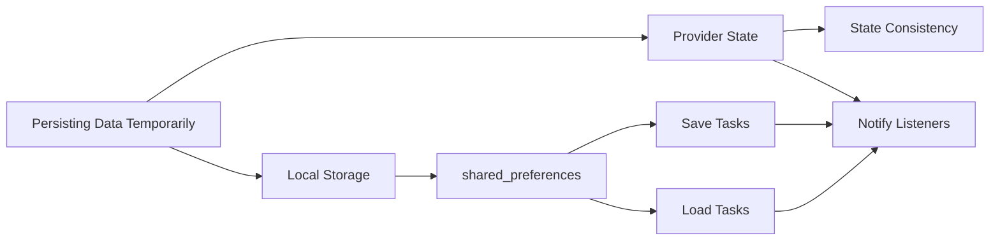

## 6.4.4 Persisting Data Temporarily

In the realm of mobile app development, ensuring that data persists across different states of an application is crucial for providing a seamless user experience. This section delves into the concept of persisting data temporarily in Flutter applications, focusing on maintaining state during app sessions and optionally extending persistence beyond sessions using local storage solutions like `shared_preferences`.

### Introduction to Data Persistence

Data persistence refers to the ability of an application to retain data across different states and sessions. In the context of our To-Do List App, persisting data temporarily means ensuring that the list of tasks remains visible and intact during the app's runtime. This is essential for user experience, as it allows users to continue their tasks without losing progress when navigating through the app or when the app is temporarily closed.

#### Why Persist Data Temporarily?

- **User Experience:** Users expect their data to remain consistent as they interact with the app. Losing data between sessions can lead to frustration.
- **State Consistency:** Maintaining state consistency ensures that the app behaves predictably, which is vital for debugging and further development.
- **Performance:** Temporary persistence can reduce the need for frequent data fetching, improving app performance.

### Using Provider to Persist Data

Provider is a popular state management solution in Flutter that helps manage and propagate state changes throughout the app. By using Provider, we can ensure that our task list remains consistent during the app's runtime.

#### Implementing Provider for State Management

Provider allows us to manage the state of our application efficiently. Here's how we can use it to manage our task list:

```dart
import 'package:flutter/material.dart';
import 'package:provider/provider.dart';

class TaskProvider extends ChangeNotifier {
  List<Task> _tasks = [];

  List<Task> get tasks => _tasks;

  void addTask(String description) {
    _tasks.add(Task(description: description));
    notifyListeners();
  }

  void deleteTask(int index) {
    _tasks.removeAt(index);
    notifyListeners();
  }

  void updateTask(int index, String newDescription) {
    _tasks[index].description = newDescription;
    notifyListeners();
  }

  void toggleTaskCompletion(int index) {
    _tasks[index].isCompleted = !_tasks[index].isCompleted;
    notifyListeners();
  }
}

class Task {
  String description;
  bool isCompleted;

  Task({required this.description, this.isCompleted = false});
}
```

- **State Management:** The `TaskProvider` class extends `ChangeNotifier`, allowing it to notify listeners whenever the state changes.
- **Task Operations:** Methods like `addTask`, `deleteTask`, `updateTask`, and `toggleTaskCompletion` modify the task list and trigger UI updates.

### Persisting Data Locally with shared_preferences (Optional)

While Provider helps manage state during the app's runtime, `shared_preferences` can be used to persist data beyond the app session. This means that even if the app is closed and reopened, the data remains intact.

#### Installing shared_preferences

To use `shared_preferences`, we need to add it to our project dependencies.

**Add to `pubspec.yaml`:**

```yaml
dependencies:
  flutter:
    sdk: flutter
  provider: ^6.0.5
  shared_preferences: ^2.0.15
```

**Run `flutter pub get`** to fetch the package.

#### Saving Tasks Locally

To save tasks locally, we need to serialize our task data into a format that can be stored in `shared_preferences`, such as JSON.

**Code Example:**

```dart
import 'dart:convert';
import 'package:shared_preferences/shared_preferences.dart';

class TaskProvider extends ChangeNotifier {
  List<Task> _tasks = [];

  List<Task> get tasks => _tasks;

  TaskProvider() {
    _loadTasks();
  }

  void addTask(String description) {
    _tasks.add(Task(description: description));
    notifyListeners();
    _saveTasks();
  }

  void deleteTask(int index) {
    _tasks.removeAt(index);
    notifyListeners();
    _saveTasks();
  }

  void updateTask(int index, String newDescription) {
    _tasks[index].description = newDescription;
    notifyListeners();
    _saveTasks();
  }

  void toggleTaskCompletion(int index) {
    _tasks[index].isCompleted = !_tasks[index].isCompleted;
    notifyListeners();
    _saveTasks();
  }

  Future<void> _saveTasks() async {
    final prefs = await SharedPreferences.getInstance();
    List<String> taskList = _tasks.map((task) => jsonEncode(task.toJson())).toList();
    await prefs.setStringList('tasks', taskList);
  }

  Future<void> _loadTasks() async {
    final prefs = await SharedPreferences.getInstance();
    List<String>? taskList = prefs.getStringList('tasks');
    if (taskList != null) {
      _tasks = taskList.map((task) => Task.fromJson(jsonDecode(task))).toList();
      notifyListeners();
    }
  }
}

class Task {
  String description;
  bool isCompleted;

  Task({required this.description, this.isCompleted = false});

  Map<String, dynamic> toJson() => {
        'description': description,
        'isCompleted': isCompleted,
      };

  factory Task.fromJson(Map<String, dynamic> json) {
    return Task(
      description: json['description'],
      isCompleted: json['isCompleted'],
    );
  }
}
```

#### Explanation:

- **Serialization:** The `Task` class includes `toJson` and `fromJson` methods to convert task objects to and from JSON format.
- **Saving to SharedPreferences:** The `_saveTasks` method converts the list of tasks to a list of JSON strings and stores it in `shared_preferences`.
- **Loading Tasks on Initialization:** The `_loadTasks` method retrieves the stored tasks from `shared_preferences` and deserializes them back into `Task` objects when the provider is initialized.

### Visualizing Data Persistence Flow

To better understand the flow of data persistence from state management to local storage, consider the following diagram:



- **Provider State:** Manages the application's runtime state, ensuring consistency.
- **Local Storage:** Uses `shared_preferences` to save and load tasks, extending persistence beyond sessions.
- **Notify Listeners:** Updates the UI whenever tasks are added, removed, or modified.

### Best Practices

- **Data Serialization:** Always ensure that data is properly serialized before storing and deserialized after retrieval to maintain data integrity.
- **Error Handling:** Implement error handling for data loading and saving processes to prevent crashes and data loss.
- **Performance Considerations:** Avoid saving large amounts of data frequently to maintain app performance. Consider batching updates or using more efficient storage solutions for larger datasets.

### Conclusion

Persisting data temporarily is a crucial aspect of app development that enhances user experience by maintaining state consistency. By leveraging Provider for state management and `shared_preferences` for local storage, developers can ensure that their Flutter applications provide a seamless and reliable user experience. As you implement these techniques, remember to follow best practices and consider the specific needs of your application to choose the most appropriate data persistence strategy.

## Quiz Time!



### What is the primary purpose of persisting data temporarily in a Flutter app?

- [x] To maintain state consistency during the app's runtime
- [ ] To permanently store data in a database
- [ ] To increase the app's download size
- [ ] To improve the app's visual design

> **Explanation:** Persisting data temporarily ensures that the app maintains state consistency during its runtime, providing a seamless user experience.

### Which package is used in Flutter for managing state and notifying listeners of changes?

- [ ] shared_preferences
- [x] Provider
- [ ] sqflite
- [ ] http

> **Explanation:** Provider is used for state management in Flutter, allowing the app to notify listeners of state changes.

### What is the role of shared_preferences in data persistence?

- [x] To store data locally beyond the app session
- [ ] To manage network requests
- [ ] To handle user authentication
- [ ] To render UI components

> **Explanation:** shared_preferences is used to store data locally, allowing it to persist beyond the app session.

### How do you add shared_preferences to a Flutter project?

- [x] By adding it to the dependencies in `pubspec.yaml` and running `flutter pub get`
- [ ] By installing it via the Android SDK Manager
- [ ] By downloading it from the Flutter website
- [ ] By including it in the main.dart file

> **Explanation:** shared_preferences is added to a Flutter project by including it in the dependencies section of `pubspec.yaml` and running `flutter pub get`.

### What is the purpose of the `toJson` method in the Task class?

- [x] To convert a Task object into a JSON format for storage
- [ ] To display the task on the UI
- [ ] To delete a task from the list
- [ ] To notify listeners of changes

> **Explanation:** The `toJson` method converts a Task object into a JSON format, which is necessary for storing it in shared_preferences.

### Which method in the TaskProvider class is responsible for loading tasks from shared_preferences?

- [ ] _saveTasks
- [x] _loadTasks
- [ ] addTask
- [ ] deleteTask

> **Explanation:** The `_loadTasks` method is responsible for loading tasks from shared_preferences when the provider is initialized.

### What is the benefit of using Provider in conjunction with shared_preferences?

- [x] It allows for both runtime state management and data persistence beyond sessions
- [ ] It reduces the app's memory usage
- [ ] It simplifies the app's UI design
- [ ] It eliminates the need for a backend server

> **Explanation:** Using Provider with shared_preferences allows for effective runtime state management and data persistence beyond sessions, enhancing user experience.

### What should be considered to maintain app performance when using shared_preferences?

- [x] Avoid saving large amounts of data frequently
- [ ] Use shared_preferences for all types of data storage
- [ ] Save data only when the app is closed
- [ ] Store data in a remote database instead

> **Explanation:** To maintain app performance, avoid saving large amounts of data frequently with shared_preferences, as it is not designed for handling large datasets.

### What is the significance of the `notifyListeners` method in the TaskProvider class?

- [x] It updates the UI whenever the task list changes
- [ ] It saves tasks to shared_preferences
- [ ] It loads tasks from shared_preferences
- [ ] It deletes tasks from the list

> **Explanation:** The `notifyListeners` method updates the UI whenever the task list changes, ensuring that the app reflects the current state.

### True or False: shared_preferences can be used to store complex data structures directly.

- [ ] True
- [x] False

> **Explanation:** False. shared_preferences is designed for storing simple key-value pairs, so complex data structures need to be serialized into a format like JSON before storage.


