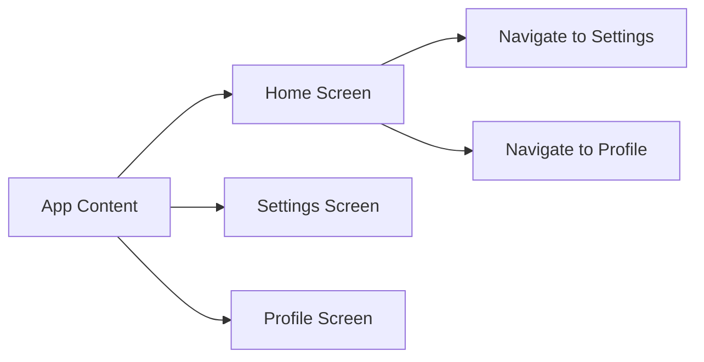

## 7.1.1 Importance of Navigation

In the realm of mobile app development, navigation plays a pivotal role in shaping the user experience. It is the backbone that allows users to traverse through different parts of an application, ensuring that they can access the features and content they need with ease. In this section, we will delve into the importance of navigation in Flutter apps, exploring how it enhances user experience, organizes app content, and supports complex functionalities. We will also provide practical examples, including a Mermaid.js diagram and a code snippet, to illustrate these concepts.

### Enhancing User Experience

Navigation is fundamental to creating an intuitive and seamless user experience. It allows users to move between different sections of an app, providing a structured flow that guides them through the application's features. A well-designed navigation system can significantly enhance usability and user satisfaction by making it easy for users to find what they are looking for without unnecessary friction.

#### Key Aspects of User Experience Enhancement:

- **Intuitive Flow:** Users should be able to predict where a navigation action will take them. This predictability reduces cognitive load and makes the app feel more intuitive.
- **Consistency:** Consistent navigation patterns across the app help users learn the interface quickly and reduce confusion.
- **Accessibility:** Navigation should be designed with accessibility in mind, ensuring that all users, including those with disabilities, can navigate the app effectively.

Consider a scenario where a user wants to adjust their app settings. With intuitive navigation, they can easily find the settings screen from the home screen without having to search through multiple menus. This ease of access enhances their overall experience and encourages continued use of the app.

### Organizing App Content

Navigation is not just about moving between screens; it's also about organizing content in a way that makes sense to the user. By dividing app content into manageable sections or screens, navigation helps users understand the app's structure and locate information quickly.

#### Benefits of Organized Content:

- **Clarity:** Breaking down content into distinct screens or sections makes it easier for users to digest information.
- **Focus:** Users can focus on one task or piece of information at a time, reducing overwhelm and improving comprehension.
- **Efficiency:** Organized content allows users to complete tasks more efficiently, as they can quickly navigate to the relevant section of the app.

For example, an app might have separate screens for home, settings, and user profiles. This separation allows users to focus on specific tasks, such as updating their profile information or changing app settings, without being distracted by unrelated content.

### Supporting App Functionality

As apps grow in complexity, they often require multiple screens to handle different tasks or display various types of information. Navigation is essential for supporting these complex functionalities, allowing users to seamlessly transition between different parts of the app.

#### Examples of Complex Functionalities:

- **Multi-step Processes:** Some tasks, such as filling out a form or completing a purchase, require multiple steps that are best handled across several screens.
- **Data Display:** Apps that display large amounts of data, such as news apps or social media platforms, benefit from navigation systems that allow users to filter and sort content.
- **User Interaction:** Interactive features, such as games or educational apps, often require navigation to guide users through different levels or modules.

In a shopping app, for instance, users might start on a home screen, navigate to a product category, view product details, and then proceed to checkout. Each of these steps requires a separate screen, and effective navigation ensures that users can move through the process smoothly.

### Visualizing Navigation with Mermaid.js

To better understand the relationship between different app screens and navigation actions, let's look at a simple Mermaid.js diagram:



This diagram illustrates a basic navigation structure where the home screen serves as the central hub, allowing users to navigate to the settings and profile screens. Such a structure is common in many apps, providing a clear and straightforward navigation path for users.

### Practical Code Example

Let's explore a simple code example to demonstrate basic navigation using Flutter's `Navigator.pushNamed` method. This method is part of Flutter's navigation system, allowing developers to define named routes and navigate between them easily.

```dart
class HomeScreen extends StatelessWidget {
  @override
  Widget build(BuildContext context) {
    return Scaffold(
      appBar: AppBar(title: Text('Home')),
      body: Center(
        child: Column(
          mainAxisAlignment: MainAxisAlignment.center,
          children: <Widget>[
            ElevatedButton(
              onPressed: () {
                Navigator.pushNamed(context, '/settings');
              },
              child: Text('Go to Settings'),
            ),
            ElevatedButton(
              onPressed: () {
                Navigator.pushNamed(context, '/profile');
              },
              child: Text('Go to Profile'),
            ),
          ],
        ),
      ),
    );
  }
}
```

#### Explanation of the Code:

- **Scaffold Widget:** Provides the basic structure for the home screen, including an app bar and a body.
- **AppBar Widget:** Displays the title of the screen, in this case, "Home."
- **Center Widget:** Centers its child widgets within the available space.
- **Column Widget:** Arranges its children vertically, allowing us to place multiple buttons on the screen.
- **ElevatedButton Widgets:** Each button is configured to navigate to a different screen when pressed. The `Navigator.pushNamed` method is used to navigate to the '/settings' and '/profile' routes, respectively.

This code snippet provides a straightforward example of how to implement navigation in a Flutter app, allowing users to move between different screens with ease.

### Conclusion

Navigation is a cornerstone of mobile app development, playing a crucial role in enhancing user experience, organizing content, and supporting complex functionalities. By understanding and implementing effective navigation strategies, developers can create apps that are not only functional but also enjoyable to use.

As you continue your journey in Flutter development, consider how navigation can be used to improve your apps. Experiment with different navigation patterns, explore advanced techniques, and always keep the user's experience at the forefront of your design decisions.

For further exploration, consider diving into Flutter's official documentation on navigation and routing, as well as exploring open-source projects that demonstrate effective navigation strategies. Additionally, online courses and tutorials can provide deeper insights into advanced navigation techniques and best practices.

## Quiz Time!



### What is the primary role of navigation in mobile apps?

- [x] To allow users to move between different parts of the app
- [ ] To increase the app's loading speed
- [ ] To enhance the app's visual design
- [ ] To reduce the app's memory usage

> **Explanation:** Navigation is primarily used to allow users to move between different parts of the app, providing a structured and intuitive flow.

### How does well-designed navigation enhance user experience?

- [x] By making it easy for users to find what they are looking for
- [ ] By increasing the app's complexity
- [ ] By reducing the number of screens in the app
- [ ] By limiting user interactions

> **Explanation:** Well-designed navigation enhances user experience by making it easy for users to find what they are looking for, reducing friction and improving usability.

### What is one benefit of organizing app content through navigation?

- [x] It makes the app easier to navigate and understand
- [ ] It increases the app's file size
- [ ] It reduces the need for user input
- [ ] It limits the app's functionality

> **Explanation:** Organizing app content through navigation makes the app easier to navigate and understand, providing clarity and focus for users.

### Why is navigation important for supporting complex app functionalities?

- [x] It allows users to transition between different parts of the app
- [ ] It simplifies the app's codebase
- [ ] It reduces the number of features in the app
- [ ] It enhances the app's visual design

> **Explanation:** Navigation is important for supporting complex app functionalities because it allows users to transition between different parts of the app, facilitating multi-step processes and data display.

### In the provided Mermaid.js diagram, what does the "Home Screen" node represent?

- [x] A central hub for navigating to other screens
- [ ] A settings configuration page
- [ ] A user profile management screen
- [ ] A data storage location

> **Explanation:** In the diagram, the "Home Screen" node represents a central hub for navigating to other screens, such as settings and profile screens.

### What method is used in the code example to navigate between screens?

- [x] Navigator.pushNamed
- [ ] Navigator.pop
- [ ] Navigator.replace
- [ ] Navigator.remove

> **Explanation:** The code example uses the `Navigator.pushNamed` method to navigate between screens, allowing for named route navigation.

### What widget is used to arrange buttons vertically in the code example?

- [x] Column
- [ ] Row
- [ ] Stack
- [ ] ListView

> **Explanation:** The `Column` widget is used to arrange buttons vertically in the code example, allowing for a vertical layout of child widgets.

### How does the `ElevatedButton` widget contribute to navigation in the code example?

- [x] It triggers navigation actions when pressed
- [ ] It displays images on the screen
- [ ] It handles user input validation
- [ ] It manages app state

> **Explanation:** The `ElevatedButton` widget contributes to navigation by triggering navigation actions when pressed, allowing users to move to different screens.

### What is the purpose of the `Scaffold` widget in the code example?

- [x] To provide the basic structure for the screen
- [ ] To handle network requests
- [ ] To manage app state
- [ ] To display images

> **Explanation:** The `Scaffold` widget provides the basic structure for the screen, including an app bar and a body, serving as a container for other widgets.

### True or False: Navigation is only important for large, complex apps.

- [ ] True
- [x] False

> **Explanation:** False. Navigation is important for all apps, regardless of size, as it enhances user experience, organizes content, and supports app functionality.


