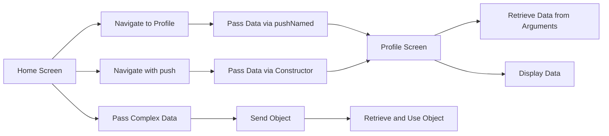

## 7.1.4 Passing Data Between Screens

In the world of mobile app development, creating a seamless and dynamic user experience often involves navigating between multiple screens while maintaining the context of user interactions. Passing data between screens is a fundamental aspect of this process, enabling applications to display personalized content and respond to user inputs effectively. In this section, we will explore various techniques for passing data between screens in Flutter, using both anonymous and named routes, and handling complex data structures.

### Introduction to Data Passing

Passing data between screens is crucial for building interactive applications that respond to user actions. Whether it's displaying a user's profile, showing details of a selected item, or maintaining state across different parts of your app, data passing allows for a more dynamic and personalized user experience. By understanding how to effectively pass data, you can create applications that are not only functional but also engaging and intuitive.

### Passing Arguments with Navigator.push

One of the most straightforward methods to pass data between screens in Flutter is by using the `Navigator.push` method. This approach involves passing arguments directly when navigating to a new screen, without the need for named routes. Here's how you can implement this technique:

#### Code Example

```dart
Navigator.push(
  context,
  MaterialPageRoute(
    builder: (context) => ProfileScreen(userName: 'John Doe'),
  ),
);
```

In this example, we're navigating to a `ProfileScreen` and passing a `userName` as an argument. The `ProfileScreen` can then use this data to display personalized content.

```dart
class ProfileScreen extends StatelessWidget {
  final String userName;

  ProfileScreen({required this.userName});

  @override
  Widget build(BuildContext context) {
    return Scaffold(
      appBar: AppBar(title: Text('$userName\'s Profile')),
      body: Center(
        child: Text('Welcome, $userName!'),
      ),
    );
  }
}
```

Here, the `ProfileScreen` receives the `userName` through its constructor, allowing it to display a personalized greeting.

### Retrieving Arguments in Named Routes

Named routes provide a more organized way to manage navigation in larger applications. When using named routes, you can pass arguments through the `Navigator.pushNamed` method and retrieve them using `ModalRoute.of(context)!.settings.arguments`.

#### Code Example

```dart
Navigator.pushNamed(
  context,
  '/profile',
  arguments: 'Jane Smith',
);
```

In this scenario, we're passing a string argument to the `/profile` route.

```dart
class ProfileScreen extends StatelessWidget {
  @override
  Widget build(BuildContext context) {
    final String userName = ModalRoute.of(context)!.settings.arguments as String;

    return Scaffold(
      appBar: AppBar(title: Text('$userName\'s Profile')),
      body: Center(
        child: Text('Welcome, $userName!'),
      ),
    );
  }
}
```

The `ProfileScreen` retrieves the `userName` using `ModalRoute.of(context)!.settings.arguments`, allowing it to display the user's profile.

### Passing Complex Data Structures

In many cases, you may need to pass more complex data structures, such as objects or maps, between screens. Flutter's flexibility allows you to pass any type of data, as long as it can be serialized and deserialized.

#### Code Example

```dart
// Define a User class
class User {
  final String name;
  final int age;

  User({required this.name, required this.age});
}

// Passing User object
Navigator.push(
  context,
  MaterialPageRoute(
    builder: (context) => ProfileScreen(user: User(name: 'Alice', age: 30)),
  ),
);
```

In this example, we're passing a `User` object to the `ProfileScreen`.

```dart
class ProfileScreen extends StatelessWidget {
  final User user;

  ProfileScreen({required this.user});

  @override
  Widget build(BuildContext context) {
    return Scaffold(
      appBar: AppBar(title: Text('${user.name}\'s Profile')),
      body: Center(
        child: Text('Name: ${user.name}\nAge: ${user.age}'),
      ),
    );
  }
}
```

The `ProfileScreen` receives the `User` object and uses its properties to display detailed information.

### Visualizing Data Flow with Mermaid.js

To better understand the flow of data between screens, let's visualize the process using a Mermaid.js diagram:



This diagram illustrates the different methods of passing data between screens, highlighting the flow from the home screen to the profile screen using both named and anonymous routes.

### Comprehensive Code Example

Let's bring everything together with a comprehensive code example that demonstrates multiple methods of passing data between screens:

```dart
void main() {
  runApp(MaterialApp(
    initialRoute: '/',
    routes: {
      '/': (context) => HomeScreen(),
      '/profile': (context) => ProfileScreen(),
    },
  ));
}

class HomeScreen extends StatelessWidget {
  @override
  Widget build(BuildContext context) {
    return Scaffold(
      appBar: AppBar(title: Text('Home')),
      body: Center(
        child: Column(
          mainAxisAlignment: MainAxisAlignment.center,
          children: <Widget>[
            ElevatedButton(
              onPressed: () {
                Navigator.pushNamed(
                  context,
                  '/profile',
                  arguments: 'Jane Smith',
                );
              },
              child: Text('Go to Profile with Name'),
            ),
            ElevatedButton(
              onPressed: () {
                Navigator.push(
                  context,
                  MaterialPageRoute(
                    builder: (context) => ProfileScreen(userName: 'Alice'),
                  ),
                );
              },
              child: Text('Go to Profile with Constructor'),
            ),
            ElevatedButton(
              onPressed: () {
                Navigator.push(
                  context,
                  MaterialPageRoute(
                    builder: (context) => ProfileScreen(
                      user: User(name: 'Bob', age: 25),
                    ),
                  ),
                );
              },
              child: Text('Go to Profile with Object'),
            ),
          ],
        ),
      ),
    );
  }
}

class ProfileScreen extends StatelessWidget {
  final String? userName;
  final User? user;

  ProfileScreen({this.userName, this.user});

  @override
  Widget build(BuildContext context) {
    String displayText = '';

    if (userName != null) {
      displayText = 'Welcome, $userName!';
    } else if (user != null) {
      displayText = 'Name: ${user!.name}\nAge: ${user!.age}';
    }

    return Scaffold(
      appBar: AppBar(title: Text('Profile')),
      body: Center(
        child: Text(displayText),
      ),
    );
  }
}

class User {
  final String name;
  final int age;

  User({required this.name, required this.age});
}
```

### Best Practices and Considerations

- **Consistency:** Maintain consistency in how you pass data across your application. Choose a method that aligns with your app's architecture and stick to it.
- **Type Safety:** Ensure that the data types you pass are correctly handled on the receiving screen. Use type checks and assertions where necessary.
- **Complex Data:** When passing complex data structures, consider using serialization methods if the data needs to be stored or transmitted over a network.
- **Performance:** Be mindful of performance implications when passing large amounts of data. Consider using state management solutions for more efficient data handling.

### Conclusion

Passing data between screens is a fundamental aspect of building dynamic and responsive Flutter applications. By understanding and implementing the techniques discussed in this section, you can create applications that provide a seamless and personalized user experience. Whether you're passing simple strings or complex objects, Flutter's flexible navigation system allows you to manage data effectively across your app's screens.

### Further Reading and Resources

- [Flutter Documentation on Navigation](https://flutter.dev/docs/development/ui/navigation)
- [State Management in Flutter](https://flutter.dev/docs/development/data-and-backend/state-mgmt/intro)
- [Building Beautiful UIs with Flutter](https://flutter.dev/docs/development/ui/widgets)

## Quiz Time!



### What is the primary benefit of passing data between screens in a Flutter app?

- [x] It allows for dynamic and personalized user experiences.
- [ ] It reduces the app's memory usage.
- [ ] It simplifies the app's code structure.
- [ ] It improves the app's network performance.

> **Explanation:** Passing data between screens enables the app to display or act upon specific information, creating a dynamic and personalized user experience.

### Which method is used to pass arguments directly when navigating without named routes?

- [x] Navigator.push
- [ ] Navigator.pushNamed
- [ ] Navigator.pop
- [ ] Navigator.replace

> **Explanation:** Navigator.push is used to navigate to a new screen and pass arguments directly without using named routes.

### How can you retrieve arguments passed through named routes?

- [x] Using ModalRoute.of(context)!.settings.arguments
- [ ] Using Navigator.pop
- [ ] Using Navigator.push
- [ ] Using context.arguments

> **Explanation:** ModalRoute.of(context)!.settings.arguments is used to retrieve arguments passed through named routes.

### What is a common use case for passing complex data structures between screens?

- [x] Displaying detailed information about a user or item.
- [ ] Reducing the number of screens in the app.
- [ ] Improving app startup time.
- [ ] Simplifying the app's navigation logic.

> **Explanation:** Passing complex data structures like objects allows screens to display detailed information about a user or item.

### In the provided code example, what class is used to represent complex data?

- [x] User
- [ ] ProfileScreen
- [ ] HomeScreen
- [ ] Navigator

> **Explanation:** The User class is used to represent complex data, such as a user's name and age.

### What is the purpose of the Mermaid.js diagram in this section?

- [x] To visualize the flow of data passing between different navigation methods.
- [ ] To illustrate the app's overall architecture.
- [ ] To show the app's performance metrics.
- [ ] To demonstrate the app's user interface design.

> **Explanation:** The Mermaid.js diagram visualizes the flow of data passing between different navigation methods, helping readers understand the process.

### Which method is used to pass data via a constructor in the code example?

- [x] Navigator.push
- [ ] Navigator.pushNamed
- [ ] Navigator.pop
- [ ] Navigator.replace

> **Explanation:** Navigator.push is used to pass data via a constructor in the code example.

### What should you consider when passing large amounts of data between screens?

- [x] Performance implications and state management solutions.
- [ ] Reducing the number of screens.
- [ ] Increasing the app's memory usage.
- [ ] Simplifying the app's code structure.

> **Explanation:** When passing large amounts of data, consider performance implications and state management solutions for efficient data handling.

### What is a potential challenge when passing data between screens?

- [x] Ensuring type safety and correct handling of data types.
- [ ] Reducing the app's network usage.
- [ ] Improving the app's startup time.
- [ ] Simplifying the app's navigation logic.

> **Explanation:** Ensuring type safety and correct handling of data types is a potential challenge when passing data between screens.

### True or False: Named routes are the only way to pass data between screens in Flutter.

- [ ] True
- [x] False

> **Explanation:** False. Data can be passed between screens using both named routes and anonymous routes (direct method).


