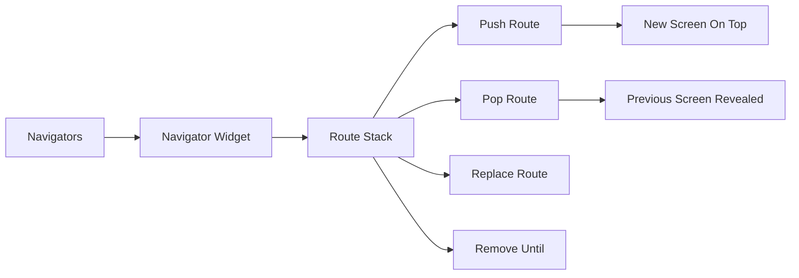

## 7.2.1 The Navigator Widget

In the world of mobile app development, navigation is a crucial aspect that determines how users interact with your application. Flutter, with its robust navigation system, provides the `Navigator` widget to manage a stack of `Route` objects, allowing seamless transitions between different screens. This section will delve into the intricacies of the `Navigator` widget, exploring its basic operations, advanced usage, and practical applications.

### Introduction to Navigator

The `Navigator` widget in Flutter is akin to a stack data structure, where each screen in your app is represented as a `Route`. When you navigate to a new screen, you "push" a new route onto the stack. Conversely, when you return to a previous screen, you "pop" the current route off the stack. This stack-based approach ensures that users can navigate back through their history, providing a familiar and intuitive experience.

#### Key Concepts

- **Route Stack:** A collection of routes managed by the `Navigator`. The topmost route is the active screen.
- **Pushing a Route:** Adds a new route to the stack, making it the active screen.
- **Popping a Route:** Removes the current route, revealing the previous one.
- **Replacing a Route:** Substitutes the current route with a new one.
- **Removing Routes:** Clears specific routes from the stack, often used to reset navigation history.

### Basic Navigator Operations

Understanding the basic operations of the `Navigator` widget is essential for implementing effective navigation in your Flutter applications. Let's explore these operations with practical code examples.

#### Pushing a New Route

To navigate to a new screen, use the `Navigator.push` method. This method requires the current context and a `Route` object, typically a `MaterialPageRoute`.

```dart
Navigator.push(
  context,
  MaterialPageRoute(builder: (context) => SettingsScreen()),
);
```

In this example, the `SettingsScreen` is pushed onto the stack, becoming the active screen.

#### Popping a Route

To return to the previous screen, use the `Navigator.pop` method. This operation removes the current route from the stack.

```dart
Navigator.pop(context);
```

This simple call pops the topmost route, revealing the screen beneath it.

#### Replacing a Route

The `Navigator.pushReplacement` method is used to replace the current route with a new one. This is useful for scenarios like navigating from a login screen to a home screen after successful authentication.

```dart
Navigator.pushReplacement(
  context,
  MaterialPageRoute(builder: (context) => LoginScreen()),
);
```

Here, the current screen is replaced with the `LoginScreen`, effectively removing the previous screen from the stack.

#### Removing All Previous Routes

To navigate to a new screen and clear all previous routes, use `Navigator.pushAndRemoveUntil`. This method is often used to reset the navigation stack, such as when logging out a user.

```dart
Navigator.pushAndRemoveUntil(
  context,
  MaterialPageRoute(builder: (context) => HomeScreen()),
  (Route<dynamic> route) => false,
);
```

This code pushes the `HomeScreen` onto the stack and removes all preceding routes, ensuring a fresh start.

### Advanced Navigator Usage

Beyond basic navigation, Flutter's `Navigator` widget offers advanced features that cater to more complex scenarios.

#### Named Routes vs. Stateless Routes

Flutter supports both named and stateless routes. Named routes are defined in a central location, making them easier to manage in larger applications. Stateless routes, on the other hand, are defined inline and are suitable for smaller apps or specific use cases.

- **Named Routes:** Defined in the `MaterialApp` widget, allowing for centralized route management.
- **Stateless Routes:** Defined directly in the `Navigator` methods, offering flexibility for dynamic routing.

#### Navigator Keys

In some cases, you may need to manage navigation outside of the widget context. This is where `GlobalKey<NavigatorState>` comes into play. By assigning a global key to the `Navigator`, you can perform navigation operations from anywhere in your app.

```dart
final GlobalKey<NavigatorState> navigatorKey = GlobalKey<NavigatorState>();

void main() {
  runApp(MaterialApp(
    navigatorKey: navigatorKey,
    home: HomeScreen(),
  ));
}

// Navigating using navigatorKey
navigatorKey.currentState?.push(
  MaterialPageRoute(builder: (context) => SettingsScreen()),
);
```

This approach is particularly useful in scenarios involving global navigation, such as handling deep links or notifications.

### Visualizing Navigator Operations

To better understand the flow of navigation operations, consider the following Mermaid.js diagram:



This diagram illustrates how the `Navigator` widget manages the route stack, with operations like pushing, popping, replacing, and removing routes.

### Practical Code Example

Let's implement a simple Flutter app demonstrating these navigation techniques. This app consists of three screens: `HomeScreen`, `SettingsScreen`, and `LoginScreen`.

```dart
class HomeScreen extends StatelessWidget {
  @override
  Widget build(BuildContext context) {
    return Scaffold(
      appBar: AppBar(title: Text('Home')),
      body: Center(
        child: Column(
          mainAxisAlignment: MainAxisAlignment.center,
          children: <Widget>[
            ElevatedButton(
              onPressed: () {
                Navigator.push(
                  context,
                  MaterialPageRoute(builder: (context) => SettingsScreen()),
                );
              },
              child: Text('Go to Settings'),
            ),
            ElevatedButton(
              onPressed: () {
                Navigator.pushReplacement(
                  context,
                  MaterialPageRoute(builder: (context) => LoginScreen()),
                );
              },
              child: Text('Go to Login'),
            ),
            ElevatedButton(
              onPressed: () {
                Navigator.pushAndRemoveUntil(
                  context,
                  MaterialPageRoute(builder: (context) => HomeScreen()),
                  (Route<dynamic> route) => false,
                );
              },
              child: Text('Reset Navigation'),
            ),
          ],
        ),
      ),
    );
  }
}

class SettingsScreen extends StatelessWidget {
  @override
  Widget build(BuildContext context) {
    return Scaffold(
      appBar: AppBar(title: Text('Settings')),
      body: Center(
        child: ElevatedButton(
          onPressed: () {
            Navigator.pop(context);
          },
          child: Text('Go Back'),
        ),
      ),
    );
  }
}

class LoginScreen extends StatelessWidget {
  @override
  Widget build(BuildContext context) {
    return Scaffold(
      appBar: AppBar(title: Text('Login')),
      body: Center(
        child: ElevatedButton(
          onPressed: () {
            Navigator.pushReplacement(
              context,
              MaterialPageRoute(builder: (context) => HomeScreen()),
            );
          },
          child: Text('Login and Go Home'),
        ),
      ),
    );
  }
}
```

### Best Practices and Common Pitfalls

- **Consistent Route Management:** Use named routes for larger applications to maintain consistency and readability.
- **Avoid Overusing Global Keys:** While `GlobalKey<NavigatorState>` is powerful, overusing it can lead to complex and hard-to-maintain code.
- **Handle Back Navigation Gracefully:** Ensure that popping routes doesn't lead to unexpected behavior or app crashes.
- **Test Navigation Thoroughly:** Use widget tests to verify navigation flows and ensure that routes behave as expected.

### Further Exploration

To deepen your understanding of navigation in Flutter, consider exploring the following resources:

- [Flutter Official Documentation on Navigation](https://flutter.dev/docs/development/ui/navigation)
- [Flutter Cookbook: Navigation Recipes](https://flutter.dev/docs/cookbook/navigation)
- [Advanced Flutter: Navigating with a GlobalKey](https://medium.com/flutter-community/flutter-navigating-with-a-globalkey-8cbf9b5f1b24)

These resources provide additional insights and examples, helping you master navigation in your Flutter applications.

### Conclusion

The `Navigator` widget is a cornerstone of Flutter's navigation system, offering a flexible and powerful way to manage routes and transitions between screens. By understanding its basic operations and advanced features, you can create intuitive and seamless navigation experiences for your users. As you continue to explore Flutter, remember to experiment with different navigation patterns and techniques, applying best practices to enhance your app's usability and performance.

## Quiz Time!



### What is the primary role of the Navigator widget in Flutter?

- [x] Managing a stack of Route objects for navigation
- [ ] Handling user input and gestures
- [ ] Rendering UI components
- [ ] Managing app state

> **Explanation:** The Navigator widget manages a stack of Route objects, allowing for navigation between different screens in a Flutter app.

### How do you navigate to a new screen using the Navigator widget?

- [x] Navigator.push(context, MaterialPageRoute(builder: (context) => NewScreen()))
- [ ] Navigator.pop(context)
- [ ] Navigator.replace(context, MaterialPageRoute(builder: (context) => NewScreen()))
- [ ] Navigator.remove(context)

> **Explanation:** Navigator.push is used to navigate to a new screen by pushing a new route onto the stack.

### Which method is used to return to the previous screen?

- [x] Navigator.pop(context)
- [ ] Navigator.push(context, MaterialPageRoute(builder: (context) => PreviousScreen()))
- [ ] Navigator.popUntil(context, ModalRoute.withName('/'))
- [ ] Navigator.pushReplacement(context, MaterialPageRoute(builder: (context) => PreviousScreen()))

> **Explanation:** Navigator.pop is used to remove the current route from the stack, returning to the previous screen.

### What is the purpose of Navigator.pushReplacement?

- [x] To replace the current route with a new one
- [ ] To add a new route on top of the stack
- [ ] To remove all routes from the stack
- [ ] To navigate to a named route

> **Explanation:** Navigator.pushReplacement replaces the current route with a new one, effectively removing the previous route from the stack.

### How can you reset the navigation stack and navigate to a new screen?

- [x] Navigator.pushAndRemoveUntil(context, MaterialPageRoute(builder: (context) => NewScreen()), (Route<dynamic> route) => false)
- [ ] Navigator.popUntil(context, ModalRoute.withName('/'))
- [ ] Navigator.pushReplacement(context, MaterialPageRoute(builder: (context) => NewScreen()))
- [ ] Navigator.remove(context)

> **Explanation:** Navigator.pushAndRemoveUntil is used to navigate to a new screen and remove all previous routes, effectively resetting the navigation stack.

### What is a GlobalKey<NavigatorState> used for?

- [x] Managing navigation outside of the widget context
- [ ] Rendering UI components
- [ ] Handling user input
- [ ] Managing app state

> **Explanation:** A GlobalKey<NavigatorState> allows for navigation operations outside of the widget context, useful for global navigation scenarios.

### When should you use named routes in a Flutter app?

- [x] In larger applications for centralized route management
- [ ] In small applications with few screens
- [ ] When using only stateless widgets
- [ ] When handling user input

> **Explanation:** Named routes are beneficial in larger applications as they allow for centralized and consistent route management.

### What is the result of calling Navigator.pop(context) when there are no routes left in the stack?

- [x] The app will close
- [ ] The app will crash
- [ ] A new route will be pushed onto the stack
- [ ] The current screen will reload

> **Explanation:** If there are no routes left in the stack, calling Navigator.pop(context) will close the app.

### What is the difference between Navigator.push and Navigator.pushReplacement?

- [x] Navigator.push adds a new route on top of the stack, while Navigator.pushReplacement replaces the current route
- [ ] Navigator.push is used for named routes, while Navigator.pushReplacement is for stateless routes
- [ ] Navigator.push is for popping routes, while Navigator.pushReplacement is for pushing routes
- [ ] There is no difference

> **Explanation:** Navigator.push adds a new route on top of the stack, while Navigator.pushReplacement replaces the current route with a new one.

### True or False: The Navigator widget can only manage routes within the same widget context.

- [ ] True
- [x] False

> **Explanation:** The Navigator widget can manage routes outside of the widget context using a GlobalKey<NavigatorState>.


