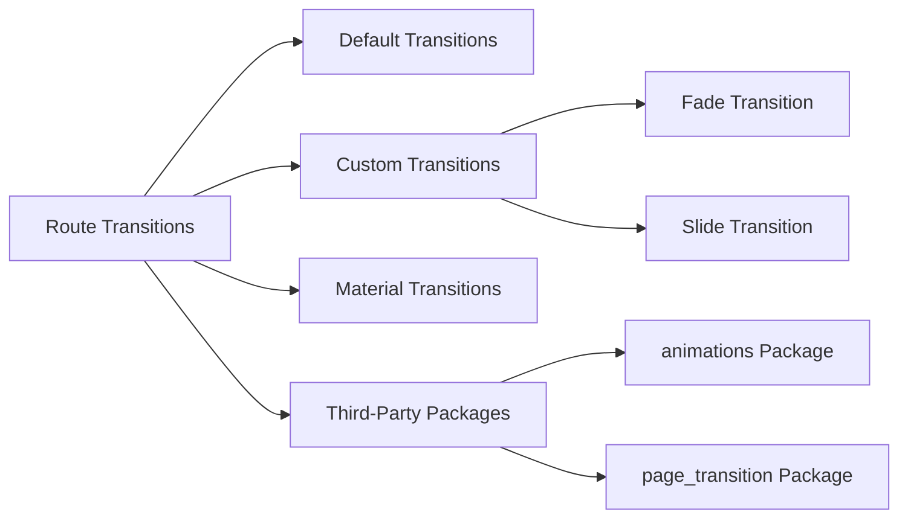

## 7.2.2 Route Transitions

In the world of mobile app development, the user experience is paramount. One of the key elements that contribute to a seamless and engaging user experience is the way transitions between different screens are handled. In Flutter, these transitions are known as route transitions. They define the animation and behavior when navigating from one screen to another, enhancing the visual experience and providing a sense of continuity.

### Introduction to Route Transitions

Route transitions in Flutter are animations that occur when navigating between different screens or routes in an application. These transitions can significantly enhance the user experience by providing smooth and visually appealing animations that guide the user's attention and make the navigation feel natural and intuitive.

When a user navigates from one screen to another, the transition animation can help indicate the change in context, making the interaction more understandable and engaging. Flutter provides a robust framework for implementing both default and custom route transitions, allowing developers to tailor the navigation experience to fit the app's design and user expectations.

### Default Route Transitions

Flutter comes with built-in default transition animations that are automatically applied when using `MaterialPageRoute`. These transitions are designed to adhere to Material Design guidelines, ensuring consistency and a familiar feel across different apps.

#### Default Transition Animation

The default transition animation in Flutter is a slide transition, where the new screen slides in from the right, and the current screen slides out to the left. This animation is automatically applied when you navigate using `MaterialPageRoute`.

**Code Example:**

```dart
Navigator.push(
  context,
  MaterialPageRoute(builder: (context) => SettingsScreen()),
);
```

In this example, no additional code is needed to achieve the default slide transition. Flutter handles the animation for you, providing a smooth and consistent navigation experience.

### Custom Route Transitions

While the default transitions are suitable for many applications, there are times when you may want to create custom transitions to better match your app's design or to provide a unique user experience. Flutter allows you to create custom transitions by extending `PageRouteBuilder`.

#### Creating Custom Transitions

To create a custom transition, you can use `PageRouteBuilder`, which gives you full control over the transition animation. You can define how the new screen should appear and how the current screen should disappear.

##### Fade Transition Example

A fade transition is a simple yet elegant animation where the new screen fades in while the current screen fades out. Here's how you can implement a fade transition:

```dart
Navigator.push(
  context,
  PageRouteBuilder(
    pageBuilder: (context, animation, secondaryAnimation) => SettingsScreen(),
    transitionsBuilder: (context, animation, secondaryAnimation, child) {
      return FadeTransition(opacity: animation, child: child);
    },
  ),
);
```

In this example, the `FadeTransition` widget is used to animate the opacity of the new screen, creating a smooth fade-in effect.

##### Slide Transition Example

A slide transition involves moving the new screen into view from a specific direction. Here's how you can implement a slide transition:

```dart
Navigator.push(
  context,
  PageRouteBuilder(
    pageBuilder: (context, animation, secondaryAnimation) => ProfileScreen(),
    transitionsBuilder: (context, animation, secondaryAnimation, child) {
      const begin = Offset(1.0, 0.0);
      const end = Offset.zero;
      const curve = Curves.ease;

      var tween = Tween(begin: begin, end: end).chain(CurveTween(curve: curve));

      return SlideTransition(
        position: animation.drive(tween),
        child: child,
      );
    },
  ),
);
```

In this example, the `SlideTransition` widget is used to animate the position of the new screen, sliding it in from the right.

### Using MaterialPageRoute for Consistent Transitions

`MaterialPageRoute` is a convenient way to implement transitions that are consistent with Material Design guidelines. It automatically applies the default slide transition, ensuring a cohesive look and feel across your app.

**Code Example:**

```dart
Navigator.push(
  context,
  MaterialPageRoute(builder: (context) => SettingsScreen()),
);
```

By using `MaterialPageRoute`, you can ensure that your app's transitions are consistent with the Material Design principles, providing a familiar and intuitive experience for users.

### Third-Party Packages for Advanced Transitions

For developers looking to implement more advanced or unique transition animations, there are several third-party packages available that offer a variety of pre-built transition animations. These packages can save time and effort while providing high-quality animations.

#### Animations Package

The `animations` package is a popular choice for implementing advanced transitions. It provides a collection of pre-built animations that can be easily integrated into your app.

**Example with Animations Package:**

```dart
import 'package:animations/animations.dart';

OpenContainer(
  closedElevation: 0.0,
  openElevation: 4.0,
  transitionType: ContainerTransitionType.fade,
  closedBuilder: (context, openContainer) => ElevatedButton(
    onPressed: openContainer,
    child: Text('Open Settings'),
  ),
  openBuilder: (context, closeContainer) => SettingsScreen(),
);
```

In this example, the `OpenContainer` widget is used to create a fade transition between the button and the `SettingsScreen`.

### Visualizing Route Transitions

To better understand the different types of route transitions available in Flutter, let's visualize them using a Mermaid.js diagram:



This diagram categorizes the various types of route transitions, highlighting the options available for enhancing the navigation experience in your Flutter app.

### Practical Code Example

Let's put everything we've learned into practice with a complete code example that demonstrates a custom fade transition:

```dart
class HomeScreen extends StatelessWidget {
  @override
  Widget build(BuildContext context) {
    return Scaffold(
      appBar: AppBar(title: Text('Home')),
      body: Center(
        child: ElevatedButton(
          onPressed: () {
            Navigator.push(
              context,
              PageRouteBuilder(
                pageBuilder: (context, animation, secondaryAnimation) => SettingsScreen(),
                transitionsBuilder: (context, animation, secondaryAnimation, child) {
                  return FadeTransition(
                    opacity: animation,
                    child: child,
                  );
                },
              ),
            );
          },
          child: Text('Go to Settings with Fade Transition'),
        ),
      ),
    );
  }
}

class SettingsScreen extends StatelessWidget {
  @override
  Widget build(BuildContext context) {
    return Scaffold(
      appBar: AppBar(title: Text('Settings')),
      body: Center(
        child: ElevatedButton(
          onPressed: () {
            Navigator.pop(context);
          },
          child: Text('Go Back'),
        ),
      ),
    );
  }
}
```

In this example, the `HomeScreen` contains a button that navigates to the `SettingsScreen` using a custom fade transition. The `SettingsScreen` includes a button to navigate back to the `HomeScreen`.

### Conclusion

Route transitions are a powerful tool in Flutter that can significantly enhance the user experience by providing smooth and visually appealing animations during navigation. Whether you choose to use the default transitions, create custom animations, or leverage third-party packages, understanding and implementing route transitions can help you create a more engaging and intuitive app.

By experimenting with different types of transitions and customizing them to fit your app's design, you can create a unique and memorable user experience that keeps users engaged and satisfied.

### References and Further Reading

- [Flutter Documentation: Navigation and Routing](https://flutter.dev/docs/development/ui/navigation)
- [Material Design Guidelines](https://material.io/design)
- [Animations Package on Pub.dev](https://pub.dev/packages/animations)
- [Page Transition Package on Pub.dev](https://pub.dev/packages/page_transition)

## Quiz Time!



### What is the default route transition animation in Flutter?

- [x] Slide from right to left
- [ ] Fade in and out
- [ ] Zoom in
- [ ] Rotate

> **Explanation:** The default transition animation in Flutter is a slide from right to left, which is automatically applied when using `MaterialPageRoute`.

### How can you create a custom fade transition in Flutter?

- [x] By using `PageRouteBuilder` and `FadeTransition`
- [ ] By using `MaterialPageRoute` only
- [ ] By using `SlideTransition`
- [ ] By using `OpenContainer`

> **Explanation:** A custom fade transition can be created using `PageRouteBuilder` and `FadeTransition`, where you define the transition animation.

### What is the purpose of using `MaterialPageRoute`?

- [x] To provide transitions compliant with Material Design guidelines
- [ ] To create custom animations
- [ ] To disable animations
- [ ] To manage state

> **Explanation:** `MaterialPageRoute` provides transitions that are compliant with Material Design guidelines, ensuring consistency across the app.

### Which package provides pre-built transition animations for Flutter?

- [x] animations
- [ ] http
- [ ] provider
- [ ] sqflite

> **Explanation:** The `animations` package provides a collection of pre-built transition animations that can be easily integrated into Flutter apps.

### What is a key benefit of using route transitions in a Flutter app?

- [x] Enhancing the visual experience and guiding user attention
- [ ] Reducing app size
- [ ] Improving network performance
- [ ] Simplifying code structure

> **Explanation:** Route transitions enhance the visual experience by providing smooth animations that guide user attention and make navigation feel natural.

### Which widget is used to create a slide transition?

- [x] SlideTransition
- [ ] FadeTransition
- [ ] OpenContainer
- [ ] MaterialPageRoute

> **Explanation:** The `SlideTransition` widget is used to animate the position of a screen, creating a slide transition effect.

### What is the role of `transitionsBuilder` in `PageRouteBuilder`?

- [x] To define the custom transition animation
- [ ] To specify the destination screen
- [ ] To manage state
- [ ] To handle user input

> **Explanation:** The `transitionsBuilder` function in `PageRouteBuilder` is used to define the custom transition animation between screens.

### Which of the following is a third-party package for advanced transitions?

- [x] page_transition
- [ ] shared_preferences
- [ ] sqflite
- [ ] provider

> **Explanation:** The `page_transition` package is a third-party package that offers advanced transition animations for Flutter apps.

### What is the effect of using a fade transition?

- [x] The new screen fades in while the current screen fades out
- [ ] The new screen slides in from the top
- [ ] The new screen zooms in
- [ ] The new screen rotates

> **Explanation:** A fade transition causes the new screen to fade in while the current screen fades out, creating a smooth visual effect.

### True or False: Custom transitions can only be created using third-party packages.

- [ ] True
- [x] False

> **Explanation:** Custom transitions can be created using Flutter's built-in `PageRouteBuilder`, without the need for third-party packages.


