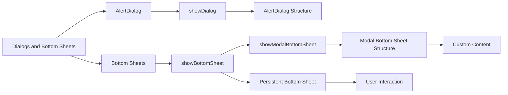

## 7.2.3 Dialogs and Bottom Sheets

In the realm of mobile app development, user interaction is paramount. Flutter provides powerful tools to enhance this interaction through dialogs and bottom sheets. These components allow developers to present additional information or prompt user actions without navigating away from the current screen. This section delves into the creation, customization, and practical application of dialogs and bottom sheets in Flutter, empowering you to build more interactive and user-friendly apps.

### Introduction to Dialogs and Bottom Sheets

Dialogs and bottom sheets are modal interfaces that temporarily take over part of the screen to provide additional functionality. They are commonly used for:

- **Confirmations:** Asking users to confirm actions, such as deleting an item.
- **Forms:** Collecting user input without leaving the current context.
- **Settings Adjustments:** Allowing users to tweak settings in a focused manner.

These components are essential for maintaining a seamless user experience, as they allow users to interact with the app without losing their place in the navigation flow.

### Creating AlertDialogs

An `AlertDialog` is a simple yet effective way to prompt users for confirmation or provide notifications. It typically consists of a title, content, and a set of actions.

#### Code Example: Creating an AlertDialog

```dart
ElevatedButton(
  onPressed: () {
    showDialog(
      context: context,
      builder: (context) => AlertDialog(
        title: Text('Delete Task'),
        content: Text('Are you sure you want to delete this task?'),
        actions: <Widget>[
          TextButton(
            onPressed: () => Navigator.of(context).pop(),
            child: Text('Cancel'),
          ),
          ElevatedButton(
            onPressed: () {
              // Perform delete action
              Navigator.of(context).pop();
            },
            child: Text('Delete'),
          ),
        ],
      ),
    );
  },
  child: Text('Delete Task'),
);
```

In this example, the `showDialog` function displays an `AlertDialog` with a title, content, and two actions: "Cancel" and "Delete". The `Navigator.of(context).pop()` method is used to dismiss the dialog.

### Creating Bottom Sheets

Bottom sheets are versatile components that slide up from the bottom of the screen. They come in two varieties: persistent and modal.

#### Persistent Bottom Sheet

A persistent bottom sheet remains visible while interacting with other parts of the app. It is ideal for displaying supplementary content that users might need to reference while performing other tasks.

##### Code Example: Persistent Bottom Sheet

```dart
Scaffold(
  appBar: AppBar(title: Text('Home')),
  body: Center(
    child: ElevatedButton(
      onPressed: () {
        Scaffold.of(context).showBottomSheet<void>(
          (BuildContext context) {
            return Container(
              height: 200,
              color: Colors.blueGrey,
              child: Center(
                child: Text(
                  'This is a persistent bottom sheet',
                  style: TextStyle(color: Colors.white, fontSize: 18),
                ),
              ),
            );
          },
        );
      },
      child: Text('Show Persistent Bottom Sheet'),
    ),
  ),
);
```

In this code, `showBottomSheet` is used to display a persistent bottom sheet. The sheet remains on the screen, allowing users to interact with other UI elements.

#### Modal Bottom Sheet

A modal bottom sheet blocks interaction with other parts of the app until it is dismissed. This is useful for tasks that require focused user attention, such as filling out a form.

##### Code Example: Modal Bottom Sheet

```dart
ElevatedButton(
  onPressed: () {
    showModalBottomSheet(
      context: context,
      builder: (context) => Container(
        height: 200,
        color: Colors.lightBlue,
        child: Center(
          child: Text(
            'This is a modal bottom sheet',
            style: TextStyle(color: Colors.white, fontSize: 18),
          ),
        ),
      ),
    );
  },
  child: Text('Show Modal Bottom Sheet'),
);
```

Here, `showModalBottomSheet` is used to present a modal bottom sheet. The user must dismiss the sheet to interact with the rest of the app.

### Customizing Dialogs and Bottom Sheets

Customization is key to making dialogs and bottom sheets fit seamlessly into your app's design. You can add custom content, such as forms or images, and style these components to match your app's theme.

#### Styling and Content Customization

You can enhance dialogs and bottom sheets by embedding forms, images, or any widget that suits your needs.

##### Code Example: AlertDialog with Form

```dart
ElevatedButton(
  onPressed: () {
    showDialog(
      context: context,
      builder: (context) => AlertDialog(
        title: Text('Add New Task'),
        content: TextField(
          controller: _taskController,
          decoration: InputDecoration(labelText: 'Task Description'),
        ),
        actions: <Widget>[
          TextButton(
            onPressed: () => Navigator.of(context).pop(),
            child: Text('Cancel'),
          ),
          ElevatedButton(
            onPressed: () {
              Provider.of<TaskProvider>(context, listen: false)
                  .addTask(_taskController.text);
              _taskController.clear();
              Navigator.of(context).pop();
            },
            child: Text('Add'),
          ),
        ],
      ),
    );
  },
  child: Text('Add Task'),
);
```

This example demonstrates how to include a `TextField` within an `AlertDialog`, allowing users to input data directly into the dialog.

### Visualizing Dialogs and Bottom Sheets

To better understand the relationship between dialogs, bottom sheets, and their interactions, consider the following diagram:



This diagram illustrates the hierarchy and flow of dialogs and bottom sheets, highlighting their structures and interactions.

### Comprehensive Code Example

Below is a complete example that incorporates both dialogs and bottom sheets, showcasing how they can be used together in a Flutter app.

```dart
class HomeScreen extends StatelessWidget {
  final TextEditingController _taskController = TextEditingController();

  @override
  Widget build(BuildContext context) {
    return Scaffold(
      appBar: AppBar(title: Text('To-Do List App')),
      body: Center(
        child: Column(
          mainAxisAlignment: MainAxisAlignment.center,
          children: <Widget>[
            ElevatedButton(
              onPressed: () {
                showDialog(
                  context: context,
                  builder: (context) => AlertDialog(
                    title: Text('Add New Task'),
                    content: TextField(
                      controller: _taskController,
                      decoration: InputDecoration(labelText: 'Task Description'),
                    ),
                    actions: <Widget>[
                      TextButton(
                        onPressed: () => Navigator.of(context).pop(),
                        child: Text('Cancel'),
                      ),
                      ElevatedButton(
                        onPressed: () {
                          if (_taskController.text.isNotEmpty) {
                            Provider.of<TaskProvider>(context, listen: false)
                                .addTask(_taskController.text);
                            _taskController.clear();
                            Navigator.of(context).pop();
                          }
                        },
                        child: Text('Add'),
                      ),
                    ],
                  ),
                );
              },
              child: Text('Add Task via Dialog'),
            ),
            SizedBox(height: 20),
            ElevatedButton(
              onPressed: () {
                showModalBottomSheet(
                  context: context,
                  builder: (context) => Container(
                    height: 200,
                    color: Colors.lightBlue,
                    child: Center(
                      child: Text(
                        'This is a modal bottom sheet',
                        style: TextStyle(color: Colors.white, fontSize: 18),
                      ),
                    ),
                  ),
                );
              },
              child: Text('Show Modal Bottom Sheet'),
            ),
          ],
        ),
      ),
    );
  }
}
```

### Best Practices and Common Pitfalls

- **Consistency:** Ensure that the design and behavior of dialogs and bottom sheets are consistent with the rest of your app.
- **Accessibility:** Provide clear labels and descriptions for all interactive elements to enhance accessibility.
- **User Experience:** Avoid overusing modal components, as they can disrupt the user flow if not implemented thoughtfully.

### Further Exploration

For more advanced usage and customization of dialogs and bottom sheets, consider exploring the following resources:

- [Flutter Official Documentation on Dialogs](https://flutter.dev/docs/development/ui/widgets/dialogs)
- [Material Design Guidelines for Bottom Sheets](https://material.io/components/sheets-bottom)
- [Flutter Community Packages for Enhanced Dialogs](https://pub.dev/packages?q=dialog)

By mastering dialogs and bottom sheets, you can significantly enhance the interactivity and user experience of your Flutter applications. Experiment with different styles and content to find what best suits your app's needs.

## Quiz Time!



### What is the primary purpose of dialogs and bottom sheets in Flutter?

- [x] To provide additional information or prompt user actions without navigating away from the current screen.
- [ ] To replace the main screen with a new interface.
- [ ] To permanently change the app's layout.
- [ ] To handle background tasks.

> **Explanation:** Dialogs and bottom sheets are used to present additional information or actions without leaving the current screen, enhancing user interaction.

### Which method is used to display an `AlertDialog` in Flutter?

- [x] `showDialog`
- [ ] `showAlert`
- [ ] `displayDialog`
- [ ] `openDialog`

> **Explanation:** The `showDialog` method is used to display an `AlertDialog` in Flutter.

### What is a key difference between a persistent bottom sheet and a modal bottom sheet?

- [x] A persistent bottom sheet allows interaction with other parts of the app, while a modal bottom sheet blocks interaction.
- [ ] A persistent bottom sheet is always visible, while a modal bottom sheet is not.
- [ ] A modal bottom sheet is used for notifications, while a persistent bottom sheet is not.
- [ ] A persistent bottom sheet is more customizable than a modal bottom sheet.

> **Explanation:** A persistent bottom sheet allows interaction with other parts of the app, whereas a modal bottom sheet requires dismissal before interacting with other UI elements.

### How can you dismiss a dialog in Flutter?

- [x] Using `Navigator.of(context).pop()`
- [ ] Using `closeDialog()`
- [ ] Using `dismissDialog()`
- [ ] Using `hideDialog()`

> **Explanation:** The `Navigator.of(context).pop()` method is used to dismiss a dialog in Flutter.

### Which widget is commonly used to display a form inside an `AlertDialog`?

- [x] `TextField`
- [ ] `FormField`
- [ ] `InputField`
- [ ] `TextInput`

> **Explanation:** The `TextField` widget is commonly used to display a form inside an `AlertDialog`.

### What is the purpose of the `showModalBottomSheet` function?

- [x] To display a bottom sheet that blocks interaction with other parts of the app until dismissed.
- [ ] To display a bottom sheet that remains visible while interacting with other parts of the app.
- [ ] To display a notification at the bottom of the screen.
- [ ] To replace the app's main screen with a new interface.

> **Explanation:** The `showModalBottomSheet` function displays a bottom sheet that blocks interaction with other parts of the app until it is dismissed.

### Which of the following is a best practice when using dialogs and bottom sheets?

- [x] Ensure that the design and behavior are consistent with the rest of the app.
- [ ] Use them as frequently as possible to engage users.
- [ ] Avoid using them for any user interactions.
- [ ] Use them only for displaying images.

> **Explanation:** Consistency in design and behavior with the rest of the app is a best practice when using dialogs and bottom sheets.

### What is a common pitfall when using modal components like dialogs and bottom sheets?

- [x] Overusing them can disrupt the user flow.
- [ ] They are too difficult to implement.
- [ ] They cannot be customized.
- [ ] They are not supported on all devices.

> **Explanation:** Overusing modal components can disrupt the user flow, making it a common pitfall.

### Which method is used to display a persistent bottom sheet in Flutter?

- [x] `showBottomSheet`
- [ ] `showPersistentSheet`
- [ ] `displayBottomSheet`
- [ ] `openBottomSheet`

> **Explanation:** The `showBottomSheet` method is used to display a persistent bottom sheet in Flutter.

### True or False: Bottom sheets can only be used for displaying static content.

- [ ] True
- [x] False

> **Explanation:** Bottom sheets can be used for both static and interactive content, such as forms and settings adjustments.


