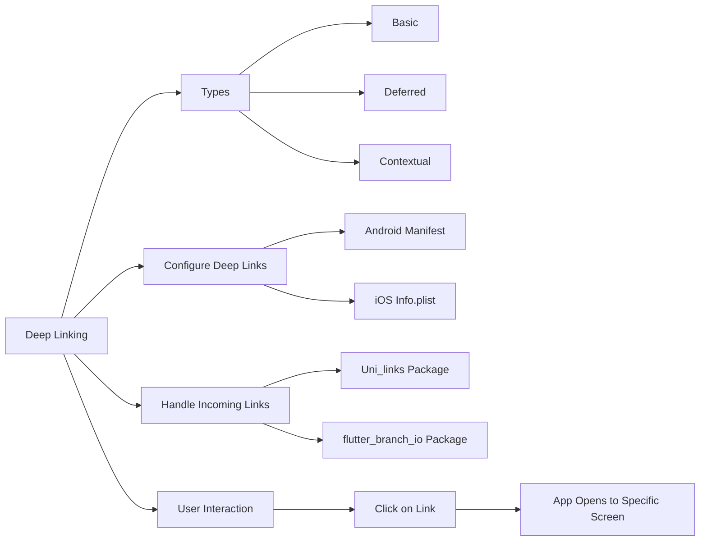

## 7.2.4 Deep Linking (Introduction)

In the ever-evolving landscape of mobile applications, providing seamless navigation and user experience is paramount. Deep linking is a powerful technique that allows users to navigate directly to specific content or screens within an app via URLs, much like accessing web pages. This capability not only enhances user experience but also plays a crucial role in app sharing and improving SEO for web-based applications. In this section, we will delve into the fundamentals of deep linking, explore its various types, and provide a comprehensive guide on configuring and handling deep links in Flutter applications.

### Introduction to Deep Linking

Deep linking is akin to providing a map with precise directions to a destination within your app. Instead of launching the app to its default screen, deep links allow users to jump directly to a specific screen or piece of content. This is particularly beneficial for:

- **Enhancing User Experience:** Users can access desired content quickly without navigating through multiple screens.
- **Improving SEO (for web):** Deep links can improve the discoverability of app content through search engines.
- **Facilitating App Sharing:** Users can share specific content with others, who can then access it directly within the app.

### Types of Deep Linking

Understanding the different types of deep linking is crucial for implementing the right solution for your app's needs:

- **Basic Deep Links:** These links open a specific screen within the app. They are straightforward and require the app to be installed on the user's device.

- **Deferred Deep Links:** These links allow users to navigate to specific content even if the app isn't installed. Once the app is installed and opened, it navigates to the intended screen. This is particularly useful for marketing campaigns and user acquisition.

- **Contextual Deep Links:** These links carry additional context or data that can be used once the app is opened. For example, a link might include a discount code or user-specific information that enhances the user's experience.

### Configuring Deep Links in Flutter

To enable deep linking in your Flutter app, you need to configure both Android and iOS platforms to handle specific URL schemes.

#### Android Configuration

For Android, deep linking is configured in the `AndroidManifest.xml` file. This involves setting up intent filters to handle specific URLs:

```xml
<activity
    android:name=".MainActivity"
    android:launchMode="singleTop"
    android:theme="@style/LaunchTheme"
    android:configChanges="keyboard|keyboardHidden|orientation|screenSize|smallestScreenSize|screenLayout|uiMode"
    android:hardwareAccelerated="true"
    android:windowSoftInputMode="adjustResize">
    <meta-data
        android:name="io.flutter.embedding.android.NormalTheme"
        android:resource="@style/NormalTheme"
        />
    <intent-filter>
        <action android:name="android.intent.action.VIEW"/>
        <category android:name="android.intent.category.DEFAULT"/>
        <category android:name="android.intent.category.BROWSABLE"/>
        <data android:scheme="https" android:host="www.example.com"/>
    </intent-filter>
</activity>
```

- **Intent Filter:** Specifies the URL scheme (`https`) and host (`www.example.com`) that the app should respond to.
- **Categories:** `DEFAULT` and `BROWSABLE` categories ensure the app can be opened from a browser or other apps.

#### iOS Configuration

For iOS, deep linking is configured in the `Info.plist` file. You also need to set up associated domains in your Apple Developer account:

```xml
<key>CFBundleURLTypes</key>
<array>
  <dict>
    <key>CFBundleTypeRole</key>
    <string>Editor</string>
    <key>CFBundleURLName</key>
    <string>com.example.app</string>
    <key>CFBundleURLSchemes</key>
    <array>
      <string>https</string>
    </array>
  </dict>
</array>
```

- **CFBundleURLTypes:** Defines the URL schemes that the app can handle.
- **Associated Domains:** Ensure that your app is configured to handle universal links by setting up associated domains in your Apple Developer account.

### Handling Incoming Links in Flutter

Once your app is configured to handle deep links, the next step is to manage these links within your Flutter application. This can be achieved using packages like `uni_links` or `flutter_branch_io`.

#### Code Example with `uni_links`

The `uni_links` package provides a straightforward way to handle incoming deep links in Flutter. Here's a basic implementation:

```dart
import 'package:uni_links/uni_links.dart';
import 'dart:async';

class DeepLinkHandler {
  StreamSubscription? _sub;

  void initDeepLinks(BuildContext context) {
    _sub = linkStream.listen((String? link) {
      if (link != null) {
        Uri uri = Uri.parse(link);
        if (uri.pathSegments.length == 1 && uri.pathSegments.first == 'profile') {
          Navigator.pushNamed(context, '/profile', arguments: uri.queryParameters['user']);
        }
      }
    }, onError: (err) {
      // Handle errors
    });
  }

  void dispose() {
    _sub?.cancel();
  }
}
```

- **Listening to Links:** The `linkStream` listens for incoming links and triggers navigation based on the URL structure.
- **Parsing URL Parameters:** The URL is parsed to extract parameters, which are then passed to the target screen.

### Practical Code Example

Let's integrate deep linking into a simple Flutter app with a home screen and a profile screen:

```dart
import 'package:flutter/material.dart';
import 'package:uni_links/uni_links.dart';
import 'dart:async';

void main() {
  runApp(MyApp());
}

class MyApp extends StatefulWidget {
  @override
  _MyAppState createState() => _MyAppState();
}

class _MyAppState extends State<MyApp> {
  final DeepLinkHandler _deepLinkHandler = DeepLinkHandler();

  @override
  void initState() {
    super.initState();
    _deepLinkHandler.initDeepLinks(context);
  }

  @override
  void dispose() {
    _deepLinkHandler.dispose();
    super.dispose();
  }

  @override
  Widget build(BuildContext context) {
    return MaterialApp(
      initialRoute: '/',
      routes: {
        '/': (context) => HomeScreen(),
        '/profile': (context) => ProfileScreen(),
      },
    );
  }
}

class HomeScreen extends StatelessWidget {
  @override
  Widget build(BuildContext context) {
    return Scaffold(
      appBar: AppBar(title: Text('Home')),
      body: Center(
        child: Text('Home Screen'),
      ),
    );
  }
}

class ProfileScreen extends StatelessWidget {
  @override
  Widget build(BuildContext context) {
    final String? userName = ModalRoute.of(context)!.settings.arguments as String?;

    return Scaffold(
      appBar: AppBar(title: Text('$userName\'s Profile')),
      body: Center(
        child: Text('Welcome, $userName!'),
      ),
    );
  }
}

class DeepLinkHandler {
  StreamSubscription? _sub;

  void initDeepLinks(BuildContext context) {
    _sub = linkStream.listen((String? link) {
      if (link != null) {
        Uri uri = Uri.parse(link);
        if (uri.pathSegments.length == 1 && uri.pathSegments.first == 'profile') {
          Navigator.pushNamed(context, '/profile', arguments: uri.queryParameters['user'] ?? 'Anonymous');
        }
      }
    }, onError: (err) {
      // Handle errors
    });
  }

  void dispose() {
    _sub?.cancel();
  }
}
```

### Visualizing Deep Linking with Mermaid.js

To better understand the flow of deep linking, let's visualize it using a Mermaid.js diagram:



### Best Practices and Considerations

- **Testing:** Ensure thorough testing of deep links across different devices and scenarios to handle edge cases and errors gracefully.
- **Security:** Validate and sanitize incoming URLs to prevent malicious activities.
- **User Experience:** Provide clear feedback to users when a deep link is opened, especially if the app needs to perform additional actions like logging in.

### Further Exploration

For those interested in diving deeper into deep linking, consider exploring the following resources:

- [Flutter Documentation on Deep Linking](https://flutter.dev/docs/development/ui/navigation/deep-linking)
- [uni_links Package on Pub.dev](https://pub.dev/packages/uni_links)
- [Apple's Universal Links Guide](https://developer.apple.com/ios/universal-links/)
- [Android's App Links Documentation](https://developer.android.com/training/app-links)

By understanding and implementing deep linking, you can significantly enhance the navigational capabilities and user experience of your Flutter applications. This foundational knowledge will serve as a stepping stone to more advanced navigation techniques and integrations.

## Quiz Time!



### What is deep linking in the context of mobile apps?

- [x] A method to navigate users directly to specific content or screens within an app using URLs.
- [ ] A technique to enhance app performance by caching data.
- [ ] A way to improve app security by encrypting URLs.
- [ ] A method to reduce app size by optimizing images.

> **Explanation:** Deep linking allows users to navigate directly to specific content or screens within an app via URLs, similar to accessing web pages.

### Which type of deep link allows navigation to specific content even if the app isn't installed?

- [ ] Basic Deep Links
- [x] Deferred Deep Links
- [ ] Contextual Deep Links
- [ ] Universal Links

> **Explanation:** Deferred Deep Links allow users to navigate to specific content even if the app isn't installed. Once installed, the app opens to the intended screen.

### What is the purpose of the `intent-filter` in Android's `AndroidManifest.xml` for deep linking?

- [x] To specify the URL scheme and host that the app should respond to.
- [ ] To define the app's main activity.
- [ ] To configure the app's theme.
- [ ] To manage app permissions.

> **Explanation:** The `intent-filter` specifies the URL scheme and host that the app should respond to, enabling deep linking.

### In iOS, where do you configure URL schemes for deep linking?

- [ ] `AppDelegate.swift`
- [ ] `Main.storyboard`
- [x] `Info.plist`
- [ ] `LaunchScreen.storyboard`

> **Explanation:** URL schemes for deep linking in iOS are configured in the `Info.plist` file.

### Which package is commonly used in Flutter for handling deep links?

- [ ] flutter_secure_storage
- [x] uni_links
- [ ] provider
- [ ] dio

> **Explanation:** The `uni_links` package is commonly used in Flutter for handling deep links.

### What should you do to ensure security when handling deep links?

- [x] Validate and sanitize incoming URLs.
- [ ] Ignore all incoming URLs.
- [ ] Only use HTTP URLs.
- [ ] Disable deep linking in production.

> **Explanation:** Validating and sanitizing incoming URLs is crucial to prevent malicious activities when handling deep links.

### What is a benefit of using deep links in mobile apps?

- [x] Enhancing user experience by allowing direct navigation to specific content.
- [ ] Increasing app size by adding more resources.
- [ ] Reducing app performance by adding more processing.
- [ ] Decreasing app security by exposing URLs.

> **Explanation:** Deep links enhance user experience by allowing direct navigation to specific content within the app.

### How can you test deep links in a Flutter app?

- [x] By simulating link clicks and observing app behavior.
- [ ] By disabling all network connections.
- [ ] By removing all URL configurations.
- [ ] By using only the default app screen.

> **Explanation:** Testing deep links involves simulating link clicks and observing how the app responds to ensure correct behavior.

### What is the role of the `linkStream` in the `uni_links` package?

- [x] To listen for incoming deep links and trigger navigation.
- [ ] To store app data locally.
- [ ] To manage app permissions.
- [ ] To configure app themes.

> **Explanation:** The `linkStream` listens for incoming deep links and triggers navigation based on the URL structure.

### True or False: Deep linking can improve SEO for web-based applications.

- [x] True
- [ ] False

> **Explanation:** Deep linking can improve SEO for web-based applications by making app content more discoverable through search engines.


