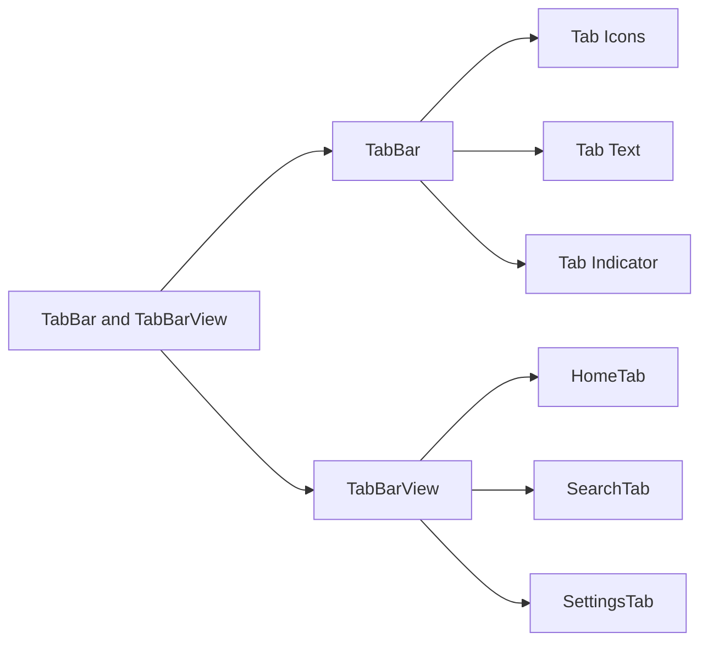

## 7.3.1 Using TabBar and TabBarView

Tabbed navigation is a fundamental aspect of mobile app design, allowing users to switch between different sections of content seamlessly. In Flutter, `TabBar` and `TabBarView` are powerful widgets that enable developers to implement this feature efficiently. This section will guide you through understanding, setting up, and customizing these widgets to create a dynamic and user-friendly tabbed interface.

### Introduction to TabBar and TabBarView

In Flutter, `TabBar` and `TabBarView` work in tandem to provide a tabbed navigation experience. The `TabBar` widget creates a set of horizontal tabs, each representing a different section of your app. When a user taps on a tab, the `TabBarView` widget displays the corresponding content.

#### Use Cases for TabBar and TabBarView

- **Content Organization:** Tabs are ideal for categorizing content into distinct sections, such as home, settings, and profile, making it easier for users to navigate.
- **Improved User Experience:** By using tabs, you can present information in a structured manner, reducing clutter and enhancing usability.
- **Efficient Navigation:** Tabs allow users to switch between views quickly without navigating away from the current screen.

### Setting Up TabController

The `TabController` is a crucial component that manages the state and synchronization between `TabBar` and `TabBarView`. It keeps track of the selected tab and ensures that the correct content is displayed.

#### Implementing TabController

To use `TabController`, you need to integrate it within a `StatefulWidget`. Here's a step-by-step guide:

1. **Create a StatefulWidget:**
   Start by creating a `StatefulWidget` to manage the state of your tabs.

2. **Initialize TabController:**
   Use the `initState` method to initialize the `TabController`, specifying the number of tabs and the `vsync` parameter for animation.

3. **Dispose of TabController:**
   Override the `dispose` method to clean up the `TabController` when the widget is removed from the widget tree.

4. **Build the UI:**
   Use `Scaffold` to structure your app, incorporating `AppBar` with `TabBar` and `TabBarView` for content display.

Here's a complete code example:

```dart
class HomeScreen extends StatefulWidget {
  @override
  _HomeScreenState createState() => _HomeScreenState();
}

class _HomeScreenState extends State<HomeScreen> with SingleTickerProviderStateMixin {
  late TabController _tabController;

  @override
  void initState() {
    super.initState();
    _tabController = TabController(length: 3, vsync: this);
  }

  @override
  void dispose() {
    _tabController.dispose();
    super.dispose();
  }

  @override
  Widget build(BuildContext context) {
    return Scaffold(
      appBar: AppBar(
        title: Text('Tabbed App'),
        bottom: TabBar(
          controller: _tabController,
          tabs: [
            Tab(icon: Icon(Icons.home), text: 'Home'),
            Tab(icon: Icon(Icons.settings), text: 'Settings'),
            Tab(icon: Icon(Icons.person), text: 'Profile'),
          ],
        ),
      ),
      body: TabBarView(
        controller: _tabController,
        children: [
          HomeTab(),
          SettingsTab(),
          ProfileTab(),
        ],
      ),
    );
  }
}

class HomeTab extends StatelessWidget {
  @override
  Widget build(BuildContext context) {
    return Center(child: Text('Home Tab'));
  }
}

class SettingsTab extends StatelessWidget {
  @override
  Widget build(BuildContext context) {
    return Center(child: Text('Settings Tab'));
  }
}

class ProfileTab extends StatelessWidget {
  @override
  Widget build(BuildContext context) {
    return Center(child: Text('Profile Tab'));
  }
}
```

### Customizing Tabs

Customization is key to creating a visually appealing and intuitive user interface. Flutter's `TabBar` widget offers various customization options, allowing you to tailor the appearance of your tabs.

#### Customization Options

- **Icons and Text:** You can add icons and text to each tab for better clarity and aesthetics.
- **Styling:** Customize the color, size, and style of the tab labels and indicators to match your app's theme.

Here's how you can customize the `TabBar`:

```dart
TabBar(
  controller: _tabController,
  indicatorColor: Colors.white,
  labelColor: Colors.yellow,
  unselectedLabelColor: Colors.white70,
  tabs: [
    Tab(icon: Icon(Icons.home), text: 'Home'),
    Tab(icon: Icon(Icons.search), text: 'Search'),
    Tab(icon: Icon(Icons.settings), text: 'Settings'),
  ],
);
```

### Visualizing TabBar and TabBarView with Mermaid.js

To better understand the relationship between `TabBar`, `TabBarView`, and their components, let's visualize it using a Mermaid.js diagram:



### Complete Example with Customization

Let's put everything together in a comprehensive example that includes tab customization:

```dart
class MyTabbedApp extends StatefulWidget {
  @override
  _MyTabbedAppState createState() => _MyTabbedAppState();
}

class _MyTabbedAppState extends State<MyTabbedApp> with SingleTickerProviderStateMixin {
  late TabController _tabController;

  @override
  void initState() {
    super.initState();
    _tabController = TabController(length: 3, vsync: this);
  }

  @override
  void dispose() {
    _tabController.dispose();
    super.dispose();
  }

  @override
  Widget build(BuildContext context) {
    return Scaffold(
      appBar: AppBar(
        title: Text('Tabbed Navigation'),
        bottom: TabBar(
          controller: _tabController,
          tabs: [
            Tab(icon: Icon(Icons.home), text: 'Home'),
            Tab(icon: Icon(Icons.search), text: 'Search'),
            Tab(icon: Icon(Icons.settings), text: 'Settings'),
          ],
          indicatorColor: Colors.yellow,
          labelColor: Colors.yellow,
          unselectedLabelColor: Colors.white70,
        ),
      ),
      body: TabBarView(
        controller: _tabController,
        children: [
          HomeTab(),
          SearchTab(),
          SettingsTab(),
        ],
      ),
    );
  }
}

class HomeTab extends StatelessWidget {
  @override
  Widget build(BuildContext context) {
    return Center(child: Text('Home Content'));
  }
}

class SearchTab extends StatelessWidget {
  @override
  Widget build(BuildContext context) {
    return Center(child: Text('Search Content'));
  }
}

class SettingsTab extends StatelessWidget {
  @override
  Widget build(BuildContext context) {
    return Center(child: Text('Settings Content'));
  }
}
```

### Encouragement to Experiment

Now that you have a solid understanding of `TabBar` and `TabBarView`, it's time to experiment. Try different configurations, such as varying the number of tabs, changing the icons and text, or applying different styles. This hands-on practice will deepen your understanding and help you create a personalized tabbed interface that enhances your app's user experience.

### Best Practices and Common Pitfalls

- **Consistency:** Ensure that the tab icons and labels are consistent with the overall theme of your app.
- **Accessibility:** Use clear and descriptive labels for each tab to improve accessibility.
- **Performance:** Avoid loading heavy content in each tab to maintain smooth transitions and responsiveness.
- **Testing:** Test your tabbed interface on different devices and screen sizes to ensure a consistent experience.

### Further Exploration

For more advanced tabbed navigation techniques, consider exploring:

- **Custom TabBar Widgets:** Create custom widgets for more complex tab designs.
- **Dynamic Tabs:** Implement tabs that can be added or removed dynamically based on user interaction or data changes.
- **Advanced Animations:** Enhance tab transitions with custom animations for a more engaging experience.

### References and Resources

- [Flutter Documentation on TabBar](https://api.flutter.dev/flutter/material/TabBar-class.html)
- [Flutter Documentation on TabBarView](https://api.flutter.dev/flutter/material/TabBarView-class.html)
- [Flutter Cookbook: Working with Tabs](https://flutter.dev/docs/cookbook/design/tabs)
- [Online Course: Flutter & Dart - The Complete Guide](https://www.udemy.com/course/learn-flutter-dart-to-build-ios-android-apps/)

By mastering `TabBar` and `TabBarView`, you can significantly enhance the navigational capabilities of your Flutter applications, providing users with a seamless and intuitive experience.

## Quiz Time!



### What is the primary purpose of the TabBar widget in Flutter?

- [x] To create a set of horizontal tabs for navigation
- [ ] To display content corresponding to each tab
- [ ] To manage the state of the application
- [ ] To handle user input events

> **Explanation:** The `TabBar` widget is used to create a set of horizontal tabs that allow users to navigate between different sections of an app.

### Which widget is used to display the content corresponding to each tab in Flutter?

- [ ] TabBar
- [x] TabBarView
- [ ] TabController
- [ ] Scaffold

> **Explanation:** The `TabBarView` widget is responsible for displaying the content associated with each tab in a `TabBar`.

### What is the role of the TabController in a tabbed interface?

- [x] To manage tab selection and synchronization between TabBar and TabBarView
- [ ] To display the content of each tab
- [ ] To handle user input events
- [ ] To create custom animations for tabs

> **Explanation:** The `TabController` manages the selection and synchronization between the `TabBar` and `TabBarView`, ensuring the correct content is displayed for each tab.

### How do you initialize a TabController in a StatefulWidget?

- [x] In the initState method
- [ ] In the build method
- [ ] In the dispose method
- [ ] In the main function

> **Explanation:** The `TabController` is initialized in the `initState` method of a `StatefulWidget` to set up the tabbed interface.

### What is the purpose of the dispose method in relation to TabController?

- [x] To clean up the TabController when the widget is removed from the widget tree
- [ ] To initialize the TabController
- [ ] To build the user interface
- [ ] To handle user input events

> **Explanation:** The `dispose` method is used to clean up resources, such as the `TabController`, when the widget is removed from the widget tree.

### Which property of TabBar allows you to customize the color of the selected tab's label?

- [ ] indicatorColor
- [x] labelColor
- [ ] unselectedLabelColor
- [ ] backgroundColor

> **Explanation:** The `labelColor` property of `TabBar` is used to customize the color of the selected tab's label.

### What does the vsync parameter in TabController do?

- [x] It provides a ticker for animations to synchronize with the screen refresh rate
- [ ] It sets the number of tabs in the TabBar
- [ ] It determines the color of the TabBar
- [ ] It handles user input events

> **Explanation:** The `vsync` parameter provides a ticker for animations, ensuring they are synchronized with the screen's refresh rate.

### How can you add icons to each tab in a TabBar?

- [x] By using the Tab widget with the icon property
- [ ] By setting the icon property of TabBar
- [ ] By using the IconButton widget
- [ ] By setting the icon property of TabController

> **Explanation:** Icons can be added to each tab by using the `Tab` widget and specifying the `icon` property.

### What is a common use case for using TabBar and TabBarView in an app?

- [x] Categorizing content into distinct sections for better organization
- [ ] Handling user authentication
- [ ] Managing app state
- [ ] Displaying a list of items

> **Explanation:** A common use case for `TabBar` and `TabBarView` is to categorize content into distinct sections, improving organization and navigation.

### True or False: The TabBarView widget is responsible for creating the tabs in a tabbed interface.

- [ ] True
- [x] False

> **Explanation:** False. The `TabBar` widget is responsible for creating the tabs, while the `TabBarView` displays the content for each tab.


