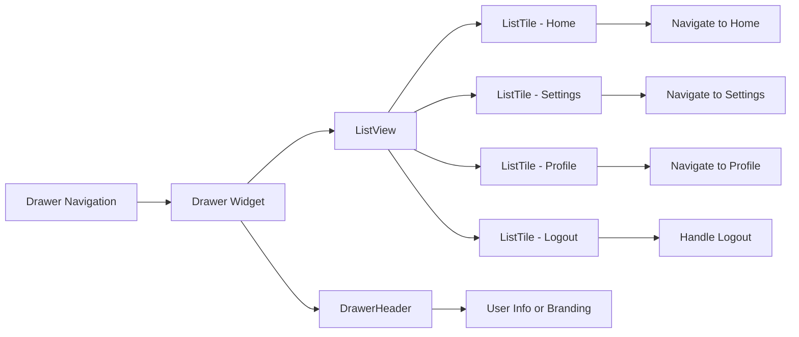

## 7.3.2 Drawer Navigation

In the world of mobile app development, providing users with intuitive and accessible navigation is crucial. One popular method to achieve this in Flutter is through the use of a `Drawer`. This section will delve into the intricacies of implementing and customizing drawer navigation, offering insights into its practical applications and guiding you through the process of integrating it into your Flutter applications.

### Introduction to Drawer Navigation

A `Drawer` in Flutter is a hidden side panel that can be swiped in from the edge of the screen or accessed via an icon in the app bar. It serves as a convenient navigation tool, allowing users to switch between different sections of an app seamlessly. This is particularly useful in applications with multiple screens or settings, where a persistent navigation menu enhances the user experience.

#### Use Cases for Drawer Navigation

- **App Settings:** Quickly access app settings without cluttering the main interface.
- **User Profiles:** Provide a dedicated space for user information and account management.
- **Navigation Menus:** Offer a comprehensive menu for navigating between different app sections.

### Implementing a Drawer

Implementing a drawer in Flutter is straightforward, thanks to the `Drawer` widget. Below, we'll walk through setting up a basic drawer and explore how to customize it to fit your app's needs.

#### Basic Drawer Setup

The following code snippet demonstrates how to set up a basic drawer within a `Scaffold` widget:

```dart
Scaffold(
  appBar: AppBar(title: Text('Drawer Example')),
  drawer: Drawer(
    child: ListView(
      padding: EdgeInsets.zero,
      children: <Widget>[
        DrawerHeader(
          decoration: BoxDecoration(color: Colors.blue),
          child: Text(
            'Navigation Menu',
            style: TextStyle(color: Colors.white, fontSize: 24),
          ),
        ),
        ListTile(
          leading: Icon(Icons.home),
          title: Text('Home'),
          onTap: () {
            Navigator.pushReplacementNamed(context, '/');
          },
        ),
        ListTile(
          leading: Icon(Icons.settings),
          title: Text('Settings'),
          onTap: () {
            Navigator.pushReplacementNamed(context, '/settings');
          },
        ),
        ListTile(
          leading: Icon(Icons.person),
          title: Text('Profile'),
          onTap: () {
            Navigator.pushReplacementNamed(context, '/profile');
          },
        ),
      ],
    ),
  ),
  body: Center(child: Text('Home Screen')),
);
```

#### Explanation

- **`DrawerHeader`:** This widget provides a header section for the drawer, often used to display user information or app branding. It is styled with a `BoxDecoration` to set the background color.
- **`ListView`:** Organizes the drawer items vertically, allowing for smooth scrolling if the list exceeds the screen height.
- **`ListTile`:** Represents individual navigation options within the drawer. Each `ListTile` includes an icon and a title, and an `onTap` callback to handle navigation.
- **`Navigator.pushReplacementNamed`:** This method replaces the current route with the selected one, ensuring that each screen is a single instance in the navigation stack.

### Customizing the Drawer

While the basic setup provides a functional drawer, customization allows you to tailor the drawer to better fit your app's design and functionality.

#### Adding User Profile or Branding

Enhancing the `DrawerHeader` with user images, app logos, or additional styling can make the drawer more engaging and informative.

**Code Example:**

```dart
DrawerHeader(
  decoration: BoxDecoration(color: Colors.blue),
  child: Row(
    children: <Widget>[
      CircleAvatar(
        radius: 30,
        backgroundImage: AssetImage('assets/images/user.png'),
      ),
      SizedBox(width: 10),
      Text(
        'John Doe',
        style: TextStyle(color: Colors.white, fontSize: 20),
      ),
    ],
  ),
);
```

#### Adding Dividers and Sections

To improve organization within the drawer, use `Divider` widgets to separate different sections, making it easier for users to navigate.

**Code Example:**

```dart
ListTile(
  leading: Icon(Icons.dashboard),
  title: Text('Dashboard'),
  onTap: () {
    Navigator.pushReplacementNamed(context, '/dashboard');
  },
),
Divider(),
ListTile(
  leading: Icon(Icons.logout),
  title: Text('Logout'),
  onTap: () {
    // Handle logout
  },
),
```

### Visualizing Drawer Navigation

To better understand the structure and flow of drawer navigation, let's visualize it using a Mermaid.js diagram:



This diagram illustrates the hierarchical structure of a drawer, showing how each component is interconnected and how navigation flows from the drawer to different app sections.

### Comprehensive Code Example

Below is a complete example of a Flutter app implementing a customized drawer:

```dart
import 'package:flutter/material.dart';

class DrawerExample extends StatelessWidget {
  @override
  Widget build(BuildContext context) {
    return Scaffold(
      appBar: AppBar(title: Text('Drawer Example')),
      drawer: Drawer(
        child: ListView(
          padding: EdgeInsets.zero,
          children: <Widget>[
            DrawerHeader(
              decoration: BoxDecoration(color: Colors.blue),
              child: Row(
                children: <Widget>[
                  CircleAvatar(
                    radius: 30,
                    backgroundImage: AssetImage('assets/images/user.png'),
                  ),
                  SizedBox(width: 10),
                  Text(
                    'John Doe',
                    style: TextStyle(color: Colors.white, fontSize: 20),
                  ),
                ],
              ),
            ),
            ListTile(
              leading: Icon(Icons.home),
              title: Text('Home'),
              onTap: () {
                Navigator.pushReplacementNamed(context, '/');
              },
            ),
            ListTile(
              leading: Icon(Icons.settings),
              title: Text('Settings'),
              onTap: () {
                Navigator.pushReplacementNamed(context, '/settings');
              },
            ),
            ListTile(
              leading: Icon(Icons.person),
              title: Text('Profile'),
              onTap: () {
                Navigator.pushReplacementNamed(context, '/profile');
              },
            ),
            Divider(),
            ListTile(
              leading: Icon(Icons.logout),
              title: Text('Logout'),
              onTap: () {
                // Implement logout functionality
                Navigator.pop(context);
              },
            ),
          ],
        ),
      ),
      body: Center(child: Text('Home Screen')),
    );
  }
}

void main() => runApp(MaterialApp(
  home: DrawerExample(),
  routes: {
    '/': (context) => HomeScreen(),
    '/settings': (context) => SettingsScreen(),
    '/profile': (context) => ProfileScreen(),
  },
));

class HomeScreen extends StatelessWidget {
  @override
  Widget build(BuildContext context) {
    return Scaffold(
      appBar: AppBar(title: Text('Home')),
      body: Center(child: Text('Welcome to the Home Screen')),
    );
  }
}

class SettingsScreen extends StatelessWidget {
  @override
  Widget build(BuildContext context) {
    return Scaffold(
      appBar: AppBar(title: Text('Settings')),
      body: Center(child: Text('Settings Screen')),
    );
  }
}

class ProfileScreen extends StatelessWidget {
  @override
  Widget build(BuildContext context) {
    return Scaffold(
      appBar: AppBar(title: Text('Profile')),
      body: Center(child: Text('Profile Screen')),
    );
  }
}
```

### Best Practices and Considerations

- **Consistency:** Ensure that the drawer's design and functionality are consistent with the rest of the app's UI.
- **Accessibility:** Make sure that all interactive elements within the drawer are accessible and provide meaningful feedback.
- **Performance:** Avoid overloading the drawer with too many items, which can degrade performance and user experience.
- **Security:** If the drawer contains sensitive information, ensure that appropriate security measures are in place.

### Conclusion

Drawer navigation is a powerful tool in Flutter for creating intuitive and accessible user interfaces. By understanding its implementation and customization options, you can enhance your app's navigation experience, making it more user-friendly and efficient. Experiment with different designs and functionalities to find the best fit for your app, and always keep the user's experience at the forefront of your design decisions.

## Quiz Time!



### What is the primary purpose of a Drawer in a Flutter app?

- [x] To provide a hidden side panel for navigation
- [ ] To display advertisements
- [ ] To store app data
- [ ] To enhance app performance

> **Explanation:** A Drawer provides a hidden side panel that can be swiped in or accessed via an icon, offering a convenient way to navigate between different sections of the app.

### Which widget is used to organize items vertically in a Drawer?

- [ ] Column
- [ ] Row
- [x] ListView
- [ ] Stack

> **Explanation:** A `ListView` is used to organize items vertically within a Drawer, allowing for smooth scrolling if the list exceeds the screen height.

### What is the role of the `DrawerHeader` widget?

- [ ] To handle navigation logic
- [x] To provide a header section for the drawer
- [ ] To display a list of items
- [ ] To manage state changes

> **Explanation:** The `DrawerHeader` widget provides a header section for the drawer, often used to display user information or app branding.

### How can you separate different sections within a Drawer?

- [ ] Using `Padding`
- [ ] Using `Container`
- [x] Using `Divider`
- [ ] Using `Spacer`

> **Explanation:** A `Divider` widget is used to separate different sections within a Drawer, improving organization and readability.

### What method is used to replace the current route with a new one in a Drawer?

- [ ] Navigator.push
- [x] Navigator.pushReplacementNamed
- [ ] Navigator.pop
- [ ] Navigator.pushNamed

> **Explanation:** `Navigator.pushReplacementNamed` replaces the current route with the selected one, ensuring a single instance of each screen in the navigation stack.

### Which widget is commonly used to represent individual navigation options in a Drawer?

- [ ] Card
- [ ] Button
- [x] ListTile
- [ ] Icon

> **Explanation:** `ListTile` is commonly used to represent individual navigation options within a Drawer, including an icon, title, and an `onTap` callback.

### What is a common use case for a Drawer in a mobile app?

- [x] App settings
- [ ] Displaying ads
- [ ] Background tasks
- [ ] Data storage

> **Explanation:** A common use case for a Drawer is to provide quick access to app settings without cluttering the main interface.

### How can you enhance the `DrawerHeader` with user images?

- [ ] Using `Text`
- [x] Using `CircleAvatar`
- [ ] Using `FlatButton`
- [ ] Using `Checkbox`

> **Explanation:** `CircleAvatar` is used to display user images within the `DrawerHeader`, enhancing the drawer with user profiles or branding.

### What should you consider when designing a Drawer for your app?

- [x] Consistency with the app's UI
- [x] Accessibility of interactive elements
- [x] Performance and user experience
- [ ] Adding as many items as possible

> **Explanation:** When designing a Drawer, consider consistency with the app's UI, accessibility of interactive elements, and performance to ensure a positive user experience.

### True or False: A Drawer can only be accessed via an icon in the app bar.

- [ ] True
- [x] False

> **Explanation:** A Drawer can be accessed via an icon in the app bar or by swiping in from the edge of the screen, providing flexible navigation options.


