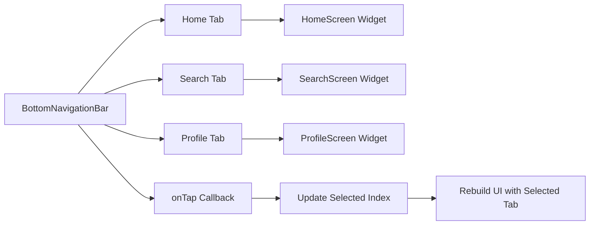

## 7.3.3 Bottom Navigation Bars

In modern mobile app design, navigation plays a crucial role in enhancing user experience by allowing seamless transitions between different sections of an application. One of the most popular navigation patterns is the Bottom Navigation Bar, which provides a persistent navigation bar at the bottom of the app, enabling users to switch between top-level views with a single tap. This section will guide you through the implementation and customization of `BottomNavigationBar` in Flutter, offering insights into its use cases, setup, and best practices.

### Introduction to Bottom Navigation Bars

The `BottomNavigationBar` widget in Flutter is a powerful tool for creating a user-friendly navigation experience. It is particularly useful for apps with three to five top-level destinations, such as Home, Search, and Profile sections. By providing a consistent and easily accessible navigation option, users can quickly switch between different parts of the app without losing context.

#### Use Cases for Bottom Navigation Bars

- **Categorizing Major Sections:** Apps like social media platforms, e-commerce sites, and productivity tools often use bottom navigation bars to categorize major sections, allowing users to access features like feeds, search, notifications, and settings effortlessly.
- **Enhancing User Experience:** By keeping navigation options visible and accessible, bottom navigation bars reduce the number of taps required to reach desired content, improving overall user satisfaction.
- **Consistent Navigation:** They provide a consistent navigation pattern across different screens, ensuring users can easily predict how to navigate through the app.

### Implementing BottomNavigationBar

Implementing a `BottomNavigationBar` in Flutter is straightforward. Let's start with a basic setup and gradually explore customization options to enhance its appearance and functionality.

#### Basic Setup

To create a simple bottom navigation bar with three tabs, follow the code example below. This setup includes three sections: Home, Search, and Profile.

```dart
class MyApp extends StatefulWidget {
  @override
  _MyAppState createState() => _MyAppState();
}

class _MyAppState extends State<MyApp> {
  int _selectedIndex = 0;
  static List<Widget> _widgetOptions = <Widget>[
    HomeTab(),
    SearchTab(),
    ProfileTab(),
  ];

  void _onItemTapped(int index) {
    setState(() {
      _selectedIndex = index;
    });
  }

  @override
  Widget build(BuildContext context) {
    return MaterialApp(
      home: Scaffold(
        appBar: AppBar(title: Text('Bottom Navigation')),
        body: Center(
          child: _widgetOptions.elementAt(_selectedIndex),
        ),
        bottomNavigationBar: BottomNavigationBar(
          items: const <BottomNavigationBarItem>[
            BottomNavigationBarItem(
              icon: Icon(Icons.home),
              label: 'Home',
            ),
            BottomNavigationBarItem(
              icon: Icon(Icons.search),
              label: 'Search',
            ),
            BottomNavigationBarItem(
              icon: Icon(Icons.person),
              label: 'Profile',
            ),
          ],
          currentIndex: _selectedIndex,
          selectedItemColor: Colors.amber[800],
          onTap: _onItemTapped,
        ),
      ),
    );
  }
}

class HomeTab extends StatelessWidget {
  @override
  Widget build(BuildContext context) {
    return Center(child: Text('Home Tab'));
  }
}

class SearchTab extends StatelessWidget {
  @override
  Widget build(BuildContext context) {
    return Center(child: Text('Search Tab'));
  }
}

class ProfileTab extends StatelessWidget {
  @override
  Widget build(BuildContext context) {
    return Center(child: Text('Profile Tab'));
  }
}
```

**Explanation:**

- **State Management:** The `_selectedIndex` variable keeps track of the currently selected tab. The `setState` method is used to update the UI when a new tab is selected.
- **Widget Options:** A list of widgets (`_widgetOptions`) corresponds to each tab, determining the content displayed when a tab is selected.
- **BottomNavigationBar:** The `BottomNavigationBar` widget defines the items (tabs) and handles user interaction through the `onTap` callback.

### Customizing BottomNavigationBar

Customization is key to creating a visually appealing and intuitive navigation experience. Let's explore how to modify the appearance and behavior of the `BottomNavigationBar`.

#### Changing Colors and Styles

You can customize the colors and styles of the `BottomNavigationBar` to match your app's theme. This includes setting the background color, selected item color, and unselected item color.

```dart
BottomNavigationBar(
  items: const <BottomNavigationBarItem>[
    BottomNavigationBarItem(
      icon: Icon(Icons.home),
      label: 'Home',
    ),
    BottomNavigationBarItem(
      icon: Icon(Icons.search),
      label: 'Search',
    ),
    BottomNavigationBarItem(
      icon: Icon(Icons.person),
      label: 'Profile',
    ),
  ],
  currentIndex: _selectedIndex,
  selectedItemColor: Colors.blue,
  unselectedItemColor: Colors.grey,
  backgroundColor: Colors.white,
  onTap: _onItemTapped,
  type: BottomNavigationBarType.fixed,
);
```

**Key Customizations:**

- **Selected Item Color:** Use `selectedItemColor` to highlight the active tab, making it visually distinct.
- **Unselected Item Color:** Set `unselectedItemColor` to define the color of inactive tabs.
- **Background Color:** Customize the `backgroundColor` to align with your app's design.

#### Adding Icons and Labels

Icons and labels are crucial for user understanding. Ensure that the icons are intuitive and the labels are clear.

```dart
BottomNavigationBar(
  items: const <BottomNavigationBarItem>[
    BottomNavigationBarItem(
      icon: Icon(Icons.dashboard),
      label: 'Dashboard',
    ),
    BottomNavigationBarItem(
      icon: Icon(Icons.notifications),
      label: 'Notifications',
    ),
    BottomNavigationBarItem(
      icon: Icon(Icons.settings),
      label: 'Settings',
    ),
  ],
  // Other properties
);
```

**Best Practices:**

- **Intuitive Icons:** Choose icons that represent the function of each tab clearly.
- **Clear Labels:** Use concise labels to describe the tab's purpose.

#### Badge Indicators

Badges are useful for indicating notifications or updates. You can use the `badges` package to add badge indicators to your `BottomNavigationBar`.

```dart
BottomNavigationBarItem(
  icon: Badge(
    badgeContent: Text('3', style: TextStyle(color: Colors.white)),
    child: Icon(Icons.notifications),
  ),
  label: 'Notifications',
),
```

**Implementation Steps:**

- **Install the Package:** Add the `badges` package to your `pubspec.yaml` file.
- **Use Badge Widget:** Wrap the icon with the `Badge` widget to display a badge.

### Handling Navigation State

Managing the navigation state is essential for ensuring that the correct content is displayed when a user interacts with the `BottomNavigationBar`.

```dart
void _onItemTapped(int index) {
  setState(() {
    _selectedIndex = index;
  });
}
```

**State Management:**

- **Selected Index:** The `_selectedIndex` variable determines which tab is active.
- **State Update:** Use `setState` to update the UI when a new tab is selected, ensuring the correct content is displayed.

### Visualizing Navigation Flow with Mermaid.js

To better understand the interaction between the bottom navigation bar, user taps, and content updates, let's visualize the process using a Mermaid.js diagram.



**Diagram Explanation:**

- **Navigation Flow:** The diagram illustrates how the `BottomNavigationBar` interacts with different tabs and updates the UI based on user input.
- **State Update:** The `onTap` callback updates the selected index, triggering a UI rebuild with the appropriate content.

### Encouragement to Experiment

Experimentation is key to mastering the use of `BottomNavigationBar`. Try different configurations, styles, and functionalities to create a personalized and user-friendly navigation experience. Consider the following exercises:

- **Exercise 1:** Add a fourth tab to the navigation bar and implement its corresponding content.
- **Exercise 2:** Customize the navigation bar to match a specific app theme, experimenting with different color schemes.
- **Exercise 3:** Implement badge indicators for multiple tabs, simulating notifications or updates.

### Conclusion

The `BottomNavigationBar` widget is a versatile tool for enhancing user navigation in Flutter apps. By understanding its implementation and customization options, you can create a seamless and intuitive navigation experience that aligns with your app's design and functionality. Remember to consider user experience and accessibility when designing your navigation bar, ensuring that it is both functional and visually appealing.

For further exploration, refer to the official [Flutter documentation](https://flutter.dev/docs) and consider exploring additional resources such as online courses or community forums to deepen your understanding of Flutter navigation patterns.

## Quiz Time!



### What is the primary purpose of a BottomNavigationBar in Flutter?

- [x] To provide persistent navigation at the bottom of the app for switching between top-level views.
- [ ] To display a list of items in a vertical scrollable format.
- [ ] To manage the app's state across different screens.
- [ ] To handle network requests and API calls.

> **Explanation:** The BottomNavigationBar is used to provide a persistent navigation option at the bottom of the app, allowing users to switch between top-level views with a single tap.

### How many top-level destinations are typically recommended for a BottomNavigationBar?

- [x] Three to five
- [ ] One to two
- [ ] Six to eight
- [ ] More than ten

> **Explanation:** It is recommended to use a BottomNavigationBar for three to five top-level destinations to maintain usability and avoid clutter.

### Which property of BottomNavigationBar is used to highlight the active tab?

- [x] selectedItemColor
- [ ] backgroundColor
- [ ] unselectedItemColor
- [ ] currentIndex

> **Explanation:** The `selectedItemColor` property is used to define the color of the active tab, making it visually distinct from the others.

### What package can be used to add badge indicators to a BottomNavigationBar?

- [x] badges
- [ ] provider
- [ ] http
- [ ] sqflite

> **Explanation:** The `badges` package can be used to add badge indicators to icons in a BottomNavigationBar, indicating notifications or updates.

### Which method is used to update the UI when a new tab is selected in a BottomNavigationBar?

- [x] setState
- [ ] initState
- [ ] dispose
- [ ] build

> **Explanation:** The `setState` method is used to update the UI when a new tab is selected, ensuring the correct content is displayed.

### What is the role of the _selectedIndex variable in the BottomNavigationBar implementation?

- [x] It keeps track of the currently selected tab.
- [ ] It stores the list of widgets for each tab.
- [ ] It defines the color scheme of the navigation bar.
- [ ] It handles network requests for the app.

> **Explanation:** The `_selectedIndex` variable keeps track of which tab is currently selected, allowing the app to display the corresponding content.

### How can you customize the appearance of a BottomNavigationBar?

- [x] By changing properties like selectedItemColor, unselectedItemColor, and backgroundColor.
- [ ] By modifying the app's main theme.
- [ ] By using a different widget for navigation.
- [ ] By altering the app's build method.

> **Explanation:** The appearance of a BottomNavigationBar can be customized by setting properties such as `selectedItemColor`, `unselectedItemColor`, and `backgroundColor`.

### What is the purpose of the onTap callback in a BottomNavigationBar?

- [x] To handle user interaction and update the selected index.
- [ ] To initialize the app's state.
- [ ] To fetch data from an API.
- [ ] To render the app's UI.

> **Explanation:** The `onTap` callback is used to handle user interaction with the BottomNavigationBar, updating the selected index and triggering a UI update.

### Which property defines the list of widgets corresponding to each tab in a BottomNavigationBar?

- [x] _widgetOptions
- [ ] _selectedIndex
- [ ] items
- [ ] onTap

> **Explanation:** The `_widgetOptions` list defines the widgets corresponding to each tab, determining the content displayed when a tab is selected.

### True or False: A BottomNavigationBar can only be used with a fixed number of tabs.

- [ ] True
- [x] False

> **Explanation:** While it is recommended to use a BottomNavigationBar for three to five tabs, it is not limited to a fixed number of tabs. However, usability may decrease with too many tabs.


