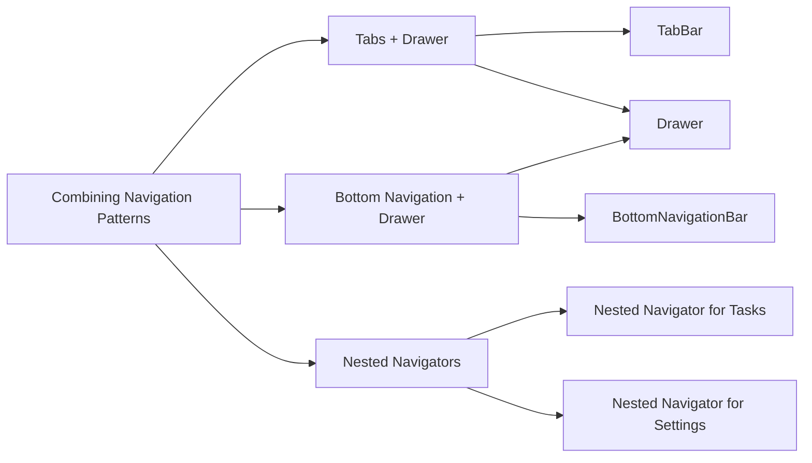

## 7.3.4 Combining Navigation Patterns

In the world of mobile app development, navigation is a critical component that significantly impacts user experience. Flutter, with its rich set of widgets, offers various navigation patterns such as tabs, drawers, and bottom navigation bars. Each of these patterns serves a unique purpose and can be combined to create a more organized and user-friendly app. This section will delve into the art of combining these navigation patterns, providing insights, practical examples, and best practices to help you design intuitive navigation structures in your Flutter applications.

### Introduction to Combining Navigation Patterns

Combining different navigation patterns allows developers to create apps that are not only functional but also aesthetically pleasing and easy to navigate. By integrating multiple navigation methods, you can cater to different user preferences and enhance the overall usability of your app. However, it's crucial to balance usability with design consistency to ensure that the navigation structure is intuitive and does not overwhelm the user.

**Key Benefits:**
- **Enhanced Usability:** By offering multiple navigation options, users can choose the method that best suits their needs, improving their overall experience.
- **Improved Organization:** Combining navigation patterns helps in categorizing content effectively, making it easier for users to find what they are looking for.
- **Design Flexibility:** It allows for creative design solutions that can make your app stand out.

### Using Tabs with Drawer Navigation

One effective way to combine navigation patterns is by integrating a `TabBar` within a `Drawer`. This setup provides users with quick access to different sections of the app through tabs while offering additional navigation options via the drawer.

#### Code Example: Tabs with Drawer

```dart
class HomeScreen extends StatefulWidget {
  @override
  _HomeScreenState createState() => _HomeScreenState();
}

class _HomeScreenState extends State<HomeScreen> with SingleTickerProviderStateMixin {
  late TabController _tabController;

  @override
  void initState() {
    super.initState();
    _tabController = TabController(length: 3, vsync: this);
  }

  @override
  void dispose() {
    _tabController.dispose();
    super.dispose();
  }

  @override
  Widget build(BuildContext context) {
    return Scaffold(
      appBar: AppBar(
        title: Text('Combined Navigation'),
        bottom: TabBar(
          controller: _tabController,
          tabs: [
            Tab(icon: Icon(Icons.home), text: 'Home'),
            Tab(icon: Icon(Icons.star), text: 'Favorites'),
            Tab(icon: Icon(Icons.settings), text: 'Settings'),
          ],
        ),
      ),
      drawer: Drawer(
        child: ListView(
          padding: EdgeInsets.zero,
          children: <Widget>[
            DrawerHeader(
              decoration: BoxDecoration(color: Colors.blue),
              child: Text('Menu', style: TextStyle(color: Colors.white, fontSize: 24)),
            ),
            ListTile(
              leading: Icon(Icons.logout),
              title: Text('Logout'),
              onTap: () {
                // Handle logout
                Navigator.pop(context);
              },
            ),
          ],
        ),
      ),
      body: TabBarView(
        controller: _tabController,
        children: [
          HomeTab(),
          FavoritesTab(),
          SettingsTab(),
        ],
      ),
    );
  }
}

class FavoritesTab extends StatelessWidget {
  @override
  Widget build(BuildContext context) {
    return Center(child: Text('Favorites Tab'));
  }
}
```

**Explanation:**
- **TabController:** Manages the state of the tabs and synchronizes with the `TabBar` and `TabBarView`.
- **Drawer:** Provides additional navigation options, such as logging out or accessing settings.
- **TabBar and TabBarView:** Allow users to switch between different sections of the app seamlessly.

### Using Bottom Navigation with Drawer

Another popular combination is using a bottom navigation bar alongside a drawer. This pattern is particularly useful for apps with a few primary sections accessible via the bottom bar, while the drawer can house less frequently accessed options.

#### Code Example: Bottom Navigation with Drawer

```dart
class MyApp extends StatefulWidget {
  @override
  _MyAppState createState() => _MyAppState();
}

class _MyAppState extends State<MyApp> {
  int _selectedIndex = 0;
  static List<Widget> _widgetOptions = <Widget>[
    HomeTab(),
    SearchTab(),
    ProfileTab(),
  ];

  void _onItemTapped(int index) {
    setState(() {
      _selectedIndex = index;
    });
  }

  @override
  Widget build(BuildContext context) {
    return MaterialApp(
      home: Scaffold(
        appBar: AppBar(title: Text('Combined Navigation')),
        drawer: Drawer(
          child: ListView(
            padding: EdgeInsets.zero,
            children: <Widget>[
              DrawerHeader(
                decoration: BoxDecoration(color: Colors.blue),
                child: Text('Menu', style: TextStyle(color: Colors.white, fontSize: 24)),
              ),
              ListTile(
                leading: Icon(Icons.info),
                title: Text('About'),
                onTap: () {
                  Navigator.pushNamed(context, '/about');
                },
              ),
            ],
          ),
        ),
        body: Center(
          child: _widgetOptions.elementAt(_selectedIndex),
        ),
        bottomNavigationBar: BottomNavigationBar(
          items: const <BottomNavigationBarItem>[
            BottomNavigationBarItem(
              icon: Icon(Icons.home),
              label: 'Home',
            ),
            BottomNavigationBarItem(
              icon: Icon(Icons.search),
              label: 'Search',
            ),
            BottomNavigationBarItem(
              icon: Icon(Icons.person),
              label: 'Profile',
            ),
          ],
          currentIndex: _selectedIndex,
          selectedItemColor: Colors.amber[800],
          onTap: _onItemTapped,
        ),
      ),
    );
  }
}

class AboutScreen extends StatelessWidget {
  @override
  Widget build(BuildContext context) {
    return Scaffold(
      appBar: AppBar(title: Text('About')),
      body: Center(child: Text('This is the About screen')),
    );
  }
}
```

**Explanation:**
- **BottomNavigationBar:** Provides quick access to primary sections of the app.
- **Drawer:** Offers additional navigation options, such as accessing the "About" screen.
- **State Management:** The `_selectedIndex` variable keeps track of the currently selected tab.

### Implementing Nested Navigators

For more complex navigation structures, such as handling navigation within tabs, nested navigators can be employed. This approach allows each tab to maintain its own navigation stack, providing a more isolated and independent navigation flow.

#### Code Example: Nested Navigators

```dart
class MainScreen extends StatelessWidget {
  @override
  Widget build(BuildContext context) {
    return DefaultTabController(
      length: 2,
      child: Scaffold(
        appBar: AppBar(
          title: Text('Nested Navigators'),
          bottom: TabBar(
            tabs: [
              Tab(icon: Icon(Icons.list), text: 'Tasks'),
              Tab(icon: Icon(Icons.settings), text: 'Settings'),
            ],
          ),
        ),
        body: TabBarView(
          children: [
            Navigator(
              onGenerateRoute: (RouteSettings settings) {
                return MaterialPageRoute(
                  builder: (context) => TaskListScreen(),
                );
              },
            ),
            Navigator(
              onGenerateRoute: (RouteSettings settings) {
                return MaterialPageRoute(
                  builder: (context) => SettingsScreen(),
                );
              },
            ),
          ],
        ),
      ),
    );
  }
}
```

**Explanation:**
- **Nested Navigator:** Each tab has its own `Navigator`, allowing for independent navigation within each section.
- **Route Management:** `onGenerateRoute` is used to define the initial route for each navigator.

### Visualizing Navigation Patterns with Mermaid.js

To better understand the interaction between various navigation components and their respective screens, let's visualize the structure using a Mermaid.js diagram.



**Diagram Explanation:**
- **Tabs + Drawer:** Combines a `TabBar` with a `Drawer` for additional navigation options.
- **Bottom Navigation + Drawer:** Uses a `BottomNavigationBar` alongside a `Drawer` for a comprehensive navigation experience.
- **Nested Navigators:** Employs separate navigators for each tab, allowing for independent navigation flows.

### Code Example: Comprehensive Navigation

To illustrate the combination of these navigation patterns, here's a comprehensive example that integrates `TabBar`, `Drawer`, and `BottomNavigationBar` within the same app.

```dart
class CombinedNavigationExample extends StatefulWidget {
  @override
  _CombinedNavigationExampleState createState() => _CombinedNavigationExampleState();
}

class _CombinedNavigationExampleState extends State<CombinedNavigationExample> {
  int _selectedIndex = 0;
  static List<Widget> _widgetOptions = <Widget>[
    HomeTab(),
    SearchTab(),
    ProfileTab(),
  ];

  void _onItemTapped(int index) {
    setState(() {
      _selectedIndex = index;
    });
  }

  @override
  Widget build(BuildContext context) {
    return Scaffold(
      appBar: AppBar(title: Text('Combined Navigation')),
      drawer: Drawer(
        child: ListView(
          padding: EdgeInsets.zero,
          children: <Widget>[
            DrawerHeader(
              decoration: BoxDecoration(color: Colors.blue),
              child: Text('Menu', style: TextStyle(color: Colors.white, fontSize: 24)),
            ),
            ListTile(
              leading: Icon(Icons.info),
              title: Text('About'),
              onTap: () {
                Navigator.pushNamed(context, '/about');
              },
            ),
          ],
        ),
      ),
      body: Center(
        child: _widgetOptions.elementAt(_selectedIndex),
      ),
      bottomNavigationBar: BottomNavigationBar(
        items: const <BottomNavigationBarItem>[
          BottomNavigationBarItem(
            icon: Icon(Icons.home),
            label: 'Home',
          ),
          BottomNavigationBarItem(
            icon: Icon(Icons.search),
            label: 'Search',
          ),
          BottomNavigationBarItem(
            icon: Icon(Icons.person),
            label: 'Profile',
          ),
        ],
        currentIndex: _selectedIndex,
        selectedItemColor: Colors.amber[800],
        onTap: _onItemTapped,
        type: BottomNavigationBarType.fixed,
      ),
    );
  }
}

class AboutScreen extends StatelessWidget {
  @override
  Widget build(BuildContext context) {
    return Scaffold(
      appBar: AppBar(title: Text('About')),
      body: Center(child: Text('This is the About screen')),
    );
  }
}
```

**Explanation:**
- This example showcases how to integrate multiple navigation patterns within a single app, providing users with a rich and flexible navigation experience.

### Best Practices for Combining Navigation Patterns

- **Consistency:** Ensure that the navigation patterns are consistent throughout the app to avoid confusing users.
- **Simplicity:** Avoid overcomplicating the navigation structure. Use only the necessary patterns to achieve your design goals.
- **User Testing:** Conduct user testing to gather feedback on the navigation experience and make adjustments as needed.
- **Accessibility:** Consider accessibility features to ensure that all users can navigate your app effectively.

### Conclusion

Combining navigation patterns in Flutter is a powerful way to enhance the user experience and create a more organized app. By integrating tabs, drawers, and bottom navigation bars, you can provide users with multiple ways to navigate your app, catering to different preferences and improving usability. Experiment with these patterns in your projects, and remember to balance usability with design consistency for the best results.

## Quiz Time!



### What is the primary benefit of combining different navigation patterns in a Flutter app?

- [x] Enhanced usability and organization
- [ ] Increased complexity
- [ ] Reduced app performance
- [ ] Limited design flexibility

> **Explanation:** Combining navigation patterns enhances usability and organization by providing multiple navigation options and improving content categorization.

### Which widget is used to manage the state of tabs in a Flutter app?

- [ ] Drawer
- [x] TabController
- [ ] BottomNavigationBar
- [ ] Navigator

> **Explanation:** `TabController` is used to manage the state of tabs and synchronize with `TabBar` and `TabBarView`.

### What is the purpose of using a Drawer in combination with a BottomNavigationBar?

- [x] To offer additional navigation options
- [ ] To replace the BottomNavigationBar
- [ ] To reduce app complexity
- [ ] To improve app performance

> **Explanation:** A Drawer provides additional navigation options that are not frequently accessed, complementing the primary sections accessible via the BottomNavigationBar.

### How can nested navigators be beneficial in a Flutter app?

- [x] They allow for independent navigation flows within different sections.
- [ ] They simplify the navigation structure.
- [ ] They eliminate the need for a main navigator.
- [ ] They reduce the number of screens in the app.

> **Explanation:** Nested navigators allow each section, such as tabs, to maintain its own navigation stack, providing independent navigation flows.

### In the provided code example, what does the `_selectedIndex` variable represent?

- [x] The currently selected tab or section
- [ ] The total number of tabs
- [ ] The index of the Drawer item
- [ ] The number of navigation patterns used

> **Explanation:** `_selectedIndex` keeps track of the currently selected tab or section in the BottomNavigationBar.

### What is the role of `onGenerateRoute` in a nested navigator?

- [x] To define the initial route for each navigator
- [ ] To manage the state of the navigator
- [ ] To synchronize the navigator with the main app
- [ ] To replace the need for a main navigator

> **Explanation:** `onGenerateRoute` is used to define the initial route for each nested navigator, allowing for independent navigation flows.

### Which of the following is a best practice when combining navigation patterns?

- [x] Ensure consistency throughout the app
- [ ] Use as many patterns as possible
- [ ] Avoid user testing
- [ ] Focus solely on design aesthetics

> **Explanation:** Ensuring consistency throughout the app is crucial to avoid confusing users and provide a seamless navigation experience.

### What is a potential drawback of combining too many navigation patterns?

- [x] Increased complexity and potential user confusion
- [ ] Improved app performance
- [ ] Enhanced usability
- [ ] Simplified navigation structure

> **Explanation:** Combining too many navigation patterns can increase complexity and potentially confuse users, detracting from the user experience.

### How can user testing benefit the navigation design of a Flutter app?

- [x] By providing feedback on the navigation experience
- [ ] By reducing the number of navigation patterns
- [ ] By eliminating the need for a Drawer
- [ ] By increasing app complexity

> **Explanation:** User testing provides valuable feedback on the navigation experience, allowing developers to make informed adjustments to improve usability.

### True or False: Nested navigators eliminate the need for a main navigator in a Flutter app.

- [ ] True
- [x] False

> **Explanation:** Nested navigators do not eliminate the need for a main navigator; they complement it by allowing independent navigation flows within specific sections.


