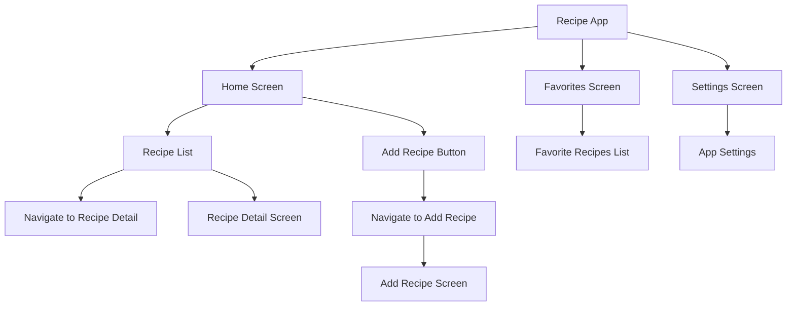

## 7.4.1 Project Overview

In this section, we delve into the creation of a **Recipe App**, a hands-on project designed to solidify your understanding of navigation and routing in Flutter. This project will guide you through the process of building a multi-screen application where users can browse a list of recipes, view detailed information about each recipe, add new recipes, and manage their favorite recipes. By the end of this project, you will have a comprehensive understanding of how to implement complex navigation patterns in Flutter applications.

### Project Description

The **Recipe App** serves as a practical application of the navigation and routing concepts discussed in this chapter. It is designed to provide a user-friendly experience by utilizing multiple screens, named routes, custom transitions, and combined navigation patterns. The app will feature:

- **Home Screen**: A central hub displaying a list of recipes with options to view details or add new recipes.
- **Recipe Detail Screen**: A detailed view of a selected recipe, showcasing ingredients, instructions, and other relevant information.
- **Add Recipe Screen**: A form-based interface allowing users to input new recipe details.
- **Favorites Screen**: A curated list of favorite recipes, accessible via tabs or a navigation drawer.
- **Settings Screen**: A section for app settings, accessible via the navigation drawer.

This project is not only about creating a functional app but also about understanding the underlying principles of navigation and how to manage state effectively to ensure a seamless user experience.

### Project Objectives

The primary objectives of this project are to:

- **Implement Navigation**: Learn how to navigate between multiple screens using both named and anonymous routes. This will involve setting up a routing table and understanding how to push and pop routes from the navigation stack.
  
- **Pass Data Between Screens**: Understand how to pass data between screens to display detailed information about recipes. This involves using constructors and arguments to transfer data seamlessly.

- **Customize Route Transitions**: Enhance the visual appeal of your app by customizing route transitions. This includes using animations to create smooth transitions between screens.

- **Combine Navigation Patterns**: Explore how to combine different navigation patterns, such as tabs and drawers, to organize content effectively. This will help you create a more intuitive and user-friendly interface.

- **Manage Navigation State**: Learn strategies for managing navigation state to ensure a consistent and seamless user experience. This includes handling back navigation and maintaining state across different screens.

### Expected Features

The Recipe App will include the following features:

- **Home Screen**: Displays a list of recipes with options to view details or add new recipes. This screen acts as the main entry point for users.

- **Recipe Detail Screen**: Shows detailed information about a selected recipe, including ingredients, preparation steps, and cooking time.

- **Add Recipe Screen**: Provides a form to input new recipe details, allowing users to expand their recipe collection.

- **Favorites Screen**: Lists favorite recipes, accessible via tabs or a navigation drawer, enabling users to quickly access their preferred recipes.

- **Settings Screen**: Contains app settings, accessible via the navigation drawer, allowing users to customize their app experience.

### Visual Representation

To better understand the structure and navigation flow of the Recipe App, refer to the following Mermaid.js diagram:

This diagram illustrates the main screens of the app and the navigation flow between them. Each node represents a screen or a significant action, while the arrows indicate the possible navigation paths.

### Instructions for the Writer

As you embark on building the Recipe App, keep the following instructions in mind:

- **Provide a Clear Overview**: Ensure that the project overview is clear and concise, outlining the purpose, objectives, and main features of the app. This will help readers understand the scope of the project and what they are expected to achieve.

- **Use the Mermaid.js Diagram**: Utilize the provided diagram to offer a visual representation of the app's structure and navigation flow. This will aid in visualizing how different screens are interconnected and how users will navigate through the app.

- **Align with Navigation Concepts**: Ensure that the project design aligns with the navigation and routing concepts discussed in the chapter. This will reinforce the practical application of theoretical knowledge and help readers connect the dots between theory and practice.

- **Encourage Hands-On Practice**: Encourage readers to experiment with the code and explore different navigation patterns. This hands-on approach will deepen their understanding and help them apply these concepts to their projects.

By the end of this project, you will have gained valuable insights into building multi-screen applications in Flutter, equipping you with the skills needed to tackle more complex projects in the future.

## Quiz Time!



### What is the primary purpose of the Recipe App project?

- [x] To demonstrate navigation and routing in a multi-screen Flutter application.
- [ ] To showcase advanced animation techniques in Flutter.
- [ ] To implement complex state management solutions.
- [ ] To explore backend integration with Firebase.

> **Explanation:** The Recipe App project is designed to demonstrate navigation and routing in a multi-screen Flutter application, focusing on implementing navigation patterns and managing state effectively.

### Which screen acts as the main entry point for users in the Recipe App?

- [x] Home Screen
- [ ] Recipe Detail Screen
- [ ] Add Recipe Screen
- [ ] Settings Screen

> **Explanation:** The Home Screen acts as the main entry point for users, displaying a list of recipes with options to view details or add new recipes.

### What navigation patterns are combined in the Recipe App?

- [x] Tabs and drawers
- [ ] Only named routes
- [ ] Only anonymous routes
- [ ] Deep linking

> **Explanation:** The Recipe App combines navigation patterns like tabs and drawers to organize content effectively and provide a user-friendly interface.

### How is data passed between screens in the Recipe App?

- [x] Using constructors and arguments
- [ ] Using global variables
- [ ] Using local storage
- [ ] Using HTTP requests

> **Explanation:** Data is passed between screens using constructors and arguments, allowing seamless transfer of information such as recipe details.

### What is the purpose of customizing route transitions in the Recipe App?

- [x] To enhance the visual appeal of the app
- [ ] To improve data security
- [ ] To reduce app size
- [ ] To simplify code structure

> **Explanation:** Customizing route transitions enhances the visual appeal of the app by creating smooth animations between screens.

### Which screen provides a form to input new recipe details?

- [x] Add Recipe Screen
- [ ] Home Screen
- [ ] Recipe Detail Screen
- [ ] Favorites Screen

> **Explanation:** The Add Recipe Screen provides a form to input new recipe details, allowing users to expand their recipe collection.

### What is the role of the Favorites Screen in the Recipe App?

- [x] To list favorite recipes
- [ ] To display app settings
- [ ] To show detailed recipe information
- [ ] To input new recipes

> **Explanation:** The Favorites Screen lists favorite recipes, enabling users to quickly access their preferred recipes.

### How does the Recipe App ensure a seamless user experience?

- [x] By managing navigation state effectively
- [ ] By using only anonymous routes
- [ ] By avoiding animations
- [ ] By limiting the number of screens

> **Explanation:** The Recipe App ensures a seamless user experience by managing navigation state effectively, handling back navigation, and maintaining state across screens.

### What does the Mermaid.js diagram illustrate in the Recipe App project?

- [x] The structure and navigation flow of the app
- [ ] The backend architecture of the app
- [ ] The database schema of the app
- [ ] The animation sequences in the app

> **Explanation:** The Mermaid.js diagram illustrates the structure and navigation flow of the app, showing how different screens are interconnected.

### True or False: The Recipe App project focuses solely on backend integration.

- [ ] True
- [x] False

> **Explanation:** False. The Recipe App project focuses on navigation and routing in a multi-screen Flutter application, not solely on backend integration.


