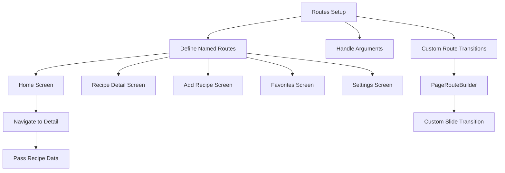

## 7.4.2 Setting Up Routes

In this section, we will delve into the intricacies of setting up routes in Flutter, focusing on creating a seamless navigation experience for our Recipe App. We'll explore defining named routes, handling arguments, and implementing custom transitions to enhance the user experience. By the end of this section, you'll have a solid understanding of how to organize and scale your app's navigation effectively.

### Defining Named Routes

Named routes in Flutter provide a structured way to manage navigation within your app. They allow you to define a map of route names to widget builders, making it easier to navigate between screens without hardcoding widget instances throughout your codebase. This approach not only enhances readability but also improves maintainability and scalability.

#### Importance of Named Routes

- **Organization**: Named routes centralize your navigation logic, making it easier to manage and update.
- **Scalability**: As your app grows, adding new screens and routes becomes straightforward.
- **Maintainability**: Changes to navigation logic can be made in one place, reducing the risk of errors.

#### Code Example: Defining Named Routes

Let's start by defining named routes for our Recipe App. We'll set up routes for the home screen, detail screen, add recipe screen, favorites screen, and settings screen.

```dart
void main() {
  runApp(MaterialApp(
    initialRoute: '/',
    routes: {
      '/': (context) => HomeScreen(),
      '/detail': (context) => RecipeDetailScreen(),
      '/add': (context) => AddRecipeScreen(),
      '/favorites': (context) => FavoritesScreen(),
      '/settings': (context) => SettingsScreen(),
    },
  ));
}
```

In this example, the `MaterialApp` widget is configured with an `initialRoute` and a `routes` map. Each entry in the map associates a route name with a widget builder function. This setup allows you to navigate to any screen using its route name.

### Handling Arguments with Named Routes

Passing data between screens is a common requirement in app development. In our Recipe App, we need to pass recipe data from the home screen to the detail screen. Flutter's named routes make this process straightforward by allowing you to pass arguments when navigating.

#### Code Example: Passing and Receiving Arguments

Here's how you can pass a `Recipe` object to the `RecipeDetailScreen` using named routes:

```dart
// Navigating to RecipeDetailScreen with arguments
Navigator.pushNamed(
  context,
  '/detail',
  arguments: selectedRecipe,
);

// Receiving arguments in RecipeDetailScreen
class RecipeDetailScreen extends StatelessWidget {
  @override
  Widget build(BuildContext context) {
    final Recipe recipe = ModalRoute.of(context)!.settings.arguments as Recipe;

    return Scaffold(
      appBar: AppBar(title: Text(recipe.title)),
      body: Padding(
        padding: const EdgeInsets.all(16.0),
        child: Column(
          children: <Widget>[
            Image.network(recipe.imageUrl),
            SizedBox(height: 10),
            Text(recipe.description),
          ],
        ),
      ),
    );
  }
}
```

- **Passing Arguments**: Use `Navigator.pushNamed` with the `arguments` parameter to pass data to the target screen.
- **Receiving Arguments**: In the target screen, retrieve the arguments using `ModalRoute.of(context)!.settings.arguments`.

This method ensures that data is passed efficiently and can be accessed easily in the destination screen, maintaining a clean separation of concerns.

### Implementing Custom Route Transitions

Custom transitions can significantly enhance the user experience by providing smooth and visually appealing animations between screens. Flutter's `PageRouteBuilder` allows you to define custom transitions for specific routes.

#### Code Example: Custom Slide Transition

Let's implement a custom slide transition for navigating to the `RecipeDetailScreen`:

```dart
Navigator.push(
  context,
  PageRouteBuilder(
    pageBuilder: (context, animation, secondaryAnimation) => RecipeDetailScreen(),
    transitionsBuilder: (context, animation, secondaryAnimation, child) {
      var begin = Offset(0.0, 1.0);
      var end = Offset.zero;
      var curve = Curves.ease;

      var tween = Tween(begin: begin, end: end).chain(CurveTween(curve: curve));

      return SlideTransition(
        position: animation.drive(tween),
        child: child,
      );
    },
  ),
);
```

- **PageRouteBuilder**: This widget provides a flexible way to define custom transitions.
- **SlideTransition**: In this example, we use a `SlideTransition` to animate the screen from the bottom to the top.
- **Tween and CurveTween**: These are used to define the animation's start and end points and apply easing curves for smooth transitions.

Custom transitions can be tailored to fit the theme and style of your app, providing a unique and engaging user experience.

### Visualizing Route Setup with Mermaid.js

To better understand the flow of route setup, data passing, and transition customization, let's visualize the process using a Mermaid.js diagram:



- **Routes Setup**: The central node representing the overall process.
- **Define Named Routes**: The first step in organizing navigation.
- **Handle Arguments**: Passing data between screens.
- **Custom Route Transitions**: Enhancing navigation with animations.

This diagram illustrates the logical flow of setting up routes, handling data, and customizing transitions, providing a clear overview of the navigation structure.

### Conclusion

Setting up routes in Flutter is a crucial aspect of building organized and scalable applications. By defining named routes, handling arguments, and implementing custom transitions, you can create a robust navigation system that enhances the user experience. As you continue to develop your Recipe App, consider experimenting with different transition effects and data handling techniques to further refine your app's navigation.

### Further Exploration

- **Official Flutter Documentation**: [Flutter Navigation](https://flutter.dev/docs/development/ui/navigation)
- **Open-Source Projects**: Explore GitHub repositories for real-world examples of Flutter navigation.
- **Online Courses**: Consider taking advanced Flutter courses on platforms like Udemy or Coursera to deepen your understanding of navigation and routing.

By mastering these concepts, you'll be well-equipped to tackle more complex navigation scenarios in your future Flutter projects.

## Quiz Time!



### What is the primary benefit of using named routes in Flutter?

- [x] Organization and scalability of navigation logic
- [ ] Faster app performance
- [ ] Easier debugging of UI issues
- [ ] Improved network efficiency

> **Explanation:** Named routes centralize navigation logic, making it easier to manage and scale as the app grows.

### How do you pass data to a screen using named routes in Flutter?

- [x] Using the `arguments` parameter in `Navigator.pushNamed`
- [ ] Directly modifying the target screen's state
- [ ] Using global variables
- [ ] Through the app's main function

> **Explanation:** The `arguments` parameter allows you to pass data to the target screen when using named routes.

### Which widget is used to define custom transitions in Flutter?

- [x] PageRouteBuilder
- [ ] MaterialPageRoute
- [ ] Navigator
- [ ] TransitionBuilder

> **Explanation:** `PageRouteBuilder` provides a flexible way to define custom transitions between screens.

### In the provided code example, what type of transition is implemented?

- [x] Slide transition
- [ ] Fade transition
- [ ] Scale transition
- [ ] Rotation transition

> **Explanation:** The example uses a `SlideTransition` to animate the screen from the bottom to the top.

### What is the role of `Tween` in custom transitions?

- [x] It defines the start and end points of the animation.
- [ ] It handles user input during transitions.
- [ ] It manages the app's state.
- [ ] It optimizes network requests.

> **Explanation:** `Tween` is used to define the animation's start and end points, allowing for smooth transitions.

### How can you retrieve arguments passed to a screen in Flutter?

- [x] Using `ModalRoute.of(context)!.settings.arguments`
- [ ] Accessing the screen's constructor parameters
- [ ] Using a global state management solution
- [ ] Through the app's main function

> **Explanation:** `ModalRoute.of(context)!.settings.arguments` retrieves the arguments passed to the screen.

### What is the purpose of `CurveTween` in animations?

- [x] To apply easing curves for smooth transitions
- [ ] To manage user input during animations
- [ ] To handle network requests
- [ ] To optimize app performance

> **Explanation:** `CurveTween` applies easing curves to animations, enhancing their smoothness.

### Which of the following is NOT a benefit of using named routes?

- [ ] Improved organization
- [ ] Easier scalability
- [x] Direct access to hardware features
- [ ] Centralized navigation logic

> **Explanation:** Named routes do not provide direct access to hardware features; they organize navigation logic.

### What is the initial route in the provided code example?

- [x] '/'
- [ ] '/home'
- [ ] '/detail'
- [ ] '/add'

> **Explanation:** The initial route is set to `'/'`, which corresponds to the `HomeScreen`.

### True or False: Custom transitions can only be implemented using `MaterialPageRoute`.

- [ ] True
- [x] False

> **Explanation:** Custom transitions can be implemented using `PageRouteBuilder`, not just `MaterialPageRoute`.


