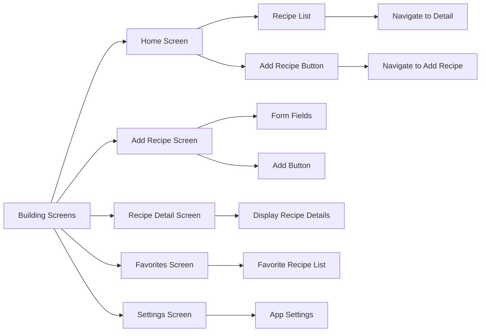

## 7.4.3 Building Screens

In this section, we will delve into the process of building the main screens for our Recipe App. This hands-on project will guide you through creating a Home Screen, Recipe Detail Screen, Add Recipe Screen, and Favorites Screen. Each screen will be designed to interact seamlessly with the others, providing a cohesive user experience. We'll explore how to implement these screens using Flutter's powerful widget system and navigation capabilities.

### Creating the HomeScreen

The HomeScreen serves as the central hub of our Recipe App, displaying a list of recipes with options to view details or add new recipes. This screen is crucial as it provides users with an overview of available recipes and acts as a gateway to other functionalities.

#### Functionality

- Displays a list of recipes.
- Allows users to tap on a recipe to view its details.
- Provides a floating action button to add new recipes.

#### Code Example

```dart
class HomeScreen extends StatelessWidget {
  final List<Recipe> recipes = [
    Recipe(
      title: 'Spaghetti Bolognese',
      description: 'A classic Italian dish...',
      imageUrl: 'https://example.com/spaghetti.jpg',
    ),
    Recipe(
      title: 'Chicken Curry',
      description: 'A flavorful Indian curry...',
      imageUrl: 'https://example.com/chicken_curry.jpg',
    ),
    // Add more recipes
  ];

  @override
  Widget build(BuildContext context) {
    return Scaffold(
      appBar: AppBar(title: Text('Recipes')),
      body: ListView.builder(
        itemCount: recipes.length,
        itemBuilder: (context, index) {
          return ListTile(
            leading: Image.network(recipes[index].imageUrl, width: 50, height: 50, fit: BoxFit.cover),
            title: Text(recipes[index].title),
            subtitle: Text(recipes[index].description),
            onTap: () {
              Navigator.pushNamed(
                context,
                '/detail',
                arguments: recipes[index],
              );
            },
          );
        },
      ),
      floatingActionButton: FloatingActionButton(
        onPressed: () {
          Navigator.pushNamed(context, '/add');
        },
        child: Icon(Icons.add),
        tooltip: 'Add Recipe',
      ),
    );
  }
}

class Recipe {
  final String title;
  final String description;
  final String imageUrl;

  Recipe({required this.title, required this.description, required this.imageUrl});
}
```

### Creating the RecipeDetailScreen

The RecipeDetailScreen provides users with detailed information about a selected recipe, including ingredients, steps, and images. This screen enhances the user experience by offering comprehensive details about each recipe.

#### Functionality

- Displays detailed information about a recipe.
- Shows ingredients and preparation steps.

#### Code Example

```dart
class RecipeDetailScreen extends StatelessWidget {
  @override
  Widget build(BuildContext context) {
    final Recipe recipe = ModalRoute.of(context)!.settings.arguments as Recipe;

    return Scaffold(
      appBar: AppBar(title: Text(recipe.title)),
      body: SingleChildScrollView(
        child: Padding(
          padding: const EdgeInsets.all(16.0),
          child: Column(
            crossAxisAlignment: CrossAxisAlignment.start,
            children: <Widget>[
              Image.network(recipe.imageUrl),
              SizedBox(height: 10),
              Text(
                recipe.description,
                style: TextStyle(fontSize: 18),
              ),
              SizedBox(height: 20),
              Text(
                'Ingredients',
                style: TextStyle(fontSize: 20, fontWeight: FontWeight.bold),
              ),
              // List of ingredients
              SizedBox(height: 20),
              Text(
                'Steps',
                style: TextStyle(fontSize: 20, fontWeight: FontWeight.bold),
              ),
              // List of steps
            ],
          ),
        ),
      ),
    );
  }
}
```

### Creating the AddRecipeScreen

The AddRecipeScreen allows users to input details for a new recipe, including the title, description, and image URL. This screen is essential for expanding the app's content and engaging users by letting them contribute their own recipes.

#### Functionality

- Provides a form for users to add new recipes.
- Validates user input to ensure data integrity.

#### Code Example

```dart
class AddRecipeScreen extends StatefulWidget {
  @override
  _AddRecipeScreenState createState() => _AddRecipeScreenState();
}

class _AddRecipeScreenState extends State<AddRecipeScreen> {
  final _formKey = GlobalKey<FormState>();
  final TextEditingController _titleController = TextEditingController();
  final TextEditingController _descriptionController = TextEditingController();
  final TextEditingController _imageUrlController = TextEditingController();

  @override
  Widget build(BuildContext context) {
    return Scaffold(
      appBar: AppBar(title: Text('Add New Recipe')),
      body: Padding(
        padding: const EdgeInsets.all(16.0),
        child: Form(
          key: _formKey,
          child: SingleChildScrollView(
            child: Column(
              children: <Widget>[
                TextFormField(
                  controller: _titleController,
                  decoration: InputDecoration(labelText: 'Recipe Title'),
                  validator: (value) {
                    if (value == null || value.isEmpty) {
                      return 'Please enter a title';
                    }
                    return null;
                  },
                ),
                SizedBox(height: 10),
                TextFormField(
                  controller: _descriptionController,
                  decoration: InputDecoration(labelText: 'Description'),
                  maxLines: 3,
                  validator: (value) {
                    if (value == null || value.isEmpty) {
                      return 'Please enter a description';
                    }
                    return null;
                  },
                ),
                SizedBox(height: 10),
                TextFormField(
                  controller: _imageUrlController,
                  decoration: InputDecoration(labelText: 'Image URL'),
                  validator: (value) {
                    if (value == null || value.isEmpty) {
                      return 'Please enter an image URL';
                    }
                    if (!Uri.parse(value).isAbsolute) {
                      return 'Please enter a valid URL';
                    }
                    return null;
                  },
                ),
                SizedBox(height: 20),
                ElevatedButton(
                  onPressed: () {
                    if (_formKey.currentState!.validate()) {
                      Recipe newRecipe = Recipe(
                        title: _titleController.text,
                        description: _descriptionController.text,
                        imageUrl: _imageUrlController.text,
                      );
                      // Add recipe to the list or database
                      Navigator.pop(context);
                    }
                  },
                  child: Text('Add Recipe'),
                ),
              ],
            ),
          ),
        ),
      ),
    );
  }

  @override
  void dispose() {
    _titleController.dispose();
    _descriptionController.dispose();
    _imageUrlController.dispose();
    super.dispose();
  }
}
```

### Creating the FavoritesScreen

The FavoritesScreen displays a list of user-marked favorite recipes, allowing easy access and management. This screen enhances user engagement by providing a personalized experience.

#### Functionality

- Displays a list of favorite recipes.
- Allows users to view details of their favorite recipes.

#### Code Example

```dart
class FavoritesScreen extends StatelessWidget {
  final List<Recipe> favoriteRecipes = [
    // Pre-populated favorite recipes
  ];

  @override
  Widget build(BuildContext context) {
    return Scaffold(
      appBar: AppBar(title: Text('Favorites')),
      body: ListView.builder(
        itemCount: favoriteRecipes.length,
        itemBuilder: (context, index) {
          return ListTile(
            leading: Image.network(favoriteRecipes[index].imageUrl, width: 50, height: 50, fit: BoxFit.cover),
            title: Text(favoriteRecipes[index].title),
            onTap: () {
              Navigator.pushNamed(
                context,
                '/detail',
                arguments: favoriteRecipes[index],
              );
            },
          );
        },
      ),
    );
  }
}
```

### Visualizing Screen Relationships with Mermaid.js

To better understand the flow and relationship between different screens in our app, let's use a Mermaid.js diagram:



### Integrating Screens with Navigation

Each screen in our Recipe App is designed to interact with the navigation system, allowing users to move seamlessly between different parts of the app. Here's how you can integrate these screens using Flutter's navigation capabilities:

- **HomeScreen**: Acts as the entry point, allowing navigation to the RecipeDetailScreen and AddRecipeScreen.
- **RecipeDetailScreen**: Receives data from the HomeScreen or FavoritesScreen and displays detailed information.
- **AddRecipeScreen**: Allows users to input new recipes and returns to the HomeScreen upon completion.
- **FavoritesScreen**: Provides quick access to favorite recipes and navigates to the RecipeDetailScreen for more information.

### Encouraging Customization and Exploration

As you become more comfortable with building and navigating between screens, consider customizing each screen further. Here are a few ideas to explore:

- **HomeScreen**: Implement search functionality to filter recipes.
- **RecipeDetailScreen**: Add a section for user reviews or ratings.
- **AddRecipeScreen**: Include fields for additional recipe details, such as cooking time or difficulty level.
- **FavoritesScreen**: Allow users to remove recipes from their favorites list.

By experimenting with these features, you'll gain a deeper understanding of Flutter's capabilities and how to create a dynamic, user-friendly app.

### Conclusion

Building screens in Flutter involves understanding the widget hierarchy and how to effectively use navigation to create a seamless user experience. By following the examples and instructions provided, you can create a robust Recipe App that showcases your skills in Flutter development. Remember to explore and customize the app further, as this is the best way to learn and grow as a developer.

## Quiz Time!



### What is the primary function of the HomeScreen in the Recipe App?

- [x] To display a list of recipes and provide navigation options.
- [ ] To show detailed information about a selected recipe.
- [ ] To allow users to add new recipes.
- [ ] To display user-marked favorite recipes.

> **Explanation:** The HomeScreen serves as the central hub, displaying a list of recipes and providing navigation to other screens.

### Which widget is used to navigate to the RecipeDetailScreen from the HomeScreen?

- [x] Navigator.pushNamed
- [ ] Navigator.pop
- [ ] Navigator.pushReplacement
- [ ] Navigator.popUntil

> **Explanation:** Navigator.pushNamed is used to navigate to the RecipeDetailScreen, passing the selected recipe as an argument.

### What is the purpose of the AddRecipeScreen?

- [x] To provide a form for users to input details of a new recipe.
- [ ] To display a list of favorite recipes.
- [ ] To show detailed information about a selected recipe.
- [ ] To manage app settings.

> **Explanation:** The AddRecipeScreen allows users to input and submit new recipes to the app.

### How does the FavoritesScreen enhance user engagement?

- [x] By providing a personalized experience with user-marked favorite recipes.
- [ ] By displaying all available recipes.
- [ ] By allowing users to add new recipes.
- [ ] By showing app settings.

> **Explanation:** The FavoritesScreen enhances engagement by allowing users to easily access and manage their favorite recipes.

### What is the role of the Scaffold widget in these screens?

- [x] To provide a basic structure with an AppBar and body for each screen.
- [ ] To manage navigation between screens.
- [ ] To handle form validation.
- [ ] To display images and text.

> **Explanation:** The Scaffold widget provides a basic structure, including an AppBar and body, for each screen.

### Which method is used to pass data between screens in Flutter?

- [x] Navigator.pushNamed with arguments
- [ ] Navigator.pop
- [ ] setState
- [ ] initState

> **Explanation:** Navigator.pushNamed with arguments is used to pass data between screens in Flutter.

### What is the function of the FloatingActionButton in the HomeScreen?

- [x] To navigate to the AddRecipeScreen for adding new recipes.
- [ ] To delete a recipe.
- [ ] To navigate to the FavoritesScreen.
- [ ] To refresh the list of recipes.

> **Explanation:** The FloatingActionButton navigates to the AddRecipeScreen, allowing users to add new recipes.

### How can you customize the RecipeDetailScreen further?

- [x] By adding user reviews or ratings.
- [ ] By displaying a list of favorite recipes.
- [ ] By allowing users to add new recipes.
- [ ] By managing app settings.

> **Explanation:** Customizing the RecipeDetailScreen with user reviews or ratings can enhance its functionality and user engagement.

### What is the purpose of using a GlobalKey<FormState> in the AddRecipeScreen?

- [x] To manage the state of the form and validate user input.
- [ ] To navigate between screens.
- [ ] To display a list of recipes.
- [ ] To handle image loading.

> **Explanation:** A GlobalKey<FormState> is used to manage the state of the form and validate user input in the AddRecipeScreen.

### True or False: The FavoritesScreen allows users to view details of their favorite recipes.

- [x] True
- [ ] False

> **Explanation:** True. The FavoritesScreen allows users to view details of their favorite recipes by navigating to the RecipeDetailScreen.


