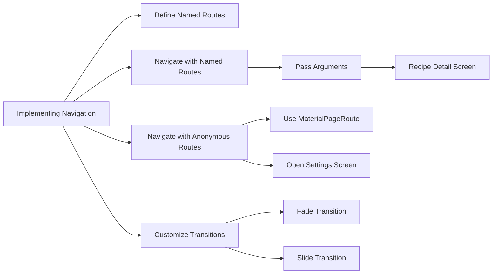

## 7.4.4 Implementing Navigation

In this section, we will delve into the intricacies of implementing navigation within a Flutter application, specifically focusing on a Recipe App with multiple screens. Navigation is a crucial aspect of mobile app development, as it dictates how users move through the app and interact with its content. By the end of this guide, you will have a solid understanding of how to set up and manage navigation in Flutter, using both named and anonymous routes, passing data between screens, and customizing transitions to enhance the user experience.

### Integrating Named Routes

Named routes in Flutter provide a convenient way to navigate between different screens in your app. They allow you to define a map of route names to widget builders, making it easy to manage and navigate to various parts of your application.

#### Registering Screens with Named Routes

To begin, ensure that all your screens are registered in the `routes` property within the `MaterialApp` widget. This setup allows you to navigate to these screens using their respective route names.

**Code Example:**

```dart
void main() {
  runApp(MaterialApp(
    initialRoute: '/',
    routes: {
      '/': (context) => HomeScreen(),
      '/detail': (context) => RecipeDetailScreen(),
      '/add': (context) => AddRecipeScreen(),
      '/favorites': (context) => FavoritesScreen(),
      '/settings': (context) => SettingsScreen(),
    },
  ));
}
```

In this example, we define several routes, each associated with a specific screen in the app. The `initialRoute` is set to `'/'`, which corresponds to the `HomeScreen`.

### Navigating Between Screens

Once your routes are defined, you can navigate between screens using the `Navigator` class. Let's explore how to navigate from the Home Screen to other screens in the app.

#### From Home Screen to Recipe Detail

When a user taps on a recipe in the list, you can navigate to the detail screen using the `Navigator.pushNamed` method. This method allows you to pass arguments to the target screen, such as the selected recipe.

**Code Example:**

```dart
onTap: () {
  Navigator.pushNamed(
    context,
    '/detail',
    arguments: recipes[index],
  );
},
```

Here, the `arguments` parameter is used to pass the selected recipe object to the `RecipeDetailScreen`.

#### From Home Screen to Add Recipe

To open the Add Recipe screen when the user presses the add button, use the `Navigator.pushNamed` method without arguments.

**Code Example:**

```dart
floatingActionButton: FloatingActionButton(
  onPressed: () {
    Navigator.pushNamed(context, '/add');
  },
  child: Icon(Icons.add),
),
```

This code snippet demonstrates how to navigate to the `AddRecipeScreen` when the floating action button is pressed.

### Navigating Using Anonymous Routes

While named routes are convenient, there are scenarios where you might prefer to use anonymous routes, especially for screens that are not part of the main navigation flow.

#### Using `Navigator.push` with `MaterialPageRoute`

Anonymous routes can be implemented using the `Navigator.push` method along with `MaterialPageRoute`. This approach is useful for one-off navigations or when you need more control over the route transition.

**Code Example:**

```dart
Navigator.push(
  context,
  MaterialPageRoute(builder: (context) => SettingsScreen()),
);
```

This example shows how to navigate to the `SettingsScreen` using an anonymous route.

### Passing Data Between Screens

Passing data between screens is a common requirement in mobile apps. Flutter provides several ways to achieve this, depending on whether you're using named or anonymous routes.

#### Named Routes with Arguments

As demonstrated earlier, you can pass data to a screen using the `arguments` parameter of the `Navigator.pushNamed` method. On the receiving screen, retrieve the arguments using `ModalRoute.of(context)!.settings.arguments`.

#### Anonymous Routes with Constructors

For anonymous routes, pass data by instantiating the target screen with constructor parameters.

**Code Example:**

```dart
Navigator.push(
  context,
  MaterialPageRoute(
    builder: (context) => RecipeDetailScreen(recipe: recipes[index]),
  ),
);
```

In this example, the `RecipeDetailScreen` constructor accepts a `recipe` parameter, allowing you to pass the selected recipe directly.

### Custom Route Transitions

Custom transitions can significantly enhance the visual appeal of your app's navigation. Flutter allows you to define custom transitions using the `PageRouteBuilder` class.

#### Creating a Custom Transition

To create a custom transition, use the `PageRouteBuilder` and define the `transitionsBuilder` function to specify the transition animation.

**Code Example:**

```dart
Navigator.push(
  context,
  PageRouteBuilder(
    pageBuilder: (context, animation, secondaryAnimation) => AddRecipeScreen(),
    transitionsBuilder: (context, animation, secondaryAnimation, child) {
      return FadeTransition(
        opacity: animation,
        child: child,
      );
    },
  ),
);
```

In this example, a `FadeTransition` is applied to the `AddRecipeScreen`, creating a smooth fade-in effect.

### Visualizing Navigation Flow

To better understand the navigation flow and integration of different navigation methods, let's visualize it using a Mermaid.js diagram.



This diagram illustrates the key components of implementing navigation in the Recipe App, highlighting the use of named and anonymous routes, argument passing, and custom transitions.

### Comprehensive Code Example

Let's bring everything together with a comprehensive code example that demonstrates the implementation of navigation in the Recipe App.

**Code Example:**

```dart
class RecipeApp extends StatelessWidget {
  @override
  Widget build(BuildContext context) {
    return MaterialApp(
      initialRoute: '/',
      routes: {
        '/': (context) => HomeScreen(),
        '/detail': (context) => RecipeDetailScreen(),
        '/add': (context) => AddRecipeScreen(),
        '/favorites': (context) => FavoritesScreen(),
        '/settings': (context) => SettingsScreen(),
      },
    );
  }
}

class HomeScreen extends StatelessWidget {
  final List<Recipe> recipes = [
    Recipe(
      title: 'Spaghetti Bolognese',
      description: 'A classic Italian dish...',
      imageUrl: 'https://example.com/spaghetti.jpg',
    ),
    Recipe(
      title: 'Chicken Curry',
      description: 'A flavorful Indian curry...',
      imageUrl: 'https://example.com/chicken_curry.jpg',
    ),
    // Add more recipes
  ];

  @override
  Widget build(BuildContext context) {
    return Scaffold(
      appBar: AppBar(title: Text('Recipes')),
      body: ListView.builder(
        itemCount: recipes.length,
        itemBuilder: (context, index) {
          return ListTile(
            leading: Image.network(recipes[index].imageUrl, width: 50, height: 50, fit: BoxFit.cover),
            title: Text(recipes[index].title),
            subtitle: Text(recipes[index].description),
            onTap: () {
              Navigator.push(
                context,
                PageRouteBuilder(
                  pageBuilder: (context, animation, secondaryAnimation) => RecipeDetailScreen(),
                  transitionsBuilder: (context, animation, secondaryAnimation, child) {
                    return SlideTransition(
                      position: Tween<Offset>(
                        begin: const Offset(1.0, 0.0),
                        end: Offset.zero,
                      ).animate(animation),
                      child: child,
                    );
                  },
                  settings: RouteSettings(arguments: recipes[index]),
                ),
              );
            },
          );
        },
      ),
      floatingActionButton: FloatingActionButton(
        onPressed: () {
          Navigator.pushNamed(context, '/add');
        },
        child: Icon(Icons.add),
        tooltip: 'Add Recipe',
      ),
    );
  }
}

class RecipeDetailScreen extends StatelessWidget {
  @override
  Widget build(BuildContext context) {
    final Recipe recipe = ModalRoute.of(context)!.settings.arguments as Recipe;

    return Scaffold(
      appBar: AppBar(title: Text(recipe.title)),
      body: SingleChildScrollView(
        child: Padding(
          padding: const EdgeInsets.all(16.0),
          child: Column(
            crossAxisAlignment: CrossAxisAlignment.start,
            children: <Widget>[
              Image.network(recipe.imageUrl),
              SizedBox(height: 10),
              Text(
                recipe.description,
                style: TextStyle(fontSize: 18),
              ),
              SizedBox(height: 20),
              Text(
                'Ingredients',
                style: TextStyle(fontSize: 20, fontWeight: FontWeight.bold),
              ),
              // List of ingredients
              SizedBox(height: 20),
              Text(
                'Steps',
                style: TextStyle(fontSize: 20, fontWeight: FontWeight.bold),
              ),
              // List of steps
            ],
          ),
        ),
      ),
    );
  }
}
```

### Best Practices and Considerations

- **Consistency:** Ensure that your navigation logic is consistent across the app. Use named routes for main navigation paths and anonymous routes for less frequent navigations.
- **Data Passing:** Always validate and handle the data passed between screens to prevent runtime errors.
- **User Experience:** Use custom transitions judiciously to enhance, not overwhelm, the user experience. Keep animations smooth and relevant to the context.
- **Testing:** Thoroughly test your navigation flows to ensure that users can navigate seamlessly without encountering dead ends or unexpected behavior.

### Further Exploration

For more advanced navigation techniques and best practices, consider exploring the following resources:

- [Flutter Official Documentation on Navigation](https://flutter.dev/docs/development/ui/navigation)
- [Flutter Cookbook: Navigation Recipes](https://flutter.dev/docs/cookbook/navigation)
- [Advanced Flutter: Beyond the Basics](https://www.udemy.com/course/advanced-flutter/)

By mastering navigation in Flutter, you can create intuitive and engaging apps that provide a seamless user experience. Continue experimenting with different navigation patterns and transitions to find what works best for your projects.

## Quiz Time!



### What is the primary purpose of using named routes in Flutter?

- [x] To manage and navigate between different screens easily.
- [ ] To enhance the visual appearance of the app.
- [ ] To improve the app's performance.
- [ ] To store user data securely.

> **Explanation:** Named routes provide a convenient way to manage and navigate between different screens in a Flutter app by defining a map of route names to widget builders.

### How can you pass data to a screen using named routes?

- [x] By using the `arguments` parameter in `Navigator.pushNamed`.
- [ ] By using global variables.
- [ ] By storing data in a database.
- [ ] By using the `context` parameter.

> **Explanation:** The `arguments` parameter in `Navigator.pushNamed` allows you to pass data to the target screen when navigating using named routes.

### Which method is used to navigate to a screen using an anonymous route?

- [ ] `Navigator.pushNamed`
- [x] `Navigator.push`
- [ ] `Navigator.pop`
- [ ] `Navigator.replace`

> **Explanation:** `Navigator.push` is used to navigate to a screen using an anonymous route, typically with `MaterialPageRoute`.

### What is the role of the `transitionsBuilder` function in `PageRouteBuilder`?

- [ ] To define the screen layout.
- [x] To specify the transition animation between screens.
- [ ] To manage state changes.
- [ ] To handle user input.

> **Explanation:** The `transitionsBuilder` function in `PageRouteBuilder` is used to define the transition animation that occurs when navigating between screens.

### Which of the following is a benefit of using custom transitions in navigation?

- [x] Enhancing the visual appeal of navigation.
- [ ] Reducing the app's memory usage.
- [ ] Improving network performance.
- [ ] Simplifying code structure.

> **Explanation:** Custom transitions enhance the visual appeal of navigation by providing smooth and contextually relevant animations.

### What is the purpose of the `initialRoute` property in `MaterialApp`?

- [x] To specify the first screen to display when the app starts.
- [ ] To define the app's theme.
- [ ] To manage user authentication.
- [ ] To configure network settings.

> **Explanation:** The `initialRoute` property in `MaterialApp` specifies the first screen to display when the app starts, based on the defined routes.

### How can you retrieve arguments passed to a screen using named routes?

- [ ] By accessing global variables.
- [x] By using `ModalRoute.of(context)!.settings.arguments`.
- [ ] By querying a database.
- [ ] By using the `context` parameter directly.

> **Explanation:** Arguments passed to a screen using named routes can be retrieved using `ModalRoute.of(context)!.settings.arguments`.

### Which widget is commonly used to trigger navigation to a new screen?

- [ ] `Text`
- [ ] `Container`
- [x] `FloatingActionButton`
- [ ] `Column`

> **Explanation:** A `FloatingActionButton` is commonly used to trigger navigation to a new screen, especially for actions like adding new items.

### What is a potential downside of using too many custom transitions?

- [x] They can overwhelm the user experience if overused.
- [ ] They improve app performance.
- [ ] They simplify code maintenance.
- [ ] They enhance data security.

> **Explanation:** While custom transitions can enhance the visual appeal, using too many can overwhelm the user experience and make the app feel cluttered.

### True or False: Anonymous routes are always preferred over named routes for navigation.

- [ ] True
- [x] False

> **Explanation:** False. Named routes are preferred for main navigation paths due to their convenience and manageability, while anonymous routes are useful for less frequent navigations.


