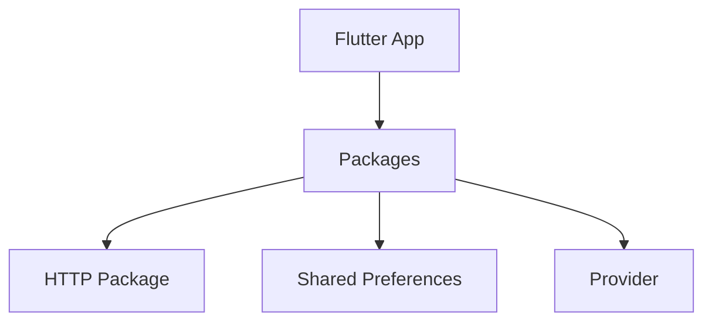

## 8.1.1 What Are Packages?

In the world of software development, efficiency and speed are crucial. Developers constantly seek ways to streamline their workflow, reduce redundancy, and leverage existing solutions to common problems. In the Flutter ecosystem, packages and plugins serve as powerful tools to achieve these goals. This section delves into the concept of packages and plugins, their role in Flutter development, and how they can significantly enhance your app-building process.

### Understanding Packages and Plugins

#### Definition of Packages and Plugins

**Packages** in Flutter are collections of reusable code that developers can incorporate into their applications to extend functionality. They are akin to libraries in other programming environments, providing pre-written code that performs specific tasks. Packages can range from simple utility functions to complex frameworks that handle state management, networking, and more.

**Plugins**, on the other hand, are a specialized subset of packages. While packages are written purely in Dart and are platform-independent, plugins include platform-specific code that allows Flutter apps to interact with native APIs of Android and iOS. This distinction is crucial because it enables Flutter apps to access device features like the camera, GPS, or Bluetooth, which are not directly accessible through Dart alone.

#### Differences Between Pure Dart Packages and Plugins

- **Pure Dart Packages**: These are written entirely in Dart and do not rely on any platform-specific code. They are cross-platform by nature and can be used in any Dart environment, including Flutter, server-side Dart, and web applications. Examples include packages for data manipulation, algorithms, and UI components.

- **Plugins**: These contain both Dart and platform-specific code (Java/Kotlin for Android, Swift/Objective-C for iOS). Plugins bridge the gap between Flutter and the underlying platform, enabling access to native features. Examples include plugins for accessing device sensors, making in-app purchases, or integrating with platform-specific services like Firebase.

### The Role of Packages in Flutter's Ecosystem

Packages and plugins are integral to the Flutter ecosystem for several reasons:

- **Accelerated Development**: By using packages, developers can quickly add functionality to their apps without writing everything from scratch. This accelerates the development process and allows developers to focus on building unique features rather than reinventing the wheel.

- **Community-Driven Solutions**: The Flutter community is vibrant and active, contributing a vast array of packages to the ecosystem. This community-driven approach means that developers can leverage solutions that have been tested and refined by others, ensuring reliability and robustness.

- **Modularity and Reusability**: Packages promote modularity, allowing developers to break down their applications into smaller, manageable components. This modular approach enhances code reusability and maintainability.

- **Access to Native Features**: Plugins provide a bridge to native device features, enabling Flutter apps to offer a rich, platform-specific user experience. This capability is essential for building apps that require deep integration with the device hardware or operating system.

### Examples of Popular Packages and Plugins

To illustrate the power and versatility of packages and plugins, let's explore some popular examples:

- **HTTP Package**: A widely used package for making network requests. It simplifies the process of sending HTTP requests and handling responses.

  ```dart
  import 'package:http/http.dart' as http;

  Future<void> fetchData() async {
    final response = await http.get(Uri.parse('https://api.example.com/data'));
    if (response.statusCode == 200) {
      print('Data fetched successfully!');
    } else {
      throw Exception('Failed to load data');
    }
  }
  ```

- **Shared Preferences**: A plugin that provides a simple way to store and retrieve key-value pairs on the device. It's commonly used for storing user preferences and settings.

- **Provider**: A package for state management that offers a simple and efficient way to manage and share state across your app.

- **Image Picker**: A plugin that allows users to select images from their device's gallery or capture new photos using the camera.

### Visualizing the Role of Packages

To better understand how packages fit into a Flutter app, consider the following diagram:



In this diagram, the Flutter app is at the center, surrounded by various packages that extend its capabilities. Each package serves a specific purpose, contributing to the overall functionality of the app.

### Best Practices for Using Packages and Plugins

When incorporating packages and plugins into your Flutter projects, consider the following best practices:

- **Evaluate the Package**: Before adding a package, evaluate its popularity, maintenance status, and community support. Check the number of likes, pub points, and the frequency of updates.

- **Read the Documentation**: Thoroughly read the package documentation to understand its features, limitations, and integration steps.

- **Check for Compatibility**: Ensure that the package is compatible with your Flutter version and any other packages you are using.

- **Minimize Dependencies**: While packages are helpful, avoid over-relying on them. Too many dependencies can increase the complexity of your project and lead to potential conflicts.

- **Contribute Back**: If you find a bug or have an improvement suggestion, consider contributing back to the package repository. This helps strengthen the Flutter community and improve the tools available to everyone.

### Common Pitfalls and Challenges

While packages and plugins offer numerous benefits, they also come with potential challenges:

- **Version Conflicts**: Different packages may depend on different versions of the same dependency, leading to conflicts. Use tools like `pub upgrade` and `pub outdated` to manage dependencies effectively.

- **Platform-Specific Issues**: Plugins that rely on native code may behave differently on Android and iOS. Always test your app on both platforms to ensure consistent behavior.

- **Security Concerns**: Be cautious when using packages that access sensitive data or device features. Review the package code if possible and ensure it follows best security practices.

### Conclusion

Packages and plugins are indispensable tools in the Flutter developer's toolkit. They enable rapid development, foster community collaboration, and provide access to a wealth of functionality that would be time-consuming and complex to implement from scratch. By understanding and effectively utilizing packages, you can enhance your Flutter apps, streamline your development process, and deliver high-quality applications to your users.

### Further Exploration

To deepen your understanding of packages and plugins, consider exploring the following resources:

- [Flutter Packages Documentation](https://flutter.dev/docs/development/packages-and-plugins/using-packages)
- [Pub.dev](https://pub.dev/): The official repository for Dart and Flutter packages.
- [Flutter Community Packages](https://fluttercommunity.dev/packages/): A curated list of high-quality packages maintained by the Flutter community.

By leveraging these resources, you can stay updated on the latest packages, discover new tools, and continue to enhance your Flutter development skills.

## Quiz Time!



### What is a package in Flutter?

- [x] A collection of reusable code that extends the functionality of Flutter applications.
- [ ] A tool for debugging Flutter applications.
- [ ] A type of widget used in Flutter.
- [ ] A method for managing app state.

> **Explanation:** A package in Flutter is a collection of reusable code that developers can incorporate into their applications to extend functionality.

### What distinguishes a plugin from a pure Dart package?

- [x] Plugins include platform-specific code to access native APIs.
- [ ] Plugins are written entirely in Dart.
- [ ] Plugins cannot be used in Flutter applications.
- [ ] Plugins are only for web applications.

> **Explanation:** Plugins include platform-specific code (e.g., Java/Kotlin for Android, Swift/Objective-C for iOS) to access native APIs, whereas pure Dart packages are written entirely in Dart.

### Which of the following is NOT a benefit of using packages in Flutter?

- [ ] Accelerated development.
- [ ] Community-driven solutions.
- [x] Increased application size.
- [ ] Modularity and reusability.

> **Explanation:** While packages offer many benefits like accelerated development and modularity, they do not inherently increase application size; this depends on the specific packages used.

### What is the primary purpose of the HTTP package in Flutter?

- [x] To make network requests and handle HTTP responses.
- [ ] To manage application state.
- [ ] To access device sensors.
- [ ] To render UI components.

> **Explanation:** The HTTP package is used to make network requests and handle HTTP responses, simplifying the process of interacting with web services.

### Which package would you use for state management in Flutter?

- [ ] HTTP
- [ ] Shared Preferences
- [x] Provider
- [ ] Image Picker

> **Explanation:** The Provider package is commonly used for state management in Flutter applications.

### What should you check before adding a package to your Flutter project?

- [x] Popularity and maintenance status.
- [x] Compatibility with your Flutter version.
- [ ] Whether it is a plugin or a package.
- [ ] The number of contributors.

> **Explanation:** Before adding a package, it's important to check its popularity, maintenance status, and compatibility with your Flutter version to ensure it meets your project's needs.

### Why is it important to test plugins on both Android and iOS?

- [x] Plugins may behave differently on each platform.
- [ ] Plugins are only supported on iOS.
- [ ] Plugins do not work on Android.
- [ ] Plugins are not necessary for Flutter apps.

> **Explanation:** Plugins may include platform-specific code, which can behave differently on Android and iOS, so testing on both platforms ensures consistent behavior.

### What is a common challenge when using multiple packages in a Flutter project?

- [ ] Lack of documentation.
- [ ] Limited functionality.
- [x] Version conflicts between dependencies.
- [ ] Inability to use plugins.

> **Explanation:** A common challenge is version conflicts between dependencies, which can occur when different packages depend on different versions of the same dependency.

### What is the role of the `pubspec.yaml` file in a Flutter project?

- [x] It manages the project's dependencies, including packages and plugins.
- [ ] It defines the app's UI layout.
- [ ] It handles network requests.
- [ ] It stores user preferences.

> **Explanation:** The `pubspec.yaml` file is used to manage a Flutter project's dependencies, including packages and plugins.

### True or False: All plugins are packages, but not all packages are plugins.

- [x] True
- [ ] False

> **Explanation:** This statement is true because plugins are a subset of packages that include platform-specific code, whereas packages can be purely Dart-based and platform-independent.


