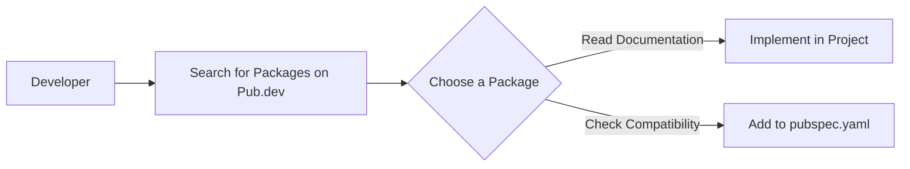

## 8.1.2 Pub.dev Repository

In the world of Flutter and Dart development, the Pub.dev repository stands as a cornerstone for developers seeking to enhance their applications with additional functionality. As the official package repository for Flutter and Dart, Pub.dev serves as the primary source for discovering, publishing, and managing packages. This section will delve into the features and significance of Pub.dev, guiding you through its navigation, understanding package versions and compatibility, and emphasizing the importance of documentation and reviews.

### Overview of Pub.dev and Its Features

Pub.dev is an essential tool for Flutter and Dart developers, offering a centralized platform where developers can find and share packages. These packages can range from simple utilities to complex libraries that significantly extend the capabilities of your applications. Here are some key features of Pub.dev:

- **Package Discovery:** Pub.dev hosts thousands of packages, making it easy for developers to find solutions to common problems or add new features to their apps.
- **Documentation and Examples:** Each package on Pub.dev comes with documentation and often includes examples to help developers understand how to implement the package in their projects.
- **Version Management:** Pub.dev provides detailed information about package versions, helping developers ensure compatibility with their existing codebase.
- **Popularity Metrics:** Packages are rated based on likes, pub points, and popularity, giving developers insight into the reliability and community support for each package.

### Navigating the Pub.dev Website

Navigating Pub.dev is straightforward, thanks to its user-friendly interface. Here’s how you can make the most of it:

- **Search Functionality:** Use the search bar to find packages by name or functionality. For example, if you need a package for HTTP requests, you can search for "HTTP" to find relevant packages.
- **Package Pages:** Each package has its own page, which includes a description, installation instructions, documentation, and version history. This page is your go-to resource for understanding how to use the package.
- **Filtering Options:** You can filter packages by tags, platform compatibility, and more, allowing you to narrow down your search to find the most suitable package for your needs.

### Understanding Package Versions and Compatibility

One of the critical aspects of using packages from Pub.dev is managing versions and ensuring compatibility with your project. Here’s what you need to know:

- **Semantic Versioning:** Packages on Pub.dev follow semantic versioning, which uses a three-part version number: MAJOR.MINOR.PATCH. Understanding this helps you determine the impact of updating a package.
  - **MAJOR:** Incompatible API changes.
  - **MINOR:** Backward-compatible functionality.
  - **PATCH:** Backward-compatible bug fixes.
- **Version Constraints:** In your `pubspec.yaml` file, you can specify version constraints to ensure that your project uses compatible versions of a package. For example, `^0.13.4` means you accept any version from `0.13.4` up to, but not including, `0.14.0`.

```yaml
dependencies:
  http: ^0.13.4
  provider: ^6.0.0
```

- **Compatibility Checks:** Before adding a package, check its compatibility with your current Flutter and Dart versions. This information is usually available on the package’s page under the "Versions" tab.

### Importance of Reading Documentation and Reviews

When selecting a package, it’s crucial to read through the documentation and reviews:

- **Documentation:** Comprehensive documentation provides insights into how to implement and use the package effectively. It often includes setup instructions, usage examples, and API references.
- **Reviews and Ratings:** User reviews and ratings can give you an idea of the package’s reliability and performance. Look for packages with high ratings and positive feedback from the community.
- **Community Support:** A package with active community support is more likely to be maintained and updated, ensuring long-term usability.

### Practical Example: Adding a Package to Your Project

Let’s walk through a practical example of adding a package from Pub.dev to your Flutter project:

1. **Search for a Package:** Suppose you need to make HTTP requests in your app. Search for "HTTP" on Pub.dev and find the `http` package.

2. **Review the Package:** Check the documentation, version compatibility, and reviews to ensure it meets your needs.

3. **Add to `pubspec.yaml`:** Once satisfied, add the package to your `pubspec.yaml` file under dependencies:

   ```yaml
   dependencies:
     http: ^0.13.4
   ```

4. **Install the Package:** Run `flutter pub get` in your terminal to install the package.

5. **Implement in Your Project:** Use the package in your Dart code as per the documentation.

### Visualizing the Process with Mermaid.js

To better understand the process of discovering and implementing a package from Pub.dev, consider the following flowchart:



This diagram illustrates the typical workflow a developer follows when integrating a package from Pub.dev into their project.

### Best Practices and Common Pitfalls

- **Regular Updates:** Keep your packages updated to benefit from the latest features and security patches. However, always check for breaking changes before updating.
- **Avoid Over-Reliance:** While packages can save time, relying too heavily on third-party packages can lead to maintenance challenges if the package becomes deprecated or unsupported.
- **Test Thoroughly:** After adding a package, thoroughly test your application to ensure that the new package doesn’t introduce any issues.

### Conclusion

Pub.dev is an invaluable resource for Flutter and Dart developers, offering a vast array of packages that can enhance your applications. By understanding how to navigate Pub.dev, manage package versions, and evaluate documentation and reviews, you can effectively leverage this repository to build robust and feature-rich applications. As you continue your Flutter development journey, remember to explore and experiment with different packages, always keeping best practices in mind.

## Quiz Time!



### What is Pub.dev?

- [x] The official package repository for Flutter and Dart.
- [ ] A code editor for Flutter development.
- [ ] A version control system for Dart.
- [ ] A testing framework for Flutter apps.

> **Explanation:** Pub.dev is the official package repository for Flutter and Dart, where developers can discover, publish, and manage packages.

### What does semantic versioning help with?

- [x] Understanding the impact of package updates.
- [ ] Writing better code.
- [ ] Improving app performance.
- [ ] Enhancing UI design.

> **Explanation:** Semantic versioning helps developers understand the impact of package updates by indicating major, minor, and patch changes.

### How can you specify version constraints in `pubspec.yaml`?

- [x] Using caret syntax like `^0.13.4`.
- [ ] By writing the version number directly.
- [ ] Using square brackets.
- [ ] By specifying the date of the version.

> **Explanation:** The caret syntax `^0.13.4` is used in `pubspec.yaml` to specify version constraints, allowing for compatible updates.

### Why is it important to read package documentation?

- [x] To understand how to implement and use the package effectively.
- [ ] To find out the package's color scheme.
- [ ] To see how many developers contributed to it.
- [ ] To check the package's file size.

> **Explanation:** Reading documentation is crucial for understanding how to implement and use the package effectively, including setup instructions and usage examples.

### What should you do before adding a package to your project?

- [x] Check its compatibility with your current Flutter and Dart versions.
- [ ] Ensure it has more than 100 likes.
- [ ] Verify it was updated in the last month.
- [ ] Confirm it is written in Java.

> **Explanation:** Before adding a package, it's important to check its compatibility with your current Flutter and Dart versions to avoid integration issues.

### What is the purpose of the `flutter pub get` command?

- [x] To install packages listed in `pubspec.yaml`.
- [ ] To remove unused packages.
- [ ] To update Flutter SDK.
- [ ] To compile the Flutter app.

> **Explanation:** The `flutter pub get` command is used to install packages listed in the `pubspec.yaml` file.

### What is a potential pitfall of over-relying on third-party packages?

- [x] Maintenance challenges if the package becomes deprecated or unsupported.
- [ ] Increased app performance.
- [ ] Better user interface design.
- [ ] Easier debugging process.

> **Explanation:** Over-relying on third-party packages can lead to maintenance challenges if the package becomes deprecated or unsupported.

### What does the popularity metric on Pub.dev indicate?

- [x] The level of community support and reliability of a package.
- [ ] The package's download speed.
- [ ] The number of developers who contributed to the package.
- [ ] The package's file size.

> **Explanation:** The popularity metric indicates the level of community support and reliability of a package, helping developers assess its quality.

### What is the first step in adding a package from Pub.dev to your project?

- [x] Search for the package on Pub.dev.
- [ ] Write a review for the package.
- [ ] Check the package's file size.
- [ ] Contact the package author.

> **Explanation:** The first step in adding a package is to search for it on Pub.dev to find the most suitable option for your needs.

### True or False: You should always update packages to the latest version without checking for breaking changes.

- [ ] True
- [x] False

> **Explanation:** It's important to check for breaking changes before updating packages to the latest version to ensure compatibility with your project.


