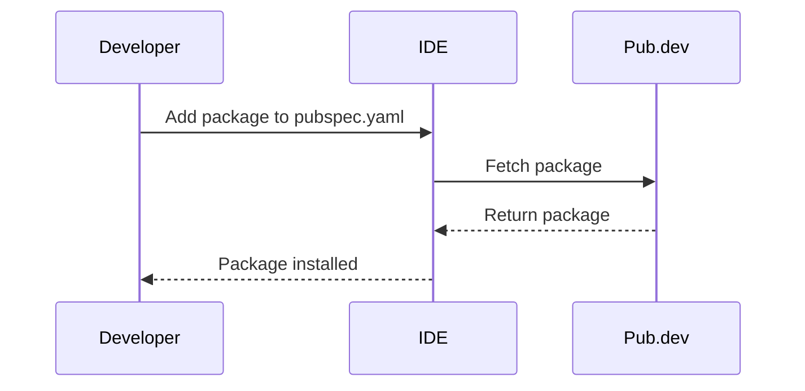

## 8.1.3 Adding Packages to Your Flutter Project: A Comprehensive Guide

In the world of Flutter development, leveraging external packages is a powerful way to enhance your app's functionality without reinventing the wheel. Packages can provide everything from simple utilities to complex features like state management, networking, and more. This section will guide you through the process of adding packages to your Flutter project, ensuring you understand the nuances of managing dependencies effectively.

### Understanding the Role of `pubspec.yaml`

The `pubspec.yaml` file is the cornerstone of your Flutter project's configuration. It defines the metadata for your app, including its dependencies. By editing this file, you can specify which packages your project requires.

#### Editing `pubspec.yaml` to Include Dependencies

To add a package, you need to declare it under the `dependencies` section of your `pubspec.yaml` file. Here's a basic structure:

```yaml
name: my_flutter_app
description: A new Flutter project.

dependencies:
  flutter:
    sdk: flutter
  http: ^0.13.4
  provider: ^6.0.0
```

- **`flutter`:** This is a special dependency that points to the Flutter SDK.
- **`http` and `provider`:** These are external packages. The caret (`^`) syntax specifies version constraints, which we'll explore next.

#### Understanding Version Constraints

Version constraints are crucial for maintaining compatibility and stability in your project. They dictate which versions of a package your project can use. Here are some common syntaxes:

- **Caret Syntax (`^`):** Allows updates that do not break the existing API. For example, `^0.13.4` means any version from `0.13.4` up to but not including `0.14.0`.
- **Exact Version:** Specifies a single version, e.g., `1.2.3`.
- **Range:** Specifies a range of acceptable versions, e.g., `>=1.2.0 <2.0.0`.

Choosing the right version constraint is a balance between stability and access to new features. The caret syntax is often preferred for its flexibility.

### Installing Packages with `flutter pub get`

Once you've updated your `pubspec.yaml`, you need to fetch the packages. This is done using the `flutter pub get` command:

```bash
flutter pub get
```

This command downloads the specified packages and their dependencies, updating your project's `pubspec.lock` file to reflect the exact versions used. This lock file ensures consistency across different environments and team members.

### Resolving Dependency Conflicts

Sometimes, you might encounter dependency conflicts, where two packages require different versions of the same dependency. Here's how to handle them:

- **Review Version Constraints:** Check if you can adjust the version constraints to accommodate both packages.
- **Consult Documentation:** Package documentation often provides guidance on compatible versions.
- **Use `dependency_overrides`:** As a last resort, you can use the `dependency_overrides` section in `pubspec.yaml` to force a specific version. However, this can lead to instability if not used carefully.

### Alternative Methods: Using IDE Tools

Many Integrated Development Environments (IDEs) like Visual Studio Code and Android Studio offer integrated tools for managing packages. These tools provide a graphical interface to search for and add packages, automatically updating your `pubspec.yaml` and running `flutter pub get`.

#### Visual Studio Code

- **Dart: Add Dependency:** Right-click on `pubspec.yaml` and select "Add Dependency" to search for packages.
- **Dart: Get Packages:** Use the command palette (`Ctrl+Shift+P`) and type "Dart: Get Packages" to fetch dependencies.

#### Android Studio

- **Pubspec Assist Plugin:** This plugin provides a UI to add dependencies directly from `pubspec.yaml`.
- **Terminal:** Use the built-in terminal to run `flutter pub get`.

### Practical Example: Adding the `http` Package

Let's walk through adding the `http` package to a Flutter project:

1. **Open `pubspec.yaml`:** Locate the `dependencies` section.
2. **Add the Package:**

   ```yaml
   dependencies:
     flutter:
       sdk: flutter
     http: ^0.13.4
   ```

3. **Run `flutter pub get`:** Open your terminal and execute the command to install the package.

4. **Import and Use in Your Code:**

   ```dart
   import 'package:http/http.dart' as http;

   void fetchData() async {
     final response = await http.get(Uri.parse('https://api.example.com/data'));
     if (response.statusCode == 200) {
       print('Data: ${response.body}');
     } else {
       print('Failed to load data');
     }
   }
   ```

### Visualizing the Process with Mermaid.js

To better understand the process of adding a package, consider the following sequence diagram:



This diagram illustrates the flow from adding a package in your `pubspec.yaml` to having it installed and ready for use in your project.

### Best Practices and Common Pitfalls

- **Regularly Update Packages:** Keep your dependencies up to date to benefit from bug fixes and new features.
- **Test After Updates:** Always test your app after updating packages to catch any breaking changes.
- **Avoid Overusing Overrides:** Dependency overrides can lead to unexpected behavior and should be used sparingly.

### Additional Resources

For further reading and exploration, consider the following resources:

- [Flutter Official Documentation](https://flutter.dev/docs/development/packages-and-plugins/using-packages)
- [Dart Packages](https://pub.dev/)
- [Effective Dart: Style](https://dart.dev/guides/language/effective-dart/style)

These resources provide deeper insights into managing packages and writing effective Dart code.

### Conclusion

Adding packages to your Flutter project is a straightforward process that can significantly enhance your app's capabilities. By understanding how to manage dependencies effectively, you can ensure your project remains stable and up-to-date. Remember to leverage IDE tools for convenience and always test your app thoroughly after making changes to dependencies.

## Quiz Time!



### What is the primary purpose of the `pubspec.yaml` file in a Flutter project?

- [x] To define the project's metadata and dependencies.
- [ ] To store the project's source code.
- [ ] To manage the project's database connections.
- [ ] To configure the project's network settings.

> **Explanation:** The `pubspec.yaml` file is used to define the project's metadata, including its dependencies, which are essential for managing external packages.

### Which syntax allows updates that do not break the existing API in version constraints?

- [x] Caret syntax (`^`)
- [ ] Exact version
- [ ] Range
- [ ] Wildcard

> **Explanation:** The caret syntax (`^`) allows updates that do not break the existing API, providing flexibility while maintaining compatibility.

### What command is used to fetch the dependencies specified in `pubspec.yaml`?

- [x] `flutter pub get`
- [ ] `flutter fetch`
- [ ] `flutter install`
- [ ] `flutter update`

> **Explanation:** The `flutter pub get` command is used to download and install the dependencies specified in the `pubspec.yaml` file.

### How can you resolve dependency conflicts in a Flutter project?

- [x] Review version constraints and consult documentation.
- [ ] Ignore the conflicts and proceed.
- [ ] Delete the conflicting packages.
- [ ] Use only the latest version of all packages.

> **Explanation:** Reviewing version constraints and consulting documentation are effective strategies for resolving dependency conflicts.

### What is the role of the `pubspec.lock` file?

- [x] To ensure consistency by locking the exact versions of dependencies used.
- [ ] To store the project's source code.
- [ ] To manage the project's database connections.
- [ ] To configure the project's network settings.

> **Explanation:** The `pubspec.lock` file locks the exact versions of dependencies used, ensuring consistency across different environments.

### Which IDE tool can be used in Visual Studio Code to add a dependency?

- [x] Dart: Add Dependency
- [ ] Flutter: Add Package
- [ ] Dart: Install Package
- [ ] Flutter: Get Dependency

> **Explanation:** The "Dart: Add Dependency" tool in Visual Studio Code allows you to add dependencies directly from `pubspec.yaml`.

### What is a potential downside of using `dependency_overrides`?

- [x] It can lead to instability if not used carefully.
- [ ] It makes the project run faster.
- [ ] It automatically resolves all conflicts.
- [ ] It simplifies the codebase.

> **Explanation:** Using `dependency_overrides` can lead to instability if not used carefully, as it forces specific versions that may not be compatible.

### Which package is used in the example to make HTTP requests?

- [x] `http`
- [ ] `provider`
- [ ] `flutter`
- [ ] `json_serializable`

> **Explanation:** The `http` package is used in the example to make HTTP requests.

### What should you do after updating packages in your Flutter project?

- [x] Test your app thoroughly.
- [ ] Delete the `pubspec.lock` file.
- [ ] Ignore the changes.
- [ ] Reinstall Flutter.

> **Explanation:** Testing your app thoroughly after updating packages helps catch any breaking changes or issues.

### True or False: The `pubspec.yaml` file is used to manage the project's database connections.

- [ ] True
- [x] False

> **Explanation:** The `pubspec.yaml` file is not used to manage database connections; it is used to define the project's metadata and dependencies.


