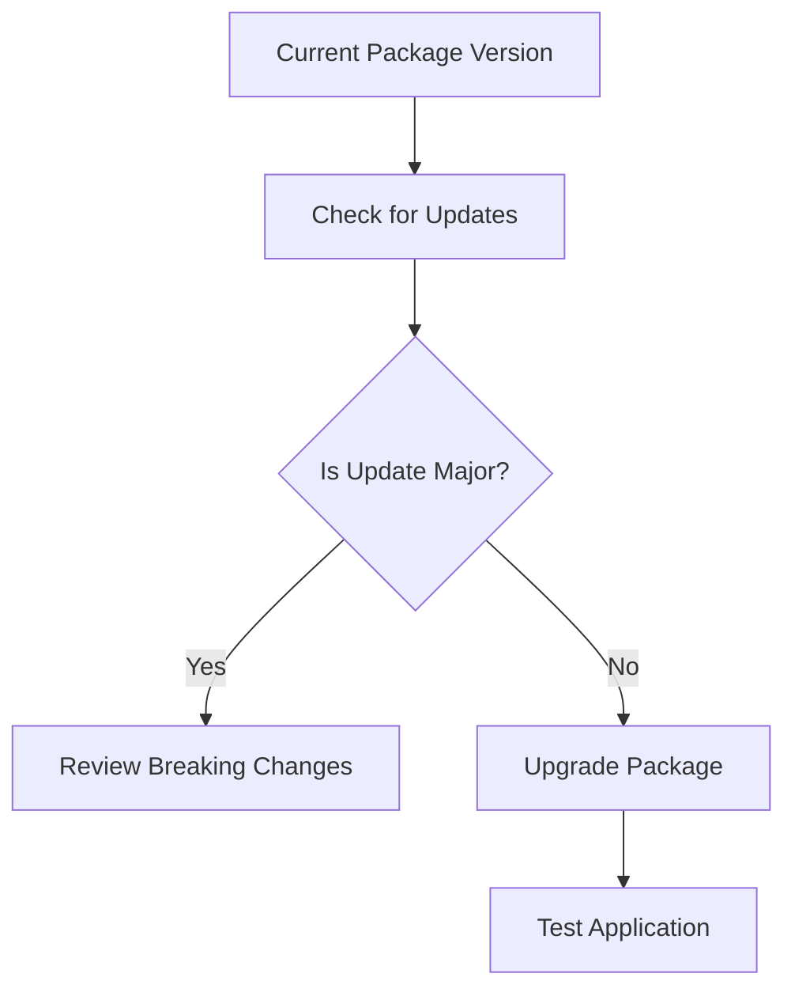

## 8.1.4 Managing Package Versions

In the world of software development, managing package versions is crucial for maintaining the stability and compatibility of your projects. As you build Flutter applications, you'll rely on a variety of external packages to extend functionality, streamline development, and integrate with third-party services. However, with great power comes great responsibility—keeping these packages up-to-date while avoiding breaking changes can be a delicate balancing act. In this section, we'll explore best practices for managing package versions, focusing on semantic versioning, version constraints, and strategies for safely updating packages.

### Understanding Semantic Versioning

Semantic versioning is a versioning scheme that conveys meaning about the underlying changes with each new release. It follows a `MAJOR.MINOR.PATCH` format, where each segment of the version number has a specific purpose:

- **MAJOR**: Incremented for incompatible API changes. A major version bump indicates that the new version is not backward-compatible with previous versions, and upgrading may require changes to your code.
- **MINOR**: Incremented for backward-compatible functionality additions. A minor version bump means new features have been added, but existing functionality remains unchanged.
- **PATCH**: Incremented for backward-compatible bug fixes. A patch version bump addresses issues without affecting existing features or introducing new ones.

Understanding semantic versioning helps you make informed decisions about when and how to update packages in your Flutter projects.

### Using Version Constraints Effectively

When specifying package dependencies in your `pubspec.yaml` file, you can use version constraints to control which versions of a package your project will accept. This is crucial for ensuring compatibility and stability. Here are some common version constraint patterns:

- **Caret Syntax (`^`)**: Allows updates that do not change the left-most non-zero digit. For example, `^1.2.3` allows versions `>=1.2.3 <2.0.0`.
- **Tilde Syntax (`~`)**: Allows updates to the last digit specified. For example, `~1.2.3` allows versions `>=1.2.3 <1.3.0`.
- **Exact Version**: Specifies a single version, such as `1.2.3`.
- **Range**: Specifies a range of acceptable versions, such as `>=1.2.0 <2.0.0`.

Using these constraints wisely can help you avoid unexpected breaking changes while still benefiting from updates and bug fixes.

### Checking for Updates with `flutter pub outdated`

To keep your Flutter project up-to-date, it's important to regularly check for package updates. The `flutter pub outdated` command provides a comprehensive overview of your project's dependencies, highlighting which packages are outdated and what the latest available versions are. Here's how you can use it:

```bash
flutter pub outdated
```

This command will generate a report showing the current version, the latest compatible version, and the latest available version for each package. This information is invaluable for planning updates and understanding the potential impact on your project.

### Strategies for Updating Packages Safely

Updating packages can introduce new features and bug fixes, but it can also lead to compatibility issues if not done carefully. Here are some strategies to ensure safe updates:

- **Review Release Notes**: Before updating a package, review the release notes to understand what changes have been made. Pay special attention to major version updates, as these may include breaking changes.
- **Test Thoroughly**: After updating a package, thoroughly test your application to ensure that everything works as expected. Automated tests can be particularly helpful in catching regressions.
- **Use Version Constraints**: As discussed earlier, use version constraints in your `pubspec.yaml` file to control which versions of a package your project will accept. This can prevent accidental upgrades to incompatible versions.
- **Incremental Updates**: Instead of updating all packages at once, consider updating them incrementally. This approach makes it easier to identify the source of any issues that arise.

### Automating Version Management

Managing package versions manually can be time-consuming, especially in larger projects with many dependencies. Fortunately, there are tools and practices that can help automate this process:

- **Continuous Integration (CI)**: Set up a CI pipeline to automatically check for package updates and run tests. This ensures that your project remains compatible with the latest package versions without manual intervention.
- **Dependabot**: Consider using tools like Dependabot, which automatically creates pull requests to update dependencies in your project. This can save time and help you stay on top of updates.

### Code Example

Here's a practical example of using the `flutter pub outdated` command and upgrading a specific package:

```bash
flutter pub outdated

flutter pub upgrade http
```

This example demonstrates how to identify outdated packages and update a specific package, such as `http`, to its latest version.

### Visualizing the Update Process

To better understand the package update process, let's look at a diagram that illustrates the steps involved:



This diagram outlines the decision-making process when updating a package. It emphasizes the importance of reviewing breaking changes for major updates and testing the application after any upgrade.

### Best Practices and Common Pitfalls

- **Best Practices**:
  - Regularly check for package updates using `flutter pub outdated`.
  - Use semantic versioning to guide your update decisions.
  - Test your application thoroughly after updating packages.
  - Automate version management with CI tools and services like Dependabot.

- **Common Pitfalls**:
  - Ignoring release notes and blindly updating packages.
  - Failing to test the application after updates, leading to undetected issues.
  - Using overly restrictive version constraints that prevent beneficial updates.

### Additional Resources

For further exploration of package management in Flutter, consider the following resources:

- [Flutter Documentation on Package Management](https://flutter.dev/docs/development/packages-and-plugins/using-packages)
- [Semantic Versioning Specification](https://semver.org/)
- [Dependabot Documentation](https://docs.github.com/en/code-security/supply-chain-security/keeping-your-dependencies-updated-automatically)

These resources provide deeper insights into managing package versions and can help you refine your approach to dependency management.

### Conclusion

Managing package versions effectively is a critical skill for any Flutter developer. By understanding semantic versioning, using version constraints wisely, and adopting strategies for safe updates, you can ensure that your projects remain stable and compatible with the latest package releases. Embrace automation tools to streamline the process and focus on delivering high-quality applications.

## Quiz Time!



### What is the purpose of semantic versioning?

- [x] To convey meaning about the underlying changes with each new release.
- [ ] To ensure all packages are updated to the latest version.
- [ ] To restrict updates to only major versions.
- [ ] To automate the update process.

> **Explanation:** Semantic versioning uses a `MAJOR.MINOR.PATCH` format to indicate the nature of changes in each release, helping developers understand the impact of updates.

### Which version constraint allows updates that do not change the left-most non-zero digit?

- [x] Caret Syntax (`^`)
- [ ] Tilde Syntax (`~`)
- [ ] Exact Version
- [ ] Range

> **Explanation:** The caret syntax (`^`) allows updates that do not change the left-most non-zero digit, providing flexibility while maintaining compatibility.

### What command is used to check for outdated packages in a Flutter project?

- [x] `flutter pub outdated`
- [ ] `flutter pub upgrade`
- [ ] `flutter pub get`
- [ ] `flutter pub update`

> **Explanation:** The `flutter pub outdated` command provides a report of outdated packages, helping developers identify which dependencies need updates.

### What should you do before updating a package to a new major version?

- [x] Review the release notes for breaking changes.
- [ ] Update all packages simultaneously.
- [ ] Ignore the update and continue with the current version.
- [ ] Automatically accept all updates.

> **Explanation:** Reviewing release notes for breaking changes is crucial before updating to a new major version, as it may require code changes.

### Which tool can automatically create pull requests to update dependencies in your project?

- [x] Dependabot
- [ ] Flutter DevTools
- [ ] GitHub Actions
- [ ] Jenkins

> **Explanation:** Dependabot is a tool that automatically creates pull requests to update dependencies, helping developers manage package versions efficiently.

### What is a common pitfall when managing package versions?

- [x] Ignoring release notes and blindly updating packages.
- [ ] Regularly checking for package updates.
- [ ] Using semantic versioning.
- [ ] Testing the application after updates.

> **Explanation:** Ignoring release notes and blindly updating packages can lead to compatibility issues and undetected problems in the application.

### What is the benefit of using version constraints in `pubspec.yaml`?

- [x] To control which versions of a package your project will accept.
- [ ] To ensure all packages are always up-to-date.
- [ ] To restrict updates to only patch versions.
- [ ] To automate the testing process.

> **Explanation:** Version constraints in `pubspec.yaml` help control which versions of a package are acceptable, preventing accidental upgrades to incompatible versions.

### What is the purpose of the `flutter pub upgrade` command?

- [x] To upgrade a specific package to its latest version.
- [ ] To check for outdated packages.
- [ ] To install new packages.
- [ ] To remove unused packages.

> **Explanation:** The `flutter pub upgrade` command upgrades a specific package to its latest version, ensuring the project uses the most recent release.

### Why is it important to test your application after updating packages?

- [x] To ensure that everything works as expected and catch regressions.
- [ ] To automatically update all other packages.
- [ ] To remove unused dependencies.
- [ ] To generate a new `pubspec.yaml` file.

> **Explanation:** Testing the application after updating packages ensures that the updates do not introduce new issues or regressions, maintaining application stability.

### True or False: Using overly restrictive version constraints can prevent beneficial updates.

- [x] True
- [ ] False

> **Explanation:** Overly restrictive version constraints can prevent beneficial updates, such as bug fixes and new features, from being applied to the project.


