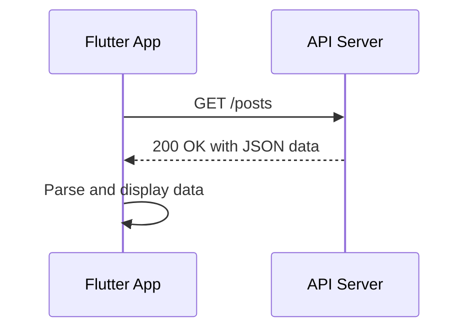

## 8.2.1 HTTP Package

In the world of mobile app development, interacting with web services is a common requirement. Whether you're fetching data from a server, submitting user input, or synchronizing information, network requests are essential. Flutter, with its rich ecosystem, provides the `http` package, a powerful tool for handling these tasks efficiently. This section will guide you through the essentials of using the `http` package in Flutter, covering everything from installation to making various types of HTTP requests and handling responses.

### Introduction to the HTTP Package

The `http` package is a fundamental library in Flutter for making network requests. It simplifies the process of communicating with web servers, allowing developers to perform HTTP operations such as GET, POST, PUT, and DELETE. This package is particularly useful for interacting with RESTful APIs, which are commonly used in modern web services.

#### Why Use the HTTP Package?

- **Simplicity**: The `http` package abstracts the complexities of network communication, providing a straightforward API for making requests.
- **Asynchronous Operations**: Network requests are inherently asynchronous, and the `http` package leverages Dart's `Future` and `async/await` syntax to handle these operations seamlessly.
- **Error Handling**: The package provides mechanisms to handle network errors, ensuring robust and reliable applications.
- **JSON Parsing**: With Dart's built-in `dart:convert` library, parsing JSON responses becomes intuitive and efficient.

### Installing the HTTP Package

Before you can use the `http` package, you need to add it to your Flutter project. This involves updating your project's `pubspec.yaml` file.

#### Step-by-Step Installation

1. **Open `pubspec.yaml`**: Locate the `pubspec.yaml` file in the root directory of your Flutter project.

2. **Add the Dependency**: Under the `dependencies` section, add the `http` package.

   ```yaml
   dependencies:
     flutter:
       sdk: flutter
     http: ^0.13.3
   ```

3. **Install the Package**: Run the following command in your terminal to install the package:

   ```bash
   flutter pub get
   ```

4. **Import the Package**: In your Dart files, import the `http` package to start using it.

   ```dart
   import 'package:http/http.dart' as http;
   ```

### Making Asynchronous HTTP Requests

Network requests in Flutter are asynchronous operations. This means they don't block the main thread, allowing your app to remain responsive while waiting for a server response. Dart's `async` and `await` keywords make handling these operations straightforward.

#### Understanding Asynchronous Programming

- **`Future`**: Represents a potential value or error that will be available at some time in the future.
- **`async`**: Marks a function as asynchronous, allowing the use of `await` within it.
- **`await`**: Pauses the execution of the function until the `Future` completes, returning the result.

### Handling Different HTTP Methods

The `http` package supports various HTTP methods, each serving a specific purpose in web communication.

#### GET Request

A GET request retrieves data from a server. It's the most common type of request used to fetch resources.

**Example: Fetching Posts**

```dart
import 'package:http/http.dart' as http;
import 'dart:convert';

Future<void> fetchPosts() async {
  final response = await http.get(Uri.parse('https://jsonplaceholder.typicode.com/posts'));

  if (response.statusCode == 200) {
    List<dynamic> posts = json.decode(response.body);
    for (var post in posts) {
      print(post['title']);
    }
  } else {
    throw Exception('Failed to load posts');
  }
}
```

In this example, we make a GET request to a placeholder API, parse the JSON response, and print the titles of the posts.

#### POST Request

A POST request sends data to a server, typically used for creating new resources.

**Example: Creating a New Post**

```dart
Future<void> createPost(String title, String body) async {
  final response = await http.post(
    Uri.parse('https://jsonplaceholder.typicode.com/posts'),
    headers: <String, String>{
      'Content-Type': 'application/json; charset=UTF-8',
    },
    body: jsonEncode(<String, String>{
      'title': title,
      'body': body,
      'userId': '1',
    }),
  );

  if (response.statusCode == 201) {
    print('Post created successfully');
  } else {
    throw Exception('Failed to create post');
  }
}
```

Here, we send a POST request with a JSON body to create a new post. The server responds with a status code indicating success or failure.

#### PUT Request

A PUT request updates an existing resource on the server.

**Example: Updating a Post**

```dart
Future<void> updatePost(int id, String title, String body) async {
  final response = await http.put(
    Uri.parse('https://jsonplaceholder.typicode.com/posts/$id'),
    headers: <String, String>{
      'Content-Type': 'application/json; charset=UTF-8',
    },
    body: jsonEncode(<String, String>{
      'title': title,
      'body': body,
      'userId': '1',
    }),
  );

  if (response.statusCode == 200) {
    print('Post updated successfully');
  } else {
    throw Exception('Failed to update post');
  }
}
```

This example demonstrates updating a post by sending a PUT request with the updated data.

#### DELETE Request

A DELETE request removes a resource from the server.

**Example: Deleting a Post**

```dart
Future<void> deletePost(int id) async {
  final response = await http.delete(
    Uri.parse('https://jsonplaceholder.typicode.com/posts/$id'),
  );

  if (response.statusCode == 200) {
    print('Post deleted successfully');
  } else {
    throw Exception('Failed to delete post');
  }
}
```

In this case, we send a DELETE request to remove a post identified by its ID.

### Parsing JSON Data

Most web APIs return data in JSON format. Dart's `dart:convert` library provides tools to decode JSON strings into Dart objects and vice versa.

#### Decoding JSON

To decode a JSON string, use the `json.decode` method, which converts the string into a Dart object.

**Example: Decoding JSON**

```dart
String jsonString = '{"name": "John", "age": 30}';
Map<String, dynamic> user = json.decode(jsonString);
print('Name: ${user['name']}, Age: ${user['age']}');
```

#### Encoding JSON

To convert a Dart object into a JSON string, use the `json.encode` method.

**Example: Encoding JSON**

```dart
Map<String, dynamic> user = {'name': 'John', 'age': 30};
String jsonString = json.encode(user);
print(jsonString);
```

### Practical Example: Fetching and Displaying Data

Let's create a simple Flutter app that fetches and displays a list of posts from a RESTful API.

#### Step 1: Set Up the Project

Create a new Flutter project and add the `http` package to your `pubspec.yaml`.

#### Step 2: Create a Model Class

Define a model class to represent the data structure of a post.

```dart
class Post {
  final int id;
  final String title;
  final String body;

  Post({required this.id, required this.title, required this.body});

  factory Post.fromJson(Map<String, dynamic> json) {
    return Post(
      id: json['id'],
      title: json['title'],
      body: json['body'],
    );
  }
}
```

#### Step 3: Fetch Data from the API

Create a function to fetch posts and parse the JSON response.

```dart
Future<List<Post>> fetchPosts() async {
  final response = await http.get(Uri.parse('https://jsonplaceholder.typicode.com/posts'));

  if (response.statusCode == 200) {
    List<dynamic> jsonResponse = json.decode(response.body);
    return jsonResponse.map((post) => Post.fromJson(post)).toList();
  } else {
    throw Exception('Failed to load posts');
  }
}
```

#### Step 4: Display Data in the UI

Use a `FutureBuilder` widget to fetch and display the posts in a list.

```dart
@override
Widget build(BuildContext context) {
  return Scaffold(
    appBar: AppBar(title: Text('Posts')),
    body: FutureBuilder<List<Post>>(
      future: fetchPosts(),
      builder: (context, snapshot) {
        if (snapshot.connectionState == ConnectionState.waiting) {
          return Center(child: CircularProgressIndicator());
        } else if (snapshot.hasError) {
          return Center(child: Text('Error: ${snapshot.error}'));
        } else {
          final posts = snapshot.data!;
          return ListView.builder(
            itemCount: posts.length,
            itemBuilder: (context, index) {
              return ListTile(
                title: Text(posts[index].title),
                subtitle: Text(posts[index].body),
              );
            },
          );
        }
      },
    ),
  );
}
```

### Error Handling and Best Practices

Handling errors gracefully is crucial for a robust application. Here are some best practices:

- **Check Status Codes**: Always check the response status code to determine if the request was successful.
- **Use Try-Catch Blocks**: Wrap network calls in try-catch blocks to handle exceptions.
- **Timeouts**: Set timeouts for requests to prevent hanging operations.
- **User Feedback**: Provide feedback to users when errors occur, such as displaying error messages or retry options.

### Real-World Scenarios and Considerations

- **Authentication**: Many APIs require authentication. Use headers to send tokens or credentials.
- **Pagination**: For large datasets, implement pagination to load data in chunks.
- **Caching**: Consider caching responses to reduce network load and improve performance.

### Mermaid.js Diagram: HTTP Request Flow

To visualize the flow of an HTTP request in a Flutter app, consider the following sequence diagram:



### Conclusion

The `http` package is an indispensable tool for Flutter developers, enabling seamless communication with web services. By mastering HTTP requests and JSON parsing, you can build powerful, data-driven applications. Remember to handle errors gracefully and consider real-world scenarios like authentication and caching to enhance your app's performance and reliability.

### Further Reading and Resources

- [Flutter HTTP Package Documentation](https://pub.dev/packages/http)
- [Dart Asynchronous Programming: Futures, async, await](https://dart.dev/codelabs/async-await)
- [RESTful API Design](https://restfulapi.net/)

## Quiz Time!



### What is the primary purpose of the `http` package in Flutter?

- [x] To make network requests
- [ ] To handle local storage
- [ ] To manage state
- [ ] To create animations

> **Explanation:** The `http` package is used for making network requests in Flutter applications.

### Which HTTP method is typically used to retrieve data from a server?

- [x] GET
- [ ] POST
- [ ] PUT
- [ ] DELETE

> **Explanation:** The GET method is used to retrieve data from a server.

### How do you add the `http` package to a Flutter project?

- [x] By adding it to the `pubspec.yaml` file under dependencies
- [ ] By importing it directly in the Dart file
- [ ] By installing it via the terminal
- [ ] By downloading it from the Flutter website

> **Explanation:** You add the `http` package by specifying it in the `pubspec.yaml` file under dependencies.

### What Dart library is used to parse JSON data?

- [x] dart:convert
- [ ] dart:async
- [ ] dart:io
- [ ] dart:core

> **Explanation:** The `dart:convert` library is used to parse JSON data in Dart.

### Which keyword is used to pause the execution of a function until a `Future` completes?

- [x] await
- [ ] async
- [ ] future
- [ ] delay

> **Explanation:** The `await` keyword is used to pause the execution of a function until a `Future` completes.

### What should you check to determine if an HTTP request was successful?

- [x] The response status code
- [ ] The response headers
- [ ] The request URL
- [ ] The request method

> **Explanation:** The response status code indicates whether an HTTP request was successful.

### Which HTTP method is used to update an existing resource on the server?

- [x] PUT
- [ ] GET
- [ ] POST
- [ ] DELETE

> **Explanation:** The PUT method is used to update an existing resource on the server.

### What is the purpose of using headers in an HTTP request?

- [x] To send additional information such as authentication tokens
- [ ] To specify the request URL
- [ ] To determine the request method
- [ ] To parse the response data

> **Explanation:** Headers are used to send additional information such as authentication tokens in an HTTP request.

### Which method is used to convert a Dart object into a JSON string?

- [x] json.encode
- [ ] json.decode
- [ ] json.parse
- [ ] json.stringify

> **Explanation:** The `json.encode` method is used to convert a Dart object into a JSON string.

### True or False: The `http` package can be used for both synchronous and asynchronous network requests.

- [x] False
- [ ] True

> **Explanation:** The `http` package is designed for asynchronous network requests, leveraging Dart's `Future` and `async/await` syntax.


