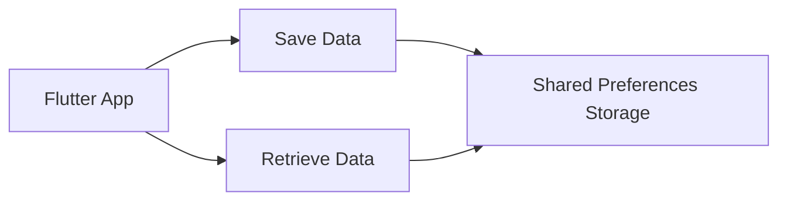

## 8.2.2 Shared Preferences

In the realm of mobile app development, efficiently managing user data is crucial for creating a seamless user experience. Flutter provides a straightforward solution for storing simple key-value pairs locally on a device through the `shared_preferences` package. This package is ideal for saving user settings, preferences, and other lightweight data that needs to persist across app sessions.

### Understanding Shared Preferences

Shared preferences in Flutter offer a simple way to store and retrieve small amounts of data as key-value pairs. This method is particularly useful for data that doesn't require complex structures or large storage capacity, such as user preferences, settings, or simple application states.

#### Use Cases for Shared Preferences

- **User Settings:** Store user preferences like theme selection, language settings, or notification preferences.
- **Application State:** Save the last opened page or user session data to enhance user experience.
- **Feature Flags:** Enable or disable features based on user settings or testing requirements.

### Installing the `shared_preferences` Package

To begin using shared preferences in your Flutter project, you need to add the `shared_preferences` package to your project's dependencies. This can be done by updating the `pubspec.yaml` file.

```yaml
dependencies:
  flutter:
    sdk: flutter
  shared_preferences: ^2.0.6
```

After adding the package, run `flutter pub get` to install it.

### Storing Data with Shared Preferences

The `shared_preferences` package allows you to store various data types, including strings, integers, doubles, booleans, and string lists. Below is a practical example of how to store a username as a string.

```dart
import 'package:shared_preferences/shared_preferences.dart';

Future<void> saveUsername(String username) async {
  final prefs = await SharedPreferences.getInstance();
  await prefs.setString('username', username);
}
```

In this example, we first obtain an instance of `SharedPreferences` using `SharedPreferences.getInstance()`. We then use the `setString` method to store the username under the key `'username'`.

### Retrieving and Updating Stored Data

Retrieving data from shared preferences is as straightforward as storing it. Here's how you can retrieve the username stored in the previous example:

```dart
Future<String?> getUsername() async {
  final prefs = await SharedPreferences.getInstance();
  return prefs.getString('username');
}
```

This function fetches the stored username using the `getString` method. If the key does not exist, it returns `null`.

### Removing Data

Sometimes, you may need to remove data from shared preferences, such as when a user logs out. Here's how you can remove the stored username:

```dart
Future<void> removeUsername() async {
  final prefs = await SharedPreferences.getInstance();
  await prefs.remove('username');
}
```

The `remove` method deletes the data associated with the specified key.

### Limitations of Shared Preferences

While shared preferences are convenient for storing simple data, they come with limitations:

- **Size Limitations:** Shared preferences are not suitable for storing large amounts of data or complex objects. They are best used for small, simple data.
- **Data Security:** Data stored in shared preferences is not encrypted, making it unsuitable for sensitive information.
- **Synchronous Access:** Access to shared preferences is synchronous, which can lead to performance issues if not managed properly.

### Best Practices

- **Use for Simple Data:** Limit the use of shared preferences to simple, non-sensitive data.
- **Avoid Frequent Writes:** Minimize the frequency of writes to shared preferences to avoid performance bottlenecks.
- **Consider Alternatives for Complex Data:** For more complex data storage needs, consider using local databases like SQLite or cloud storage solutions.

### Practical Example: Theme Preference

Let's consider a practical example where we store a user's theme preference (light or dark mode) using shared preferences.

```dart
Future<void> saveThemePreference(bool isDarkMode) async {
  final prefs = await SharedPreferences.getInstance();
  await prefs.setBool('isDarkMode', isDarkMode);
}

Future<bool> getThemePreference() async {
  final prefs = await SharedPreferences.getInstance();
  return prefs.getBool('isDarkMode') ?? false; // Default to light mode
}
```

In this example, we store the theme preference as a boolean. The `getThemePreference` function returns the stored value or defaults to `false` (light mode) if the preference hasn't been set.

### Visualizing the Process

To better understand the flow of data storage and retrieval using shared preferences, consider the following diagram:



This diagram illustrates how data is saved to and retrieved from shared preferences, emphasizing the simplicity and efficiency of this storage method.

### Conclusion

The `shared_preferences` package is a powerful tool for Flutter developers, offering a simple and effective way to manage user preferences and settings. By understanding its capabilities and limitations, you can leverage shared preferences to enhance your app's user experience without compromising performance or security.

For further exploration, consider diving into the official [shared_preferences documentation](https://pub.dev/packages/shared_preferences) and experimenting with different data types and use cases in your projects.

## Quiz Time!



### What is the primary use of the `shared_preferences` package in Flutter?

- [x] Storing simple key-value pairs locally on the device.
- [ ] Managing complex data structures.
- [ ] Encrypting sensitive user data.
- [ ] Handling real-time data synchronization.

> **Explanation:** The `shared_preferences` package is primarily used for storing simple key-value pairs locally on the device, such as user settings and preferences.

### Which data type is NOT supported by the `shared_preferences` package?

- [ ] String
- [ ] Boolean
- [ ] Integer
- [x] Complex objects

> **Explanation:** The `shared_preferences` package supports basic data types like strings, booleans, and integers, but not complex objects.

### How do you remove a stored key-value pair in shared preferences?

- [ ] prefs.delete('key');
- [x] prefs.remove('key');
- [ ] prefs.clear('key');
- [ ] prefs.erase('key');

> **Explanation:** The `remove` method is used to delete a stored key-value pair in shared preferences.

### What is a limitation of using shared preferences?

- [ ] It can store large amounts of data.
- [x] It is not suitable for sensitive data.
- [ ] It encrypts all stored data.
- [ ] It requires an internet connection.

> **Explanation:** Shared preferences are not suitable for sensitive data because the data is not encrypted.

### Which method is used to store a boolean value in shared preferences?

- [ ] prefs.setString('key', value);
- [x] prefs.setBool('key', value);
- [ ] prefs.setInt('key', value);
- [ ] prefs.setDouble('key', value);

> **Explanation:** The `setBool` method is used to store a boolean value in shared preferences.

### What should you do if a key does not exist when retrieving data from shared preferences?

- [ ] Throw an error.
- [ ] Return a default value.
- [x] Use the null-aware operator to provide a default.
- [ ] Ignore the missing key.

> **Explanation:** When retrieving data, it's common to use the null-aware operator to provide a default value if the key does not exist.

### Which of the following is a best practice when using shared preferences?

- [x] Use it for simple, non-sensitive data.
- [ ] Use it for storing large files.
- [ ] Use it for encrypting data.
- [ ] Use it for real-time data updates.

> **Explanation:** Shared preferences should be used for simple, non-sensitive data due to its limitations in size and security.

### How do you retrieve a string value from shared preferences?

- [ ] prefs.getBoolean('key');
- [ ] prefs.getInt('key');
- [x] prefs.getString('key');
- [ ] prefs.getDouble('key');

> **Explanation:** The `getString` method is used to retrieve a string value from shared preferences.

### What is the default return value when retrieving a boolean from shared preferences if the key does not exist?

- [ ] true
- [ ] null
- [x] false
- [ ] An error is thrown

> **Explanation:** If a boolean key does not exist, the default return value is `false`.

### True or False: Shared preferences can be used to store complex data structures like lists of objects.

- [ ] True
- [x] False

> **Explanation:** Shared preferences are not designed to store complex data structures like lists of objects; they are intended for simple key-value pairs.


