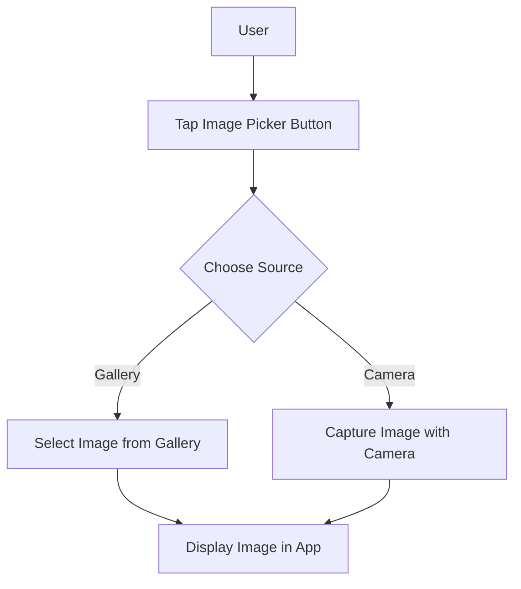

## 8.2.3 Image Picker

In the world of mobile app development, providing users with the ability to capture or select images is a common requirement. Whether you're building a social media app, a profile management system, or a simple photo gallery, integrating image selection capabilities can significantly enhance user engagement. Flutter, with its rich ecosystem of packages, offers a straightforward way to implement this feature using the `image_picker` package.

### Introduction to the `image_picker` Package

The `image_picker` package is a powerful tool that allows Flutter developers to access the device's camera and photo library. This package simplifies the process of letting users select images from their gallery or capture new photos using the camera. It abstracts the complexities of handling platform-specific code, providing a unified API for both Android and iOS.

### Installing the `image_picker` Package

To get started with the `image_picker` package, you first need to add it to your Flutter project. This involves updating your `pubspec.yaml` file to include the package as a dependency.

```yaml
dependencies:
  flutter:
    sdk: flutter
  image_picker: ^0.8.4+3
```

After adding the dependency, run `flutter pub get` in your terminal to install the package.

### Configuring Platform-Specific Settings

Before you can use the `image_picker` package, you need to configure some platform-specific settings for both Android and iOS to handle permissions and ensure smooth functionality.

#### Android Configuration

1. **Update `AndroidManifest.xml`:** You need to add permissions for camera and storage access.

```xml
<manifest xmlns:android="http://schemas.android.com/apk/res/android"
    package="com.example.yourapp">

    <uses-permission android:name="android.permission.CAMERA"/>
    <uses-permission android:name="android.permission.READ_EXTERNAL_STORAGE"/>
    <uses-permission android:name="android.permission.WRITE_EXTERNAL_STORAGE"/>

    <application
        android:label="yourapp"
        android:icon="@mipmap/ic_launcher">
        <!-- Other configurations -->
    </application>
</manifest>
```

2. **Handle FileProvider:** Ensure that your app can share files with other apps by configuring a `FileProvider`.

```xml
<application>
    <provider
        android:name="androidx.core.content.FileProvider"
        android:authorities="${applicationId}.fileprovider"
        android:exported="false"
        android:grantUriPermissions="true">
        <meta-data
            android:name="android.support.FILE_PROVIDER_PATHS"
            android:resource="@xml/file_paths"/>
    </provider>
</application>
```

Create a new XML resource file named `file_paths.xml` in the `res/xml` directory:

```xml
<paths xmlns:android="http://schemas.android.com/apk/res/android">
    <external-path name="external_files" path="."/>
</paths>
```

#### iOS Configuration

1. **Update `Info.plist`:** You need to request permission to access the camera and photo library.

```xml
<key>NSCameraUsageDescription</key>
<string>We need access to your camera to take photos.</string>
<key>NSPhotoLibraryUsageDescription</key>
<string>We need access to your photo library to select photos.</string>
<key>NSPhotoLibraryAddUsageDescription</key>
<string>We need permission to save photos to your library.</string>
```

### Picking Images from the Gallery or Camera

With the package installed and configured, you can now implement functionality to pick images from the gallery or capture new photos using the camera.

#### Code Example

Here's a simple example demonstrating how to use the `image_picker` package to select an image from the gallery:

```dart
import 'package:flutter/material.dart';
import 'package:image_picker/image_picker.dart';
import 'dart:io';

class ImagePickerExample extends StatefulWidget {
  @override
  _ImagePickerExampleState createState() => _ImagePickerExampleState();
}

class _ImagePickerExampleState extends State<ImagePickerExample> {
  final ImagePicker _picker = ImagePicker();
  File? _image;

  Future<void> pickImage() async {
    final XFile? pickedFile = await _picker.pickImage(source: ImageSource.gallery);
    if (pickedFile != null) {
      setState(() {
        _image = File(pickedFile.path);
      });
    }
  }

  @override
  Widget build(BuildContext context) {
    return Scaffold(
      appBar: AppBar(
        title: Text('Image Picker Example'),
      ),
      body: Center(
        child: Column(
          mainAxisAlignment: MainAxisAlignment.center,
          children: <Widget>[
            _image == null
                ? Text('No image selected.')
                : Image.file(_image!),
            ElevatedButton(
              onPressed: pickImage,
              child: Text('Pick Image from Gallery'),
            ),
          ],
        ),
      ),
    );
  }
}
```

#### Explanation

- **ImagePicker Instance:** An instance of `ImagePicker` is created to interact with the device's camera and gallery.
- **pickImage Method:** This asynchronous method uses the `pickImage` function to open the gallery. If an image is selected, it updates the `_image` state with the file path.
- **UI Display:** The selected image is displayed using the `Image.file` widget. If no image is selected, a placeholder text is shown.

### Displaying and Managing Selected Images

Once an image is selected, you might want to display it within your app or perform additional operations such as editing or uploading it to a server.

#### Displaying Images

Displaying images in Flutter is straightforward. You can use the `Image.file` widget to render the image on the screen. Ensure that the image file is not null before attempting to display it.

```dart
Image.file(_image!)
```

#### Managing Images

Managing images involves handling various scenarios such as:

- **Image Compression:** To reduce the file size before uploading.
- **Image Cropping:** Allowing users to crop the image to a desired aspect ratio.
- **Image Uploading:** Sending the image to a server or cloud storage.

### Handling Permissions

Handling permissions is crucial to ensure a smooth user experience. Both Android and iOS require explicit permission to access the camera and photo library.

- **Android:** Permissions are declared in the `AndroidManifest.xml`, but you may also need to request permissions at runtime for devices running Android 6.0 (API level 23) or higher.
- **iOS:** Permissions are requested through the `Info.plist` file, and the system automatically prompts the user for permission when needed.

### Best Practices and Common Pitfalls

- **Error Handling:** Always handle potential errors such as user cancellation or permission denial gracefully.
- **User Experience:** Provide clear instructions and feedback to users when requesting permissions or when an image is successfully selected.
- **Testing:** Test your app on multiple devices and OS versions to ensure compatibility and a seamless user experience.

### Real-World Scenario

Consider a social media app where users can update their profile picture. Using the `image_picker` package, you can allow users to either select an existing photo from their gallery or take a new one using the camera. This enhances user engagement by providing a personalized experience.

### Mermaid.js Diagram

To visualize the image selection process, consider the following flowchart:



### Additional Resources

- [Flutter Image Picker Documentation](https://pub.dev/packages/image_picker)
- [Handling Permissions in Flutter](https://flutter.dev/docs/development/data-and-backend/networking)
- [Image Processing in Flutter](https://flutter.dev/docs/cookbook/plugins/picture-using-camera)

### Conclusion

The `image_picker` package is an essential tool for Flutter developers looking to integrate image selection capabilities into their apps. By following the steps outlined in this article, you can provide a seamless and engaging user experience. Remember to handle permissions carefully and test your app across different devices and platforms.

## Quiz Time!



### What is the primary purpose of the `image_picker` package in Flutter?

- [x] To allow users to select images from the gallery or capture new photos using the camera.
- [ ] To edit images within the app.
- [ ] To store images in a cloud database.
- [ ] To create image filters.

> **Explanation:** The `image_picker` package is used to access the device's camera and photo library, allowing users to select or capture images.

### Which file needs to be updated to request camera and storage permissions on Android?

- [x] `AndroidManifest.xml`
- [ ] `build.gradle`
- [ ] `MainActivity.java`
- [ ] `styles.xml`

> **Explanation:** Permissions for camera and storage access are declared in the `AndroidManifest.xml` file.

### What method is used to pick an image from the gallery using the `image_picker` package?

- [x] `pickImage`
- [ ] `getImage`
- [ ] `selectImage`
- [ ] `chooseImage`

> **Explanation:** The `pickImage` method is used to open the gallery and allow the user to select an image.

### What widget is used to display a selected image from a file in Flutter?

- [x] `Image.file`
- [ ] `Image.asset`
- [ ] `Image.network`
- [ ] `Image.memory`

> **Explanation:** The `Image.file` widget is used to display images from a file path.

### Which of the following is a common pitfall when using the `image_picker` package?

- [x] Not handling permissions correctly.
- [ ] Using too many images in the app.
- [ ] Displaying images in a grid layout.
- [ ] Compressing images before display.

> **Explanation:** Handling permissions incorrectly can lead to runtime errors and a poor user experience.

### What should you do if the user denies permission to access the camera or gallery?

- [x] Provide a fallback or explanation to the user.
- [ ] Force the app to close.
- [ ] Ignore the denial and proceed.
- [ ] Automatically grant permissions.

> **Explanation:** It's important to handle permission denial gracefully and inform the user why the permission is needed.

### How can you reduce the file size of an image before uploading it?

- [x] Compress the image.
- [ ] Increase the image resolution.
- [ ] Convert the image to a different format.
- [ ] Encrypt the image.

> **Explanation:** Compressing the image reduces its file size, making it easier to upload.

### What is the purpose of the `FileProvider` in Android configuration?

- [x] To allow sharing of files between apps.
- [ ] To increase app security.
- [ ] To enhance image quality.
- [ ] To manage app permissions.

> **Explanation:** `FileProvider` is used to share files between apps securely.

### Which key in `Info.plist` is used to request access to the photo library on iOS?

- [x] `NSPhotoLibraryUsageDescription`
- [ ] `NSCameraUsageDescription`
- [ ] `NSMicrophoneUsageDescription`
- [ ] `NSLocationUsageDescription`

> **Explanation:** `NSPhotoLibraryUsageDescription` is used to request access to the photo library on iOS.

### True or False: The `image_picker` package can be used to edit images directly within the app.

- [ ] True
- [x] False

> **Explanation:** The `image_picker` package is used for selecting or capturing images, not for editing them.


