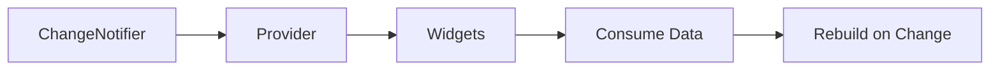

## 8.2.4 Provider Package

State management is a crucial aspect of building robust and scalable Flutter applications. Among the various state management solutions available, the `provider` package stands out for its simplicity and ease of use. In this section, we will delve into the `provider` package, exploring how it facilitates the management and propagation of application state. We'll cover the installation process, setting up `ChangeNotifier` classes, providing data to the widget tree, and consuming and reacting to changes in state. By the end of this section, you'll have a solid understanding of how to leverage the `provider` package to manage state effectively in your Flutter applications.

### Understanding the Provider Package

The `provider` package is a wrapper around InheritedWidgets, making it easier to manage and propagate state throughout your Flutter application. It allows you to separate your business logic from the UI, making your code more maintainable and testable. The `provider` package is particularly useful for managing global state, such as user authentication status, theme settings, or any other data that needs to be accessed by multiple widgets in the widget tree.

### Installing the Provider Package

To get started with the `provider` package, you first need to add it to your project's dependencies. Open your `pubspec.yaml` file and add the following line under `dependencies`:

```yaml
dependencies:
  flutter:
    sdk: flutter
  provider: ^6.0.0
```

After adding the dependency, run `flutter pub get` in your terminal to install the package.

### Setting Up ChangeNotifier Classes

The `ChangeNotifier` class is a simple way to manage state in Flutter. It provides a mechanism to notify listeners when the state changes. To use `ChangeNotifier`, you need to create a class that extends it. Here's an example of a simple counter class:

```dart
import 'package:flutter/foundation.dart';

class Counter with ChangeNotifier {
  int _count = 0;

  int get count => _count;

  void increment() {
    _count++;
    notifyListeners();
  }
}
```

In this example, the `Counter` class has a private `_count` variable and a public getter `count`. The `increment` method increases the count and calls `notifyListeners()`, which triggers a rebuild of any listening widgets.

### Providing Data to the Widget Tree

To make the `Counter` class available to the widget tree, you need to use a `ChangeNotifierProvider`. This provider should be placed above the widgets that need access to the `Counter` instance. Typically, you would set this up in the `main` function:

```dart
import 'package:flutter/material.dart';
import 'package:provider/provider.dart';
import 'counter.dart'; // Import the Counter class

void main() {
  runApp(
    ChangeNotifierProvider(
      create: (context) => Counter(),
      child: MyApp(),
    ),
  );
}

class MyApp extends StatelessWidget {
  @override
  Widget build(BuildContext context) {
    return MaterialApp(
      home: CounterScreen(),
    );
  }
}
```

In this setup, the `ChangeNotifierProvider` creates an instance of `Counter` and provides it to the widget tree. The `MyApp` widget is the root of the application, and `CounterScreen` is where we will consume the `Counter` data.

### Consuming and Reacting to Changes in State

To consume the `Counter` data and react to changes, you can use the `Consumer` widget. The `Consumer` widget listens for changes in the `Counter` instance and rebuilds its child whenever the `Counter` notifies listeners:

```dart
class CounterScreen extends StatelessWidget {
  @override
  Widget build(BuildContext context) {
    return Scaffold(
      appBar: AppBar(title: Text('Provider Example')),
      body: Center(
        child: Consumer<Counter>(
          builder: (context, counter, child) => Text('Count: ${counter.count}'),
        ),
      ),
      floatingActionButton: FloatingActionButton(
        onPressed: () => Provider.of<Counter>(context, listen: false).increment(),
        child: Icon(Icons.add),
      ),
    );
  }
}
```

In this example, the `Consumer` widget rebuilds the `Text` widget whenever the `Counter`'s state changes. The `FloatingActionButton` increments the counter without listening for changes, hence `listen: false` is used.

### Practical Example: Building a Simple Counter App

Let's walk through a practical example of building a simple counter app using the `provider` package. This example will demonstrate how to set up the provider, consume data, and update state.

#### Step 1: Create the Counter Class

First, create a new Dart file named `counter.dart` and define the `Counter` class as shown earlier.

#### Step 2: Set Up the Provider

In your `main.dart` file, set up the `ChangeNotifierProvider` as described in the "Providing Data to the Widget Tree" section.

#### Step 3: Build the UI

Create a new widget named `CounterScreen` and use the `Consumer` widget to display the counter value. Add a `FloatingActionButton` to increment the counter.

```dart
class CounterScreen extends StatelessWidget {
  @override
  Widget build(BuildContext context) {
    return Scaffold(
      appBar: AppBar(title: Text('Provider Example')),
      body: Center(
        child: Consumer<Counter>(
          builder: (context, counter, child) => Text('Count: ${counter.count}'),
        ),
      ),
      floatingActionButton: FloatingActionButton(
        onPressed: () => Provider.of<Counter>(context, listen: false).increment(),
        child: Icon(Icons.add),
      ),
    );
  }
}
```

#### Step 4: Run the App

Run your app using `flutter run`. You should see a simple interface with a counter value and a button to increment the count.

### Understanding the Flow with a Diagram

To better understand how the `provider` package works, let's visualize the flow using a Mermaid.js diagram:



- **ChangeNotifier**: The `Counter` class extends `ChangeNotifier`, allowing it to notify listeners of state changes.
- **Provider**: The `ChangeNotifierProvider` makes the `Counter` instance available to the widget tree.
- **Widgets**: Widgets like `Consumer` access the `Counter` data.
- **Consume Data**: The `Consumer` widget listens for changes and consumes the data.
- **Rebuild on Change**: When the `Counter` state changes, the `Consumer` widget rebuilds, updating the UI.

### Best Practices and Common Pitfalls

- **Avoid Overusing Providers**: While the `provider` package is powerful, avoid using too many providers in your widget tree. This can lead to performance issues and make your code harder to maintain.
- **Use `listen: false` When Necessary**: If a widget only needs to perform an action without reacting to state changes, use `listen: false` to avoid unnecessary rebuilds.
- **Keep Business Logic Separate**: Use `ChangeNotifier` classes to encapsulate business logic, keeping your UI code clean and focused on presentation.
- **Test Your Providers**: Write unit tests for your `ChangeNotifier` classes to ensure that state changes are handled correctly.

### Further Exploration and Resources

To deepen your understanding of the `provider` package and state management in Flutter, consider exploring the following resources:

- [Flutter Documentation on Provider](https://flutter.dev/docs/development/data-and-backend/state-mgmt/simple)
- [Provider Package on Pub.dev](https://pub.dev/packages/provider)
- [State Management in Flutter: Official Guide](https://flutter.dev/docs/development/data-and-backend/state-mgmt/intro)
- [Flutter Community: State Management](https://flutter.dev/community)

### Conclusion

The `provider` package is a versatile and efficient solution for state management in Flutter applications. By separating business logic from UI code, it enhances the maintainability and scalability of your app. With the knowledge gained in this section, you can confidently implement the `provider` package in your projects, ensuring a clean and responsive user experience.

---

## Quiz Time!



### What is the primary purpose of the `provider` package in Flutter?

- [x] To manage and propagate application state efficiently
- [ ] To handle network requests
- [ ] To create animations
- [ ] To manage database connections

> **Explanation:** The `provider` package is primarily used for managing and propagating application state efficiently in Flutter applications.

### How do you notify widgets of state changes in a `ChangeNotifier` class?

- [x] By calling `notifyListeners()`
- [ ] By using `setState()`
- [ ] By calling `updateWidgets()`
- [ ] By using `refreshUI()`

> **Explanation:** In a `ChangeNotifier` class, you call `notifyListeners()` to notify widgets of state changes.

### Which widget is used to listen for changes in a `ChangeNotifier` and rebuild its child?

- [x] `Consumer`
- [ ] `Provider`
- [ ] `Listener`
- [ ] `Observer`

> **Explanation:** The `Consumer` widget listens for changes in a `ChangeNotifier` and rebuilds its child when notified.

### What is the role of `ChangeNotifierProvider` in the `provider` package?

- [x] To provide an instance of a `ChangeNotifier` to the widget tree
- [ ] To create a new widget
- [ ] To manage network requests
- [ ] To handle animations

> **Explanation:** `ChangeNotifierProvider` provides an instance of a `ChangeNotifier` to the widget tree, making it accessible to descendant widgets.

### When should you use `listen: false` with the `Provider.of` method?

- [x] When you want to perform an action without reacting to state changes
- [ ] When you want to listen for state changes
- [ ] When you want to update the UI
- [ ] When you want to create a new provider

> **Explanation:** Use `listen: false` with the `Provider.of` method when you want to perform an action without reacting to state changes.

### What is a common pitfall when using the `provider` package?

- [x] Overusing providers in the widget tree
- [ ] Not using enough providers
- [ ] Using providers for network requests
- [ ] Using providers for animations

> **Explanation:** A common pitfall is overusing providers in the widget tree, which can lead to performance issues and make the code harder to maintain.

### How do you add the `provider` package to your Flutter project?

- [x] By adding `provider: ^6.0.0` to the `pubspec.yaml` file
- [ ] By importing it in the Dart file
- [ ] By installing it via the terminal
- [ ] By downloading it from the internet

> **Explanation:** You add the `provider` package to your Flutter project by adding `provider: ^6.0.0` to the `pubspec.yaml` file and running `flutter pub get`.

### What is the benefit of separating business logic from UI code using the `provider` package?

- [x] It makes the code more maintainable and testable
- [ ] It makes the UI more colorful
- [ ] It improves network performance
- [ ] It reduces app size

> **Explanation:** Separating business logic from UI code using the `provider` package makes the code more maintainable and testable.

### Which method in the `ChangeNotifier` class triggers a rebuild of listening widgets?

- [x] `notifyListeners()`
- [ ] `setState()`
- [ ] `updateUI()`
- [ ] `refreshWidgets()`

> **Explanation:** The `notifyListeners()` method in the `ChangeNotifier` class triggers a rebuild of listening widgets.

### True or False: The `provider` package can only be used for global state management.

- [ ] True
- [x] False

> **Explanation:** False. The `provider` package can be used for both global and local state management in Flutter applications.


