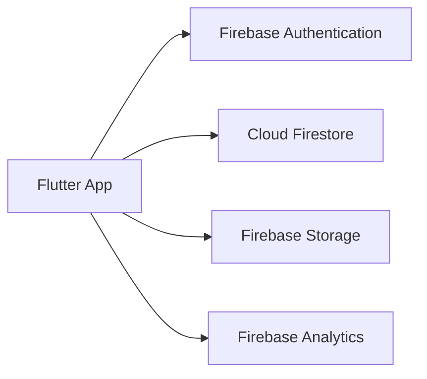

## 8.3.1 What Is Firebase?

In the ever-evolving landscape of mobile app development, Firebase emerges as a pivotal tool for developers seeking to build robust applications without the overhead of managing backend infrastructure. Firebase, a comprehensive Backend-as-a-Service (BaaS) platform provided by Google, offers a suite of services designed to streamline the development process, enhance app functionality, and improve user engagement. This section delves into the core aspects of Firebase, its integration with Flutter, and the myriad benefits it brings to the table.

### Overview of Firebase Services

Firebase is not just a single service but a collection of tools that cater to various backend needs. Here's a breakdown of some of the key services Firebase offers:

- **Firebase Authentication**: Simplifies the process of user authentication by providing ready-to-use UI libraries and SDKs for email/password, phone number, and social media logins (Google, Facebook, Twitter, etc.).

- **Cloud Firestore**: A scalable, flexible database for storing and syncing data in real-time across all connected clients. It supports offline access, ensuring seamless user experience even when connectivity is intermittent.

- **Firebase Realtime Database**: A cloud-hosted NoSQL database that allows data to be stored and synchronized in real-time across all clients. It is particularly useful for applications that require live updates.

- **Firebase Storage**: Provides secure file uploads and downloads for user-generated content such as photos and videos. It integrates seamlessly with Firebase Authentication to control access.

- **Firebase Analytics**: Offers insights into user behavior and engagement with detailed reports and dashboards. It helps in making informed decisions to enhance user experience and app performance.

- **Firebase Cloud Messaging (FCM)**: Enables developers to send notifications and messages to users across platforms, enhancing user engagement and retention.

- **Firebase Hosting**: A fast and secure web hosting service for static and dynamic content, including HTML, CSS, JavaScript, and media files.

- **Firebase Functions**: Allows developers to run backend code in response to events triggered by Firebase features and HTTPS requests, enabling serverless application logic.

- **Firebase Crashlytics**: Provides real-time crash reporting and analytics to help developers track, prioritize, and fix stability issues.

### Benefits of Using Firebase with Flutter

Integrating Firebase with Flutter offers a powerful combination that enhances the capabilities of mobile applications. Here are some of the benefits:

- **Seamless Integration**: Firebase provides official plugins for Flutter, ensuring smooth integration and reducing the complexity of connecting your app to backend services.

- **Rapid Development**: With Firebase handling backend services, developers can focus on building and refining the app's frontend, significantly reducing time-to-market.

- **Scalability**: Firebase services are designed to scale automatically, accommodating growing user bases without the need for additional infrastructure management.

- **Cross-Platform Support**: Firebase supports both Android and iOS platforms, allowing developers to build cross-platform apps with a single codebase using Flutter.

- **Real-Time Capabilities**: Services like Cloud Firestore and Realtime Database enable real-time data synchronization, which is crucial for applications requiring live updates, such as chat apps or collaborative tools.

- **Security and Compliance**: Firebase provides robust security features, including authentication and data encryption, ensuring that user data is protected and compliant with industry standards.

### Common Use Cases

Firebase's versatility makes it suitable for a wide range of applications. Here are some common use cases:

- **User Authentication**: Implementing secure and reliable user authentication is a breeze with Firebase Authentication. It supports various authentication methods, making it easy to integrate into any app.

- **Real-Time Databases**: Apps that require real-time data updates, such as chat applications, collaborative tools, or live dashboards, benefit greatly from Firebase's real-time database capabilities.

- **Cloud Storage**: For apps that handle large amounts of user-generated content, such as photo-sharing or video-streaming apps, Firebase Storage provides a scalable and secure solution.

- **Analytics and User Engagement**: Firebase Analytics helps developers understand user behavior, track app performance, and make data-driven decisions to enhance user engagement.

- **Push Notifications**: Firebase Cloud Messaging allows developers to send targeted notifications to users, improving engagement and retention.

### Overview of Firebase Pricing and Scalability

Firebase offers a flexible pricing model that caters to both small-scale projects and large enterprises. Here's a brief overview:

- **Free Tier**: Firebase provides a generous free tier that includes access to most services with certain usage limits. This is ideal for small projects or prototyping.

- **Pay-As-You-Go**: For larger projects, Firebase offers a pay-as-you-go pricing model, allowing developers to scale their usage based on demand. This model ensures that you only pay for what you use, making it cost-effective for growing applications.

- **Scalability**: Firebase services are built on Google's infrastructure, ensuring high availability and the ability to scale seamlessly as your user base grows. This eliminates the need for manual scaling and infrastructure management.

### Visualizing Firebase Integration with Flutter

To better understand how Firebase integrates with a Flutter app, consider the following diagram:

This diagram illustrates a typical setup where a Flutter app leverages multiple Firebase services to enhance its functionality. Each service plays a crucial role in providing a comprehensive backend solution.

### Conclusion

Firebase is a powerful tool that simplifies the backend development process, allowing developers to focus on building feature-rich applications. Its seamless integration with Flutter makes it an ideal choice for mobile app developers looking to leverage robust backend services without the hassle of managing infrastructure. Whether you're building a simple app or a complex enterprise solution, Firebase offers the tools and scalability needed to succeed.

For further exploration, consider diving into Firebase's official documentation, exploring open-source projects that utilize Firebase, or taking online courses to deepen your understanding of Firebase and its capabilities.

## Quiz Time!



### What is Firebase?

- [x] A comprehensive Backend-as-a-Service platform by Google
- [ ] A frontend framework for building mobile apps
- [ ] A database management system
- [ ] A cloud storage service

> **Explanation:** Firebase is a Backend-as-a-Service (BaaS) platform provided by Google, offering a range of services for app development.

### Which Firebase service is used for user authentication?

- [x] Firebase Authentication
- [ ] Cloud Firestore
- [ ] Firebase Storage
- [ ] Firebase Analytics

> **Explanation:** Firebase Authentication is the service used for managing user authentication in apps.

### What is Cloud Firestore?

- [x] A scalable, flexible database for real-time data synchronization
- [ ] A service for sending push notifications
- [ ] A tool for crash reporting
- [ ] A cloud storage solution

> **Explanation:** Cloud Firestore is a NoSQL database that allows for real-time data synchronization across clients.

### Which Firebase service provides real-time crash reporting?

- [x] Firebase Crashlytics
- [ ] Firebase Analytics
- [ ] Firebase Functions
- [ ] Firebase Hosting

> **Explanation:** Firebase Crashlytics offers real-time crash reporting and analytics to help developers track and fix stability issues.

### What is the primary benefit of using Firebase with Flutter?

- [x] Seamless integration and rapid development
- [ ] Increased complexity in app development
- [ ] Limited scalability
- [ ] Manual infrastructure management

> **Explanation:** Firebase integrates seamlessly with Flutter, allowing for rapid development and reducing complexity.

### Which Firebase service is used for storing and syncing data in real-time?

- [x] Cloud Firestore
- [ ] Firebase Storage
- [ ] Firebase Functions
- [ ] Firebase Hosting

> **Explanation:** Cloud Firestore is used for storing and syncing data in real-time across connected clients.

### What is Firebase's pricing model?

- [x] Free tier and pay-as-you-go
- [ ] Subscription-based only
- [ ] One-time payment
- [ ] Free for all services

> **Explanation:** Firebase offers a free tier with usage limits and a pay-as-you-go model for larger projects.

### Which service allows for secure file uploads and downloads?

- [x] Firebase Storage
- [ ] Firebase Authentication
- [ ] Cloud Firestore
- [ ] Firebase Analytics

> **Explanation:** Firebase Storage provides secure file uploads and downloads for user-generated content.

### What is Firebase Cloud Messaging used for?

- [x] Sending notifications and messages to users
- [ ] Managing user authentication
- [ ] Hosting web content
- [ ] Analyzing user behavior

> **Explanation:** Firebase Cloud Messaging is used for sending notifications and messages to users across platforms.

### True or False: Firebase supports both Android and iOS platforms.

- [x] True
- [ ] False

> **Explanation:** Firebase supports both Android and iOS platforms, allowing for cross-platform app development.


