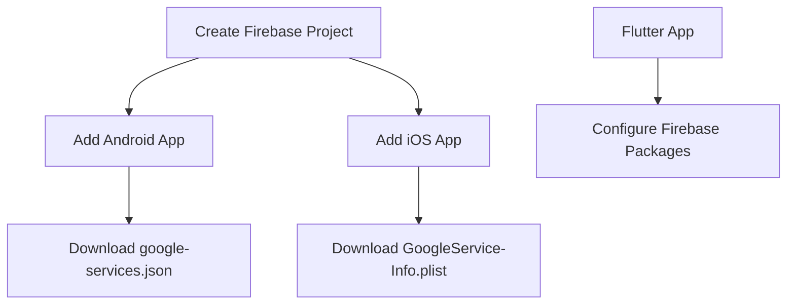

## 8.3.2 Setting Up Firebase

Integrating Firebase into your Flutter application can significantly enhance its capabilities by providing robust backend services such as authentication, real-time databases, cloud storage, and more. This section will guide you through the process of setting up Firebase for both Android and iOS platforms, ensuring your Flutter app is ready to leverage these powerful features.

### Creating a Firebase Project

Before you can integrate Firebase with your Flutter app, you need to create a Firebase project. This project acts as a container for your app's Firebase services.

1. **Access the Firebase Console:**
   - Navigate to the [Firebase Console](https://console.firebase.google.com/).
   - Sign in with your Google account if you haven't already.

2. **Create a New Project:**
   - Click on "Add Project" or "Create a Project."
   - Enter a name for your project. This name will help you identify your project in the Firebase Console.
   - (Optional) Enable Google Analytics for your project. This can provide insights into user behavior and app performance.
   - Click "Create Project" and wait for the setup to complete.

3. **Access Your Project Dashboard:**
   - Once your project is created, click "Continue" to access the Firebase project dashboard.

### Adding Android and iOS Apps to Firebase

With your Firebase project ready, the next step is to add your Android and iOS applications to it. This involves configuring Firebase to recognize your app and provide the necessary configuration files.

#### Adding an Android App

1. **Register Your App:**
   - In the Firebase Console, click on the Android icon to add an Android app.
   - Enter your Android package name. This should match the `applicationId` in your `app-level build.gradle` file.
   - (Optional) Provide a nickname for your app and the SHA-1 key for Google Sign-In and other services.
   - Click "Register App."

2. **Download `google-services.json`:**
   - After registering your app, download the `google-services.json` file.
   - Place this file in the `android/app` directory of your Flutter project.

3. **Configure Your Android Project:**
   - Open the `android/build.gradle` file and add the Google services classpath:
     ```gradle
     dependencies {
         classpath 'com.google.gms:google-services:4.3.10'
     }
     ```
   - In the `android/app/build.gradle` file, apply the Google services plugin at the bottom:
     ```gradle
     apply plugin: 'com.google.gms.google-services'
     ```

#### Adding an iOS App

1. **Register Your App:**
   - In the Firebase Console, click on the iOS icon to add an iOS app.
   - Enter your iOS bundle ID. This should match the `PRODUCT_BUNDLE_IDENTIFIER` in your Xcode project.
   - (Optional) Provide a nickname for your app and the App Store ID.
   - Click "Register App."

2. **Download `GoogleService-Info.plist`:**
   - After registering your app, download the `GoogleService-Info.plist` file.
   - Add this file to the `ios/Runner` directory of your Flutter project using Xcode.

3. **Configure Your iOS Project:**
   - Open your `ios/Runner.xcworkspace` in Xcode.
   - Ensure that `GoogleService-Info.plist` is included in your project by dragging it into the Xcode project navigator.

### Installing Firebase SDKs in Flutter

With your Firebase project set up and your apps registered, the next step is to install the necessary Firebase SDKs in your Flutter project.

1. **Update `pubspec.yaml`:**
   - Open the `pubspec.yaml` file in your Flutter project.
   - Add the following dependencies:
     ```yaml
     dependencies:
       firebase_core: ^2.0.0
       firebase_auth: ^4.0.0
       cloud_firestore: ^4.0.0
     ```

2. **Install the Packages:**
   - Run the following command in your terminal to install the packages:
     ```bash
     flutter pub get
     ```

3. **Initialize Firebase in Your Flutter App:**
   - Open your `lib/main.dart` file.
   - Import the `firebase_core` package and initialize Firebase in the `main` function:
     ```dart
     import 'package:flutter/material.dart';
     import 'package:firebase_core/firebase_core.dart';

     void main() async {
       WidgetsFlutterBinding.ensureInitialized();
       await Firebase.initializeApp();
       runApp(MyApp());
     }

     class MyApp extends StatelessWidget {
       @override
       Widget build(BuildContext context) {
         return MaterialApp(
           home: Scaffold(
             appBar: AppBar(title: Text('Firebase Setup')),
             body: Center(child: Text('Firebase is initialized')),
           ),
         );
       }
     }
     ```

### Visualizing the Setup Process

To better understand the setup process, refer to the following diagram that outlines the steps involved in integrating Firebase with your Flutter app:



### Best Practices and Common Pitfalls

- **Ensure Correct Package Names:** Double-check that the package names and bundle IDs match those in your Firebase Console and your Flutter project configuration files.
- **Keep Configuration Files Secure:** Do not expose your `google-services.json` and `GoogleService-Info.plist` files in public repositories.
- **Regularly Update Firebase SDKs:** Keep your Firebase SDKs up to date to benefit from the latest features and security patches.
- **Test on Real Devices:** While emulators are useful, always test Firebase functionalities on real devices to ensure compatibility and performance.

### Additional Resources

- [Firebase Documentation](https://firebase.google.com/docs/flutter/setup)
- [FlutterFire GitHub Repository](https://github.com/FirebaseExtended/flutterfire)
- [Google Developers Codelabs](https://codelabs.developers.google.com/)

By following these steps, you can successfully set up Firebase for your Flutter application, enabling you to leverage its powerful backend services. As you continue to develop your app, consider exploring additional Firebase features such as Cloud Functions, Firebase Analytics, and more to enhance your app's capabilities.

## Quiz Time!



### Which of the following is the first step in setting up Firebase for a Flutter app?

- [x] Create a Firebase project in the Firebase Console.
- [ ] Download `google-services.json`.
- [ ] Add Firebase SDKs to `pubspec.yaml`.
- [ ] Initialize Firebase in the Flutter app.

> **Explanation:** The first step is to create a Firebase project in the Firebase Console, which acts as a container for your app's Firebase services.

### What file is required for configuring Firebase in an Android app?

- [x] `google-services.json`
- [ ] `GoogleService-Info.plist`
- [ ] `firebase-config.json`
- [ ] `android-config.xml`

> **Explanation:** The `google-services.json` file is required for configuring Firebase in an Android app.

### What command is used to install Firebase packages in a Flutter project?

- [x] `flutter pub get`
- [ ] `flutter install`
- [ ] `flutter packages get`
- [ ] `flutter setup`

> **Explanation:** The `flutter pub get` command is used to install packages listed in the `pubspec.yaml` file.

### Where should the `GoogleService-Info.plist` file be placed in an iOS Flutter project?

- [x] `ios/Runner`
- [ ] `ios/App`
- [ ] `ios/Config`
- [ ] `ios/Resources`

> **Explanation:** The `GoogleService-Info.plist` file should be placed in the `ios/Runner` directory of your Flutter project.

### Which of the following dependencies is NOT typically added for Firebase integration in Flutter?

- [x] `flutter_test`
- [ ] `firebase_core`
- [ ] `firebase_auth`
- [ ] `cloud_firestore`

> **Explanation:** `flutter_test` is not related to Firebase integration; it is used for testing Flutter apps.

### What is the purpose of the `firebase_core` package in a Flutter project?

- [x] To initialize Firebase in the Flutter app.
- [ ] To handle user authentication.
- [ ] To manage cloud storage.
- [ ] To provide analytics services.

> **Explanation:** The `firebase_core` package is used to initialize Firebase in the Flutter app.

### What should you do if your Firebase configuration files are exposed in a public repository?

- [x] Regenerate the configuration files and update your project.
- [ ] Ignore it, as it is not a security risk.
- [ ] Share the repository link with others.
- [ ] Delete the repository immediately.

> **Explanation:** If your Firebase configuration files are exposed, you should regenerate them to prevent unauthorized access to your Firebase project.

### Which file should be modified to apply the Google services plugin in an Android Flutter project?

- [x] `android/app/build.gradle`
- [ ] `android/build.gradle`
- [ ] `android/settings.gradle`
- [ ] `android/gradle.properties`

> **Explanation:** The `android/app/build.gradle` file should be modified to apply the Google services plugin.

### What is the role of the `cloud_firestore` package in a Flutter project?

- [x] To interact with Firestore databases.
- [ ] To manage user authentication.
- [ ] To provide cloud storage.
- [ ] To handle real-time messaging.

> **Explanation:** The `cloud_firestore` package is used to interact with Firestore databases in a Flutter project.

### True or False: It is safe to commit `google-services.json` to a public GitHub repository.

- [ ] True
- [x] False

> **Explanation:** It is not safe to commit `google-services.json` to a public repository as it contains sensitive information about your Firebase project.


