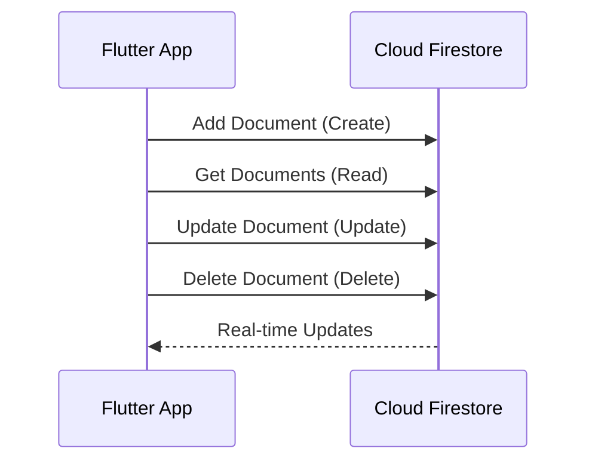

## 8.3.3 Firestore Database Basics

In the evolving landscape of mobile app development, Cloud Firestore emerges as a powerful, flexible, and scalable NoSQL cloud database solution. It is designed to handle the complexities of real-time data synchronization and offline support, making it an ideal choice for modern applications. In this section, we will delve into the basics of Cloud Firestore, explore its data model, and demonstrate how to perform CRUD operations using Flutter. By the end of this chapter, you'll have a solid understanding of how to leverage Firestore in your Flutter projects.

### Understanding Firestore's Structure

Firestore is structured around two main concepts: **collections** and **documents**. This hierarchical data model allows for efficient data organization and retrieval.

- **Collections**: These are containers for documents. Collections can contain any number of documents, and they can also contain subcollections, allowing for nested data structures.
- **Documents**: These are individual records within a collection. Each document is identified by a unique ID and contains fields that map to values. Documents can store various data types, including strings, numbers, booleans, arrays, and even maps.

#### Example Structure

Consider a simple app that manages user profiles. You might have a `users` collection, where each document represents a user:

```
users (Collection)
  ├── userId1 (Document)
  │   ├── name: "Alice"
  │   ├── age: 30
  │   └── email: "alice@example.com"
  ├── userId2 (Document)
  │   ├── name: "Bob"
  │   ├── age: 25
  │   └── email: "bob@example.com"
  └── ...
```

This structure allows you to efficiently query and manage user data.

### Setting Up Firestore in Flutter

Before you can use Firestore in your Flutter app, you need to set up Firebase and integrate Firestore. Follow these steps:

1. **Create a Firebase Project**: Go to the [Firebase Console](https://console.firebase.google.com/) and create a new project.

2. **Add Firebase to Your Flutter App**:
   - Register your app with Firebase by providing the package name.
   - Download the `google-services.json` file for Android and place it in the `android/app` directory.
   - For iOS, download the `GoogleService-Info.plist` file and add it to the `Runner` project in Xcode.

3. **Add Firebase and Firestore Dependencies**:
   Update your `pubspec.yaml` file to include the necessary dependencies:

   ```yaml
   dependencies:
     flutter:
       sdk: flutter
     firebase_core: ^latest_version
     cloud_firestore: ^latest_version
   ```

4. **Initialize Firebase**:
   Initialize Firebase in your `main.dart` file:

   ```dart
   import 'package:flutter/material.dart';
   import 'package:firebase_core/firebase_core.dart';

   void main() async {
     WidgetsFlutterBinding.ensureInitialized();
     await Firebase.initializeApp();
     runApp(MyApp());
   }

   class MyApp extends StatelessWidget {
     @override
     Widget build(BuildContext context) {
       return MaterialApp(
         home: Scaffold(
           appBar: AppBar(title: Text('Firestore Example')),
           body: Center(child: Text('Welcome to Firestore')),
         ),
       );
     }
   }
   ```

### Performing CRUD Operations

Firestore supports CRUD operations, which are essential for managing data in your app. Let's explore each operation with practical examples.

#### Create: Adding Documents

To add a document to a collection, use the `set` method. Here's how you can add a new user to the `users` collection:

```dart
import 'package:cloud_firestore/cloud_firestore.dart';

final FirebaseFirestore _firestore = FirebaseFirestore.instance;

Future<void> addUser(String userId, String name, int age) async {
  await _firestore.collection('users').doc(userId).set({
    'name': name,
    'age': age,
  });
}
```

This code creates a new document with the specified `userId` and sets the `name` and `age` fields.

#### Read: Retrieving Documents

To read data from Firestore, you can use the `get` method for one-time reads or `snapshots` for real-time updates. Here's an example of retrieving all users:

```dart
Stream<QuerySnapshot> getUsers() {
  return _firestore.collection('users').snapshots();
}
```

This function returns a stream of snapshots, allowing you to listen for real-time updates.

#### Update: Modifying Documents

To update an existing document, use the `update` method. Here's how you can update a user's age:

```dart
Future<void> updateUserAge(String userId, int newAge) async {
  await _firestore.collection('users').doc(userId).update({
    'age': newAge,
  });
}
```

This code updates the `age` field of the specified user document.

#### Delete: Removing Documents

To delete a document, use the `delete` method. Here's an example of deleting a user:

```dart
Future<void> deleteUser(String userId) async {
  await _firestore.collection('users').doc(userId).delete();
}
```

This code removes the document with the specified `userId` from the `users` collection.

### Real-Time Listeners and Data Streams

One of Firestore's powerful features is its ability to provide real-time data synchronization. By using streams, you can listen for changes in your data and update the UI accordingly.

#### Example: Listening for User Changes

Here's how you can set up a real-time listener for the `users` collection:

```dart
void listenToUserChanges() {
  _firestore.collection('users').snapshots().listen((snapshot) {
    for (var doc in snapshot.docs) {
      print('User: ${doc.data()}');
    }
  });
}
```

This code listens for changes in the `users` collection and prints the updated data whenever a change occurs.

### Visualizing Firestore Operations

To better understand the interaction between your Flutter app and Firestore, consider the following sequence diagram:



This diagram illustrates the typical flow of CRUD operations and real-time updates between your app and Firestore.

### Best Practices and Considerations

- **Security Rules**: Always configure Firestore security rules to protect your data. Use Firebase Authentication to manage user access.
- **Data Modeling**: Plan your data structure carefully to optimize for query performance and scalability.
- **Offline Support**: Firestore provides offline support by caching data locally. Ensure your app handles offline scenarios gracefully.
- **Error Handling**: Implement robust error handling to manage network issues and Firestore exceptions.

### Additional Resources

To deepen your understanding of Firestore and its integration with Flutter, consider exploring the following resources:

- [Firestore Documentation](https://firebase.google.com/docs/firestore)
- [FlutterFire Documentation](https://firebase.flutter.dev/docs/overview)
- [Firebase Security Rules](https://firebase.google.com/docs/rules)
- [Firestore Data Modeling Guide](https://firebase.google.com/docs/firestore/manage-data/structure-data)

### Conclusion

Cloud Firestore is a versatile and powerful database solution that seamlessly integrates with Flutter. By mastering its basic operations and understanding its real-time capabilities, you can build dynamic and responsive applications. As you continue to explore Firestore, remember to consider best practices for security, data modeling, and offline support to ensure your app is robust and scalable.

## Quiz Time!



### What is the primary data model used by Firestore?

- [x] Collections and Documents
- [ ] Tables and Rows
- [ ] Nodes and Edges
- [ ] Keys and Values

> **Explanation:** Firestore uses a hierarchical data model based on collections and documents, allowing for flexible and scalable data organization.

### How do you add a new document to a Firestore collection in Flutter?

- [x] Using the `set` method on a document reference
- [ ] Using the `insert` method on a collection reference
- [ ] Using the `add` method on a document reference
- [ ] Using the `create` method on a collection reference

> **Explanation:** The `set` method is used to add or overwrite a document in a Firestore collection.

### Which method is used to listen for real-time updates in Firestore?

- [x] `snapshots`
- [ ] `get`
- [ ] `listen`
- [ ] `stream`

> **Explanation:** The `snapshots` method returns a stream that provides real-time updates whenever the data changes.

### What is the purpose of Firestore security rules?

- [x] To control access to your Firestore data
- [ ] To improve query performance
- [ ] To manage offline data caching
- [ ] To synchronize data across devices

> **Explanation:** Firestore security rules are used to define who can access or modify your data, ensuring data protection.

### Which of the following is a benefit of using Firestore's real-time capabilities?

- [x] Instant UI updates when data changes
- [x] Reduced server load due to fewer requests
- [ ] Increased data storage capacity
- [ ] Improved app startup time

> **Explanation:** Firestore's real-time capabilities allow for instant UI updates and can reduce server load by minimizing the need for frequent data requests.

### What is a common use case for Firestore's offline support?

- [x] Allowing users to access data without an internet connection
- [ ] Improving app launch speed
- [ ] Enhancing data encryption
- [ ] Reducing app size

> **Explanation:** Firestore's offline support caches data locally, enabling users to access and interact with data even when offline.

### How can you update a specific field in a Firestore document?

- [x] Using the `update` method on a document reference
- [ ] Using the `modify` method on a collection reference
- [ ] Using the `set` method with merge option
- [ ] Using the `change` method on a document reference

> **Explanation:** The `update` method is used to modify specific fields in an existing Firestore document.

### What is the role of Firebase Authentication in Firestore?

- [x] To manage user access and authentication
- [ ] To improve data retrieval speed
- [ ] To enhance data visualization
- [ ] To synchronize data across devices

> **Explanation:** Firebase Authentication is used to manage user identities and control access to Firestore data.

### Which Firestore feature helps in optimizing data retrieval?

- [x] Indexing
- [ ] Caching
- [ ] Sharding
- [ ] Replication

> **Explanation:** Indexing in Firestore helps optimize data retrieval by allowing efficient querying of data.

### True or False: Firestore can only be used with Firebase Authentication.

- [ ] True
- [x] False

> **Explanation:** While Firebase Authentication is commonly used with Firestore for managing user access, Firestore can be used independently or with other authentication methods.


