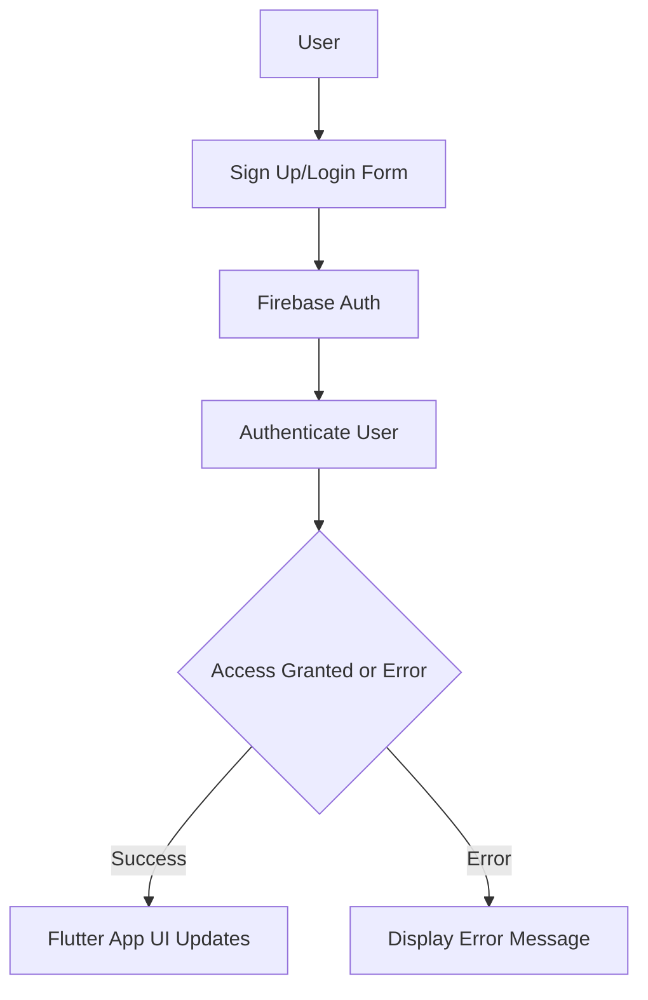

## 8.3.4 Authentication Services

In the realm of mobile app development, managing user authentication is a critical component that ensures secure access to your application. Firebase Authentication provides a robust and flexible service that simplifies the process of authenticating users across various platforms. In this section, we will delve into the different authentication methods supported by Firebase, with a focus on implementing email/password authentication in Flutter. We will also explore how to handle authentication states and errors effectively.

### Overview of Firebase Authentication Methods

Firebase Authentication supports a variety of authentication methods, allowing developers to choose the most suitable option for their application. Here are some of the key methods:

- **Email/Password Authentication**: This is the most common form of authentication, where users sign up and log in using their email address and a password.
- **Google Sign-In**: Allows users to authenticate using their Google account, providing a seamless login experience.
- **Facebook Login**: Enables users to sign in with their Facebook credentials, leveraging the social network's authentication system.
- **Anonymous Authentication**: Allows users to access your app without creating an account, useful for trial or guest access.
- **Other Providers**: Firebase also supports authentication via other providers like Twitter, GitHub, and Apple.

Each of these methods has its own use cases and benefits, and Firebase makes it easy to integrate them into your Flutter app.

### Setting Up Email/Password Authentication

To get started with Firebase Authentication in your Flutter app, you'll need to set up Firebase in your project. This involves creating a Firebase project and configuring your app to use Firebase services.

#### Step 1: Create a Firebase Project

1. Go to the [Firebase Console](https://console.firebase.google.com/).
2. Click on "Add project" and follow the prompts to create a new project.
3. Once your project is created, navigate to the "Authentication" section in the Firebase Console.
4. Enable the "Email/Password" sign-in method.

#### Step 2: Add Firebase to Your Flutter App

1. Add the `firebase_core` and `firebase_auth` packages to your `pubspec.yaml` file:

   ```yaml
   dependencies:
     flutter:
       sdk: flutter
     firebase_core: latest_version
     firebase_auth: latest_version
   ```

2. Run `flutter pub get` to install the packages.

3. Initialize Firebase in your app. In your `main.dart` file, ensure Firebase is initialized before running the app:

   ```dart
   import 'package:flutter/material.dart';
   import 'package:firebase_core/firebase_core.dart';

   void main() async {
     WidgetsFlutterBinding.ensureInitialized();
     await Firebase.initializeApp();
     runApp(MyApp());
   }
   ```

### Implementing Sign-Up and Login Flows

With Firebase Authentication set up, you can now implement the sign-up and login flows in your Flutter app.

#### Sign-Up Flow

The sign-up process involves creating a new user account using an email and password. Here's a basic implementation:

```dart
import 'package:firebase_auth/firebase_auth.dart';

final FirebaseAuth _auth = FirebaseAuth.instance;

Future<User?> signUp(String email, String password) async {
  try {
    UserCredential userCredential = await _auth.createUserWithEmailAndPassword(
      email: email,
      password: password,
    );
    return userCredential.user;
  } catch (e) {
    print('Error during sign-up: $e');
    return null;
  }
}
```

#### Login Flow

The login process allows existing users to access their accounts using their email and password:

```dart
Future<User?> signIn(String email, String password) async {
  try {
    UserCredential userCredential = await _auth.signInWithEmailAndPassword(
      email: email,
      password: password,
    );
    return userCredential.user;
  } catch (e) {
    print('Error during sign-in: $e');
    return null;
  }
}
```

### Handling Authentication States and Errors

Managing authentication states and handling errors are crucial for providing a smooth user experience.

#### Authentication State

Firebase provides a way to listen to authentication state changes, allowing your app to respond accordingly:

```dart
Stream<User?> authStateChanges() {
  return _auth.authStateChanges();
}
```

You can use this stream to update your app's UI based on whether the user is signed in or not.

#### Error Handling

When implementing authentication, it's important to handle potential errors, such as invalid credentials or network issues. Here’s an example of handling errors during sign-in:

```dart
Future<User?> signIn(String email, String password) async {
  try {
    UserCredential userCredential = await _auth.signInWithEmailAndPassword(
      email: email,
      password: password,
    );
    return userCredential.user;
  } on FirebaseAuthException catch (e) {
    if (e.code == 'user-not-found') {
      print('No user found for that email.');
    } else if (e.code == 'wrong-password') {
      print('Wrong password provided.');
    }
    return null;
  } catch (e) {
    print('Error during sign-in: $e');
    return null;
  }
}
```

### Practical Example: Building a Simple Authentication UI

Let's create a simple Flutter app with a basic authentication UI that allows users to sign up and log in using email and password.

#### Step 1: Create the UI

Create a new Flutter widget for the authentication screen:

```dart
import 'package:flutter/material.dart';

class AuthScreen extends StatefulWidget {
  @override
  _AuthScreenState createState() => _AuthScreenState();
}

class _AuthScreenState extends State<AuthScreen> {
  final TextEditingController _emailController = TextEditingController();
  final TextEditingController _passwordController = TextEditingController();

  @override
  Widget build(BuildContext context) {
    return Scaffold(
      appBar: AppBar(title: Text('Authentication')),
      body: Padding(
        padding: const EdgeInsets.all(16.0),
        child: Column(
          children: [
            TextField(
              controller: _emailController,
              decoration: InputDecoration(labelText: 'Email'),
            ),
            TextField(
              controller: _passwordController,
              decoration: InputDecoration(labelText: 'Password'),
              obscureText: true,
            ),
            SizedBox(height: 20),
            ElevatedButton(
              onPressed: () async {
                // Call sign-up or sign-in function here
              },
              child: Text('Sign Up'),
            ),
            ElevatedButton(
              onPressed: () async {
                // Call sign-in function here
              },
              child: Text('Sign In'),
            ),
          ],
        ),
      ),
    );
  }
}
```

#### Step 2: Integrate Authentication Logic

Integrate the sign-up and sign-in functions into the UI:

```dart
ElevatedButton(
  onPressed: () async {
    User? user = await signUp(_emailController.text, _passwordController.text);
    if (user != null) {
      print('Sign-up successful: ${user.email}');
    }
  },
  child: Text('Sign Up'),
),
ElevatedButton(
  onPressed: () async {
    User? user = await signIn(_emailController.text, _passwordController.text);
    if (user != null) {
      print('Sign-in successful: ${user.email}');
    }
  },
  child: Text('Sign In'),
),
```

### Visualizing the Authentication Flow

To better understand the authentication flow, let's use a Mermaid.js diagram to illustrate the process:



### Best Practices and Common Pitfalls

- **Secure Password Storage**: Always ensure that passwords are stored securely and never hard-coded in your app.
- **Error Feedback**: Provide clear and user-friendly error messages to guide users in case of authentication failures.
- **State Management**: Use state management solutions like Provider or Riverpod to manage authentication states efficiently.
- **Testing**: Thoroughly test authentication flows to ensure they handle all edge cases and provide a seamless user experience.

### Additional Resources

- [Firebase Authentication Documentation](https://firebase.google.com/docs/auth)
- [FlutterFire Documentation](https://firebase.flutter.dev/)
- [Official Flutter Documentation](https://flutter.dev/docs)

### Conclusion

Firebase Authentication offers a powerful and flexible solution for managing user authentication in your Flutter apps. By leveraging its various authentication methods and handling authentication states and errors effectively, you can provide a secure and seamless user experience. As you continue to explore Firebase and Flutter, consider experimenting with different authentication providers and integrating advanced features like multi-factor authentication.

## Quiz Time!



### What is Firebase Authentication?

- [x] A service that simplifies user management and authentication.
- [ ] A database service for storing user data.
- [ ] A tool for building user interfaces.
- [ ] A cloud storage solution for media files.

> **Explanation:** Firebase Authentication is a service that simplifies user management and authentication across various platforms.

### Which of the following is NOT a supported authentication method in Firebase?

- [ ] Email/Password
- [ ] Google Sign-In
- [ ] Facebook Login
- [x] Blockchain Authentication

> **Explanation:** Firebase does not support Blockchain Authentication as a method. It supports methods like Email/Password, Google Sign-In, and Facebook Login.

### What is the purpose of the `authStateChanges()` method in Firebase?

- [x] To listen for changes in the authentication state of the user.
- [ ] To update the user's email address.
- [ ] To reset the user's password.
- [ ] To delete the user's account.

> **Explanation:** The `authStateChanges()` method is used to listen for changes in the authentication state of the user, allowing the app to respond accordingly.

### How can you handle errors during sign-in with Firebase Authentication?

- [x] By using a try-catch block and checking for specific error codes.
- [ ] By ignoring the errors and proceeding with the sign-in.
- [ ] By displaying a generic error message without details.
- [ ] By logging the user out immediately.

> **Explanation:** Handling errors during sign-in involves using a try-catch block to catch exceptions and checking for specific error codes to provide appropriate feedback.

### What is the first step in setting up Firebase Authentication in a Flutter app?

- [x] Creating a Firebase project in the Firebase Console.
- [ ] Writing the authentication logic in Dart.
- [ ] Designing the user interface for authentication.
- [ ] Testing the authentication flows.

> **Explanation:** The first step is to create a Firebase project in the Firebase Console and enable the desired authentication methods.

### Which package is essential for integrating Firebase Authentication in a Flutter app?

- [x] `firebase_auth`
- [ ] `flutter_secure_storage`
- [ ] `http`
- [ ] `provider`

> **Explanation:** The `firebase_auth` package is essential for integrating Firebase Authentication in a Flutter app.

### What is the role of the `FirebaseAuth.instance` in the authentication process?

- [x] It provides access to the Firebase Authentication API for performing authentication operations.
- [ ] It stores user credentials locally on the device.
- [ ] It manages the app's database connections.
- [ ] It handles network requests for the app.

> **Explanation:** `FirebaseAuth.instance` provides access to the Firebase Authentication API, allowing the app to perform authentication operations like sign-up and sign-in.

### What should you do if a user enters an incorrect password during sign-in?

- [x] Display an error message indicating the password is incorrect.
- [ ] Automatically reset the user's password.
- [ ] Lock the user's account permanently.
- [ ] Allow the user to proceed with the sign-in.

> **Explanation:** If a user enters an incorrect password, you should display an error message indicating the issue, allowing them to try again.

### Why is it important to handle authentication states in a Flutter app?

- [x] To update the app's UI based on whether the user is signed in or not.
- [ ] To store user data securely on the device.
- [ ] To improve the app's performance.
- [ ] To reduce the app's memory usage.

> **Explanation:** Handling authentication states is important to update the app's UI based on whether the user is signed in or not, providing a seamless user experience.

### True or False: Firebase Authentication can only be used for mobile apps.

- [ ] True
- [x] False

> **Explanation:** False. Firebase Authentication can be used for both mobile and web applications, providing a unified authentication solution across platforms.


