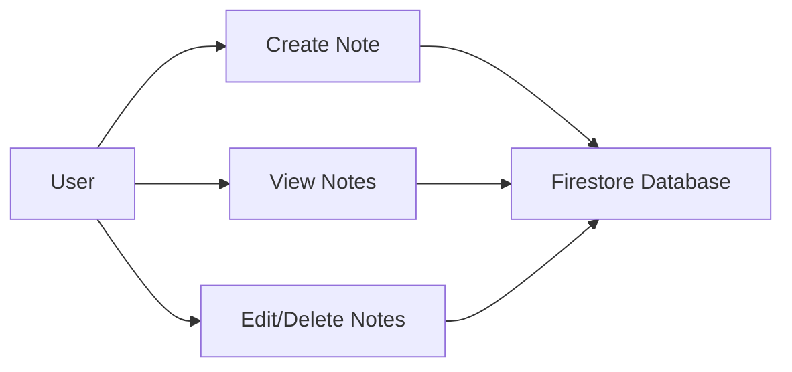

## 8.4.1 Project Overview

In this section, we embark on an exciting journey to build a Notes App using Flutter, leveraging Firebase for cloud storage. This project will not only enhance your understanding of Flutter's capabilities but also introduce you to the powerful cloud services offered by Firebase. By the end of this project, you will have a fully functional app capable of creating, reading, updating, and deleting notes, with data stored securely in the cloud. Additionally, you will implement user authentication to ensure that each user's notes are private and accessible only to them.

### Project Objectives and Features

The primary objective of this project is to create a robust and user-friendly Notes App that utilizes Firebase for backend services. Here are the key features we aim to implement:

- **User Authentication**: Allow users to sign up, log in, and log out using Firebase Authentication. This ensures that each user's data is secure and private.
- **Create Notes**: Users can create new notes with a title and body. These notes will be stored in Firebase Firestore, a NoSQL cloud database.
- **Read Notes**: Retrieve and display a list of notes from Firestore, allowing users to view their saved notes.
- **Update Notes**: Enable users to edit existing notes, with changes reflected in the cloud database.
- **Delete Notes**: Provide functionality for users to delete notes they no longer need, ensuring the database remains organized and clutter-free.

### Overview of Technologies and Packages Used

To achieve the objectives outlined above, we will utilize several technologies and packages:

- **Flutter**: The primary framework for building the app's user interface. Flutter's widget-based architecture allows for rapid development and a seamless user experience.
- **Firebase**: A comprehensive suite of cloud services that will power our app's backend. We will specifically use:
  - **Firebase Authentication**: To manage user sign-in and sign-out processes.
  - **Cloud Firestore**: To store and retrieve notes data.
- **Provider Package**: A popular state management solution in Flutter that will help manage app state efficiently, particularly when dealing with asynchronous data from Firebase.

### Expected Learning Outcomes

By completing this project, you will gain valuable skills and insights, including:

- **Understanding Firebase Integration**: Learn how to set up and configure Firebase services within a Flutter app, including authentication and Firestore.
- **CRUD Operations with Firestore**: Master the implementation of create, read, update, and delete operations using Firestore's powerful API.
- **State Management with Provider**: Understand how to manage app state effectively using the Provider package, ensuring a responsive and dynamic user interface.
- **User Authentication**: Gain experience in implementing secure user authentication, a critical component of many modern apps.
- **Cloud Storage Best Practices**: Learn best practices for storing and retrieving data from the cloud, ensuring scalability and reliability.

### Visualizing the App Workflow

To better understand the flow of our Notes App, let's visualize the interactions between the user, the app, and Firebase services using a Mermaid.js diagram:



In this diagram, the user can perform various actions such as creating, viewing, editing, and deleting notes. Each of these actions interacts with the Firestore Database, where the notes are stored. This visual representation helps clarify the app's architecture and the role of Firebase in managing data.

### Practical Code Examples and Snippets

As we progress through the project, we'll provide practical code examples to illustrate key concepts. Here's a simple example of how you might initialize Firebase in your Flutter app:

```dart
import 'package:firebase_core/firebase_core.dart';

void main() async {
  WidgetsFlutterBinding.ensureInitialized();
  await Firebase.initializeApp();
  runApp(MyApp());
}
```

In this snippet, we ensure that Firebase is initialized before running the app. This is a crucial step to access Firebase services throughout the app.

### Real-World Scenarios and Best Practices

In real-world applications, handling user data securely and efficiently is paramount. Here are some best practices to consider:

- **Secure Authentication**: Always use secure methods for user authentication. Firebase Authentication provides robust security features, but it's essential to follow best practices, such as using strong passwords and enabling two-factor authentication if possible.
- **Efficient Data Retrieval**: When retrieving data from Firestore, use queries to fetch only the necessary data. This reduces bandwidth usage and improves app performance.
- **Error Handling**: Implement comprehensive error handling to manage potential issues, such as network failures or authentication errors. Providing clear feedback to users enhances the overall user experience.

### Encouraging Hands-On Practice

As you work through this project, we encourage you to experiment with the code and explore additional features. Consider these mini-exercises:

- **Extend the App**: Add a feature to categorize notes, allowing users to organize their notes into different categories.
- **Explore Firebase Functions**: Implement server-side logic using Firebase Functions to automate tasks, such as sending notifications when a note is updated.
- **Enhance UI/UX**: Improve the app's user interface by incorporating animations or custom themes, making the app more visually appealing.

### References and Additional Resources

To deepen your understanding of the concepts covered in this project, consider exploring the following resources:

- [Flutter Documentation](https://flutter.dev/docs): The official Flutter documentation provides comprehensive guides and tutorials.
- [Firebase Documentation](https://firebase.google.com/docs): Explore Firebase's extensive documentation to learn more about its services and capabilities.
- [Provider Package](https://pub.dev/packages/provider): Learn more about the Provider package and its role in state management.

### Conclusion

Building a Notes App with cloud storage using Flutter and Firebase is an excellent way to enhance your app development skills. By integrating Firebase services, you'll gain experience in managing cloud-based data and user authentication, both of which are essential components of modern mobile applications. As you progress through this project, remember to experiment, explore additional features, and apply best practices to create a robust and user-friendly app.

## Quiz Time!



### What is the primary objective of the Notes App project?

- [x] To create a Notes App using Flutter and Firebase for cloud storage.
- [ ] To build a game using Flutter.
- [ ] To develop a social media app.
- [ ] To create a weather forecasting app.

> **Explanation:** The primary objective is to create a Notes App using Flutter and Firebase for cloud storage.

### Which Firebase service is used for user authentication in the Notes App?

- [x] Firebase Authentication
- [ ] Firebase Realtime Database
- [ ] Firebase Hosting
- [ ] Firebase Analytics

> **Explanation:** Firebase Authentication is used to manage user sign-in and sign-out processes.

### What type of database is used to store notes in the Notes App?

- [x] Cloud Firestore
- [ ] SQLite
- [ ] MySQL
- [ ] Firebase Realtime Database

> **Explanation:** Cloud Firestore is used to store and retrieve notes data.

### Which package is used for state management in the Notes App?

- [x] Provider
- [ ] Redux
- [ ] Bloc
- [ ] Riverpod

> **Explanation:** The Provider package is used for state management in the Notes App.

### What are the CRUD operations implemented in the Notes App?

- [x] Create, Read, Update, Delete
- [ ] Copy, Rename, Upload, Download
- [ ] Connect, Retrieve, Upload, Delete
- [ ] Create, Remove, Update, Display

> **Explanation:** CRUD stands for Create, Read, Update, and Delete operations.

### What is the purpose of the `Firebase.initializeApp()` function in the app?

- [x] To initialize Firebase services before running the app.
- [ ] To create a new Firebase project.
- [ ] To update the Firebase SDK.
- [ ] To delete Firebase data.

> **Explanation:** `Firebase.initializeApp()` initializes Firebase services before running the app.

### Which of the following is a best practice for retrieving data from Firestore?

- [x] Use queries to fetch only the necessary data.
- [ ] Retrieve all data at once.
- [ ] Use a separate database for each user.
- [ ] Store data locally instead of using Firestore.

> **Explanation:** Using queries to fetch only the necessary data reduces bandwidth usage and improves app performance.

### What is a potential extension feature for the Notes App?

- [x] Categorizing notes into different categories.
- [ ] Adding a weather forecasting feature.
- [ ] Implementing a chat system.
- [ ] Creating a music player.

> **Explanation:** Categorizing notes into different categories is a potential extension feature for the Notes App.

### Which of the following is NOT a feature of the Notes App?

- [x] Real-time chat functionality
- [ ] User authentication
- [ ] Creating and deleting notes
- [ ] Storing notes in the cloud

> **Explanation:** Real-time chat functionality is not a feature of the Notes App.

### True or False: The Notes App project includes implementing server-side logic using Firebase Functions.

- [x] True
- [ ] False

> **Explanation:** Implementing server-side logic using Firebase Functions is suggested as an extension feature for the Notes App.


