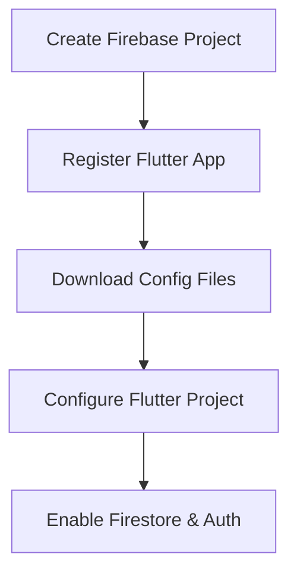

## 8.4.2 Setting Up Firebase Project

In this section, we will guide you through the process of setting up a Firebase project for your Flutter Notes App. Firebase provides a suite of tools and services that can significantly enhance your app's capabilities, including real-time databases, authentication, and analytics. By the end of this guide, you will have a Firebase project configured to support cloud storage and user authentication for your app.

### Creating a New Firebase Project

The first step in integrating Firebase with your Flutter app is to create a new Firebase project. This project will serve as the backend for your Notes App, providing cloud storage and authentication services.

1. **Sign in to Firebase Console:**
   - Navigate to the [Firebase Console](https://console.firebase.google.com/).
   - Sign in with your Google account. If you don't have one, you'll need to create it.

2. **Create a New Project:**
   - Click on the "Add Project" button.
   - Enter a name for your project, such as "NotesApp".
   - (Optional) Choose whether to enable Google Analytics for your project. This can be useful for tracking user engagement and app performance.
   - Click "Create Project" and wait for Firebase to set up your project.

3. **Access the Project Dashboard:**
   - Once the project is created, click "Continue" to access the Firebase project dashboard.

### Registering the Flutter App with Firebase

After creating the Firebase project, the next step is to register your Flutter app with Firebase. This involves adding your app to the Firebase project and downloading the necessary configuration files.

1. **Add an App to Your Project:**
   - In the Firebase console, click on the Android or iOS icon to add a new app.
   - For Android:
     - Enter the Android package name (e.g., `com.example.notesapp`).
     - Provide an app nickname (optional) and the SHA-1 key (optional, but recommended for authentication).
   - For iOS:
     - Enter the iOS bundle ID (e.g., `com.example.notesapp`).
     - Provide an app nickname (optional).

2. **Download Configuration Files:**
   - For Android, download the `google-services.json` file.
   - For iOS, download the `GoogleService-Info.plist` file.

3. **Add Configuration Files to Your Flutter Project:**
   - Place the `google-services.json` file in the `android/app` directory of your Flutter project.
   - Place the `GoogleService-Info.plist` file in the `ios/Runner` directory.

### Configuring Platform-Specific Files

Correct configuration of platform-specific files is crucial for Firebase services to function properly in your app.

1. **Android Configuration:**
   - Open the `android/build.gradle` file and add the following line to the `dependencies` section:
     ```gradle
     classpath 'com.google.gms:google-services:4.3.10'
     ```
   - In the `android/app/build.gradle` file, add the following at the bottom:
     ```gradle
     apply plugin: 'com.google.gms.google-services'
     ```

2. **iOS Configuration:**
   - Open the `ios/Runner.xcworkspace` in Xcode.
   - Right-click on the `Runner` project and select "Add Files to 'Runner'".
   - Add the `GoogleService-Info.plist` file to the project.

### Enabling Firestore and Authentication Services

With your app registered and configuration files in place, the next step is to enable the necessary Firebase services.

1. **Enable Firestore:**
   - In the Firebase console, navigate to the "Firestore Database" section.
   - Click "Create Database".
   - Choose "Start in Test Mode" for initial development (ensure to switch to "Production Mode" before deploying your app).
   - Click "Next" and select a location for your database.

2. **Enable Authentication:**
   - Navigate to the "Authentication" section in the Firebase console.
   - Click "Get Started".
   - Enable the sign-in methods you wish to use (e.g., Email/Password, Google Sign-In).

### Visualizing the Setup Process

To better understand the setup process, refer to the following diagram:



### Best Practices and Common Pitfalls

- **Security Rules:** Always configure security rules for Firestore and Authentication to protect user data.
- **Environment Separation:** Use different Firebase projects for development and production environments to prevent accidental data loss or exposure.
- **Configuration Management:** Keep your configuration files secure and avoid committing them to version control systems.

### Conclusion

Setting up Firebase for your Flutter Notes App is a critical step in leveraging cloud storage and authentication services. By following the steps outlined in this guide, you will have a robust backend setup that can scale with your app's needs. Remember to explore Firebase's extensive documentation and community resources for further learning and troubleshooting.

### Additional Resources

- [Firebase Documentation](https://firebase.google.com/docs)
- [FlutterFire GitHub Repository](https://github.com/FirebaseExtended/flutterfire)
- [Google Cloud Platform](https://cloud.google.com/)

## Quiz Time!



### What is the first step in setting up Firebase for a Flutter app?

- [x] Create a new Firebase project
- [ ] Download configuration files
- [ ] Register the app with Firebase
- [ ] Enable Firestore

> **Explanation:** The first step is to create a new Firebase project, which serves as the backend for your app.

### Where should the `google-services.json` file be placed in a Flutter project?

- [x] `android/app` directory
- [ ] `ios/Runner` directory
- [ ] `lib` directory
- [ ] `android/build` directory

> **Explanation:** The `google-services.json` file should be placed in the `android/app` directory for Android configuration.

### What is the purpose of the `GoogleService-Info.plist` file?

- [x] It configures Firebase services for iOS apps
- [ ] It configures Firebase services for Android apps
- [ ] It stores user authentication data
- [ ] It is used for Firestore database configuration

> **Explanation:** The `GoogleService-Info.plist` file configures Firebase services for iOS apps.

### Which Firebase service should be enabled to store user-generated notes?

- [x] Firestore
- [ ] Authentication
- [ ] Analytics
- [ ] Cloud Functions

> **Explanation:** Firestore is used to store and manage user-generated notes in the cloud.

### What should you do before deploying your app to production?

- [x] Switch Firestore to "Production Mode"
- [ ] Enable test mode for Firestore
- [ ] Disable authentication
- [ ] Remove configuration files

> **Explanation:** Before deploying, switch Firestore to "Production Mode" to ensure data security.

### Why is it important to configure platform-specific files correctly?

- [x] To ensure Firebase services function properly
- [ ] To reduce app size
- [ ] To improve app performance
- [ ] To enable offline capabilities

> **Explanation:** Correct configuration of platform-specific files is crucial for Firebase services to function properly.

### What is a common pitfall when setting up Firebase?

- [x] Not configuring security rules
- [ ] Using multiple Firebase projects
- [ ] Enabling too many services
- [ ] Not using Google Analytics

> **Explanation:** Not configuring security rules can lead to data breaches and unauthorized access.

### How can you manage different environments in Firebase?

- [x] Use separate Firebase projects for development and production
- [ ] Use the same Firebase project for all environments
- [ ] Disable certain services in production
- [ ] Use environment variables

> **Explanation:** Using separate Firebase projects for development and production helps manage different environments effectively.

### What is the role of the `apply plugin: 'com.google.gms.google-services'` line in `build.gradle`?

- [x] It integrates Firebase services with the Android app
- [ ] It reduces app build time
- [ ] It enables offline capabilities
- [ ] It configures app permissions

> **Explanation:** This line integrates Firebase services with the Android app by applying the necessary plugin.

### True or False: You should commit your Firebase configuration files to version control.

- [ ] True
- [x] False

> **Explanation:** Firebase configuration files should not be committed to version control to prevent unauthorized access to your Firebase project.


