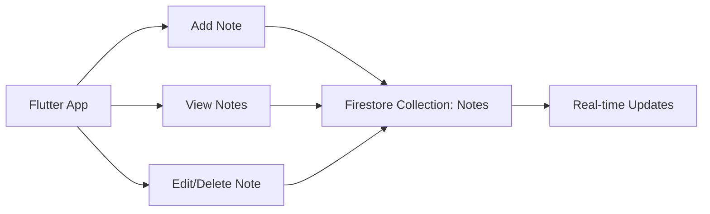

## 8.4.3 Implementing Cloud Firestore

In this section, we will delve into integrating Cloud Firestore into your Flutter Notes App. Cloud Firestore is a flexible, scalable database for mobile, web, and server development from Firebase and Google Cloud Platform. It offers seamless integration with Flutter, allowing you to build powerful, real-time applications. This guide will walk you through setting up Firestore security rules, structuring your database, and implementing CRUD (Create, Read, Update, Delete) operations. By the end of this section, you'll have a fully functional notes app that leverages the power of Cloud Firestore.

### Setting Up Firestore Security Rules

Before diving into the code, it's crucial to understand Firestore security rules. These rules determine who can access or modify your data. Properly configured rules ensure that your app is secure and that users can only access their own data.

#### Defining Firestore Security Rules

Firestore security rules are written in a JSON-like syntax. Here's a basic example to get you started:

```json
service cloud.firestore {
  match /databases/{database}/documents {
    match /notes/{noteId} {
      allow read, write: if request.auth != null;
    }
  }
}
```

- **Explanation:**
  - The above rules allow read and write access to the `notes` collection only if the user is authenticated (`request.auth != null`).
  - You can further refine these rules to restrict access based on user roles or specific fields.

#### Best Practices for Security Rules

- **Principle of Least Privilege:** Grant the minimum permissions necessary.
- **Test Thoroughly:** Use the Firestore emulator to test your rules before deploying.
- **Keep It Simple:** Complex rules are harder to maintain and more prone to errors.

### Structuring the Firestore Database for Notes

A well-structured database is key to efficient data retrieval and management. For our notes app, we'll use a simple collection-document model.

#### Database Structure

- **Collection:** `notes`
  - **Document Fields:**
    - `title`: String
    - `content`: String

This structure allows us to store each note as a document within the `notes` collection.

### Implementing CRUD Operations

Now that we have our database structure and security rules in place, let's implement the CRUD operations.

#### Creating a Note

To add a new note to Firestore, we'll use the `add` method, which automatically generates a unique ID for each document.

```dart
// Firestore note model
class Note {
  String id;
  String title;
  String content;

  Note({
    required this.id,
    required this.title,
    required this.content,
  });

  Map<String, dynamic> toMap() {
    return {
      'title': title,
      'content': content,
    };
  }

  factory Note.fromMap(String id, Map<String, dynamic> map) {
    return Note(
      id: id,
      title: map['title'],
      content: map['content'],
    );
  }
}

// Adding a note
Future<void> addNote(Note note) async {
  await FirebaseFirestore.instance.collection('notes').add(note.toMap());
}
```

- **Explanation:**
  - The `Note` class represents a note with an `id`, `title`, and `content`.
  - The `addNote` function converts a `Note` object to a map and adds it to the `notes` collection.

#### Reading Notes

To fetch notes from Firestore, we'll use a stream to listen for real-time updates.

```dart
// Fetching notes
Stream<List<Note>> getNotes() {
  return FirebaseFirestore.instance
      .collection('notes')
      .snapshots()
      .map((snapshot) => snapshot.docs
          .map((doc) => Note.fromMap(doc.id, doc.data()))
          .toList());
}
```

- **Explanation:**
  - The `getNotes` function returns a stream of `Note` objects.
  - It listens to changes in the `notes` collection and maps each document to a `Note` object.

#### Updating a Note

To update an existing note, we'll use the `update` method with the document's ID.

```dart
// Updating a note
Future<void> updateNote(Note note) async {
  await FirebaseFirestore.instance
      .collection('notes')
      .doc(note.id)
      .update(note.toMap());
}
```

- **Explanation:**
  - The `updateNote` function updates the fields of a note document identified by its `id`.

#### Deleting a Note

To delete a note, we'll use the `delete` method with the document's ID.

```dart
// Deleting a note
Future<void> deleteNote(String id) async {
  await FirebaseFirestore.instance.collection('notes').doc(id).delete();
}
```

- **Explanation:**
  - The `deleteNote` function removes a note document from the `notes` collection using its `id`.

### Handling Real-Time Updates with Firestore Streams

Firestore streams provide real-time data synchronization, which is ideal for applications that require live updates.

#### Implementing Real-Time Updates

The `getNotes` function we implemented earlier already uses a stream to provide real-time updates. This means any changes to the `notes` collection (additions, updates, deletions) will automatically reflect in your app.

#### Practical Example: Displaying Notes in a Flutter App

Let's see how we can display these notes in a Flutter app using a `StreamBuilder`.

```dart
import 'package:flutter/material.dart';
import 'package:cloud_firestore/cloud_firestore.dart';

class NotesList extends StatelessWidget {
  @override
  Widget build(BuildContext context) {
    return StreamBuilder<List<Note>>(
      stream: getNotes(),
      builder: (context, snapshot) {
        if (snapshot.connectionState == ConnectionState.waiting) {
          return CircularProgressIndicator();
        }
        if (!snapshot.hasData || snapshot.data!.isEmpty) {
          return Text('No notes available');
        }
        final notes = snapshot.data!;
        return ListView.builder(
          itemCount: notes.length,
          itemBuilder: (context, index) {
            final note = notes[index];
            return ListTile(
              title: Text(note.title),
              subtitle: Text(note.content),
            );
          },
        );
      },
    );
  }
}
```

- **Explanation:**
  - The `StreamBuilder` widget listens to the `getNotes` stream.
  - It rebuilds the UI whenever the stream emits a new event, ensuring the notes list is always up-to-date.

### Visualizing the Workflow

To better understand the flow of data and operations, here's a visual representation using Mermaid.js:



- **Explanation:**
  - The diagram illustrates how the Flutter app interacts with the Firestore collection for adding, viewing, editing, and deleting notes.
  - Real-time updates ensure that any changes in the Firestore collection are immediately reflected in the app.

### Best Practices and Common Pitfalls

- **Optimize Data Structure:** Keep your data structure simple and flat to optimize query performance.
- **Use Indexes Wisely:** Firestore automatically indexes fields, but you can create composite indexes for complex queries.
- **Handle Network Latency:** Implement offline persistence to ensure your app remains functional without an internet connection.
- **Monitor Usage:** Keep an eye on your Firestore usage to avoid unexpected costs.

### Further Resources

- **Official Documentation:** [Firestore Documentation](https://firebase.google.com/docs/firestore)
- **FlutterFire Plugins:** [FlutterFire GitHub](https://github.com/FirebaseExtended/flutterfire)
- **Online Courses:** Consider courses on platforms like Udemy or Coursera for in-depth learning.
- **Community Forums:** Engage with the Flutter and Firebase communities on platforms like Stack Overflow and Reddit.

### Summary

In this section, we've covered how to integrate Cloud Firestore into your Flutter Notes App. We've explored setting up security rules, structuring the database, and implementing CRUD operations with real-time updates. By following these steps, you can build a robust, scalable notes app that leverages the power of Cloud Firestore.

## Quiz Time!



### What is the primary purpose of Firestore security rules?

- [x] To control access to the database
- [ ] To optimize database performance
- [ ] To manage database indexes
- [ ] To provide real-time updates

> **Explanation:** Firestore security rules are used to control access to the database, ensuring that only authorized users can read or write data.


### Which method is used to add a new document to a Firestore collection?

- [ ] update
- [ ] delete
- [x] add
- [ ] set

> **Explanation:** The `add` method is used to add a new document to a Firestore collection, automatically generating a unique ID.


### How can you listen for real-time updates in Firestore?

- [ ] Using HTTP requests
- [x] Using Firestore streams
- [ ] Using WebSockets
- [ ] Using polling

> **Explanation:** Firestore streams provide real-time updates by listening to changes in the database and emitting new events.


### What is the purpose of the `toMap` method in the Note class?

- [ ] To delete a note
- [x] To convert a Note object to a map
- [ ] To update a note
- [ ] To fetch a note

> **Explanation:** The `toMap` method converts a Note object to a map, which is necessary for storing it in Firestore.


### Which widget is used to display real-time data from Firestore in a Flutter app?

- [ ] FutureBuilder
- [x] StreamBuilder
- [ ] ListView
- [ ] Column

> **Explanation:** The `StreamBuilder` widget is used to display real-time data from Firestore by listening to a stream and rebuilding the UI when new data is available.


### What is the role of the `snapshots` method in Firestore?

- [ ] To delete documents
- [ ] To update documents
- [x] To listen for real-time updates
- [ ] To add documents

> **Explanation:** The `snapshots` method is used to listen for real-time updates in a Firestore collection or document.


### How do you update an existing document in Firestore?

- [ ] Using the `add` method
- [x] Using the `update` method
- [ ] Using the `delete` method
- [ ] Using the `get` method

> **Explanation:** The `update` method is used to modify the fields of an existing document in Firestore.


### What is a common use case for Firestore streams?

- [ ] Batch processing
- [ ] Offline data storage
- [x] Real-time data synchronization
- [ ] Data encryption

> **Explanation:** Firestore streams are commonly used for real-time data synchronization, allowing apps to reflect changes immediately.


### Which of the following is a best practice for Firestore security rules?

- [x] Grant the minimum permissions necessary
- [ ] Allow all users to read and write
- [ ] Use complex rules for all collections
- [ ] Avoid testing rules before deployment

> **Explanation:** Granting the minimum permissions necessary is a best practice to ensure security and prevent unauthorized access.


### True or False: Firestore automatically indexes all fields in a document.

- [x] True
- [ ] False

> **Explanation:** Firestore automatically indexes all fields in a document, which helps in efficient querying and retrieval of data.


