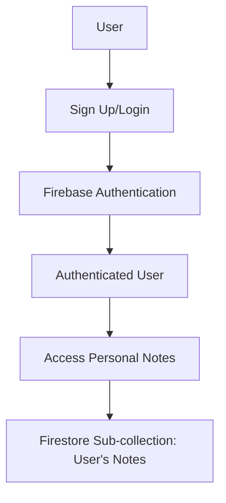

## 8.4.4 Authenticating Users

In this section, we will delve into implementing user authentication for your Notes App using Firebase. Authentication is crucial for ensuring that each user's notes are secure and private. By the end of this chapter, you will have a fully functional authentication system that allows users to sign up, log in, and manage their notes securely.

### Overview

User authentication is a fundamental aspect of modern applications, providing a secure way to manage user access and data. In this project, we will use Firebase Authentication to handle user sign-up and login processes. Additionally, we will integrate Firestore to store notes specific to authenticated users, ensuring that each user's data is isolated and secure.

### Setting Up Firebase Authentication

Before diving into the implementation, ensure that your Firebase project is set up and integrated with your Flutter app. If you haven't done this yet, refer to the earlier section on setting up Firebase.

#### Adding Firebase Authentication to Your Project

1. **Add Firebase Authentication Package**: First, include the Firebase Authentication package in your `pubspec.yaml` file.

   ```yaml
   dependencies:
     flutter:
       sdk: flutter
     firebase_auth: ^3.1.6
     cloud_firestore: ^3.1.6
   ```

2. **Initialize Firebase**: Ensure Firebase is initialized in your `main.dart` file.

   ```dart
   import 'package:firebase_core/firebase_core.dart';
   import 'package:flutter/material.dart';

   void main() async {
     WidgetsFlutterBinding.ensureInitialized();
     await Firebase.initializeApp();
     runApp(MyApp());
   }
   ```

### Creating Authentication UI

The first step in implementing authentication is to create the user interface for sign-up and login forms. These forms will allow users to enter their credentials and access their notes.

#### Sign-Up Form

Create a simple sign-up form where users can enter their email and password to create an account.

```dart
class SignUpScreen extends StatefulWidget {
  @override
  _SignUpScreenState createState() => _SignUpScreenState();
}

class _SignUpScreenState extends State<SignUpScreen> {
  final TextEditingController _emailController = TextEditingController();
  final TextEditingController _passwordController = TextEditingController();
  final AuthService _authService = AuthService();

  @override
  Widget build(BuildContext context) {
    return Scaffold(
      appBar: AppBar(title: Text('Sign Up')),
      body: Padding(
        padding: const EdgeInsets.all(16.0),
        child: Column(
          children: [
            TextField(
              controller: _emailController,
              decoration: InputDecoration(labelText: 'Email'),
            ),
            TextField(
              controller: _passwordController,
              decoration: InputDecoration(labelText: 'Password'),
              obscureText: true,
            ),
            ElevatedButton(
              onPressed: () async {
                User? user = await _authService.signUp(
                  _emailController.text,
                  _passwordController.text,
                );
                if (user != null) {
                  // Navigate to the notes screen
                }
              },
              child: Text('Sign Up'),
            ),
          ],
        ),
      ),
    );
  }
}
```

#### Login Form

Similarly, create a login form for existing users to access their accounts.

```dart
class LoginScreen extends StatefulWidget {
  @override
  _LoginScreenState createState() => _LoginScreenState();
}

class _LoginScreenState extends State<LoginScreen> {
  final TextEditingController _emailController = TextEditingController();
  final TextEditingController _passwordController = TextEditingController();
  final AuthService _authService = AuthService();

  @override
  Widget build(BuildContext context) {
    return Scaffold(
      appBar: AppBar(title: Text('Login')),
      body: Padding(
        padding: const EdgeInsets.all(16.0),
        child: Column(
          children: [
            TextField(
              controller: _emailController,
              decoration: InputDecoration(labelText: 'Email'),
            ),
            TextField(
              controller: _passwordController,
              decoration: InputDecoration(labelText: 'Password'),
              obscureText: true,
            ),
            ElevatedButton(
              onPressed: () async {
                User? user = await _authService.signIn(
                  _emailController.text,
                  _passwordController.text,
                );
                if (user != null) {
                  // Navigate to the notes screen
                }
              },
              child: Text('Login'),
            ),
          ],
        ),
      ),
    );
  }
}
```

### Implementing Firebase Authentication Logic

With the UI in place, the next step is to implement the logic for handling user authentication using Firebase.

#### AuthService Class

Create an `AuthService` class to encapsulate the authentication logic. This class will handle sign-up, login, and sign-out operations.

```dart
import 'package:firebase_auth/firebase_auth.dart';

class AuthService {
  final FirebaseAuth _auth = FirebaseAuth.instance;

  // Sign up with email and password
  Future<User?> signUp(String email, String password) async {
    try {
      UserCredential result = await _auth.createUserWithEmailAndPassword(
          email: email, password: password);
      return result.user;
    } catch (e) {
      print(e);
      return null;
    }
  }

  // Sign in with email and password
  Future<User?> signIn(String email, String password) async {
    try {
      UserCredential result = await _auth.signInWithEmailAndPassword(
          email: email, password: password);
      return result.user;
    } catch (e) {
      print(e);
      return null;
    }
  }

  // Sign out
  Future<void> signOut() async {
    await _auth.signOut();
  }

  // Auth state changes
  Stream<User?> get user {
    return _auth.authStateChanges();
  }
}
```

### Managing User Sessions and Authentication States

Handling user sessions and authentication states is crucial for providing a seamless user experience. You can use the `authStateChanges` stream to listen for changes in the authentication state and update the UI accordingly.

#### Listening to Authentication State

In your main widget, listen to the authentication state to determine whether to show the login screen or the notes screen.

```dart
class MyApp extends StatelessWidget {
  @override
  Widget build(BuildContext context) {
    return StreamBuilder<User?>(
      stream: AuthService().user,
      builder: (context, snapshot) {
        if (snapshot.connectionState == ConnectionState.active) {
          User? user = snapshot.data;
          if (user == null) {
            return MaterialApp(home: LoginScreen());
          }
          return MaterialApp(home: NotesScreen());
        } else {
          return CircularProgressIndicator();
        }
      },
    );
  }
}
```

### Associating Notes with Authenticated Users in Firestore

To ensure that notes are user-specific, store each user's notes in a sub-collection within their user document in Firestore.

#### Adding Notes to Firestore

When a user adds a note, save it under their user ID in Firestore.

```dart
import 'package:cloud_firestore/cloud_firestore.dart';

Future<void> addUserNote(String userId, Note note) async {
  await FirebaseFirestore.instance
      .collection('users')
      .doc(userId)
      .collection('notes')
      .add(note.toMap());
}
```

#### Retrieving User-Specific Notes

Fetch notes for the authenticated user by querying their specific sub-collection.

```dart
Stream<List<Note>> getUserNotes(String userId) {
  return FirebaseFirestore.instance
      .collection('users')
      .doc(userId)
      .collection('notes')
      .snapshots()
      .map((snapshot) => snapshot.docs
          .map((doc) => Note.fromMap(doc.id, doc.data()))
          .toList());
}
```

### Practical Example: Secure Notes App

Let's put everything together in a practical example. We'll create a simple notes app where users can sign up, log in, and manage their notes securely.

#### Step-by-Step Implementation

1. **Set Up Firebase**: Ensure Firebase is initialized in your app.
2. **Create Authentication UI**: Implement sign-up and login forms.
3. **Implement AuthService**: Handle authentication logic using Firebase.
4. **Manage Authentication State**: Use streams to manage user sessions.
5. **Store Notes in Firestore**: Save and retrieve user-specific notes.

### Diagram: Authentication Flow

Here's a visual representation of the authentication flow in your app:



### Best Practices and Common Pitfalls

- **Error Handling**: Always handle errors gracefully, providing feedback to users when authentication fails.
- **Security**: Ensure that sensitive data, such as passwords, are handled securely and not logged.
- **User Experience**: Provide clear navigation and feedback during authentication processes to enhance user experience.

### Additional Resources

- [Firebase Authentication Documentation](https://firebase.google.com/docs/auth)
- [FlutterFire Documentation](https://firebase.flutter.dev/docs/overview)
- [Firestore Security Rules](https://firebase.google.com/docs/firestore/security/get-started)

### Conclusion

By implementing user authentication in your Notes App, you've taken a significant step towards creating a secure and user-friendly application. This foundation can be expanded with additional features such as password reset, social login, and more.

## Quiz Time!



### What is the primary purpose of implementing user authentication in the Notes App?

- [x] To ensure that each user's notes are secure and private.
- [ ] To allow users to share notes with others.
- [ ] To improve the app's performance.
- [ ] To enable offline access to notes.

> **Explanation:** User authentication ensures that each user's notes are secure and private, preventing unauthorized access.

### Which Firebase package is used for authentication in Flutter?

- [x] firebase_auth
- [ ] cloud_firestore
- [ ] firebase_core
- [ ] firebase_storage

> **Explanation:** The `firebase_auth` package is used for handling authentication in Flutter apps.

### What method is used to listen for changes in the authentication state?

- [x] authStateChanges
- [ ] onAuthStateChanged
- [ ] userChanges
- [ ] authChanges

> **Explanation:** The `authStateChanges` method is used to listen for changes in the authentication state.

### How are user-specific notes stored in Firestore?

- [x] In a sub-collection within the user's document.
- [ ] In a global collection shared by all users.
- [ ] In a separate database.
- [ ] In a local file on the device.

> **Explanation:** User-specific notes are stored in a sub-collection within the user's document in Firestore.

### What should be done if an error occurs during authentication?

- [x] Handle the error gracefully and provide feedback to the user.
- [ ] Ignore the error and continue.
- [ ] Log the error and terminate the app.
- [ ] Retry the operation indefinitely.

> **Explanation:** Errors should be handled gracefully, providing feedback to the user to improve the experience.

### Which method is used to sign up a new user with email and password?

- [x] createUserWithEmailAndPassword
- [ ] signInWithEmailAndPassword
- [ ] signUpWithEmailAndPassword
- [ ] registerUserWithEmailAndPassword

> **Explanation:** The `createUserWithEmailAndPassword` method is used to sign up a new user with email and password.

### What is the role of the AuthService class in the Notes App?

- [x] To encapsulate authentication logic such as sign-up, login, and sign-out.
- [ ] To manage the user interface of the app.
- [ ] To handle database operations.
- [ ] To store user preferences.

> **Explanation:** The `AuthService` class encapsulates authentication logic, including sign-up, login, and sign-out operations.

### What is the purpose of the `authStateChanges` stream?

- [x] To listen for changes in the user's authentication state.
- [ ] To update the user interface.
- [ ] To manage user preferences.
- [ ] To store user data.

> **Explanation:** The `authStateChanges` stream is used to listen for changes in the user's authentication state.

### How can you ensure that sensitive data like passwords are handled securely?

- [x] By not logging sensitive data and using secure methods for handling them.
- [ ] By storing them in plain text.
- [ ] By sharing them with other users.
- [ ] By ignoring security best practices.

> **Explanation:** Sensitive data should not be logged, and secure methods should be used for handling them to ensure security.

### True or False: Firebase Authentication can only be used for email and password authentication.

- [ ] True
- [x] False

> **Explanation:** Firebase Authentication supports multiple authentication methods, including email and password, social login, and more.


