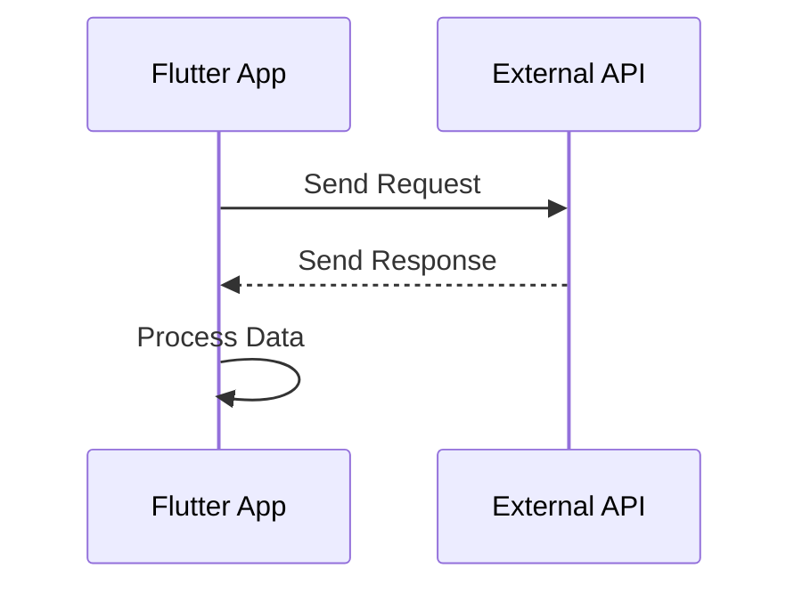

## 9.1.1 What Is an API?

In the ever-evolving landscape of software development, APIs, or Application Programming Interfaces, stand as the unsung heroes that enable seamless communication between disparate software systems. Imagine a world where every application had to be built from scratch, with no ability to leverage existing services or data from other applications. APIs eliminate this need by providing a standardized way for applications to interact, share data, and extend functionality.

### Understanding APIs: The Basics

At its core, an API is a set of rules and protocols that allow different software applications to communicate with each other. Think of an API as a contract between two parties: the provider of a service and the consumer of that service. This contract defines how requests for data or functionality should be made, what data will be returned, and how errors will be handled.

#### Real-World Analogy: The Restaurant Menu

To better understand APIs, consider the analogy of a restaurant. When you visit a restaurant, you interact with a menu, which lists the available dishes. You don't need to know how each dish is prepared in the kitchen; you simply place your order with the waiter, who then communicates your request to the kitchen. The kitchen prepares your meal and the waiter delivers it to you. In this analogy:

- **The Menu**: Represents the API, outlining the available services (dishes) and how to request them.
- **The Customer**: Acts as the application or user making a request.
- **The Waiter**: Functions as the intermediary, facilitating communication between the customer and the kitchen.
- **The Kitchen**: Symbolizes the backend service that processes requests and returns results.

This analogy highlights how APIs abstract the complexity of underlying systems, allowing users to interact with services without needing to understand their inner workings.

### Types of APIs

APIs come in various forms, each suited to different use cases and architectural styles. Here are some common types of APIs:

- **Web APIs**: These are APIs that can be accessed over the internet using HTTP protocols. They are widely used for web services and are often RESTful.
  
- **REST APIs**: Representational State Transfer (REST) APIs are a popular architectural style for designing networked applications. They use standard HTTP methods like GET, POST, PUT, and DELETE to perform operations on resources.

- **SOAP APIs**: Simple Object Access Protocol (SOAP) APIs rely on XML-based messaging protocols and are known for their robustness and security features, often used in enterprise environments.

- **GraphQL**: A query language for APIs, GraphQL allows clients to request exactly the data they need, making it more efficient than traditional REST APIs in certain scenarios.

- **Library/Framework APIs**: These are APIs provided by libraries or frameworks that developers use to build applications. They offer predefined functions and classes to simplify development tasks.

### The Role of APIs in Modern App Development

APIs are integral to modern app development, enabling developers to:

- **Integrate with Third-Party Services**: APIs allow applications to leverage external services, such as payment gateways, social media platforms, and cloud storage, without reinventing the wheel.

- **Facilitate Microservices Architecture**: In a microservices architecture, APIs enable communication between independent services, promoting scalability and flexibility.

- **Enhance User Experience**: By integrating APIs, developers can provide users with rich features and real-time data, such as weather updates, maps, and personalized content.

- **Enable Cross-Platform Compatibility**: APIs allow applications to function across different platforms and devices, ensuring a consistent user experience.

### Real-World Examples of API Usage

APIs are ubiquitous in today's digital world. Here are a few examples of how they are used:

- **Social Media Integration**: Applications use APIs to interact with social media platforms, allowing users to share content, log in using social accounts, and fetch user data.

- **Payment Processing**: E-commerce platforms integrate with payment gateway APIs to process transactions securely and efficiently.

- **Weather Applications**: Weather apps use APIs to fetch real-time weather data from meteorological services, providing users with up-to-date forecasts.

- **Travel Booking**: Travel websites and apps use APIs to access flight, hotel, and car rental data from various providers, offering users a comprehensive booking experience.

### Practical Code Example: Making an API Request in Flutter

To illustrate how APIs work in practice, let's look at a simple example of making an API request in a Flutter application using the `http` package.

```dart
import 'package:http/http.dart' as http;

Future<void> fetchData() async {
  // Define the API endpoint
  final url = Uri.parse('https://api.example.com/data');

  try {
    // Send a GET request to the API
    final response = await http.get(url);

    // Check if the request was successful
    if (response.statusCode == 200) {
      // Parse and use the data
      print('Data fetched successfully!');
      // You can process the response body here
    } else {
      // Handle the error
      throw Exception('Failed to load data');
    }
  } catch (e) {
    // Handle any exceptions
    print('An error occurred: $e');
  }
}
```

In this example, we define a function `fetchData` that sends a GET request to a specified API endpoint. We check the response status code to determine if the request was successful and handle any errors that may occur.

### Visualizing API Communication with Mermaid.js

To further clarify how API communication works, let's use a sequence diagram to illustrate the interaction between a Flutter app and an external API.



This diagram shows the sequence of events in a typical API interaction:

1. The Flutter app sends a request to the external API.
2. The API processes the request and sends a response back to the app.
3. The app processes the received data, which can then be used to update the UI or perform other actions.

### Best Practices for Working with APIs

When integrating APIs into your applications, consider the following best practices:

- **Understand the API Documentation**: Thoroughly read and understand the API documentation to know how to properly make requests and handle responses.

- **Handle Errors Gracefully**: Implement robust error handling to manage network failures, incorrect responses, and other potential issues.

- **Secure API Requests**: Use HTTPS to encrypt data in transit and consider implementing authentication mechanisms like API keys or OAuth.

- **Optimize API Usage**: Minimize the number of API calls by caching responses and only requesting necessary data to improve performance and reduce costs.

- **Stay Updated**: APIs can change over time, so keep an eye on updates and deprecations to ensure your application remains functional.

### Common Pitfalls and Challenges

While working with APIs, developers may encounter several challenges:

- **Rate Limiting**: Many APIs impose limits on the number of requests that can be made in a given time period. Be mindful of these limits to avoid service disruptions.

- **Versioning**: APIs may have multiple versions, and changes in newer versions can break existing functionality. Always specify the API version you are using.

- **Data Consistency**: Ensure that your application can handle inconsistencies in the data returned by APIs, such as missing fields or unexpected data types.

- **Latency**: Network latency can affect the performance of your application. Consider using asynchronous programming and loading indicators to improve user experience.

### Further Exploration and Resources

To deepen your understanding of APIs and their implementation, consider exploring the following resources:

- **Official Documentation**: Always refer to the official documentation of the APIs you are using for the most accurate and up-to-date information.

- **Books and Articles**: "RESTful Web APIs" by Leonard Richardson and Mike Amundsen provides a comprehensive guide to designing and using RESTful APIs.

- **Online Courses**: Platforms like Udemy and Coursera offer courses on API development and integration, covering both theoretical and practical aspects.

- **Open-Source Projects**: Explore open-source projects on GitHub to see real-world examples of API integration and best practices.

### Summary

APIs are the backbone of modern app development, enabling seamless communication between software systems and unlocking a world of possibilities for developers. By understanding the fundamentals of APIs, their types, and their role in app development, you can harness their power to build robust, scalable, and feature-rich applications. As you continue your journey in software development, remember to stay curious, explore new APIs, and apply best practices to create exceptional user experiences.

## Quiz Time!



### What is the primary purpose of an API?

- [x] To enable communication between different software applications
- [ ] To store data locally on a device
- [ ] To design user interfaces
- [ ] To compile code into machine language

> **Explanation:** APIs allow different software applications to communicate with each other, enabling the exchange of data and functionality.

### Which of the following is a type of API?

- [x] REST API
- [x] SOAP API
- [x] GraphQL
- [ ] HTML API

> **Explanation:** REST, SOAP, and GraphQL are all types of APIs, each with its own architecture and use cases. HTML is not an API type.

### In the restaurant analogy, what does the menu represent?

- [x] The API
- [ ] The customer
- [ ] The kitchen
- [ ] The waiter

> **Explanation:** In the analogy, the menu represents the API, outlining the available services and how to request them.

### What HTTP method is typically used to retrieve data from an API?

- [x] GET
- [ ] POST
- [ ] PUT
- [ ] DELETE

> **Explanation:** The GET method is used to request data from a specified resource.

### Which of the following is a benefit of using APIs in app development?

- [x] Integrating with third-party services
- [x] Facilitating microservices architecture
- [x] Enhancing user experience
- [ ] Increasing code complexity

> **Explanation:** APIs allow integration with third-party services, facilitate microservices architecture, and enhance user experience by providing rich features.

### What is a common challenge when working with APIs?

- [x] Rate limiting
- [ ] Easy integration
- [ ] High performance
- [ ] Unlimited requests

> **Explanation:** Rate limiting is a common challenge, as many APIs impose limits on the number of requests that can be made in a given time period.

### How can you secure API requests?

- [x] Use HTTPS
- [x] Implement authentication mechanisms
- [ ] Use HTTP
- [ ] Avoid encryption

> **Explanation:** Using HTTPS encrypts data in transit, and implementing authentication mechanisms like API keys or OAuth enhances security.

### What should you do to handle API changes over time?

- [x] Stay updated with API documentation
- [ ] Ignore versioning
- [ ] Assume backward compatibility
- [ ] Avoid using APIs

> **Explanation:** Staying updated with API documentation helps ensure your application remains functional despite changes or deprecations.

### What is the role of the `http` package in Flutter?

- [x] To make network requests
- [ ] To design UI components
- [ ] To manage state
- [ ] To compile Dart code

> **Explanation:** The `http` package in Flutter is used to make network requests, allowing communication with external APIs.

### True or False: APIs can only be used for web applications.

- [ ] True
- [x] False

> **Explanation:** APIs can be used for various types of applications, including web, mobile, and desktop, enabling cross-platform compatibility.


