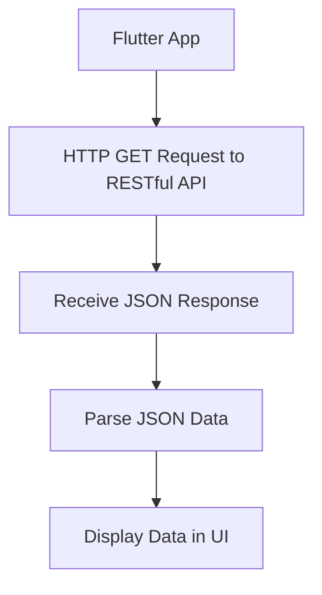

## 9.1.2 Working with RESTful APIs

In the modern world of app development, integrating with web services is a fundamental skill. RESTful APIs are among the most prevalent types of web APIs, offering a standardized way to interact with web services. This section delves into the principles of REST architecture, how RESTful APIs function, and how you can leverage them within your Flutter applications.

### Principles of REST Architecture

REST, or Representational State Transfer, is an architectural style that defines a set of constraints and properties based on HTTP. It is designed to work with the web's existing infrastructure and protocols, making it a natural fit for web-based applications. Here are the core principles of REST:

- **Statelessness**: Each request from a client to a server must contain all the information needed to understand and process the request. The server does not store any state about the client session on its side. This stateless nature simplifies server design and improves scalability.

- **Client-Server Architecture**: REST separates the user interface concerns from the data storage concerns. This separation allows for the independent evolution of the client-side and server-side components.

- **Resource-Based Structuring**: In REST, resources (such as users, posts, or comments) are identified by URIs (Uniform Resource Identifiers). Each resource can be accessed and manipulated using standard HTTP methods.

- **Uniform Interface**: RESTful APIs use a uniform interface to interact with resources. This interface is defined by HTTP methods such as GET, POST, PUT, DELETE, etc.

- **Cacheability**: Responses from the server can be cached by clients to improve performance. RESTful APIs should provide information about whether a response is cacheable or not.

- **Layered System**: REST allows for a layered architecture where intermediaries such as load balancers, proxies, or gateways can be used to improve scalability and manageability.

### Resources and Endpoints

In RESTful APIs, resources are the key entities that you interact with. Each resource is represented by a URI, and you perform operations on these resources using HTTP methods. For example, consider a blogging platform:

- **Resource**: Posts
- **Endpoint**: `https://api.example.com/posts`

The operations you can perform on this resource include:

- **GET**: Retrieve a list of posts or a specific post.
- **POST**: Create a new post.
- **PUT**: Update an existing post.
- **DELETE**: Remove a post.

Endpoints are the URLs that you use to access these resources. They are designed to be intuitive and follow a predictable pattern, making it easier for developers to understand and use the API.

### Stateless Communication

Stateless communication is a cornerstone of REST architecture. In a stateless system, each request from the client to the server must contain all the information needed to understand and process the request. This means that the server does not store any session information about the client, which has several advantages:

- **Scalability**: Statelessness allows servers to handle more requests because they do not need to maintain session information.
- **Reliability**: Since each request is independent, failures in one request do not affect others.
- **Simplified Server Logic**: The server does not need to manage session state, reducing complexity.

### Advantages of Using RESTful APIs

RESTful APIs offer several benefits that make them a popular choice for web services:

- **Simplicity**: RESTful APIs use standard HTTP methods and status codes, making them easy to understand and implement.
- **Scalability**: The stateless nature of RESTful APIs allows them to scale easily across multiple servers.
- **Flexibility**: RESTful APIs can be used with any programming language or platform that supports HTTP.
- **Interoperability**: RESTful APIs can be consumed by a wide range of clients, including web browsers, mobile apps, and other servers.

### Implementing RESTful APIs in Flutter

Now that we have a solid understanding of RESTful APIs, let's explore how to implement them in a Flutter application. We'll use the `http` package to make network requests and handle responses.

#### Code Example: Fetching Data from a RESTful API

Below is an example of how to fetch a list of posts from a RESTful API using Flutter:

```dart
import 'package:http/http.dart' as http;
import 'dart:convert';

// Define a Post class to represent the data structure
class Post {
  final int userId;
  final int id;
  final String title;
  final String body;

  Post({required this.userId, required this.id, required this.title, required this.body});

  // Factory method to create a Post from JSON
  factory Post.fromJson(Map<String, dynamic> json) {
    return Post(
      userId: json['userId'],
      id: json['id'],
      title: json['title'],
      body: json['body'],
    );
  }
}

// Function to fetch posts from the API
Future<List<Post>> fetchPosts() async {
  final response = await http.get(Uri.parse('https://jsonplaceholder.typicode.com/posts'));

  if (response.statusCode == 200) {
    // Parse the JSON response
    List<dynamic> body = json.decode(response.body);
    // Map the JSON to a list of Post objects
    List<Post> posts = body.map((dynamic item) => Post.fromJson(item)).toList();
    return posts;
  } else {
    throw Exception('Failed to load posts');
  }
}
```

In this example, we define a `Post` class to represent the data structure of a post. The `fetchPosts` function makes an HTTP GET request to the API endpoint, parses the JSON response, and returns a list of `Post` objects.

#### Diagram: RESTful API Interaction

To visualize the interaction between a Flutter app and a RESTful API, consider the following diagram:



This diagram illustrates the flow of data from the Flutter app to the RESTful API and back. The app sends an HTTP GET request, receives a JSON response, parses the data, and displays it in the user interface.

### Best Practices for Working with RESTful APIs

When working with RESTful APIs, consider the following best practices:

- **Error Handling**: Always handle errors gracefully. Check the status code of the response and provide meaningful error messages to the user.
- **Asynchronous Programming**: Use asynchronous programming to avoid blocking the UI thread. Flutter's `Future` and `async/await` make this easy.
- **Caching**: Implement caching strategies to reduce the number of network requests and improve performance.
- **Security**: Use HTTPS to encrypt data in transit and consider authentication mechanisms such as OAuth for secure access.

### Common Pitfalls and Challenges

While RESTful APIs are powerful, there are common pitfalls to be aware of:

- **Over-fetching and Under-fetching**: Requesting too much or too little data can lead to inefficiencies. Use query parameters and pagination to control the data you receive.
- **Versioning**: APIs evolve over time. Implement versioning to ensure backward compatibility.
- **Rate Limiting**: Be mindful of API rate limits to avoid being blocked by the server.

### Further Exploration

To deepen your understanding of RESTful APIs and their implementation in Flutter, consider exploring the following resources:

- [Flutter HTTP Package Documentation](https://pub.dev/packages/http)
- [RESTful API Design Best Practices](https://www.restapitutorial.com/)
- [JSONPlaceholder API](https://jsonplaceholder.typicode.com/) - A free online REST API for testing and prototyping.

### Conclusion

RESTful APIs are a cornerstone of modern web development, providing a standardized way to interact with web services. By understanding the principles of REST architecture and learning how to implement RESTful APIs in Flutter, you can build powerful and scalable applications that leverage the vast resources of the web.

---

## Quiz Time!



### What is a key principle of REST architecture?

- [x] Statelessness
- [ ] Stateful communication
- [ ] Client-side storage
- [ ] Server-side sessions

> **Explanation:** Statelessness is a core principle of REST architecture, meaning each request from a client to a server must contain all the information needed to understand and process the request.

### Which HTTP method is used to retrieve data from a RESTful API?

- [x] GET
- [ ] POST
- [ ] PUT
- [ ] DELETE

> **Explanation:** The GET method is used to retrieve data from a RESTful API.

### What is the purpose of a URI in RESTful APIs?

- [x] To identify resources
- [ ] To store session data
- [ ] To encrypt data
- [ ] To manage user authentication

> **Explanation:** In RESTful APIs, a URI (Uniform Resource Identifier) is used to identify resources.

### What does the `http` package in Flutter help with?

- [x] Making network requests
- [ ] Managing local databases
- [ ] Handling user input
- [ ] Rendering UI components

> **Explanation:** The `http` package in Flutter is used for making network requests.

### Which of the following is a benefit of using RESTful APIs?

- [x] Scalability
- [x] Flexibility
- [ ] Complexity
- [ ] High latency

> **Explanation:** RESTful APIs are scalable and flexible, allowing them to be used across various platforms and languages.

### What should you do if a RESTful API request fails?

- [x] Handle the error gracefully
- [ ] Ignore the error
- [ ] Retry indefinitely
- [ ] Log out the user

> **Explanation:** It is important to handle errors gracefully to provide a good user experience.

### Which of the following is a common pitfall when working with RESTful APIs?

- [x] Over-fetching data
- [ ] Using HTTPS
- [ ] Implementing caching
- [ ] Handling errors

> **Explanation:** Over-fetching data can lead to inefficiencies and should be avoided.

### What is the role of JSON in RESTful APIs?

- [x] To format data for exchange
- [ ] To secure data
- [ ] To compress data
- [ ] To authenticate users

> **Explanation:** JSON (JavaScript Object Notation) is commonly used to format data for exchange in RESTful APIs.

### How can you improve the performance of a RESTful API in your app?

- [x] Implement caching
- [ ] Increase request size
- [ ] Use HTTP instead of HTTPS
- [ ] Disable error handling

> **Explanation:** Implementing caching can reduce the number of network requests and improve performance.

### True or False: RESTful APIs require the server to maintain session state.

- [ ] True
- [x] False

> **Explanation:** RESTful APIs are stateless, meaning the server does not maintain session state.


