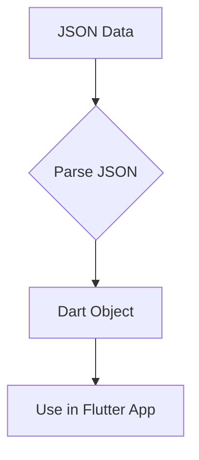

## 9.1.3 JSON Data Format

In the realm of web development and API integration, JSON (JavaScript Object Notation) stands out as a pivotal data interchange format. Its lightweight nature and human-readable syntax make it a preferred choice for data exchange between clients and servers. This section delves into the intricacies of JSON, its structure, syntax, and how it seamlessly integrates with Dart, the programming language underpinning Flutter.

### Understanding JSON: Definition and Purpose

JSON is a text-based data format that is easy for humans to read and write, and easy for machines to parse and generate. It is primarily used to transmit data between a server and a web application as an alternative to XML. JSON's simplicity and flexibility make it ideal for representing complex data structures in a concise manner.

**Key Characteristics of JSON:**
- **Lightweight:** JSON is minimalistic, reducing the overhead associated with data transmission.
- **Human-Readable:** Its syntax is straightforward, making it easy to understand and debug.
- **Language-Independent:** While JSON is derived from JavaScript, it is supported by most programming languages, including Dart.

### JSON Syntax: Objects, Arrays, and Key-Value Pairs

JSON's structure is built upon two primary constructs: objects and arrays.

#### JSON Objects

A JSON object is an unordered collection of key-value pairs, where keys are strings and values can be strings, numbers, arrays, objects, `true`, `false`, or `null`. Objects are enclosed in curly braces `{}`.

**Example:**

```json
{
  "userId": 1,
  "id": 1,
  "title": "Sample Post",
  "body": "This is the body of the post."
}
```

#### JSON Arrays

A JSON array is an ordered list of values, which can be of any type, including other arrays and objects. Arrays are enclosed in square brackets `[]`.

**Example:**

```json
[
  {
    "userId": 1,
    "id": 1,
    "title": "Sample Post",
    "body": "This is the body of the post."
  },
  {
    "userId": 2,
    "id": 2,
    "title": "Another Post",
    "body": "This is another post body."
  }
]
```

### Advantages of JSON Over Other Data Formats

JSON's popularity is attributed to several advantages over other data formats like XML:

- **Simplicity:** JSON's syntax is less verbose than XML, making it easier to read and write.
- **Efficiency:** JSON's lightweight nature results in faster data parsing and reduced bandwidth usage.
- **Interoperability:** JSON's compatibility with most programming languages facilitates seamless data exchange across different systems.

### Parsing JSON in Dart

In Flutter, parsing JSON data is a common task when working with APIs. Dart provides robust support for JSON through its `dart:convert` library, which includes functions to encode and decode JSON data.

#### Mapping JSON to Dart Objects

To work with JSON data in Dart, you typically map it to Dart objects. This involves defining a Dart class that mirrors the structure of the JSON data and implementing a factory constructor to parse the JSON.

**Dart Class Example:**

```dart
import 'dart:convert';

// Dart class to represent the JSON structure
class Post {
  final int userId;
  final int id;
  final String title;
  final String body;

  Post({required this.userId, required this.id, required this.title, required this.body});

  // Factory constructor to create a Post object from JSON
  factory Post.fromJson(Map<String, dynamic> json) {
    return Post(
      userId: json['userId'],
      id: json['id'],
      title: json['title'],
      body: json['body'],
    );
  }

  // Method to convert a Post object to JSON
  Map<String, dynamic> toJson() {
    return {
      'userId': userId,
      'id': id,
      'title': title,
      'body': body,
    };
  }
}

void main() {
  // Example JSON string
  String jsonString = '{"userId": 1, "id": 1, "title": "Sample Post", "body": "This is the body of the post."}';

  // Parsing JSON to Dart object
  Map<String, dynamic> jsonMap = jsonDecode(jsonString);
  Post post = Post.fromJson(jsonMap);

  // Output Dart object properties
  print('User ID: ${post.userId}');
  print('ID: ${post.id}');
  print('Title: ${post.title}');
  print('Body: ${post.body}');

  // Converting Dart object back to JSON
  String jsonOutput = jsonEncode(post.toJson());
  print('JSON Output: $jsonOutput');
}
```

### Practical Example: Parsing JSON in a Flutter App

Consider a scenario where you need to fetch a list of posts from an API and display them in a Flutter app. You would start by defining a Dart class to represent the post data, as shown above. Then, you would use the `http` package to make a network request, parse the JSON response, and map it to a list of `Post` objects.

**Fetching and Parsing JSON:**

```dart
import 'dart:convert';
import 'package:http/http.dart' as http;

Future<List<Post>> fetchPosts() async {
  final response = await http.get(Uri.parse('https://jsonplaceholder.typicode.com/posts'));

  if (response.statusCode == 200) {
    List<dynamic> jsonList = jsonDecode(response.body);
    return jsonList.map((json) => Post.fromJson(json)).toList();
  } else {
    throw Exception('Failed to load posts');
  }
}
```

### Visualizing JSON Parsing with Mermaid.js

To better understand the flow of JSON parsing in a Flutter app, consider the following diagram:



### Best Practices and Common Pitfalls

- **Error Handling:** Always handle exceptions when parsing JSON to prevent runtime errors. Use try-catch blocks to manage potential issues.
- **Data Validation:** Validate JSON data before parsing to ensure it matches the expected structure.
- **Performance:** For large JSON data, consider using efficient parsing techniques or libraries to optimize performance.

### Further Exploration

For a deeper understanding of JSON and its integration with Dart, consider exploring the following resources:

- [Dart JSON Documentation](https://dart.dev/guides/json)
- [Flutter HTTP Package](https://pub.dev/packages/http)
- [JSONPlaceholder API](https://jsonplaceholder.typicode.com/)

These resources provide comprehensive insights into JSON handling and API integration in Flutter, empowering you to build robust and efficient applications.

## Quiz Time!



### What is JSON primarily used for?

- [x] Data interchange between a server and a web application
- [ ] Styling web pages
- [ ] Compiling code
- [ ] Managing databases

> **Explanation:** JSON (JavaScript Object Notation) is primarily used for data interchange between a server and a web application due to its lightweight and human-readable format.

### Which of the following is a key characteristic of JSON?

- [x] Lightweight
- [ ] Verbose
- [ ] Binary format
- [ ] Complex syntax

> **Explanation:** JSON is known for being lightweight, which makes it efficient for data transmission.

### What are the two primary constructs of JSON?

- [x] Objects and Arrays
- [ ] Classes and Functions
- [ ] Tables and Fields
- [ ] Nodes and Edges

> **Explanation:** JSON is structured using objects (key-value pairs) and arrays (ordered lists of values).

### How are JSON objects enclosed?

- [x] Curly braces {}
- [ ] Square brackets []
- [ ] Parentheses ()
- [ ] Angle brackets <>

> **Explanation:** JSON objects are enclosed in curly braces {} and consist of key-value pairs.

### What Dart library is commonly used for JSON parsing?

- [x] dart:convert
- [ ] dart:io
- [ ] dart:async
- [ ] dart:core

> **Explanation:** The `dart:convert` library provides functions for encoding and decoding JSON data in Dart.

### What is the advantage of JSON over XML?

- [x] Less verbose
- [ ] More secure
- [ ] Faster execution
- [ ] Better styling

> **Explanation:** JSON is less verbose than XML, making it easier to read and write.

### Which method is used to convert a Dart object to JSON?

- [x] jsonEncode
- [ ] jsonDecode
- [ ] jsonParse
- [ ] jsonStringify

> **Explanation:** The `jsonEncode` method is used to convert a Dart object to a JSON string.

### What should you do to handle errors when parsing JSON?

- [x] Use try-catch blocks
- [ ] Ignore errors
- [ ] Use print statements
- [ ] Restart the app

> **Explanation:** Using try-catch blocks helps manage exceptions and prevent runtime errors during JSON parsing.

### Which of the following is a common pitfall when working with JSON?

- [x] Not handling exceptions
- [ ] Using too many comments
- [ ] Overusing variables
- [ ] Excessive indentation

> **Explanation:** Not handling exceptions when parsing JSON can lead to runtime errors and application crashes.

### True or False: JSON is a binary data format.

- [ ] True
- [x] False

> **Explanation:** JSON is a text-based data format, not binary, which makes it human-readable and easy to debug.


