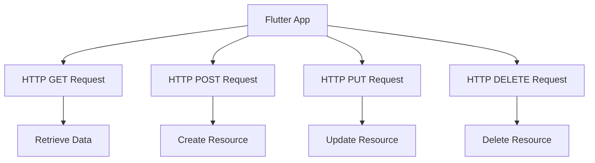

## 9.1.4 HTTP Methods

In the world of web development, HTTP methods are the backbone of communication between clients and servers. They define the action to be performed on a given resource, making them essential for building RESTful APIs. Understanding these methods is crucial for developers, especially when working with Flutter to create robust and efficient applications. This section delves into the various HTTP methods, their purposes, use cases, and how they map to CRUD operations.

### Overview of HTTP Methods

HTTP methods, also known as HTTP verbs, are a set of request methods to indicate the desired action to be performed for a given resource. The most commonly used HTTP methods are:

- **GET**: Retrieve data from a server.
- **POST**: Send data to a server to create a resource.
- **PUT**: Update an existing resource on the server.
- **DELETE**: Remove a resource from the server.
- **PATCH**: Partially update a resource on the server.

Each method serves a specific purpose and is used in different scenarios, often aligning with CRUD (Create, Read, Update, Delete) operations.

### Mapping HTTP Methods to CRUD Operations

Understanding how HTTP methods map to CRUD operations is fundamental for designing RESTful APIs. Here's how each method corresponds to CRUD:

- **GET (Read)**: Used to retrieve data from the server. It is a safe and idempotent method, meaning it does not alter the state of the resource and can be called multiple times without changing the result.

- **POST (Create)**: Used to send data to the server to create a new resource. It is neither safe nor idempotent, as calling it multiple times may result in multiple resources being created.

- **PUT (Update)**: Used to update an existing resource. It is idempotent, meaning multiple identical requests will have the same effect as a single request.

- **DELETE (Delete)**: Used to remove a resource from the server. It is idempotent, as deleting a resource multiple times will have the same effect as deleting it once.

- **PATCH (Partial Update)**: Similar to PUT, but used for partial updates. It is not necessarily idempotent, as the result may vary depending on the current state of the resource.

### Examples of When to Use Each Method

Let's explore practical scenarios where each HTTP method is applicable:

#### GET Method

The GET method is used to request data from a specified resource. It should only retrieve data and have no other effect on the data.

**Example Use Case**: Fetching a list of blog posts from a server.

```dart
Future<void> fetchPosts() async {
  final response = await http.get(Uri.parse('https://jsonplaceholder.typicode.com/posts'));
  if (response.statusCode == 200) {
    List<dynamic> posts = json.decode(response.body);
    print('Fetched ${posts.length} posts');
  } else {
    throw Exception('Failed to load posts');
  }
}
```

#### POST Method

The POST method is used to send data to the server to create a new resource.

**Example Use Case**: Creating a new blog post.

```dart
Future<void> createPost(Post post) async {
  final response = await http.post(
    Uri.parse('https://jsonplaceholder.typicode.com/posts'),
    headers: {'Content-Type': 'application/json; charset=UTF-8'},
    body: json.encode(post.toJson()),
  );
  if (response.statusCode == 201) {
    print('Post created successfully!');
  } else {
    throw Exception('Failed to create post');
  }
}
```

#### PUT Method

The PUT method is used to update an existing resource. It replaces the entire resource with the new data provided.

**Example Use Case**: Updating an existing blog post.

```dart
Future<void> updatePost(int id, Post post) async {
  final response = await http.put(
    Uri.parse('https://jsonplaceholder.typicode.com/posts/$id'),
    headers: {'Content-Type': 'application/json; charset=UTF-8'},
    body: json.encode(post.toJson()),
  );
  if (response.statusCode == 200) {
    print('Post updated successfully!');
  } else {
    throw Exception('Failed to update post');
  }
}
```

#### DELETE Method

The DELETE method is used to remove a resource from the server.

**Example Use Case**: Deleting a blog post.

```dart
Future<void> deletePost(int id) async {
  final response = await http.delete(
    Uri.parse('https://jsonplaceholder.typicode.com/posts/$id'),
  );
  if (response.statusCode == 200) {
    print('Post deleted successfully!');
  } else {
    throw Exception('Failed to delete post');
  }
}
```

#### PATCH Method

The PATCH method is used for partial updates to a resource.

**Example Use Case**: Updating the title of a blog post without affecting other fields.

```dart
Future<void> patchPostTitle(int id, String newTitle) async {
  final response = await http.patch(
    Uri.parse('https://jsonplaceholder.typicode.com/posts/$id'),
    headers: {'Content-Type': 'application/json; charset=UTF-8'},
    body: json.encode({'title': newTitle}),
  );
  if (response.statusCode == 200) {
    print('Post title updated successfully!');
  } else {
    throw Exception('Failed to update post title');
  }
}
```

### Understanding Idempotency and Safety of Methods

Idempotency and safety are important concepts in HTTP methods:

- **Idempotency**: An operation is idempotent if performing it multiple times has the same effect as performing it once. GET, PUT, and DELETE are idempotent, while POST is not.

- **Safety**: An operation is safe if it does not modify the resource. GET is a safe method, while POST, PUT, DELETE, and PATCH are not.

Understanding these concepts helps in designing APIs that are predictable and reliable.

### Code Example

Here's a complete example demonstrating the use of different HTTP methods in a Flutter application:

```dart
import 'package:http/http.dart' as http;
import 'dart:convert';

class Post {
  final int userId;
  final int id;
  final String title;
  final String body;

  Post({required this.userId, required this.id, required this.title, required this.body});

  Map<String, dynamic> toJson() {
    return {
      'userId': userId,
      'id': id,
      'title': title,
      'body': body,
    };
  }
}

Future<void> createPost(Post post) async {
  final response = await http.post(
    Uri.parse('https://jsonplaceholder.typicode.com/posts'),
    headers: {'Content-Type': 'application/json; charset=UTF-8'},
    body: json.encode(post.toJson()),
  );
  if (response.statusCode == 201) {
    print('Post created successfully!');
  } else {
    throw Exception('Failed to create post');
  }
}

Future<void> updatePost(int id, Post post) async {
  final response = await http.put(
    Uri.parse('https://jsonplaceholder.typicode.com/posts/$id'),
    headers: {'Content-Type': 'application/json; charset=UTF-8'},
    body: json.encode(post.toJson()),
  );
  if (response.statusCode == 200) {
    print('Post updated successfully!');
  } else {
    throw Exception('Failed to update post');
  }
}

Future<void> deletePost(int id) async {
  final response = await http.delete(
    Uri.parse('https://jsonplaceholder.typicode.com/posts/$id'),
  );
  if (response.statusCode == 200) {
    print('Post deleted successfully!');
  } else {
    throw Exception('Failed to delete post');
  }
}
```

### Visualizing HTTP Methods with Mermaid.js

To better understand the flow of HTTP methods in a Flutter application, let's visualize it using a Mermaid.js diagram:



### Best Practices and Common Pitfalls

- **Use the Correct Method**: Always use the appropriate HTTP method for the desired operation. For example, use GET for retrieving data and POST for creating new resources.

- **Handle Errors Gracefully**: Implement error handling for network requests to manage failures and provide feedback to users.

- **Secure Your API**: Ensure that your API endpoints are secure, especially when dealing with sensitive data. Use HTTPS and authentication mechanisms.

- **Understand Idempotency**: Be mindful of idempotency when designing APIs to avoid unintended side effects.

- **Optimize for Performance**: Minimize the amount of data transferred over the network by using efficient data formats and compression techniques.

### Further Resources

- [MDN Web Docs: HTTP Methods](https://developer.mozilla.org/en-US/docs/Web/HTTP/Methods)
- [RESTful API Design: Best Practices in a Nutshell](https://restfulapi.net/)
- [Flutter HTTP Package Documentation](https://pub.dev/packages/http)

### Conclusion

Understanding HTTP methods is crucial for building effective RESTful APIs and integrating them into your Flutter applications. By mastering these methods, you can create robust, efficient, and reliable applications that communicate seamlessly with servers. Remember to follow best practices and continuously explore new techniques to enhance your skills.

## Quiz Time!



### Which HTTP method is used to retrieve data from a server?

- [x] GET
- [ ] POST
- [ ] PUT
- [ ] DELETE

> **Explanation:** The GET method is used to request data from a specified resource without altering it.

### What is the primary purpose of the POST method?

- [ ] Retrieve data
- [x] Create a new resource
- [ ] Update an existing resource
- [ ] Delete a resource

> **Explanation:** The POST method is used to send data to the server to create a new resource.

### Which HTTP methods are considered idempotent?

- [x] GET
- [x] PUT
- [x] DELETE
- [ ] POST

> **Explanation:** GET, PUT, and DELETE are idempotent methods, meaning multiple identical requests have the same effect as a single request.

### What does it mean for an HTTP method to be "safe"?

- [x] It does not modify the resource
- [ ] It requires authentication
- [ ] It encrypts data
- [ ] It is faster than other methods

> **Explanation:** A safe HTTP method does not alter the state of the resource. GET is an example of a safe method.

### Which method would you use to partially update a resource?

- [ ] GET
- [ ] POST
- [x] PATCH
- [ ] DELETE

> **Explanation:** The PATCH method is used for partial updates to a resource.

### What is the status code for a successful POST request that creates a resource?

- [ ] 200
- [x] 201
- [ ] 204
- [ ] 404

> **Explanation:** A successful POST request that creates a resource returns a 201 status code, indicating "Created."

### Which HTTP method should be used to delete a resource?

- [ ] GET
- [ ] POST
- [ ] PUT
- [x] DELETE

> **Explanation:** The DELETE method is used to remove a resource from the server.

### What is the main difference between PUT and PATCH methods?

- [ ] PUT is for creating resources, PATCH is for deleting
- [x] PUT replaces the entire resource, PATCH updates partially
- [ ] PUT is idempotent, PATCH is not
- [ ] PUT is faster than PATCH

> **Explanation:** PUT replaces the entire resource, while PATCH is used for partial updates.

### Which HTTP method is not safe but idempotent?

- [ ] GET
- [ ] POST
- [x] PUT
- [ ] PATCH

> **Explanation:** PUT is not safe because it modifies the resource, but it is idempotent as multiple identical requests have the same effect.

### True or False: The DELETE method is both safe and idempotent.

- [ ] True
- [x] False

> **Explanation:** The DELETE method is idempotent but not safe, as it modifies the resource by removing it.


