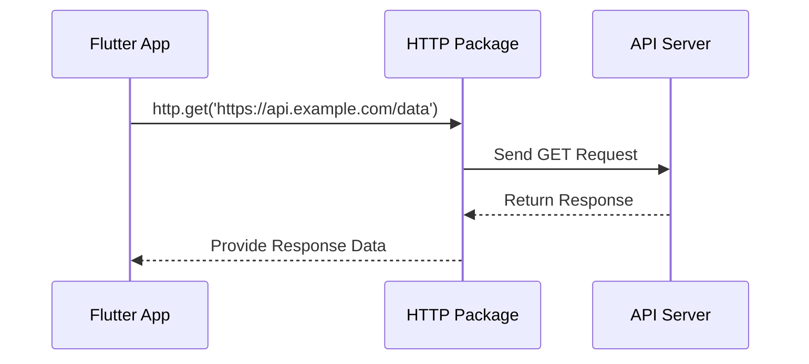

## 9.2.1 Using the HTTP Package

In the world of mobile app development, interacting with web services and APIs is a fundamental skill. Flutter, with its robust ecosystem, provides the `http` package, a powerful and easy-to-use library for making HTTP requests. This section will guide you through the process of integrating the `http` package into your Flutter projects, enabling you to fetch data from the web, send data to servers, and handle asynchronous operations seamlessly.

### Introduction to the HTTP Package

The `http` package is a widely-used library in Flutter that simplifies the process of making HTTP requests. It provides a straightforward API for sending GET, POST, PUT, DELETE, and other HTTP requests, making it an essential tool for developers working with RESTful APIs.

#### Why Use the HTTP Package?

- **Simplicity**: The `http` package abstracts the complexities of HTTP communication, allowing you to focus on your application's logic.
- **Versatility**: It supports various HTTP methods and can handle both simple and complex requests.
- **Asynchronous Operations**: Built on Dart's `Future` and `async`/`await` features, it allows for non-blocking network calls, essential for maintaining a responsive UI.

### Installing the HTTP Package

To start using the `http` package, you need to add it to your Flutter project's dependencies. This is done by modifying the `pubspec.yaml` file.

#### Step-by-Step Installation

1. **Open `pubspec.yaml`**: Locate this file in the root directory of your Flutter project.

2. **Add the Dependency**: Under the `dependencies` section, add the `http` package.

   ```yaml
   dependencies:
     flutter:
       sdk: flutter
     http: ^0.13.4
   ```

3. **Install the Package**: Run the following command in your terminal to install the package:

   ```bash
   flutter pub get
   ```

This command fetches the package and makes it available for use in your project.

### Importing the HTTP Package

Once installed, you need to import the `http` package into your Dart files where you plan to use it. This is done using the `import` statement.

```dart
import 'package:http/http.dart' as http;
```

The `as http` part allows you to prefix the package's classes and methods with `http`, preventing naming conflicts and improving code readability.

### Overview of Main Classes and Methods

The `http` package provides several classes and methods to facilitate HTTP communication. Here are some of the most commonly used:

- **`http.get`**: Sends a GET request to the specified URL.
- **`http.post`**: Sends a POST request, typically used to submit data to a server.
- **`http.put`**: Sends a PUT request, often used to update existing data.
- **`http.delete`**: Sends a DELETE request to remove data from a server.

These methods return a `Future<http.Response>`, which represents the eventual completion (or failure) of the asynchronous operation.

### Handling Asynchronous Operations with Future

In Flutter, network requests are asynchronous, meaning they don't block the main thread. This is crucial for maintaining a smooth user experience. Dart's `Future` class, along with `async` and `await` keywords, provides a powerful way to handle asynchronous operations.

#### Using `async` and `await`

Here's a basic example of how to use `http.get` to fetch data from a server:

```dart
Future<void> fetchData() async {
  try {
    final response = await http.get(Uri.parse('https://api.example.com/data'));
    if (response.statusCode == 200) {
      print('Data fetched successfully!');
      // Process the response data here
    } else {
      throw Exception('Failed to load data');
    }
  } catch (e) {
    print('Error: $e');
  }
}
```

- **`async`**: Marks the function as asynchronous, allowing the use of `await`.
- **`await`**: Pauses the execution of the function until the `Future` completes, returning the result.

### Practical Code Example

Let's dive into a more detailed example that demonstrates how to use the `http` package to perform a GET request and handle the response.

```dart
import 'package:http/http.dart' as http;
import 'dart:convert';

Future<void> fetchUserData() async {
  final url = Uri.parse('https://jsonplaceholder.typicode.com/users');
  try {
    final response = await http.get(url);
    if (response.statusCode == 200) {
      List<dynamic> users = jsonDecode(response.body);
      for (var user in users) {
        print('User: ${user['name']}');
      }
    } else {
      print('Failed to load users. Status code: ${response.statusCode}');
    }
  } catch (e) {
    print('An error occurred: $e');
  }
}
```

- **`Uri.parse`**: Converts a string URL into a `Uri` object, which is required by the `http` methods.
- **`jsonDecode`**: Parses the JSON response body into a Dart object, allowing you to work with the data.

### Understanding the Sequence of HTTP Requests

To better understand how HTTP requests work in a Flutter app, let's visualize the process using a sequence diagram.



- **App**: Initiates the request using the `http` package.
- **HTTP**: Manages the request and communicates with the server.
- **Server**: Processes the request and sends back a response.

### Best Practices and Common Pitfalls

#### Best Practices

- **Error Handling**: Always handle potential errors using try-catch blocks to prevent crashes.
- **Response Validation**: Check the status code of the response to ensure the request was successful.
- **JSON Parsing**: Use Dart's `dart:convert` library to parse JSON data efficiently.

#### Common Pitfalls

- **Blocking the UI**: Avoid performing network requests on the main thread. Use `async` and `await` to keep the UI responsive.
- **Unvalidated URLs**: Always validate and parse URLs using `Uri.parse` to prevent errors.
- **Ignoring Status Codes**: Always check the response's status code to handle different outcomes appropriately.

### Real-World Scenario: Fetching Weather Data

Imagine you're building a weather app that fetches current weather data from an API. Here's how you might use the `http` package to achieve this:

```dart
Future<void> fetchWeatherData(String city) async {
  final apiKey = 'your_api_key';
  final url = Uri.parse('https://api.openweathermap.org/data/2.5/weather?q=$city&appid=$apiKey');
  try {
    final response = await http.get(url);
    if (response.statusCode == 200) {
      var weatherData = jsonDecode(response.body);
      print('Temperature: ${weatherData['main']['temp']}');
    } else {
      print('Failed to fetch weather data. Status code: ${response.statusCode}');
    }
  } catch (e) {
    print('An error occurred: $e');
  }
}
```

### Encouragement for Hands-On Practice

To solidify your understanding, try modifying the examples provided. Experiment with different endpoints, handle various response formats, and implement additional HTTP methods like POST or DELETE.

### Further Resources

- **Official Documentation**: [HTTP Package on pub.dev](https://pub.dev/packages/http)
- **Dart Language Tour**: [Asynchronous Programming: Futures, async, await](https://dart.dev/codelabs/async-await)
- **Flutter Networking Guide**: [Flutter Networking](https://flutter.dev/docs/cookbook/networking/fetch-data)

By mastering the `http` package, you'll be well-equipped to build Flutter apps that interact with web services and APIs effectively. Keep experimenting, and don't hesitate to explore more advanced topics like authentication and data caching as you grow more comfortable with networking in Flutter.

## Quiz Time!



### What is the primary purpose of the `http` package in Flutter?

- [x] To simplify making HTTP requests and interacting with RESTful APIs.
- [ ] To handle local storage and database operations.
- [ ] To manage state across Flutter applications.
- [ ] To create animations and transitions in the UI.

> **Explanation:** The `http` package is designed to simplify the process of making HTTP requests and interacting with RESTful APIs, providing a straightforward API for sending and receiving data over the web.

### How do you add the `http` package to a Flutter project?

- [x] By adding it to the `dependencies` section in `pubspec.yaml`.
- [ ] By installing it via the Flutter IDE.
- [ ] By downloading it from the Flutter website.
- [ ] By writing custom code to include it.

> **Explanation:** To use the `http` package, you need to add it to the `dependencies` section of your `pubspec.yaml` file and run `flutter pub get` to install it.

### What is the purpose of using `async` and `await` in Dart?

- [x] To handle asynchronous operations without blocking the main thread.
- [ ] To create synchronous code execution.
- [ ] To define classes and objects.
- [ ] To manage state in Flutter applications.

> **Explanation:** `async` and `await` are used in Dart to handle asynchronous operations, allowing the code to run without blocking the main thread, which is crucial for maintaining a responsive UI.

### Which method is used to send a GET request using the `http` package?

- [x] `http.get`
- [ ] `http.send`
- [ ] `http.fetch`
- [ ] `http.retrieve`

> **Explanation:** The `http.get` method is used to send a GET request to a specified URL, allowing you to retrieve data from a server.

### What should you always check after making an HTTP request?

- [x] The response's status code.
- [ ] The server's IP address.
- [ ] The client's network speed.
- [ ] The user's device model.

> **Explanation:** After making an HTTP request, it's important to check the response's status code to determine if the request was successful and handle any errors appropriately.

### What does the `jsonDecode` function do?

- [x] Parses a JSON string into a Dart object.
- [ ] Encodes a Dart object into a JSON string.
- [ ] Sends a JSON string to a server.
- [ ] Validates JSON syntax.

> **Explanation:** The `jsonDecode` function is used to parse a JSON string into a Dart object, allowing you to work with the data in your application.

### What is a common pitfall when making HTTP requests in Flutter?

- [x] Blocking the UI by performing network requests on the main thread.
- [ ] Using too many asynchronous operations.
- [ ] Not using enough animations.
- [ ] Overloading the app with too many widgets.

> **Explanation:** A common pitfall is blocking the UI by performing network requests on the main thread. It's important to use asynchronous operations to keep the UI responsive.

### How can you prevent naming conflicts when importing the `http` package?

- [x] By using `as http` in the import statement.
- [ ] By renaming the package in `pubspec.yaml`.
- [ ] By creating a custom alias in the Dart file.
- [ ] By importing it in a separate file.

> **Explanation:** Using `as http` in the import statement allows you to prefix the package's classes and methods with `http`, preventing naming conflicts and improving code readability.

### What is the role of the `Future` class in Dart?

- [x] To represent the eventual completion or failure of an asynchronous operation.
- [ ] To manage state across Flutter applications.
- [ ] To create animations and transitions.
- [ ] To handle local storage operations.

> **Explanation:** The `Future` class in Dart represents the eventual completion or failure of an asynchronous operation, allowing you to handle the result once it's available.

### True or False: The `http` package can only be used for GET requests.

- [ ] True
- [x] False

> **Explanation:** False. The `http` package can be used for various HTTP methods, including GET, POST, PUT, DELETE, and more, making it versatile for different types of requests.


