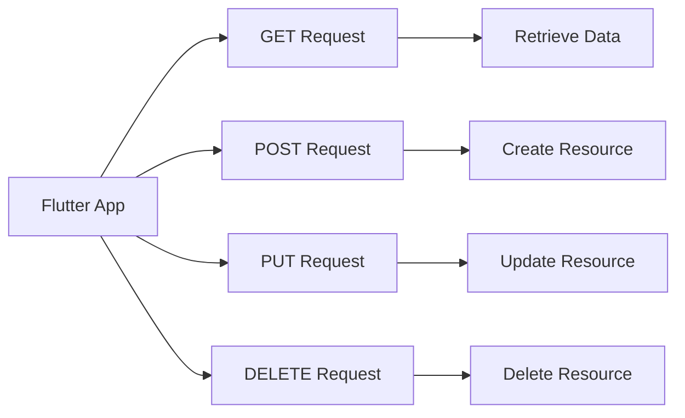

## 9.2.2 Sending Requests

In the world of mobile app development, interacting with web services is a common requirement. Whether you're fetching data from a server, submitting user information, or updating resources, understanding how to send HTTP requests is crucial. In this section, we'll explore how to construct and send various types of HTTP requests using the `http` package in Flutter. We'll cover GET, POST, PUT, and DELETE requests, discuss setting headers, sending request bodies, and managing query parameters. By the end of this section, you'll be equipped to handle network communication in your Flutter apps effectively.

### Understanding HTTP Requests

HTTP (Hypertext Transfer Protocol) is the foundation of data communication on the web. It defines methods to interact with resources, such as:

- **GET**: Retrieve data from a server.
- **POST**: Send data to a server to create a resource.
- **PUT**: Update an existing resource on a server.
- **DELETE**: Remove a resource from a server.

Each request type serves a specific purpose and requires different handling in terms of headers, body, and parameters.

### Setting Up the `http` Package

Before diving into code examples, ensure you have the `http` package added to your Flutter project. Add the following dependency to your `pubspec.yaml` file:

```yaml
dependencies:
  http: ^0.13.3
```

Run `flutter pub get` to install the package.

### Crafting GET Requests with Query Parameters

GET requests are used to retrieve data from a server. They can include query parameters to filter or modify the data returned.

```dart
import 'package:http/http.dart' as http;
import 'dart:convert';

Future<void> fetchUsers(String query) async {
  final response = await http.get(Uri.parse('https://api.example.com/users?search=$query'));
  if (response.statusCode == 200) {
    final List<dynamic> users = json.decode(response.body);
    // Process the list of users
  } else {
    throw Exception('Failed to fetch users');
  }
}
```

**Key Points:**

- **URI Parsing**: Use `Uri.parse` to construct the URL with query parameters.
- **Status Code Handling**: Check the `statusCode` to determine if the request was successful.
- **JSON Decoding**: Use `json.decode` to parse the response body.

### Sending POST Requests with JSON Bodies

POST requests are used to send data to a server, typically to create a new resource. They often include a JSON body.

```dart
Future<void> createUser(String name, String email) async {
  final response = await http.post(
    Uri.parse('https://api.example.com/users'),
    headers: {'Content-Type': 'application/json; charset=UTF-8'},
    body: json.encode({'name': name, 'email': email}),
  );
  if (response.statusCode == 201) {
    print('User created!');
  } else {
    throw Exception('Failed to create user');
  }
}
```

**Key Points:**

- **Headers**: Set `Content-Type` to `application/json` to indicate the body format.
- **JSON Encoding**: Use `json.encode` to convert Dart objects to JSON strings.
- **Status Code 201**: Indicates successful creation of a resource.

### Using PUT/PATCH for Updating Resources

PUT requests are used to update existing resources. They require the resource's identifier and a JSON body with updated data.

```dart
Future<void> updateUser(int id, String name, String email) async {
  final response = await http.put(
    Uri.parse('https://api.example.com/users/$id'),
    headers: {'Content-Type': 'application/json; charset=UTF-8'},
    body: json.encode({'name': name, 'email': email}),
  );
  if (response.statusCode == 200) {
    print('User updated!');
  } else {
    throw Exception('Failed to update user');
  }
}
```

**Key Points:**

- **Resource Identification**: Include the resource ID in the URL.
- **PUT vs. PATCH**: Use PUT for full updates and PATCH for partial updates.
- **Status Code 200**: Indicates successful update.

### Executing DELETE Requests

DELETE requests are used to remove resources from a server. They typically require the resource's identifier.

```dart
Future<void> deleteUser(int id) async {
  final response = await http.delete(Uri.parse('https://api.example.com/users/$id'));
  if (response.statusCode == 200) {
    print('User deleted!');
  } else {
    throw Exception('Failed to delete user');
  }
}
```

**Key Points:**

- **Resource Identification**: Include the resource ID in the URL.
- **Status Code 200**: Indicates successful deletion.

### Setting Custom Headers

Custom headers are often required for authentication, content negotiation, or other purposes. You can set headers in any HTTP request.

```dart
Future<void> fetchProtectedData() async {
  final response = await http.get(
    Uri.parse('https://api.example.com/protected'),
    headers: {'Authorization': 'Bearer YOUR_ACCESS_TOKEN'},
  );
  if (response.statusCode == 200) {
    // Process protected data
  } else {
    throw Exception('Failed to fetch protected data');
  }
}
```

**Key Points:**

- **Authorization**: Use headers to pass authentication tokens.
- **Content Negotiation**: Specify `Accept` headers to request specific data formats.

### Practical Example: User Management

Let's consider a practical example where we manage user data using the above HTTP methods. We'll create a simple Dart class to encapsulate these operations.

```dart
class UserService {
  final String baseUrl = 'https://api.example.com/users';

  Future<List<dynamic>> fetchUsers(String query) async {
    final response = await http.get(Uri.parse('$baseUrl?search=$query'));
    if (response.statusCode == 200) {
      return json.decode(response.body);
    } else {
      throw Exception('Failed to fetch users');
    }
  }

  Future<void> createUser(String name, String email) async {
    final response = await http.post(
      Uri.parse(baseUrl),
      headers: {'Content-Type': 'application/json; charset=UTF-8'},
      body: json.encode({'name': name, 'email': email}),
    );
    if (response.statusCode != 201) {
      throw Exception('Failed to create user');
    }
  }

  Future<void> updateUser(int id, String name, String email) async {
    final response = await http.put(
      Uri.parse('$baseUrl/$id'),
      headers: {'Content-Type': 'application/json; charset=UTF-8'},
      body: json.encode({'name': name, 'email': email}),
    );
    if (response.statusCode != 200) {
      throw Exception('Failed to update user');
    }
  }

  Future<void> deleteUser(int id) async {
    final response = await http.delete(Uri.parse('$baseUrl/$id'));
    if (response.statusCode != 200) {
      throw Exception('Failed to delete user');
    }
  }
}
```

### Diagram: HTTP Request Flow

Below is a visual representation of how different HTTP requests interact with a server.



### Best Practices and Common Pitfalls

- **Error Handling**: Always check the `statusCode` and handle errors gracefully.
- **Timeouts**: Set timeouts for requests to avoid hanging indefinitely.
- **Security**: Never hardcode sensitive information like API keys in your code.
- **Data Validation**: Validate data before sending it to the server to prevent errors.

### Further Reading and Resources

- [Flutter Official Documentation](https://flutter.dev/docs)
- [Dart HTTP Package Documentation](https://pub.dev/packages/http)
- [RESTful API Design](https://restfulapi.net/)
- [JSON Handling in Dart](https://dart.dev/guides/json)

### Conclusion

Mastering HTTP requests in Flutter is essential for building robust, data-driven applications. By understanding how to construct and send GET, POST, PUT, and DELETE requests, you can effectively interact with web services and manage data within your apps. Practice these techniques, explore the provided resources, and continue to refine your skills in networking and API integration.

## Quiz Time!



### What is the primary purpose of a GET request?

- [x] Retrieve data from a server.
- [ ] Send data to a server.
- [ ] Update data on a server.
- [ ] Delete data from a server.

> **Explanation:** GET requests are used to retrieve data from a server without modifying it.

### Which HTTP method is typically used to create a new resource?

- [ ] GET
- [x] POST
- [ ] PUT
- [ ] DELETE

> **Explanation:** POST requests are used to send data to a server to create a new resource.

### How do you specify query parameters in a GET request using the `http` package?

- [x] By appending them to the URL.
- [ ] By including them in the request body.
- [ ] By setting them in the headers.
- [ ] By using a separate method.

> **Explanation:** Query parameters are appended to the URL in a GET request.

### What is the correct header to set when sending JSON data in a POST request?

- [ ] `Authorization`
- [x] `Content-Type: application/json; charset=UTF-8`
- [ ] `Accept: application/json`
- [ ] `Cache-Control: no-cache`

> **Explanation:** The `Content-Type` header specifies the format of the data being sent, which is JSON in this case.

### Which status code indicates a successful creation of a resource?

- [ ] 200
- [x] 201
- [ ] 204
- [ ] 404

> **Explanation:** A status code of 201 indicates that a resource has been successfully created.

### What is the difference between PUT and PATCH requests?

- [x] PUT updates the entire resource, while PATCH updates part of the resource.
- [ ] PUT deletes the resource, while PATCH updates it.
- [ ] PUT creates a new resource, while PATCH deletes it.
- [ ] PUT and PATCH are identical.

> **Explanation:** PUT is used for full updates, while PATCH is used for partial updates.

### How can you handle errors when sending HTTP requests in Flutter?

- [x] By checking the `statusCode` and throwing exceptions for non-successful codes.
- [ ] By ignoring the response.
- [ ] By only using GET requests.
- [ ] By setting a timeout of zero.

> **Explanation:** Checking the `statusCode` and handling exceptions is a standard way to manage errors.

### What should you avoid when dealing with sensitive information in your app?

- [x] Hardcoding API keys in your code.
- [ ] Using environment variables.
- [ ] Storing keys securely.
- [ ] Encrypting sensitive data.

> **Explanation:** Hardcoding sensitive information like API keys in your code can lead to security vulnerabilities.

### What is the purpose of setting custom headers in an HTTP request?

- [x] To pass additional information like authentication tokens.
- [ ] To increase the speed of the request.
- [ ] To reduce the size of the response.
- [ ] To change the request method.

> **Explanation:** Custom headers are used to pass additional information, such as authentication tokens, to the server.

### True or False: DELETE requests require a request body.

- [ ] True
- [x] False

> **Explanation:** DELETE requests typically do not require a request body, as they are used to remove resources identified by the URL.


