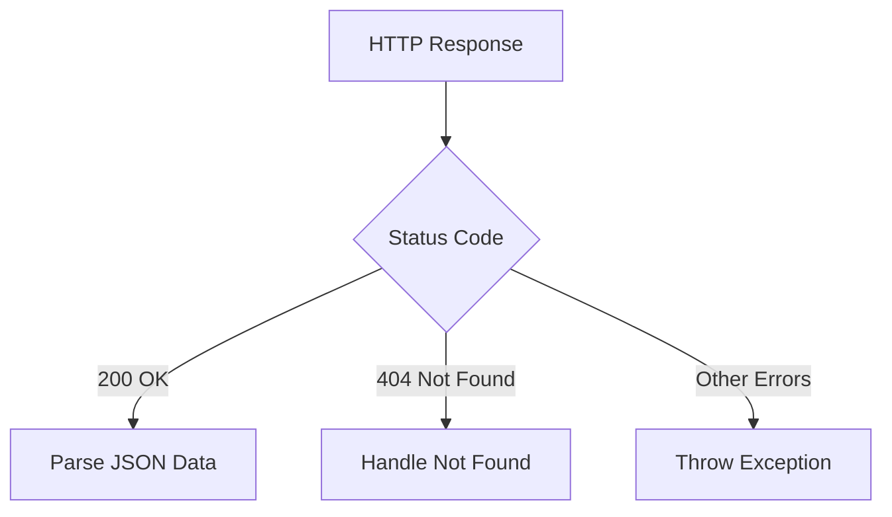

## 9.2.3 Handling Responses

Handling HTTP responses is a critical aspect of building robust and reliable applications in Flutter. When your app communicates with a server, it sends HTTP requests and receives responses. Understanding how to handle these responses effectively is essential for ensuring that your app behaves correctly under various conditions, such as network errors or unexpected server responses.

### Understanding HTTP Status Codes

HTTP status codes are three-digit numbers returned by the server to indicate the result of the request. They are categorized into five classes:

- **1xx (Informational):** Request received, continuing process.
- **2xx (Success):** The request was successfully received, understood, and accepted.
- **3xx (Redirection):** Further action needs to be taken to complete the request.
- **4xx (Client Error):** The request contains bad syntax or cannot be fulfilled.
- **5xx (Server Error):** The server failed to fulfill a valid request.

Understanding these codes is crucial for determining how to handle the response. For example, a `200 OK` status indicates success, while a `404 Not Found` status indicates that the requested resource could not be found.

### Parsing JSON and Other Response Formats

In modern web applications, JSON (JavaScript Object Notation) is the most commonly used format for data interchange. However, you might also encounter XML or plain text. Parsing these formats correctly is essential for extracting meaningful data from the response.

#### Parsing JSON

JSON is a lightweight data-interchange format that is easy for humans to read and write and easy for machines to parse and generate. In Dart, you can use the `dart:convert` library to decode JSON data into Dart objects.

```dart
import 'dart:convert';

void parseJsonResponse(String jsonResponse) {
  Map<String, dynamic> data = json.decode(jsonResponse);
  print('Parsed JSON: $data');
}
```

#### Parsing XML and Plain Text

While JSON is prevalent, you might need to handle XML or plain text responses. For XML, you can use packages like `xml` to parse the data. Plain text can be handled directly as a string.

### Handling Different Response Scenarios

When dealing with HTTP responses, you must handle various scenarios, including successful responses, client errors, and server errors.

#### Successful Responses

A successful response typically has a status code in the `2xx` range. For example, a `200 OK` status means the request was successful, and you can proceed to parse the response body.

```dart
if (response.statusCode == 200) {
  // Parse the JSON data
  Map<String, dynamic> data = json.decode(response.body);
  // Process the data
} else {
  // Handle other status codes
}
```

#### Client Errors

Client errors have status codes in the `4xx` range. These errors indicate issues with the request, such as a `404 Not Found` error when the requested resource does not exist.

```dart
if (response.statusCode == 404) {
  print('Resource not found.');
} else {
  // Handle other status codes
}
```

#### Server Errors

Server errors have status codes in the `5xx` range. These errors indicate that the server encountered an error while processing the request.

```dart
if (response.statusCode >= 500) {
  print('Server error. Please try again later.');
} else {
  // Handle other status codes
}
```

### Best Practices for Response Handling

To ensure your app is reliable and user-friendly, consider the following best practices when handling HTTP responses:

- **Check Status Codes:** Always check the status code of the response to determine the appropriate action.
- **Handle Errors Gracefully:** Provide meaningful error messages to the user and log errors for debugging purposes.
- **Use Timeouts:** Set timeouts for HTTP requests to prevent your app from hanging indefinitely.
- **Retry Logic:** Implement retry logic for transient errors, such as network timeouts or server overloads.
- **Secure Data Handling:** Ensure that sensitive data is handled securely, especially when dealing with authentication or personal information.

### Code Example

Here's a complete example demonstrating how to handle HTTP responses in Flutter:

```dart
import 'package:http/http.dart' as http;
import 'dart:convert';

Future<void> fetchPost(int id) async {
  try {
    final response = await http.get(Uri.parse('https://jsonplaceholder.typicode.com/posts/$id'));

    if (response.statusCode == 200) {
      Map<String, dynamic> data = json.decode(response.body);
      Post post = Post.fromJson(data);
      print('Title: ${post.title}');
    } else if (response.statusCode == 404) {
      print('Post not found.');
    } else {
      throw Exception('Failed to load post');
    }
  } catch (e) {
    print('An error occurred: $e');
  }
}

class Post {
  final int userId;
  final int id;
  final String title;
  final String body;

  Post({required this.userId, required this.id, required this.title, required this.body});

  factory Post.fromJson(Map<String, dynamic> json) {
    return Post(
      userId: json['userId'],
      id: json['id'],
      title: json['title'],
      body: json['body'],
    );
  }
}
```

### Visualizing the Response Handling Process

To better understand the flow of handling HTTP responses, consider the following Mermaid.js diagram:



This diagram illustrates the decision-making process based on the HTTP status code, guiding you through parsing data, handling errors, and throwing exceptions when necessary.

### Real-World Scenarios

In real-world applications, handling HTTP responses effectively can significantly impact user experience and app reliability. For instance, consider an e-commerce app that fetches product details from a server. If the server returns a `404 Not Found` error, the app should inform the user that the product is unavailable rather than crashing or displaying incorrect information.

### Conclusion

Handling HTTP responses is a fundamental skill for Flutter developers working with networked applications. By understanding HTTP status codes, parsing response formats, and implementing best practices, you can build robust and user-friendly apps that handle network interactions gracefully.

For further exploration, consider reading the official [Flutter documentation on networking](https://flutter.dev/docs/cookbook/networking/fetch-data) and exploring packages like `dio` for more advanced networking features.

## Quiz Time!



### What is the significance of HTTP status codes in handling responses?

- [x] They indicate the result of the HTTP request.
- [ ] They provide the server's IP address.
- [ ] They determine the size of the response body.
- [ ] They are used to encrypt the response data.

> **Explanation:** HTTP status codes indicate the result of the HTTP request, helping developers understand whether the request was successful or if there was an error.

### Which Dart library is commonly used for parsing JSON data?

- [x] dart:convert
- [ ] dart:io
- [ ] dart:async
- [ ] dart:core

> **Explanation:** The `dart:convert` library is used for encoding and decoding JSON data in Dart.

### What should you do if an HTTP response has a status code of 404?

- [x] Handle the error by informing the user that the resource was not found.
- [ ] Retry the request immediately.
- [ ] Assume the server is down and stop all network requests.
- [ ] Ignore the response and continue with default data.

> **Explanation:** A 404 status code indicates that the requested resource was not found, so it's important to handle this error gracefully by informing the user.

### What is a best practice when handling HTTP responses in Flutter?

- [x] Check the status code and handle errors gracefully.
- [ ] Always retry the request regardless of the status code.
- [ ] Only handle responses with status code 200.
- [ ] Ignore status codes and focus on the response body.

> **Explanation:** Checking the status code and handling errors gracefully is a best practice to ensure app reliability and a good user experience.

### Which of the following is a common format for HTTP response data?

- [x] JSON
- [x] XML
- [ ] CSV
- [ ] YAML

> **Explanation:** JSON and XML are common formats for HTTP response data, while CSV and YAML are less commonly used in this context.

### What should you do if an HTTP response has a status code of 500?

- [x] Inform the user of a server error and suggest trying again later.
- [ ] Retry the request immediately.
- [ ] Assume the client made a mistake and log the error.
- [ ] Ignore the response and continue with default data.

> **Explanation:** A 500 status code indicates a server error, so it's best to inform the user and suggest trying again later.

### How can you handle transient network errors in a Flutter app?

- [x] Implement retry logic with exponential backoff.
- [ ] Ignore the error and continue with cached data.
- [ ] Immediately retry the request without delay.
- [ ] Display an error message and stop all network requests.

> **Explanation:** Implementing retry logic with exponential backoff is a common strategy for handling transient network errors.

### What is the purpose of setting timeouts for HTTP requests?

- [x] To prevent the app from hanging indefinitely if the server does not respond.
- [ ] To ensure the server processes requests faster.
- [ ] To reduce the size of the response body.
- [ ] To encrypt the request data.

> **Explanation:** Setting timeouts helps prevent the app from hanging indefinitely if the server does not respond, ensuring a better user experience.

### Which package can be used for more advanced networking features in Flutter?

- [x] dio
- [ ] path_provider
- [ ] shared_preferences
- [ ] provider

> **Explanation:** The `dio` package offers more advanced networking features, such as interceptors and request cancellation.

### True or False: It is unnecessary to handle HTTP responses with status codes other than 200.

- [ ] True
- [x] False

> **Explanation:** It is essential to handle HTTP responses with various status codes to ensure the app can manage errors and provide a good user experience.


