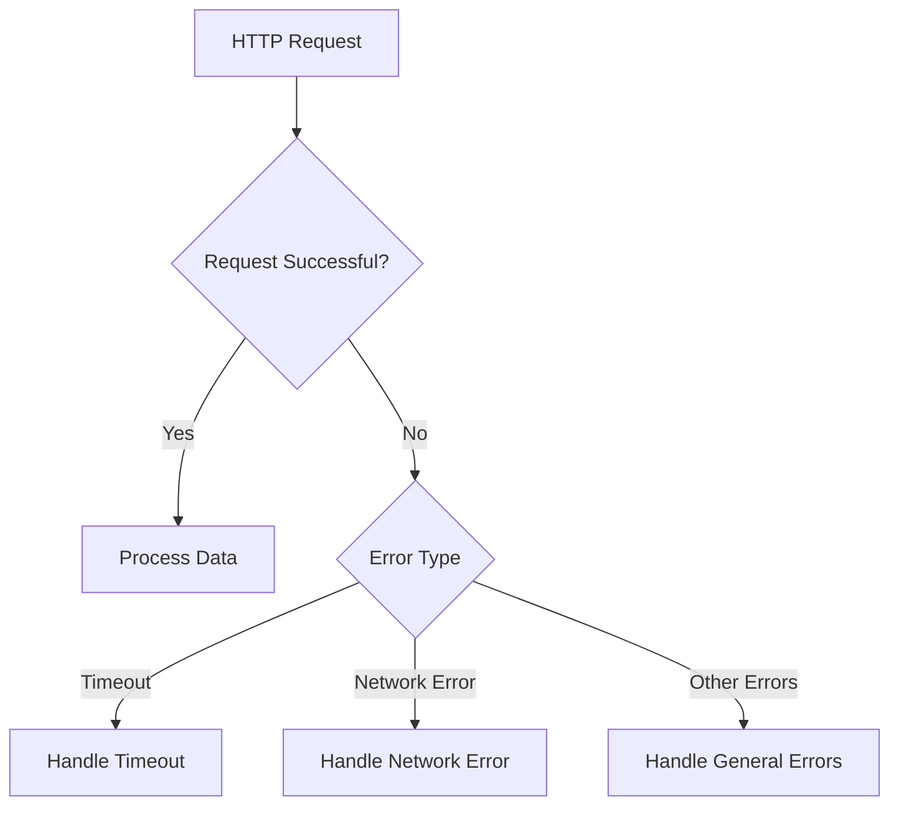

## 9.2.4 Error Handling

In the realm of mobile app development, particularly when dealing with network requests, robust error handling is not just a best practice—it's a necessity. Users expect seamless experiences, and any disruption due to network issues can lead to frustration and potential abandonment of your app. This section delves into the intricacies of error handling in Flutter, focusing on network-related errors, and provides strategies to manage these gracefully.

### Understanding Network-Related Errors

Network-related errors can arise from various sources, and understanding these is the first step towards handling them effectively. Here are some common types:

- **Network Issues**: These occur when the device cannot connect to the internet or the server is unreachable. This could be due to poor connectivity, server downtime, or DNS issues.
  
- **Timeouts**: A request might take too long to complete, often due to slow server responses or network latency. Setting a timeout ensures that your app doesn't hang indefinitely.

- **Invalid Responses**: Even if a request reaches the server, the response might not be what you expect. This includes HTTP status codes indicating errors (like 404 or 500) or malformed data that cannot be parsed.

### Using `try-catch` Blocks to Handle Exceptions

In Dart, the `try-catch` block is a powerful construct for managing exceptions. When making network requests, it's crucial to wrap your code in `try-catch` to handle potential errors gracefully.

Here's a practical example:

```dart
import 'package:http/http.dart' as http;
import 'dart:convert';
import 'dart:async';

Future<void> fetchDataWithHandling() async {
  try {
    final response = await http.get(Uri.parse('https://api.example.com/data')).timeout(Duration(seconds: 10));
    if (response.statusCode == 200) {
      // Process data
      var data = jsonDecode(response.body);
      print('Data received: $data');
    } else {
      // Handle non-200 status codes
      throw Exception('Failed to load data: ${response.statusCode}');
    }
  } on TimeoutException catch (_) {
    print('Request timed out');
  } on http.ClientException catch (e) {
    print('Network error: $e');
  } catch (e) {
    print('Unexpected error: $e');
  }
}
```

**Explanation:**

- **TimeoutException**: This specific catch block handles scenarios where the request exceeds the specified duration.
- **http.ClientException**: Captures network-related issues, such as connectivity problems.
- **Generic catch**: Catches any other exceptions that might occur, ensuring that no error goes unhandled.

### Providing User Feedback on Errors

User feedback is crucial when errors occur. Instead of leaving users in the dark, provide informative messages that guide them on what to do next. For instance, if a network error occurs, you might display a message like "Unable to connect. Please check your internet connection and try again."

Consider using Flutter's `SnackBar` or `Dialog` widgets to display error messages:

```dart
import 'package:flutter/material.dart';

void showError(BuildContext context, String message) {
  ScaffoldMessenger.of(context).showSnackBar(
    SnackBar(
      content: Text(message),
      duration: Duration(seconds: 3),
    ),
  );
}
```

### Implementing Retry Logic for Transient Failures

Transient failures, such as temporary network outages, can often be resolved by retrying the request. Implementing a retry mechanism can significantly improve user experience.

Here's a simple retry logic implementation:

```dart
Future<void> fetchDataWithRetry() async {
  int retryCount = 0;
  const maxRetries = 3;
  bool success = false;

  while (!success && retryCount < maxRetries) {
    try {
      final response = await http.get(Uri.parse('https://api.example.com/data')).timeout(Duration(seconds: 10));
      if (response.statusCode == 200) {
        // Process data
        success = true;
        print('Data received successfully');
      } else {
        throw Exception('Failed to load data: ${response.statusCode}');
      }
    } on TimeoutException catch (_) {
      retryCount++;
      print('Timeout occurred, retrying... ($retryCount/$maxRetries)');
    } on http.ClientException catch (e) {
      retryCount++;
      print('Network error: $e, retrying... ($retryCount/$maxRetries)');
    } catch (e) {
      print('Unexpected error: $e');
      break;
    }
  }

  if (!success) {
    print('Failed to fetch data after $maxRetries attempts.');
  }
}
```

**Explanation:**

- The loop attempts the request up to a maximum number of retries.
- Each failure increments the `retryCount`, and the process stops if the maximum is reached.
- This approach is useful for handling transient network issues without overwhelming the server with requests.

### Logging and Monitoring for Debugging Purposes

Logging errors is essential for diagnosing issues and improving your app's reliability. By capturing logs, you can analyze patterns and identify recurring problems.

Consider using a logging package like `logger` for structured logging:

```dart
import 'package:logger/logger.dart';

var logger = Logger();

void logError(String message, dynamic error) {
  logger.e(message, error);
}
```

**Best Practices for Logging:**

- **Log at Appropriate Levels**: Use different log levels (info, warning, error) to categorize messages.
- **Avoid Logging Sensitive Information**: Ensure that no personal or sensitive data is logged.
- **Use External Monitoring Tools**: Integrate with services like Firebase Crashlytics for real-time error reporting and analysis.

### Visualizing Error Handling with Mermaid.js

To better understand the flow of error handling, here's a Mermaid.js diagram illustrating the process:



**Diagram Explanation:**

- The diagram begins with an HTTP request.
- If successful, data is processed.
- If not, the error type is determined, and appropriate handling is executed based on the error category.

### Conclusion

Effective error handling is a cornerstone of robust app development. By anticipating potential issues and implementing strategies to manage them, you can significantly enhance the user experience and reliability of your Flutter applications. Remember to provide clear user feedback, implement retry mechanisms for transient errors, and log errors for ongoing improvement.

By mastering these techniques, you'll be well-equipped to handle the complexities of network requests in your Flutter projects, ensuring that your apps remain resilient and user-friendly.

## Quiz Time!



### What is a common cause of network-related errors?

- [x] Poor connectivity
- [ ] Incorrect user input
- [ ] High CPU usage
- [ ] Large app size

> **Explanation:** Poor connectivity is a common cause of network-related errors, affecting the ability to connect to the server.

### Which Dart construct is used to handle exceptions?

- [x] try-catch
- [ ] if-else
- [ ] switch-case
- [ ] loop

> **Explanation:** The `try-catch` construct is used in Dart to handle exceptions and manage errors gracefully.

### What should you do when a network request times out?

- [x] Implement retry logic
- [ ] Ignore the error
- [ ] Restart the app
- [ ] Display a loading spinner indefinitely

> **Explanation:** Implementing retry logic is a common approach to handle timeouts, allowing the app to attempt the request again.

### How can you provide user feedback on errors?

- [x] Use SnackBar or Dialog widgets
- [ ] Log the error silently
- [ ] Display a blank screen
- [ ] Terminate the app

> **Explanation:** SnackBar or Dialog widgets can be used to provide informative feedback to users when errors occur.

### What is the purpose of logging errors?

- [x] To diagnose issues and improve app reliability
- [ ] To increase app size
- [ ] To slow down the app
- [ ] To confuse users

> **Explanation:** Logging errors helps diagnose issues and improve the reliability of the app by providing insights into recurring problems.

### What is a transient failure?

- [x] A temporary network issue
- [ ] A permanent server error
- [ ] A user input error
- [ ] A UI rendering issue

> **Explanation:** A transient failure is a temporary network issue that can often be resolved by retrying the request.

### Which package can be used for structured logging in Flutter?

- [x] logger
- [ ] http
- [ ] provider
- [ ] shared_preferences

> **Explanation:** The `logger` package is used for structured logging in Flutter, providing different log levels and formatting options.

### What should you avoid logging?

- [x] Sensitive information
- [ ] Error messages
- [ ] Debug information
- [ ] API endpoints

> **Explanation:** Sensitive information should not be logged to protect user privacy and security.

### What is the benefit of using external monitoring tools?

- [x] Real-time error reporting and analysis
- [ ] Increased app size
- [ ] Slower app performance
- [ ] More complex code

> **Explanation:** External monitoring tools provide real-time error reporting and analysis, helping developers quickly identify and fix issues.

### True or False: Implementing retry logic can overwhelm the server with requests.

- [x] True
- [ ] False

> **Explanation:** True. While retry logic is useful, it must be implemented carefully to avoid overwhelming the server with excessive requests.


