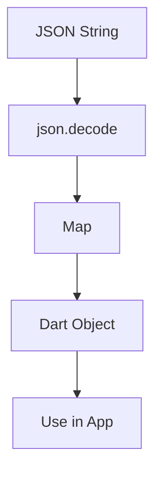

## 9.3.1 Decoding JSON

In the world of modern app development, interacting with web services and APIs is a common requirement. These services often communicate using JSON (JavaScript Object Notation), a lightweight data interchange format that is easy for humans to read and write, and easy for machines to parse and generate. In this section, we will explore how to decode JSON data in Flutter using Dart's `dart:convert` library, transforming JSON strings into Dart objects that your application can use.

### Understanding JSON and Its Role in APIs

JSON is a text-based format that represents structured data. It is widely used in web applications to transmit data between a server and a client. JSON data is composed of key-value pairs, arrays, and nested objects, making it flexible and powerful for representing complex data structures.

#### JSON Structure Example

Here's a simple JSON example representing a user:

```json
{
  "name": "John Doe",
  "email": "john.doe@example.com",
  "age": 30,
  "address": {
    "street": "123 Main St",
    "city": "Anytown",
    "zip": "12345"
  }
}
```

This JSON object contains basic user information, including a nested `address` object.

### Importing and Using the `dart:convert` Library

To decode JSON in Flutter, you need to use the `dart:convert` library, which provides the `json.decode` method to parse JSON strings into Dart objects.

#### Importing `dart:convert`

Before you can use the `json.decode` function, you need to import the `dart:convert` library:

```dart
import 'dart:convert';
```

### Using `json.decode` to Parse JSON Strings

The `json.decode` method takes a JSON string and converts it into a Dart object, typically a `Map<String, dynamic>` for JSON objects or a `List<dynamic>` for JSON arrays.

#### Basic JSON Decoding Example

Let's start with a simple example of decoding a JSON string into a Dart map:

```dart
import 'dart:convert';

void decodeJson(String jsonString) {
  Map<String, dynamic> user = json.decode(jsonString);
  print('Name: ${user['name']}');
  print('Email: ${user['email']}');
}

// Example usage
String jsonString = '{"name": "John Doe", "email": "john.doe@example.com"}';
decodeJson(jsonString);
```

In this example, the `json.decode` function parses the JSON string into a `Map<String, dynamic>`, allowing you to access the values using their keys.

### Mapping Parsed JSON to Dart Objects

While working with JSON data as maps is straightforward, it is often more convenient and safer to map this data to custom Dart classes. This approach provides type safety and makes your code more maintainable.

#### Creating a Dart Class for JSON Data

Consider the following Dart class representing a user:

```dart
class User {
  final String name;
  final String email;
  final int age;
  final Address address;

  User({required this.name, required this.email, required this.age, required this.address});

  factory User.fromJson(Map<String, dynamic> json) {
    return User(
      name: json['name'],
      email: json['email'],
      age: json['age'],
      address: Address.fromJson(json['address']),
    );
  }
}

class Address {
  final String street;
  final String city;
  final String zip;

  Address({required this.street, required this.city, required this.zip});

  factory Address.fromJson(Map<String, dynamic> json) {
    return Address(
      street: json['street'],
      city: json['city'],
      zip: json['zip'],
    );
  }
}
```

#### Decoding JSON into Dart Objects

With the `User` and `Address` classes defined, you can now decode JSON data into these objects:

```dart
void decodeJsonToUser(String jsonString) {
  Map<String, dynamic> userMap = json.decode(jsonString);
  User user = User.fromJson(userMap);
  print('Name: ${user.name}');
  print('Email: ${user.email}');
  print('City: ${user.address.city}');
}

// Example usage
String jsonString = '''
{
  "name": "John Doe",
  "email": "john.doe@example.com",
  "age": 30,
  "address": {
    "street": "123 Main St",
    "city": "Anytown",
    "zip": "12345"
  }
}
''';
decodeJsonToUser(jsonString);
```

### Handling Nested JSON Structures

JSON data often contains nested structures, such as arrays of objects or objects within objects. Handling these structures requires careful mapping to Dart classes.

#### Example of Nested JSON Decoding

Consider a JSON response that includes a list of users:

```json
{
  "users": [
    {
      "name": "John Doe",
      "email": "john.doe@example.com",
      "age": 30,
      "address": {
        "street": "123 Main St",
        "city": "Anytown",
        "zip": "12345"
      }
    },
    {
      "name": "Jane Smith",
      "email": "jane.smith@example.com",
      "age": 25,
      "address": {
        "street": "456 Elm St",
        "city": "Othertown",
        "zip": "67890"
      }
    }
  ]
}
```

To decode this JSON, you can create a `UserList` class:

```dart
class UserList {
  final List<User> users;

  UserList({required this.users});

  factory UserList.fromJson(Map<String, dynamic> json) {
    var usersJson = json['users'] as List;
    List<User> usersList = usersJson.map((userJson) => User.fromJson(userJson)).toList();
    return UserList(users: usersList);
  }
}
```

#### Decoding the List of Users

Here's how you can decode the JSON string into a `UserList` object:

```dart
void decodeJsonToUserList(String jsonString) {
  Map<String, dynamic> userListMap = json.decode(jsonString);
  UserList userList = UserList.fromJson(userListMap);
  for (var user in userList.users) {
    print('Name: ${user.name}, City: ${user.address.city}');
  }
}

// Example usage
String jsonString = '''
{
  "users": [
    {
      "name": "John Doe",
      "email": "john.doe@example.com",
      "age": 30,
      "address": {
        "street": "123 Main St",
        "city": "Anytown",
        "zip": "12345"
      }
    },
    {
      "name": "Jane Smith",
      "email": "jane.smith@example.com",
      "age": 25,
      "address": {
        "street": "456 Elm St",
        "city": "Othertown",
        "zip": "67890"
      }
    }
  ]
}
''';
decodeJsonToUserList(jsonString);
```

### Visualizing the JSON Decoding Process

To better understand the flow of decoding JSON into Dart objects, consider the following Mermaid.js diagram:



This diagram illustrates the transformation from a JSON string to a Dart object that can be utilized within your application.

### Best Practices and Common Pitfalls

- **Error Handling:** Always handle potential errors when decoding JSON, such as malformed JSON strings or missing keys. Use try-catch blocks to manage exceptions gracefully.
- **Type Safety:** Ensure that your Dart classes match the structure of the JSON data. Mismatches can lead to runtime errors.
- **Performance Considerations:** For large JSON data, consider using asynchronous operations to avoid blocking the main thread.
- **Testing:** Write unit tests for your JSON decoding logic to ensure it handles various scenarios correctly.

### Further Exploration

To deepen your understanding of JSON decoding in Flutter, consider exploring the following resources:

- [Dart `dart:convert` Library Documentation](https://api.dart.dev/stable/dart-convert/dart-convert-library.html)
- [Flutter JSON and Serialization Guide](https://flutter.dev/docs/development/data-and-backend/json)
- [Effective Dart: Style](https://dart.dev/guides/language/effective-dart/style)

### Conclusion

Decoding JSON is a fundamental skill in Flutter development, enabling your app to interact with web services and APIs effectively. By mastering JSON parsing and mapping data to Dart objects, you can build robust applications that handle complex data structures with ease. Practice these techniques in your projects to gain confidence and proficiency in working with JSON in Flutter.

## Quiz Time!



### What is the primary purpose of the `dart:convert` library in Flutter?

- [x] To decode JSON data into Dart objects
- [ ] To convert Dart objects into XML
- [ ] To handle image processing
- [ ] To manage state in Flutter apps

> **Explanation:** The `dart:convert` library is used to decode JSON data into Dart objects, making it essential for handling API responses.

### Which method is used to parse a JSON string into a Dart object?

- [x] `json.decode`
- [ ] `json.encode`
- [ ] `json.parse`
- [ ] `json.stringify`

> **Explanation:** The `json.decode` method is used to parse a JSON string into a Dart object, typically a map or list.

### What type of Dart object is typically returned by `json.decode` when parsing a JSON object?

- [x] `Map<String, dynamic>`
- [ ] `List<dynamic>`
- [ ] `String`
- [ ] `int`

> **Explanation:** When parsing a JSON object, `json.decode` typically returns a `Map<String, dynamic>`.

### How can you handle nested JSON structures in Dart?

- [x] By creating nested Dart classes and using factory constructors
- [ ] By using only primitive data types
- [ ] By ignoring nested structures
- [ ] By converting JSON to XML first

> **Explanation:** Nested JSON structures can be handled by creating corresponding nested Dart classes and using factory constructors to map JSON data to these classes.

### What is a common pitfall when decoding JSON in Dart?

- [x] Mismatching Dart class structure with JSON data
- [ ] Using too many imports
- [ ] Writing too many comments
- [ ] Using JSON for small data sets

> **Explanation:** A common pitfall is mismatching the Dart class structure with the JSON data, which can lead to runtime errors.

### Which of the following is a best practice when decoding JSON?

- [x] Handling potential errors with try-catch blocks
- [ ] Ignoring errors and assuming JSON is always correct
- [ ] Using synchronous operations for large JSON data
- [ ] Avoiding unit tests for JSON decoding logic

> **Explanation:** It is a best practice to handle potential errors with try-catch blocks to manage exceptions gracefully.

### What is the benefit of mapping JSON data to Dart classes?

- [x] Provides type safety and makes code more maintainable
- [ ] Increases the complexity of the code
- [ ] Reduces the performance of the app
- [ ] Makes the app incompatible with APIs

> **Explanation:** Mapping JSON data to Dart classes provides type safety and makes the code more maintainable.

### Which of the following resources can help you learn more about JSON decoding in Flutter?

- [x] Dart `dart:convert` Library Documentation
- [ ] Flutter Animation Guide
- [ ] Flutter State Management Guide
- [ ] Dart Concurrency Guide

> **Explanation:** The Dart `dart:convert` Library Documentation is a valuable resource for learning more about JSON decoding.

### True or False: JSON is a binary data format.

- [ ] True
- [x] False

> **Explanation:** JSON is a text-based data format, not binary.

### True or False: The `json.encode` method is used to decode JSON strings.

- [ ] True
- [x] False

> **Explanation:** The `json.encode` method is used to encode Dart objects into JSON strings, not to decode them.


