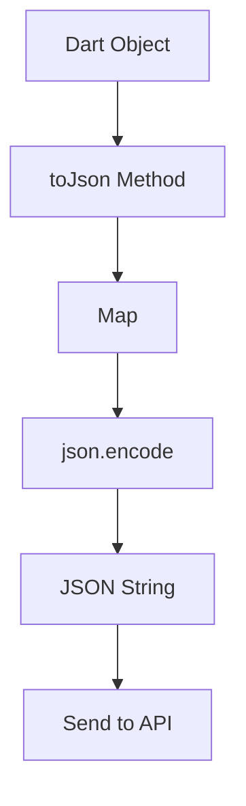

## 9.3.2 Encoding JSON

In the realm of modern app development, communicating with web services is a fundamental necessity. JSON (JavaScript Object Notation) has become the de facto standard for data interchange between clients and servers due to its lightweight and human-readable format. In Flutter, encoding Dart objects into JSON strings is a crucial step when sending data to APIs. This section will guide you through the process of encoding JSON in Dart, focusing on the use of the `json.encode` method and the implementation of serialization methods (`toJson`) in Dart classes.

### Understanding JSON Encoding

JSON encoding is the process of converting Dart objects into a JSON string format. This is essential when you need to send structured data over the network to a web service or API. The Dart `dart:convert` library provides the `json.encode` function, which is used to serialize Dart objects into JSON strings.

### Using `json.encode` to Serialize Dart Objects

The `json.encode` function is a straightforward way to convert Dart objects into JSON strings. It takes a Dart object and returns a JSON-encoded string. However, for `json.encode` to work, the Dart object must be convertible to a JSON-compatible format, typically a `Map<String, dynamic>`.

Here's a simple example of using `json.encode`:

```dart
import 'dart:convert';

class User {
  final String name;
  final String email;

  User({required this.name, required this.email});

  Map<String, dynamic> toJson() {
    return {
      'name': name,
      'email': email,
    };
  }
}

void encodeJson(User user) {
  String jsonString = json.encode(user.toJson());
  print(jsonString);
}

// Example usage
User user = User(name: 'Jane Doe', email: 'jane.doe@example.com');
encodeJson(user);
```

In this example, the `User` class has a `toJson` method that converts the object into a `Map<String, dynamic>`. This map is then passed to `json.encode`, which serializes it into a JSON string.

### Implementing `toJson` Methods in Dart Classes

To enable JSON encoding, each Dart class that you want to serialize must implement a `toJson` method. This method should return a `Map<String, dynamic>` representation of the object. The keys in the map should be strings, and the values should be JSON-compatible types such as strings, numbers, lists, or other maps.

#### Example: Implementing `toJson` in a Dart Class

Consider a `Product` class that represents an item in an e-commerce app:

```dart
class Product {
  final int id;
  final String name;
  final double price;
  final List<String> tags;

  Product({required this.id, required this.name, required this.price, required this.tags});

  Map<String, dynamic> toJson() {
    return {
      'id': id,
      'name': name,
      'price': price,
      'tags': tags,
    };
  }
}
```

In this `Product` class, the `toJson` method converts the object into a map, making it ready for JSON encoding.

### Ensuring Data Compatibility with API Requirements

When encoding JSON, it's crucial to ensure that the data structure and types match the API's requirements. APIs often expect specific field names and data types, so your `toJson` method must align with these expectations.

#### Handling Data Types During Serialization

Dart's strong typing system helps ensure that data types are consistent. However, when dealing with JSON, you must be mindful of how different types are represented. For example, JSON does not support `DateTime` objects directly. You must convert `DateTime` to a string format, such as ISO 8601, before encoding.

```dart
class Event {
  final String title;
  final DateTime date;

  Event({required this.title, required this.date});

  Map<String, dynamic> toJson() {
    return {
      'title': title,
      'date': date.toIso8601String(),
    };
  }
}
```

In this `Event` class, the `date` field is converted to an ISO 8601 string using `toIso8601String()`.

### Sending JSON Data in HTTP Requests

Once you have a JSON string, you can send it in an HTTP request to an API. Typically, this involves setting the `Content-Type` header to `application/json` and including the JSON string in the request body.

#### Example: Sending JSON Data with HTTP POST

Here's how you might send a JSON-encoded `User` object in an HTTP POST request using the `http` package:

```dart
import 'dart:convert';
import 'package:http/http.dart' as http;

Future<void> sendUserData(User user) async {
  final url = Uri.parse('https://example.com/api/users');
  final response = await http.post(
    url,
    headers: {'Content-Type': 'application/json'},
    body: json.encode(user.toJson()),
  );

  if (response.statusCode == 200) {
    print('User data sent successfully');
  } else {
    print('Failed to send user data: ${response.statusCode}');
  }
}
```

In this example, the `sendUserData` function sends a `User` object to a specified API endpoint. The `json.encode` function is used to serialize the user data, and the `http.post` method sends the data with the appropriate headers.

### Visualizing the Encoding Process

To better understand the flow of encoding Dart objects to JSON, consider the following Mermaid.js diagram:



- **Dart Object**: The initial object you want to encode.
- **toJson Method**: Converts the object into a map.
- **Map<String, dynamic>**: The intermediate representation.
- **json.encode**: Serializes the map into a JSON string.
- **JSON String**: The final encoded data ready for transmission.
- **Send to API**: The JSON string is sent over the network.

### Best Practices for JSON Encoding

- **Consistency**: Ensure that your `toJson` methods are consistent across your application to avoid discrepancies in data representation.
- **Validation**: Validate your data before encoding to prevent sending invalid or incomplete data to the API.
- **Error Handling**: Implement error handling for network requests to manage failures gracefully.
- **Documentation**: Keep your API documentation handy to ensure your JSON structure aligns with the API's expectations.

### Common Pitfalls and Challenges

- **Data Type Mismatches**: Ensure that your Dart data types are compatible with JSON. For example, convert `DateTime` to strings.
- **Missing Fields**: If a field is missing in the `toJson` method, it won't be included in the JSON output, potentially leading to errors.
- **Complex Nested Structures**: When dealing with nested objects, ensure each nested object also implements a `toJson` method.

### Further Exploration

For more in-depth understanding and advanced techniques, consider exploring the following resources:

- [Dart's `dart:convert` library documentation](https://api.dart.dev/stable/dart-convert/dart-convert-library.html)
- [Flutter's official guide on networking](https://flutter.dev/docs/cookbook/networking)
- Books like "Flutter in Action" by Eric Windmill for comprehensive insights into Flutter development.

### Conclusion

Encoding JSON in Dart is a fundamental skill for any Flutter developer working with APIs. By implementing `toJson` methods in your classes and using `json.encode`, you can efficiently serialize Dart objects into JSON strings, ensuring seamless communication with web services. Remember to adhere to best practices and validate your data to maintain robust and reliable applications.

---

## Quiz Time!



### What is the primary purpose of JSON encoding in Dart?

- [x] To convert Dart objects into JSON strings for API communication.
- [ ] To convert JSON strings into Dart objects.
- [ ] To store data locally on the device.
- [ ] To encrypt data for secure transmission.

> **Explanation:** JSON encoding is used to convert Dart objects into JSON strings, which are then sent to APIs for communication.

### Which Dart library provides the `json.encode` function?

- [x] `dart:convert`
- [ ] `dart:core`
- [ ] `dart:async`
- [ ] `dart:io`

> **Explanation:** The `dart:convert` library provides the `json.encode` function for encoding Dart objects into JSON strings.

### What must a Dart class implement to be JSON-encoded using `json.encode`?

- [x] A `toJson` method that returns a `Map<String, dynamic>`.
- [ ] A `fromJson` method that returns a `Map<String, dynamic>`.
- [ ] A `toString` method that returns a JSON string.
- [ ] A `toMap` method that returns a `Map<String, dynamic>`.

> **Explanation:** A Dart class must implement a `toJson` method that returns a `Map<String, dynamic>` to be JSON-encoded using `json.encode`.

### What is a common issue when encoding `DateTime` objects in JSON?

- [x] JSON does not support `DateTime` objects directly, so they must be converted to strings.
- [ ] JSON automatically converts `DateTime` objects to timestamps.
- [ ] JSON supports `DateTime` objects natively without conversion.
- [ ] JSON requires `DateTime` objects to be in milliseconds since epoch.

> **Explanation:** JSON does not support `DateTime` objects directly, so they must be converted to a string format, such as ISO 8601, before encoding.

### Which HTTP method is typically used to send JSON data to an API?

- [x] POST
- [ ] GET
- [ ] DELETE
- [ ] PATCH

> **Explanation:** The POST method is typically used to send JSON data to an API, as it allows for sending data in the request body.

### What should you include in the HTTP request headers when sending JSON data?

- [x] `Content-Type: application/json`
- [ ] `Accept: text/plain`
- [ ] `Authorization: Bearer token`
- [ ] `Content-Length: 0`

> **Explanation:** When sending JSON data, you should include the `Content-Type: application/json` header to indicate the format of the data being sent.

### What is the role of the `toJson` method in a Dart class?

- [x] To convert the class instance into a `Map<String, dynamic>` for JSON encoding.
- [ ] To convert JSON strings into class instances.
- [ ] To serialize the class instance into a binary format.
- [ ] To encrypt the class instance for secure storage.

> **Explanation:** The `toJson` method converts the class instance into a `Map<String, dynamic>`, making it ready for JSON encoding.

### What is a potential pitfall when encoding nested objects in JSON?

- [x] Each nested object must also implement a `toJson` method.
- [ ] Nested objects are automatically encoded without additional methods.
- [ ] JSON does not support nested objects.
- [ ] Nested objects must be flattened before encoding.

> **Explanation:** When encoding nested objects, each nested object must implement its own `toJson` method to ensure proper serialization.

### Why is it important to validate data before JSON encoding?

- [x] To prevent sending invalid or incomplete data to the API.
- [ ] To ensure the data is encrypted.
- [ ] To reduce the size of the JSON string.
- [ ] To automatically correct data types.

> **Explanation:** Validating data before JSON encoding helps prevent sending invalid or incomplete data to the API, ensuring data integrity and compliance with API requirements.

### True or False: JSON encoding is only necessary for sending data to APIs, not for receiving data.

- [ ] True
- [x] False

> **Explanation:** JSON encoding is specifically for sending data to APIs, while JSON decoding is used for receiving and interpreting data from APIs.


