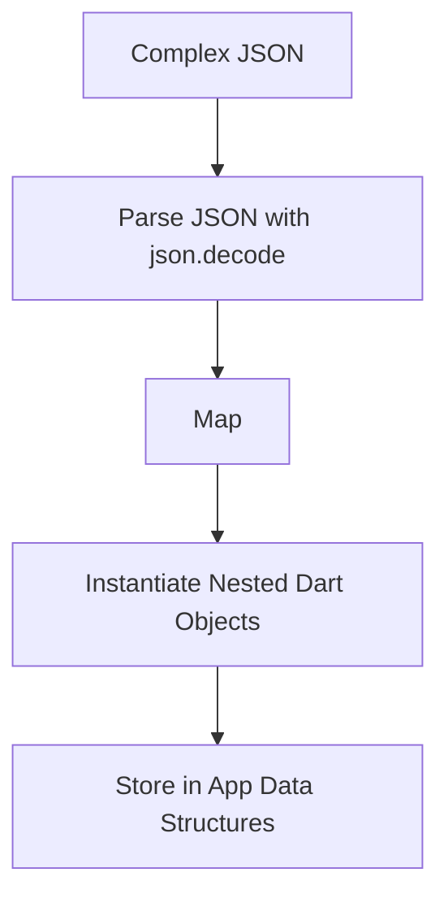

## 9.3.3 Working with Complex JSON

In the world of mobile app development, interacting with web services and APIs is a common task. These services often return data in JSON format, which is lightweight and easy to parse. However, when dealing with complex JSON structures, such as deeply nested objects and arrays, parsing can become challenging. This section will guide you through the process of handling complex JSON data in Flutter using Dart, focusing on strategies to maintain readability and efficiency in your code.

### Understanding Complex JSON Structures

JSON (JavaScript Object Notation) is a text-based format for representing structured data. It is widely used for data interchange between a server and a client. A typical JSON object might look simple, but real-world applications often require handling more complex structures. These can include nested objects, arrays of objects, and combinations thereof.

#### Example of a Complex JSON Structure

Consider the following JSON structure representing a user profile with nested address and contact information:

```json
{
  "name": "Alice Smith",
  "email": "alice.smith@example.com",
  "address": {
    "street": "123 Maple Street",
    "city": "Springfield",
    "country": "USA"
  },
  "contacts": [
    {
      "type": "home",
      "number": "123-456-7890"
    },
    {
      "type": "work",
      "number": "987-654-3210"
    }
  ]
}
```

This JSON includes nested objects (`address`) and an array of objects (`contacts`). Parsing such structures requires a systematic approach.

### Strategies for Parsing Complex JSON

To effectively parse complex JSON data, you should:

- **Create Dart Classes**: Define classes that mirror the structure of your JSON data.
- **Use Factory Constructors**: Implement factory constructors to handle the conversion from JSON to Dart objects.
- **Maintain Readability**: Organize your code to ensure it remains readable and maintainable.

#### Creating Dart Classes for Nested Structures

For each nested structure in your JSON, create a corresponding Dart class. This approach not only helps in organizing your code but also makes it easier to manage and extend.

**Example Dart Classes for the JSON Structure**

```dart
import 'dart:convert';

// Address class to represent the nested address object
class Address {
  final String street;
  final String city;
  final String country;

  Address({required this.street, required this.city, required this.country});

  factory Address.fromJson(Map<String, dynamic> json) {
    return Address(
      street: json['street'],
      city: json['city'],
      country: json['country'],
    );
  }

  Map<String, dynamic> toJson() {
    return {
      'street': street,
      'city': city,
      'country': country,
    };
  }
}

// Contact class to represent each contact in the contacts array
class Contact {
  final String type;
  final String number;

  Contact({required this.type, required this.number});

  factory Contact.fromJson(Map<String, dynamic> json) {
    return Contact(
      type: json['type'],
      number: json['number'],
    );
  }

  Map<String, dynamic> toJson() {
    return {
      'type': type,
      'number': number,
    };
  }
}

// User class to represent the main user object
class User {
  final String name;
  final String email;
  final Address address;
  final List<Contact> contacts;

  User({required this.name, required this.email, required this.address, required this.contacts});

  factory User.fromJson(Map<String, dynamic> json) {
    var contactsFromJson = json['contacts'] as List;
    List<Contact> contactList = contactsFromJson.map((contactJson) => Contact.fromJson(contactJson)).toList();

    return User(
      name: json['name'],
      email: json['email'],
      address: Address.fromJson(json['address']),
      contacts: contactList,
    );
  }

  Map<String, dynamic> toJson() {
    return {
      'name': name,
      'email': email,
      'address': address.toJson(),
      'contacts': contacts.map((contact) => contact.toJson()).toList(),
    };
  }
}
```

### Using Factory Constructors for Complex Deserialization

Factory constructors in Dart are a powerful feature for creating instances of a class. They are particularly useful for deserializing JSON data into Dart objects. By using factory constructors, you can encapsulate the logic required to parse JSON data, making your code cleaner and more maintainable.

**Example of Using Factory Constructors**

In the `User` class above, the factory constructor `User.fromJson` is used to parse the JSON data. It handles the conversion of nested JSON objects and arrays into Dart objects:

- The `address` field is parsed using `Address.fromJson`.
- The `contacts` array is parsed by mapping each JSON object in the array to a `Contact` object using `Contact.fromJson`.

### Best Practices for Readable and Maintainable Code

When working with complex JSON data, it's crucial to keep your code organized and maintainable. Here are some best practices:

- **Modularize Your Code**: Break down your code into smaller, reusable components. Each class should handle a specific part of the JSON structure.
- **Use Descriptive Names**: Name your classes and variables clearly to reflect their purpose and the data they represent.
- **Document Your Code**: Use comments to explain complex logic and document the purpose of each class and method.
- **Test Your Parsing Logic**: Write unit tests to ensure your parsing logic works correctly, especially when dealing with optional fields or varying data structures.

### Practical Example: Parsing Complex JSON

Let's put everything together in a practical example. We'll parse the JSON string into a `User` object and print out some of its properties.

```dart
void parseComplexJson(String jsonString) {
  Map<String, dynamic> data = json.decode(jsonString);
  User user = User.fromJson(data);
  print('Name: ${user.name}');
  print('Email: ${user.email}');
  print('City: ${user.address.city}');
  print('Contacts:');
  for (var contact in user.contacts) {
    print('  ${contact.type}: ${contact.number}');
  }
}

// Example usage
String jsonString = '''
{
  "name": "Alice Smith",
  "email": "alice.smith@example.com",
  "address": {
    "street": "123 Maple Street",
    "city": "Springfield",
    "country": "USA"
  },
  "contacts": [
    {
      "type": "home",
      "number": "123-456-7890"
    },
    {
      "type": "work",
      "number": "987-654-3210"
    }
  ]
}
''';

parseComplexJson(jsonString);
```

### Visualizing the Parsing Process

To better understand the flow of parsing complex JSON, let's visualize the process using a Mermaid.js diagram:



### Conclusion

Parsing complex JSON structures in Flutter requires a thoughtful approach to ensure your code remains efficient and maintainable. By creating Dart classes that mirror your JSON data, using factory constructors for deserialization, and following best practices, you can handle even the most intricate JSON structures with ease. As you continue to work with APIs and JSON data, these strategies will prove invaluable in building robust and scalable Flutter applications.

### Further Reading and Resources

- [Dart Language Tour](https://dart.dev/guides/language/language-tour): Official Dart documentation for understanding language features.
- [Flutter JSON and Serialization](https://flutter.dev/docs/development/data-and-backend/json): Flutter's guide on handling JSON data.
- [Effective Dart: Style](https://dart.dev/guides/language/effective-dart/style): Best practices for writing clean and maintainable Dart code.

By mastering these techniques, you'll be well-equipped to tackle any JSON parsing challenges you encounter in your Flutter development journey.

## Quiz Time!



### What is the primary purpose of creating Dart classes for JSON structures?

- [x] To mirror the JSON structure and facilitate parsing
- [ ] To make the code more complex
- [ ] To avoid using factory constructors
- [ ] To eliminate the need for JSON decoding

> **Explanation:** Creating Dart classes that mirror the JSON structure helps in organizing the code and facilitates easy parsing and serialization.

### How does a factory constructor help in JSON parsing?

- [x] It encapsulates the logic for creating an instance from JSON
- [ ] It automatically decodes JSON without any logic
- [ ] It is used to create multiple instances at once
- [ ] It replaces the need for regular constructors

> **Explanation:** Factory constructors encapsulate the logic needed to create an instance of a class from JSON data, making the code cleaner and more maintainable.

### What is the role of the `json.decode` function in Dart?

- [x] It converts a JSON string into a Dart object
- [ ] It encodes a Dart object into a JSON string
- [ ] It validates JSON syntax
- [ ] It formats JSON data for display

> **Explanation:** The `json.decode` function is used to convert a JSON string into a Dart object, typically a `Map<String, dynamic>`.

### Why is it important to modularize code when dealing with complex JSON?

- [x] To improve readability and maintainability
- [ ] To increase the complexity of the code
- [ ] To make debugging more difficult
- [ ] To avoid using classes

> **Explanation:** Modularizing code improves readability and maintainability by breaking down complex logic into smaller, manageable components.

### What is a common use case for using a list of objects in JSON?

- [x] Representing a collection of similar items, such as contacts
- [ ] Storing a single value
- [ ] Encoding a single object
- [ ] Avoiding nested structures

> **Explanation:** A list of objects in JSON is commonly used to represent a collection of similar items, such as a list of contacts or products.

### What should you consider when naming classes and variables in your Dart code?

- [x] Use descriptive names that reflect their purpose
- [ ] Use short, cryptic names
- [ ] Avoid using names that relate to their function
- [ ] Use random names for variety

> **Explanation:** Descriptive names help in understanding the purpose of classes and variables, making the code easier to read and maintain.

### How can you handle optional fields in JSON when parsing?

- [x] Use null-aware operators and default values
- [ ] Ignore them completely
- [ ] Throw an error if they are missing
- [ ] Always assume they are present

> **Explanation:** Using null-aware operators and default values allows you to handle optional fields gracefully without errors.

### What is the benefit of writing unit tests for your JSON parsing logic?

- [x] To ensure the parsing logic works correctly
- [ ] To make the code more complex
- [ ] To avoid using factory constructors
- [ ] To eliminate the need for JSON decoding

> **Explanation:** Writing unit tests ensures that your parsing logic handles various scenarios correctly, improving the reliability of your code.

### What is the purpose of the `toJson` method in Dart classes?

- [x] To convert a Dart object back into a JSON-compatible format
- [ ] To decode JSON strings
- [ ] To validate JSON syntax
- [ ] To format JSON data for display

> **Explanation:** The `toJson` method is used to convert a Dart object back into a JSON-compatible format, typically a `Map<String, dynamic>`.

### True or False: JSON arrays can only contain primitive data types.

- [ ] True
- [x] False

> **Explanation:** JSON arrays can contain any type of data, including objects, arrays, and primitive data types.


