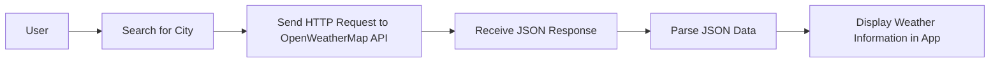

---

linkTitle: "9.4.1 Project Overview"
title: "Weather App Project Overview: Building with OpenWeatherMap API"
description: "Explore the development of a Flutter Weather App using OpenWeatherMap API, focusing on HTTP requests, JSON parsing, and state management."
categories:
- Flutter Development
- Mobile App Development
- API Integration
tags:
- Flutter
- OpenWeatherMap
- Networking
- JSON Parsing
- State Management
date: 2024-10-25
type: docs
nav_weight: 941000
canonical: "https://fluttermasterylibrary.com/4/9/4/1"
license: "© 2023 Tokenizer Inc. CC BY-NC-SA 4.0"
---

## 9.4.1 Project Overview

In this section, we embark on an exciting journey to build a Weather App using Flutter and the OpenWeatherMap API. This hands-on project will guide you through the process of integrating a third-party API to fetch and display real-time weather data. By the end of this project, you will have a functional app that allows users to search for cities and view current weather conditions, including temperature, humidity, and weather descriptions.

### Project Objectives and Features

The primary goal of this project is to create a user-friendly Weather App that showcases the power of Flutter in building networked applications. Here are the key features and objectives we aim to achieve:

- **Search for Cities:** Users can input the name of a city to retrieve weather information. This involves handling user input and validating it to ensure accurate searches.
  
- **Display Current Weather Information:** Once a city is searched, the app will display the current weather conditions, including temperature, humidity, wind speed, and a brief weather description. This data will be fetched from the OpenWeatherMap API.

- **Handle User Input and Display Errors:** The app will provide feedback for invalid inputs or network errors, ensuring a smooth user experience.

### Technologies and Packages Used

To build this Weather App, we will leverage several key technologies and packages that are essential for networking and state management in Flutter:

- **HTTP Package:** We will use the `http` package to send HTTP requests to the OpenWeatherMap API and handle responses. This package simplifies the process of making network calls and managing data retrieval.

- **Provider Package:** For state management, we will utilize the `provider` package. This package allows us to manage and propagate state changes efficiently across the app, especially when dealing with asynchronous data from API calls.

### Expected Learning Outcomes

By completing this project, you will gain valuable skills and insights into building networked Flutter applications. Here are the key learning outcomes:

- **Building Networked Flutter Apps:** You will learn how to integrate external APIs into your Flutter app, enabling it to fetch and display dynamic data.

- **Managing State with Asynchronous Data:** The project will teach you how to handle asynchronous data using state management solutions like `provider`, ensuring that your app remains responsive and efficient.

- **Parsing and Displaying API Data:** You will gain experience in parsing JSON data from API responses and displaying it in a user-friendly format within your app.

### Project Workflow

To provide a clear understanding of the workflow involved in this project, let's visualize the process using a Mermaid.js diagram:



This diagram outlines the sequence of actions from the user's perspective, starting with a city search and culminating in the display of weather information. Each step involves specific tasks that we will cover in detail throughout the project.

### Practical Code Examples

To illustrate the implementation of key features, let's explore some practical code snippets that demonstrate how to achieve the objectives outlined above.

#### Sending HTTP Requests

To fetch weather data, we will use the `http` package to send a GET request to the OpenWeatherMap API. Here's a basic example of how to perform this task:

```dart
import 'package:http/http.dart' as http;
import 'dart:convert';

Future<Map<String, dynamic>> fetchWeatherData(String city) async {
  final apiKey = 'YOUR_API_KEY';
  final url = 'https://api.openweathermap.org/data/2.5/weather?q=$city&appid=$apiKey';

  final response = await http.get(Uri.parse(url));

  if (response.statusCode == 200) {
    return json.decode(response.body);
  } else {
    throw Exception('Failed to load weather data');
  }
}
```

In this code snippet, we define a function `fetchWeatherData` that takes a city name as input and returns a map containing the weather data. We construct the API URL using the city name and our API key, then send a GET request. If the request is successful, we parse the JSON response and return it; otherwise, we throw an exception.

#### Parsing JSON Data

Once we receive the JSON response, we need to extract relevant information to display in the app. Here's an example of how to parse the JSON data:

```dart
void displayWeather(Map<String, dynamic> weatherData) {
  final temperature = weatherData['main']['temp'];
  final description = weatherData['weather'][0]['description'];
  final humidity = weatherData['main']['humidity'];

  print('Temperature: $temperature');
  print('Weather: $description');
  print('Humidity: $humidity');
}
```

In this snippet, we extract the temperature, weather description, and humidity from the JSON data and print them to the console. This data will later be displayed in the app's UI.

#### Managing State with Provider

To manage state effectively, we will use the `provider` package. Here's a basic setup for managing weather data state:

```dart
import 'package:flutter/material.dart';
import 'package:provider/provider.dart';

class WeatherProvider with ChangeNotifier {
  Map<String, dynamic> _weatherData;

  Map<String, dynamic> get weatherData => _weatherData;

  Future<void> fetchWeather(String city) async {
    _weatherData = await fetchWeatherData(city);
    notifyListeners();
  }
}

void main() {
  runApp(
    ChangeNotifierProvider(
      create: (context) => WeatherProvider(),
      child: MyApp(),
    ),
  );
}
```

In this example, we define a `WeatherProvider` class that extends `ChangeNotifier`. This class holds the weather data and provides a method `fetchWeather` to update it. By calling `notifyListeners`, we ensure that any UI components listening to this provider are updated when the data changes.

### Real-World Scenarios and Challenges

Building a Weather App involves several real-world challenges that you may encounter in professional app development:

- **Handling Network Errors:** Network requests can fail due to various reasons, such as connectivity issues or invalid API keys. Implementing robust error handling is crucial to provide a seamless user experience.

- **User Input Validation:** Ensuring that user input is valid and meaningful is essential to prevent unnecessary API calls and improve app performance.

- **Responsive UI Design:** Designing a responsive and intuitive UI that adapts to different screen sizes and orientations enhances user engagement.

### Best Practices and Tips

Here are some best practices and tips to keep in mind while working on this project:

- **Use Environment Variables:** Store sensitive information like API keys in environment variables or secure storage to prevent exposure.

- **Optimize Network Calls:** Minimize the number of network calls by caching data locally when appropriate, reducing latency and improving performance.

- **Test Thoroughly:** Test your app on various devices and network conditions to ensure reliability and robustness.

### Additional Resources

To deepen your understanding of the concepts covered in this project, consider exploring the following resources:

- [Flutter Official Documentation](https://flutter.dev/docs): Comprehensive guides and tutorials on Flutter development.
- [OpenWeatherMap API Documentation](https://openweathermap.org/api): Detailed information on using the OpenWeatherMap API.
- [Provider Package Documentation](https://pub.dev/packages/provider): Official documentation for the `provider` package.

By the end of this project, you will have a solid foundation in building networked Flutter apps, managing state with asynchronous data, and parsing and displaying API data. This knowledge will empower you to tackle more complex projects and expand your skills in mobile app development.

## Quiz Time!



### What is the primary goal of the Weather App project?

- [x] To create a user-friendly app that fetches and displays weather data from an API.
- [ ] To build a static app with hardcoded weather data.
- [ ] To develop a game using weather data.
- [ ] To create a weather forecasting algorithm.

> **Explanation:** The primary goal is to create a user-friendly app that fetches and displays real-time weather data from the OpenWeatherMap API.

### Which package is used for networking in the Weather App project?

- [x] `http`
- [ ] `dio`
- [ ] `flutter_network`
- [ ] `connectivity`

> **Explanation:** The `http` package is used for making HTTP requests to the OpenWeatherMap API.

### What is the purpose of the `provider` package in this project?

- [x] To manage state and propagate changes across the app.
- [ ] To handle network requests.
- [ ] To parse JSON data.
- [ ] To design the app's UI.

> **Explanation:** The `provider` package is used for state management, allowing the app to manage and propagate state changes efficiently.

### What type of data format is used to receive weather information from the API?

- [x] JSON
- [ ] XML
- [ ] CSV
- [ ] YAML

> **Explanation:** The weather information is received in JSON format, which is commonly used for API responses.

### Which of the following is a key feature of the Weather App?

- [x] Searching for cities to display weather information.
- [ ] Predicting future weather conditions.
- [ ] Displaying historical weather data.
- [ ] Providing weather alerts.

> **Explanation:** A key feature is allowing users to search for cities to display current weather information.

### What should be done if the API request fails?

- [x] Implement error handling to provide feedback to the user.
- [ ] Ignore the error and continue.
- [ ] Retry the request indefinitely.
- [ ] Display a generic error message without details.

> **Explanation:** Implementing error handling is crucial to provide feedback to the user and ensure a smooth experience.

### How can sensitive information like API keys be protected?

- [x] Store them in environment variables or secure storage.
- [ ] Hardcode them in the app.
- [ ] Share them publicly.
- [ ] Use them without any protection.

> **Explanation:** Sensitive information should be stored in environment variables or secure storage to prevent exposure.

### What is a benefit of using the `provider` package for state management?

- [x] It allows efficient state propagation and management across the app.
- [ ] It simplifies UI design.
- [ ] It enhances network performance.
- [ ] It provides built-in animations.

> **Explanation:** The `provider` package allows efficient state propagation and management, especially with asynchronous data.

### What is a common challenge when building networked apps?

- [x] Handling network errors and ensuring reliability.
- [ ] Designing static UI components.
- [ ] Avoiding user input.
- [ ] Using only local data.

> **Explanation:** Handling network errors and ensuring reliability is a common challenge in networked apps.

### True or False: The Weather App project involves creating a weather forecasting algorithm.

- [ ] True
- [x] False

> **Explanation:** The project focuses on fetching and displaying current weather data, not creating a forecasting algorithm.


