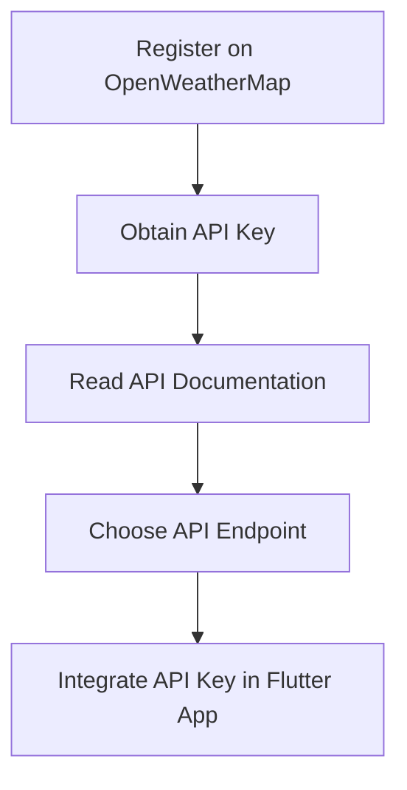

## 9.4.2 Setting Up the OpenWeatherMap API for Your Flutter Weather App

In this section, we will guide you through the process of setting up access to the OpenWeatherMap API, which is essential for fetching weather data for your Flutter weather app. This involves registering for an API key, understanding the API documentation, choosing the appropriate endpoints, and securely storing the API key within your Flutter project. By the end of this section, you will be equipped with the knowledge to integrate weather data into your app effectively.

### Registering for an OpenWeatherMap Account

To begin using the OpenWeatherMap API, you first need to create an account on their platform. Follow these steps to register:

- **Visit the OpenWeatherMap Website:** Go to [OpenWeatherMap](https://home.openweathermap.org/users/sign_up) and click on the "Sign Up" button.
- **Fill Out the Registration Form:** Provide the necessary information, including your email address, password, and any other required details.
- **Verify Your Email:** After submitting the form, check your email inbox for a verification email from OpenWeatherMap. Click the link in the email to verify your account.

### Obtaining an API Key

Once you have registered and verified your account, the next step is to obtain an API key. This key is crucial as it allows your app to authenticate requests to the OpenWeatherMap API.

- **Log In to Your Account:** Use your credentials to log in to the OpenWeatherMap website.
- **Navigate to the API Keys Section:** Once logged in, go to the "API keys" section of your account dashboard.
- **Generate a New API Key:** Click on the "Generate" button to create a new API key. You can name this key for easy identification, especially if you plan to use multiple keys for different projects.
- **Copy the API Key:** Once generated, copy the API key. You will need this key to make requests to the API from your Flutter app.

### Overview of Available API Endpoints

OpenWeatherMap offers a variety of endpoints that provide different types of weather data. For a basic weather app, you will primarily be interested in the following endpoints:

- **Current Weather Data:** This endpoint provides real-time weather information for a specified location. It includes data such as temperature, humidity, wind speed, and weather conditions.
- **5 Day / 3 Hour Forecast:** This endpoint offers a weather forecast for the next five days, with data available in three-hour intervals.
- **One Call API:** This comprehensive endpoint provides current weather, minute-by-minute forecasts for one hour, hourly forecasts for 48 hours, and daily forecasts for seven days.

To access these endpoints, refer to the [OpenWeatherMap API documentation](https://openweathermap.org/api) for detailed information on request parameters and response formats.

### Understanding API Usage Limits and Pricing

Before integrating the API into your app, it's important to understand the usage limits and pricing associated with the OpenWeatherMap API:

- **Free Tier:** OpenWeatherMap offers a free tier that allows a limited number of API calls per minute and per day. This is suitable for development and small-scale applications.
- **Paid Plans:** For higher usage requirements, consider upgrading to a paid plan. These plans offer increased API call limits and additional features such as historical weather data and advanced weather maps.

Ensure that your app's expected usage aligns with the chosen plan to avoid unexpected costs or service interruptions.

### Setting Up Environment Variables or Secure Storage for the API Key

To protect your API key from unauthorized access, it's crucial to store it securely within your Flutter project. Here are some methods to achieve this:

- **Environment Variables:** Use environment variables to store sensitive information like API keys. This approach keeps the key out of your source code and allows for easy configuration changes.
  
  **Example:**
  ```dart
  import 'package:flutter_dotenv/flutter_dotenv.dart';

  Future<void> main() async {
    await dotenv.load(fileName: ".env");
    runApp(MyApp());
  }

  // Access the API key
  final String apiKey = dotenv.env['OPENWEATHERMAP_API_KEY'] ?? '';
  ```

- **Secure Storage:** Use the `flutter_secure_storage` package to store the API key securely on the device. This method encrypts the key, making it more secure than plain text storage.

  **Example:**
  ```dart
  import 'package:flutter_secure_storage/flutter_secure_storage.dart';

  final storage = FlutterSecureStorage();

  // Store the API key
  await storage.write(key: 'apiKey', value: 'YOUR_OPENWEATHERMAP_API_KEY');

  // Retrieve the API key
  String? apiKey = await storage.read(key: 'apiKey');
  ```

### Integrating the API Key in Your Flutter App

Once you have securely stored your API key, you can integrate it into your Flutter app to make requests to the OpenWeatherMap API. Here's a basic example of how to use the API key in a network request:

```dart
import 'dart:convert';
import 'package:http/http.dart' as http;

Future<void> fetchWeatherData(String city) async {
  const String apiKey = 'YOUR_OPENWEATHERMAP_API_KEY';
  final String url = 'https://api.openweathermap.org/data/2.5/weather?q=$city&appid=$apiKey';

  final response = await http.get(Uri.parse(url));

  if (response.statusCode == 200) {
    final data = jsonDecode(response.body);
    print('Weather in $city: ${data['weather'][0]['description']}');
  } else {
    print('Failed to fetch weather data');
  }
}
```

### Mermaid.js Diagram

To visualize the process of setting up the OpenWeatherMap API, refer to the following diagram:



### Best Practices and Common Pitfalls

- **Keep Your API Key Secure:** Never hard-code your API key directly in your source code. Use environment variables or secure storage to protect it.
- **Monitor API Usage:** Regularly check your API usage to ensure you stay within your plan's limits and avoid unexpected charges.
- **Handle Errors Gracefully:** Implement error handling in your app to manage scenarios where the API request fails or returns unexpected data.
- **Stay Updated:** Keep an eye on updates to the OpenWeatherMap API and adjust your app accordingly to maintain compatibility.

### Additional Resources

- [OpenWeatherMap API Documentation](https://openweathermap.org/api)
- [Flutter Environment Variables with flutter_dotenv](https://pub.dev/packages/flutter_dotenv)
- [Secure Storage in Flutter](https://pub.dev/packages/flutter_secure_storage)

By following these steps and best practices, you will be well-prepared to integrate the OpenWeatherMap API into your Flutter weather app, providing users with accurate and up-to-date weather information.

## Quiz Time!



### What is the first step in setting up the OpenWeatherMap API for your Flutter app?

- [x] Registering for an OpenWeatherMap account
- [ ] Obtaining an API key
- [ ] Reading the API documentation
- [ ] Integrating the API key in the Flutter app

> **Explanation:** The first step is to register for an OpenWeatherMap account, which is necessary before obtaining an API key.

### How can you securely store your OpenWeatherMap API key in a Flutter app?

- [x] Using environment variables
- [x] Using secure storage
- [ ] Hard-coding it in the source code
- [ ] Storing it in a plain text file

> **Explanation:** Secure storage methods like environment variables and secure storage are recommended to protect your API key.

### Which OpenWeatherMap API endpoint provides real-time weather information?

- [x] Current Weather Data
- [ ] 5 Day / 3 Hour Forecast
- [ ] One Call API
- [ ] Historical Weather Data

> **Explanation:** The Current Weather Data endpoint provides real-time weather information for a specified location.

### What should you do if your app's API usage exceeds the free tier limits?

- [x] Consider upgrading to a paid plan
- [ ] Ignore the usage limits
- [ ] Hard-code the API key
- [ ] Use a different API

> **Explanation:** If your app's usage exceeds the free tier limits, consider upgrading to a paid plan to avoid service interruptions.

### Why is it important to monitor your API usage?

- [x] To avoid unexpected charges
- [x] To ensure you stay within your plan's limits
- [ ] To hard-code the API key
- [ ] To ignore the usage limits

> **Explanation:** Monitoring API usage helps avoid unexpected charges and ensures you stay within your plan's limits.

### What is the purpose of the `flutter_secure_storage` package?

- [x] To securely store sensitive data on the device
- [ ] To hard-code the API key
- [ ] To store data in a plain text file
- [ ] To ignore the usage limits

> **Explanation:** The `flutter_secure_storage` package is used to securely store sensitive data, such as API keys, on the device.

### Which of the following is a best practice when handling API keys?

- [x] Keeping the API key secure
- [x] Using environment variables
- [ ] Hard-coding the API key
- [ ] Sharing the API key publicly

> **Explanation:** Keeping the API key secure and using environment variables are best practices for handling API keys.

### What should you do if an API request fails in your app?

- [x] Implement error handling
- [ ] Ignore the error
- [ ] Hard-code the API key
- [ ] Use a different API

> **Explanation:** Implementing error handling is important to manage scenarios where the API request fails or returns unexpected data.

### What is the benefit of using the One Call API endpoint?

- [x] It provides comprehensive weather data, including current, hourly, and daily forecasts
- [ ] It only provides real-time weather information
- [ ] It is free to use without limits
- [ ] It requires no API key

> **Explanation:** The One Call API endpoint provides comprehensive weather data, including current, hourly, and daily forecasts.

### True or False: You should hard-code your API key directly in your Flutter app's source code.

- [ ] True
- [x] False

> **Explanation:** False. Hard-coding your API key in the source code is not secure. Use environment variables or secure storage instead.


