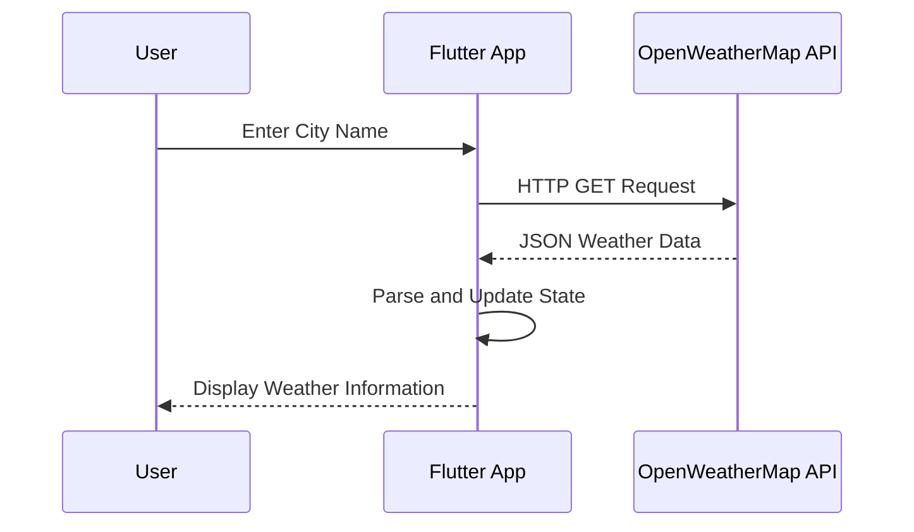

## 9.4.3 Fetching Weather Data

In this section, we will delve into the process of fetching weather data from the OpenWeatherMap API and integrating it into a Flutter application. This involves constructing HTTP GET requests, handling JSON responses, and updating the app's state with the fetched data. By the end of this guide, you will have a solid understanding of how to interact with external APIs and display dynamic data in your Flutter app.

### Building the API Request URL

The first step in fetching weather data is constructing the appropriate API request URL. The OpenWeatherMap API requires specific query parameters, including the city name and your API key. Here's how you can build the URL:

1. **API Endpoint**: The base URL for the OpenWeatherMap API is `https://api.openweathermap.org/data/2.5/weather`.
2. **Query Parameters**:
   - `q`: The city name for which you want to fetch the weather data.
   - `appid`: Your unique API key from OpenWeatherMap.
   - `units`: The unit system for temperature (e.g., `metric` for Celsius).

Here's a Dart code snippet to construct the URL using these parameters:

```dart
const String apiKey = 'YOUR_OPENWEATHERMAP_API_KEY';

Uri buildWeatherApiUrl(String city) {
  final queryParameters = {
    'q': city,
    'appid': apiKey,
    'units': 'metric',
  };
  return Uri.https('api.openweathermap.org', '/data/2.5/weather', queryParameters);
}
```

### Sending Asynchronous HTTP GET Requests

To send HTTP requests in Flutter, we use the `http` package. This package provides a simple way to perform network operations asynchronously. Here's how you can send a GET request to the OpenWeatherMap API:

1. **Add the `http` package**: Ensure you have the `http` package added to your `pubspec.yaml` file:

   ```yaml
   dependencies:
     http: ^0.13.3
   ```

2. **Send the Request**: Use the `http.get` method to send the request and await the response:

```dart
import 'package:http/http.dart' as http;

Future<http.Response> fetchWeatherData(String city) async {
  final uri = buildWeatherApiUrl(city);
  final response = await http.get(uri);
  return response;
}
```

### Parsing JSON Responses into Dart Objects

Once you receive the response from the API, the next step is to parse the JSON data into Dart objects. This allows you to work with the data more conveniently in your app.

1. **Check the Response Status**: Ensure the request was successful by checking the status code.

2. **Parse the JSON**: Use the `dart:convert` library to decode the JSON response.

3. **Create a Model Class**: Define a Dart class to represent the weather data.

Here's how you can implement these steps:

```dart
import 'dart:convert';

class Weather {
  final String cityName;
  final double temperature;
  final String description;

  Weather({required this.cityName, required this.temperature, required this.description});

  factory Weather.fromJson(Map<String, dynamic> json) {
    return Weather(
      cityName: json['name'],
      temperature: json['main']['temp'].toDouble(),
      description: json['weather'][0]['description'],
    );
  }
}

Future<Weather> parseWeatherData(http.Response response) async {
  if (response.statusCode == 200) {
    return Weather.fromJson(json.decode(response.body));
  } else {
    throw Exception('Failed to load weather data');
  }
}
```

### Updating the App's State with Fetched Data

After parsing the JSON data, the final step is to update your app's state to reflect the new weather information. This involves using Flutter's state management capabilities to display the data in the UI.

1. **State Management**: Use a `StatefulWidget` to manage the app's state.

2. **Update UI**: Call `setState` to update the UI with the new data.

Here's an example of how you can integrate the fetched data into your app's state:

```dart
class WeatherScreen extends StatefulWidget {
  @override
  _WeatherScreenState createState() => _WeatherScreenState();
}

class _WeatherScreenState extends State<WeatherScreen> {
  Weather? _weather;
  bool _isLoading = false;

  Future<void> _fetchWeather(String city) async {
    setState(() {
      _isLoading = true;
    });

    try {
      final response = await fetchWeatherData(city);
      final weather = await parseWeatherData(response);
      setState(() {
        _weather = weather;
        _isLoading = false;
      });
    } catch (e) {
      setState(() {
        _isLoading = false;
      });
      // Handle error, e.g., show a message to the user
    }
  }

  @override
  Widget build(BuildContext context) {
    return Scaffold(
      appBar: AppBar(
        title: Text('Weather App'),
      ),
      body: Center(
        child: _isLoading
            ? CircularProgressIndicator()
            : _weather != null
                ? Column(
                    mainAxisAlignment: MainAxisAlignment.center,
                    children: [
                      Text('City: ${_weather!.cityName}'),
                      Text('Temperature: ${_weather!.temperature}°C'),
                      Text('Description: ${_weather!.description}'),
                    ],
                  )
                : Text('Enter a city to get weather data'),
      ),
      floatingActionButton: FloatingActionButton(
        onPressed: () => _fetchWeather('London'), // Example city
        child: Icon(Icons.search),
      ),
    );
  }
}
```

### Practical Example and Real-World Scenario

Imagine you are building a weather app that allows users to search for the current weather in any city. By integrating the OpenWeatherMap API, you can provide real-time weather updates, enhancing the user experience. This functionality is crucial for apps that rely on external data sources to deliver dynamic content.

### Best Practices and Common Pitfalls

- **API Key Security**: Never hardcode your API key in the source code. Consider using environment variables or secure storage solutions.
- **Error Handling**: Always handle potential errors, such as network issues or invalid responses, to prevent app crashes.
- **User Feedback**: Provide visual feedback (e.g., loading indicators) while fetching data to improve user experience.
- **Rate Limiting**: Be aware of API rate limits and optimize your requests to avoid exceeding them.

### Mermaid.js Diagram

To visualize the process of fetching weather data, consider the following sequence diagram:



### Additional Resources

- [OpenWeatherMap API Documentation](https://openweathermap.org/api)
- [Flutter HTTP Package Documentation](https://pub.dev/packages/http)
- [Dart JSON Documentation](https://dart.dev/guides/json)

By following this guide, you will be able to fetch and display weather data in your Flutter app, providing users with valuable information. Experiment with different cities and explore additional features, such as displaying weather forecasts or integrating maps.

## Quiz Time!



### What is the base URL for the OpenWeatherMap API used in this guide?

- [x] `https://api.openweathermap.org/data/2.5/weather`
- [ ] `https://api.weather.com/v3/wx/conditions/current`
- [ ] `https://api.openweathermap.org/data/3.0/onecall`
- [ ] `https://weatherapi.com/v1/current.json`

> **Explanation:** The base URL for fetching current weather data from OpenWeatherMap is `https://api.openweathermap.org/data/2.5/weather`.

### Which Dart package is used to send HTTP requests in Flutter?

- [x] `http`
- [ ] `dio`
- [ ] `flutter_http`
- [ ] `network`

> **Explanation:** The `http` package is commonly used in Flutter for sending HTTP requests.

### What is the purpose of the `appid` query parameter in the API request?

- [x] To authenticate the request with your unique API key
- [ ] To specify the city name
- [ ] To define the response format
- [ ] To set the temperature unit

> **Explanation:** The `appid` parameter is used to authenticate the request with your unique API key from OpenWeatherMap.

### How do you parse a JSON response in Dart?

- [x] Using `json.decode` from the `dart:convert` library
- [ ] Using `json.parse` from the `dart:json` library
- [ ] Using `JSON.parse` from the `dart:convert` library
- [ ] Using `jsonDecode` from the `dart:core` library

> **Explanation:** In Dart, `json.decode` from the `dart:convert` library is used to parse JSON responses.

### What should you do if the HTTP response status code is not 200?

- [x] Throw an exception
- [ ] Return an empty object
- [ ] Retry the request immediately
- [ ] Ignore the response

> **Explanation:** If the status code is not 200, it indicates an error, and you should throw an exception to handle it appropriately.

### Which widget is used to manage the state in the provided example?

- [x] `StatefulWidget`
- [ ] `StatelessWidget`
- [ ] `InheritedWidget`
- [ ] `Provider`

> **Explanation:** A `StatefulWidget` is used to manage the state and update the UI when the weather data changes.

### What is the role of the `setState` method in Flutter?

- [x] To update the UI with new state data
- [ ] To initialize the widget
- [ ] To dispose of resources
- [ ] To build the widget tree

> **Explanation:** The `setState` method is used to update the UI with new state data in a `StatefulWidget`.

### Why is it important to handle errors when fetching data from an API?

- [x] To prevent app crashes and provide a better user experience
- [ ] To increase the app's performance
- [ ] To reduce the number of network requests
- [ ] To improve the app's design

> **Explanation:** Handling errors prevents app crashes and ensures a smooth user experience even when network issues occur.

### What is a common practice to secure your API key in a Flutter app?

- [x] Use environment variables or secure storage
- [ ] Hardcode it in the source code
- [ ] Share it publicly on GitHub
- [ ] Store it in a plain text file

> **Explanation:** Using environment variables or secure storage is a common practice to keep your API key secure.

### True or False: The `http` package can only be used for GET requests.

- [ ] True
- [x] False

> **Explanation:** The `http` package can be used for various HTTP methods, including GET, POST, PUT, and DELETE.


