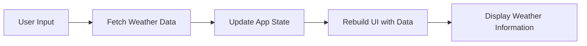

## 9.4.4 Displaying Data in the UI

In this section, we will explore how to present the fetched weather data in a user-friendly and responsive interface using Flutter. We'll cover designing a clean UI, utilizing various Flutter widgets, and integrating state management to ensure the UI updates dynamically based on the app's state. By the end of this section, you'll have a solid understanding of how to build an engaging weather app interface that effectively communicates information to users.

### Designing a Clean and Intuitive UI for Weather Information

Creating an intuitive user interface is crucial for any app, especially one that displays dynamic data like weather information. The goal is to present data clearly and attractively, ensuring users can quickly understand the information provided.

#### Key Considerations for UI Design

- **Simplicity:** Keep the design simple and focused. Avoid cluttering the screen with too much information.
- **Readability:** Use legible fonts and appropriate font sizes. Ensure text contrasts well with the background.
- **Responsiveness:** Design layouts that adapt to different screen sizes and orientations.
- **Feedback:** Provide visual feedback for loading states and errors to enhance user experience.

### Using Flutter Widgets to Display Data

Flutter offers a rich set of widgets that can be used to build complex UIs. For our weather app, we'll use a combination of `Text`, `Image`, `Card`, and `ListView` widgets to display the weather data.

#### Text and Image Widgets

The `Text` widget is used to display strings of text, while the `Image` widget can display images from various sources, such as network URLs or local assets.

```dart
Text(
  'Sunny',
  style: TextStyle(fontSize: 24, fontWeight: FontWeight.bold),
)

Image.network(
  'https://example.com/weather-icon.png',
  width: 50,
  height: 50,
)
```

#### Card and ListTile Widgets

The `Card` widget provides a material design card, which can be used to group related information. The `ListTile` widget is a convenient way to display a single row of information, typically used within a `Card`.

```dart
Card(
  child: ListTile(
    leading: Image.network('https://example.com/weather-icon.png'),
    title: Text('New York'),
    subtitle: Text('Clear Sky'),
    trailing: Text('25°C'),
  ),
)
```

#### ListView for Dynamic Content

`ListView` is a scrollable list of widgets. It's ideal for displaying a list of weather forecasts or other dynamic content.

```dart
ListView.builder(
  itemCount: weatherData.length,
  itemBuilder: (context, index) {
    final weather = weatherData[index];
    return Card(
      child: ListTile(
        title: Text(weather.cityName),
        subtitle: Text(weather.description),
        trailing: Text('${weather.temperature}°C'),
      ),
    );
  },
)
```

### Integrating State Management to Update the UI Dynamically

State management is crucial for updating the UI in response to data changes. In our weather app, we'll use the `setState` method to manage the app's state and trigger UI updates.

#### Managing State with setState

The `setState` method is used to notify the framework that the internal state of an object has changed, prompting a rebuild of the widget tree.

```dart
void _getWeather() async {
  setState(() {
    _isLoading = true;
    _error = null;
  });

  try {
    final weather = await _weatherService.fetchWeather(_controller.text);
    setState(() {
      _weather = weather;
    });
  } catch (e) {
    setState(() {
      _error = e.toString();
    });
  } finally {
    setState(() {
      _isLoading = false;
    });
  }
}
```

### Handling Loading States and Displaying Error Messages

Providing feedback during loading and error states is essential for a smooth user experience. We'll use a `CircularProgressIndicator` to indicate loading and display error messages using a `Text` widget.

#### Loading Indicator

A `CircularProgressIndicator` can be used to show that the app is fetching data.

```dart
_isLoading
  ? CircularProgressIndicator()
  : Container()
```

#### Error Handling

Display error messages using a `Text` widget with a distinct style to catch the user's attention.

```dart
_error != null
  ? Text(
      _error!,
      style: TextStyle(color: Colors.red),
    )
  : Container()
```

### Complete Code Example

Here's the complete code for our weather app, integrating all the concepts discussed:

```dart
import 'package:flutter/material.dart';
import 'weather_service.dart'; // Assuming WeatherService and Weather classes are in this file

class WeatherApp extends StatefulWidget {
  @override
  _WeatherAppState createState() => _WeatherAppState();
}

class _WeatherAppState extends State<WeatherApp> {
  final WeatherService _weatherService = WeatherService();
  Weather? _weather;
  bool _isLoading = false;
  String? _error;
  final TextEditingController _controller = TextEditingController();

  void _getWeather() async {
    final city = _controller.text;
    if (city.isEmpty) return;

    setState(() {
      _isLoading = true;
      _error = null;
    });

    try {
      final weather = await _weatherService.fetchWeather(city);
      setState(() {
        _weather = weather;
      });
    } catch (e) {
      setState(() {
        _error = e.toString();
      });
    } finally {
      setState(() {
        _isLoading = false;
      });
    }
  }

  @override
  Widget build(BuildContext context) {
    return Scaffold(
      appBar: AppBar(title: Text('Weather App')),
      body: Padding(
        padding: const EdgeInsets.all(16.0),
        child: Column(
          children: [
            TextField(
              controller: _controller,
              decoration: InputDecoration(
                labelText: 'Enter City Name',
                suffixIcon: IconButton(
                  icon: Icon(Icons.search),
                  onPressed: _getWeather,
                ),
              ),
              onSubmitted: (_) => _getWeather(),
            ),
            SizedBox(height: 20),
            _isLoading
                ? CircularProgressIndicator()
                : _error != null
                    ? Text(
                        _error!,
                        style: TextStyle(color: Colors.red),
                      )
                    : _weather != null
                        ? Card(
                            child: ListTile(
                              title: Text(_weather!.cityName),
                              subtitle: Text('${_weather!.description}'),
                              trailing: Text('${_weather!.temperature}°C'),
                            ),
                          )
                        : Container(),
          ],
        ),
      ),
    );
  }
}
```

### Visualizing the Data Flow

To better understand the flow of data in our app, let's use a Mermaid.js diagram to illustrate the process:



### Best Practices and Common Pitfalls

- **Best Practices:**
  - Use meaningful variable names and comments to improve code readability.
  - Keep the UI responsive by managing state efficiently.
  - Provide clear feedback for loading and error states.

- **Common Pitfalls:**
  - Failing to handle network errors gracefully can lead to a poor user experience.
  - Overcomplicating the UI with too many elements can confuse users.
  - Not testing the app on different screen sizes can result in layout issues.

### Further Exploration

To deepen your understanding of Flutter UI design and state management, consider exploring the following resources:

- [Flutter Documentation](https://flutter.dev/docs)
- [Flutter Layouts by Example](https://flutter.dev/docs/development/ui/layout)
- [State Management in Flutter](https://flutter.dev/docs/development/data-and-backend/state-mgmt/intro)

These resources provide comprehensive guides and examples to help you master Flutter development.

## Quiz Time!



### What is the primary purpose of using a `Card` widget in Flutter?

- [x] To group related information in a material design card.
- [ ] To display a list of items.
- [ ] To create a scrollable view.
- [ ] To handle user input.

> **Explanation:** The `Card` widget is used to group related information in a material design card, providing a consistent look and feel.

### Which widget is best suited for displaying a list of weather forecasts?

- [ ] `Column`
- [ ] `Row`
- [x] `ListView`
- [ ] `Stack`

> **Explanation:** `ListView` is a scrollable list of widgets, making it ideal for displaying a list of weather forecasts or other dynamic content.

### How can you provide feedback to users during data loading?

- [ ] Use a `Text` widget.
- [x] Use a `CircularProgressIndicator`.
- [ ] Use an `Image` widget.
- [ ] Use a `Button` widget.

> **Explanation:** A `CircularProgressIndicator` is used to indicate that the app is fetching data, providing visual feedback to users during loading.

### What method is used to update the UI in response to state changes?

- [ ] `build()`
- [ ] `initState()`
- [x] `setState()`
- [ ] `dispose()`

> **Explanation:** The `setState` method is used to notify the framework that the internal state of an object has changed, prompting a rebuild of the widget tree.

### What should you do if the city name entered by the user is empty?

- [x] Return early from the function.
- [ ] Display an error message.
- [ ] Fetch default weather data.
- [ ] Clear the input field.

> **Explanation:** If the city name is empty, it's best to return early from the function to avoid unnecessary API calls.

### Which widget is used to display error messages in the UI?

- [ ] `Image`
- [x] `Text`
- [ ] `Button`
- [ ] `ListView`

> **Explanation:** The `Text` widget is used to display error messages, typically with a distinct style to catch the user's attention.

### What is a common pitfall when designing a weather app UI?

- [x] Overcomplicating the UI with too many elements.
- [ ] Using a `ListView` for dynamic content.
- [ ] Providing feedback for loading states.
- [ ] Handling network errors gracefully.

> **Explanation:** Overcomplicating the UI with too many elements can confuse users and detract from the app's usability.

### What is the role of the `TextEditingController` in the weather app?

- [ ] To fetch weather data.
- [ ] To display weather information.
- [x] To manage the text input from the user.
- [ ] To handle network errors.

> **Explanation:** The `TextEditingController` is used to manage the text input from the user, allowing the app to retrieve the entered city name.

### How can you ensure the UI adapts to different screen sizes?

- [ ] Use fixed dimensions for all widgets.
- [ ] Avoid using `ListView`.
- [x] Design responsive layouts.
- [ ] Use only `Text` widgets.

> **Explanation:** Designing responsive layouts ensures that the UI adapts to different screen sizes and orientations, providing a consistent user experience.

### True or False: The `setState` method should be used sparingly to avoid unnecessary rebuilds.

- [x] True
- [ ] False

> **Explanation:** The `setState` method should be used sparingly to avoid unnecessary rebuilds, which can impact app performance.


