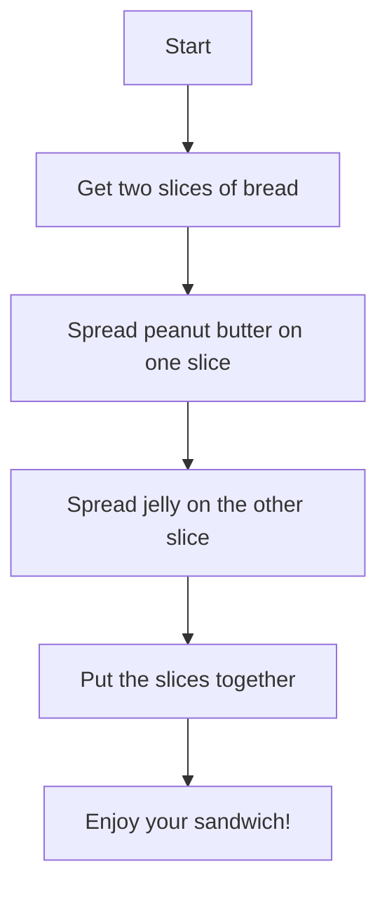

## 1.1.1 What is Coding?

Welcome to the exciting world of coding! Today, we're going to explore what coding is and why it's such a fun and powerful tool. Imagine being able to tell a computer what to do, just like giving instructions to a robot or following a recipe to bake a delicious cake. That's what coding is all about!

### Understanding Coding Through Analogies

Let's start with a simple analogy. Have you ever played a game where you had to give someone directions, like telling a friend how to get to your house? Coding is a bit like that. It's all about giving clear instructions to a computer so it knows exactly what to do.

#### Coding is Like Giving Instructions to a Robot

Imagine you have a friendly robot named Flutter. Flutter can do many things, but only if you tell it exactly what to do. If you want Flutter to make a sandwich, you need to give it step-by-step instructions:

1. **Get two slices of bread.**
2. **Spread peanut butter on one slice.**
3. **Spread jelly on the other slice.**
4. **Put the slices together.**

Each step is a piece of code, and together they form a program that Flutter can follow.

#### Coding is Like a Recipe

Think about your favorite cake. To make it, you need a recipe with specific steps:

1. **Gather ingredients.**
2. **Mix the ingredients.**
3. **Bake the mixture.**
4. **Let it cool and enjoy!**

Just like a recipe, coding involves creating a list of instructions that need to be followed in order to achieve a desired outcome.

### Interactive Activity: Write Your Own Instructions

Now it's your turn! Let's try a fun activity to understand coding logic. Write a simple set of instructions for a friend to follow. It could be anything, like how to draw a smiley face or how to make a paper airplane. Here's an example:

1. **Draw a big circle for the face.**
2. **Add two small circles for the eyes.**
3. **Draw a curved line for the smile.**

By writing these instructions, you're already thinking like a coder!

### Visualizing Coding with Flowcharts

To help visualize how coding works, let's use a flowchart. A flowchart is a diagram that shows the steps in a process. Here's a simple flowchart for making a sandwich:

This flowchart shows the sequence of steps, just like a program tells a computer what to do.

### Engaging Questions to Ponder

- Have you ever told someone how to play a game? That's a bit like coding!
- What other activities can you think of that involve giving instructions?
- How would you explain coding to a friend who has never heard of it before?

### Conclusion

Coding is all about creating instructions that computers can follow. It's like giving directions, following a recipe, or even creating a flowchart. By learning to code, you can create games, apps, and so much more. It's a skill that lets you turn your ideas into reality!

Now that you know what coding is, you're ready to start your coding adventure with Flutter the Friendly Robot. Let's get coding!

## Quiz Time!



### What is coding similar to?

- [x] Giving instructions to a robot
- [ ] Playing a musical instrument
- [ ] Painting a picture
- [ ] Riding a bicycle

> **Explanation:** Coding is similar to giving instructions to a robot because it involves telling a computer what to do step-by-step.

### What is a flowchart used for in coding?

- [x] To show the steps in a process
- [ ] To draw pictures
- [ ] To write stories
- [ ] To solve math problems

> **Explanation:** A flowchart is used to visually represent the steps in a process, much like a program outlines steps for a computer.

### Which of these is an example of coding?

- [x] Writing a recipe
- [ ] Watching TV
- [ ] Reading a book
- [ ] Playing soccer

> **Explanation:** Writing a recipe involves creating a set of instructions, similar to coding.

### What does a coder do?

- [x] Writes instructions for computers
- [ ] Builds houses
- [ ] Cooks food
- [ ] Drives cars

> **Explanation:** A coder writes instructions, or code, that tells computers what to do.

### Why is coding compared to a recipe?

- [x] Both involve following specific steps
- [ ] Both are about cooking
- [ ] Both are about eating
- [ ] Both are about cleaning

> **Explanation:** Coding is compared to a recipe because both involve following specific steps to achieve a result.

### What is the first step in making a sandwich according to the flowchart?

- [x] Get two slices of bread
- [ ] Spread peanut butter
- [ ] Spread jelly
- [ ] Put the slices together

> **Explanation:** The first step in the flowchart is to get two slices of bread.

### What can coding help you create?

- [x] Games and apps
- [ ] Only drawings
- [ ] Only music
- [ ] Only movies

> **Explanation:** Coding can help you create games, apps, and much more.

### What is the role of Flutter in this chapter?

- [x] A friendly robot to help understand coding
- [ ] A type of cake
- [ ] A kind of dance
- [ ] A musical instrument

> **Explanation:** Flutter is introduced as a friendly robot to help understand coding.

### How can you start thinking like a coder?

- [x] By writing simple instructions
- [ ] By watching TV
- [ ] By sleeping
- [ ] By eating

> **Explanation:** Writing simple instructions helps you start thinking like a coder.

### True or False: Coding is only for adults.

- [ ] True
- [x] False

> **Explanation:** False. Coding is for everyone, including kids, and can be a fun and educational activity.


