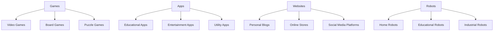

## 1.1.2 Why Learn to Code?

Welcome to the exciting world of coding! Have you ever wondered how your favorite video games, apps, or websites are made? The answer is coding! Coding is like a magical tool that lets you create anything you can imagine on a computer. Let's dive into why learning to code is not only fun but also incredibly beneficial.

### The Magic of Coding: Creating Your Own World

Coding is a superpower that allows you to bring your ideas to life. Imagine being able to create your own video game, design a website, or even build a robot! With coding, you can do all of this and more. It's like having a magic wand that turns your imagination into reality.

#### Real-World Examples: Coding in Action

Let's take a look at some popular apps and games that you might know:

- **Minecraft**: This game lets you build entire worlds with blocks. Did you know that Minecraft was created using code? Coding allows players to modify the game and create new adventures.
- **Scratch**: A platform where you can create your own interactive stories, games, and animations. Scratch uses a simple coding language that makes it easy for beginners to start coding.
- **YouTube**: The website where you watch videos is built with code. Coding makes it possible to upload, share, and watch videos from all over the world.

These examples show how coding is used to create things we use and enjoy every day. By learning to code, you can create your own amazing projects too!

### The Benefits of Learning to Code

Coding is not just about making cool things; it also teaches you valuable skills that can help you in many areas of life. Here are some reasons why learning to code is beneficial:

1. **Problem-Solving Skills**: Coding challenges you to think critically and solve problems. You'll learn how to break down complex tasks into smaller, manageable steps.

2. **Creativity**: Coding is a creative process. You can design games, animations, and websites that reflect your unique ideas and style.

3. **Logical Thinking**: Coding helps you develop logical thinking skills. You'll learn how to create algorithms, which are step-by-step instructions for solving problems.

4. **Collaboration**: Many coding projects involve working with others. You'll learn how to communicate your ideas and collaborate with teammates to achieve a common goal.

5. **Future Opportunities**: Coding is a valuable skill in today's digital world. It opens up a wide range of career opportunities in fields like technology, science, and engineering.

### What Would You Like to Create?

Now that you know the benefits of coding, let's think about what you would like to create. Would you like to design a game, build a website, or maybe create an app that helps people? The possibilities are endless!

Here's a fun activity: Take a moment to think about what you would like to create with code. Write down your ideas and share them with your friends or family. You might be surprised by how many cool projects you can come up with!

### Visualizing the Possibilities

To help you imagine what you can create with code, let's look at some colorful illustrations:

This diagram shows just a few of the things you can create with code. Each category, like games or apps, has many different possibilities. What will you choose to create?

### Conclusion: Embrace the Adventure of Coding

Learning to code is an adventure filled with creativity, problem-solving, and endless possibilities. Whether you want to create games, apps, or websites, coding gives you the tools to make your ideas come to life. So, let's get started on this exciting journey and see where your imagination takes you!

## Quiz Time!



### What is one of the main benefits of learning to code?

- [x] It helps develop problem-solving skills.
- [ ] It makes you taller.
- [ ] It allows you to fly.
- [ ] It turns you into a robot.

> **Explanation:** Learning to code helps develop problem-solving skills by teaching you how to break down complex tasks into smaller, manageable steps.

### Which of the following is a popular game created using code?

- [x] Minecraft
- [ ] Monopoly
- [ ] Chess
- [ ] Hide and Seek

> **Explanation:** Minecraft is a popular game created using code, allowing players to build and explore virtual worlds.

### What can you create with coding?

- [x] Games
- [x] Websites
- [x] Apps
- [ ] Magic potions

> **Explanation:** Coding allows you to create games, websites, and apps, among other things. Magic potions are not created with code.

### How does coding help with creativity?

- [x] It allows you to design and create unique projects.
- [ ] It makes you draw better.
- [ ] It improves your singing.
- [ ] It teaches you to dance.

> **Explanation:** Coding helps with creativity by allowing you to design and create unique projects that reflect your ideas and style.

### What is Scratch?

- [x] A platform for creating interactive stories, games, and animations.
- [ ] A type of dance.
- [ ] A cooking technique.
- [ ] A musical instrument.

> **Explanation:** Scratch is a platform that allows users to create interactive stories, games, and animations using a simple coding language.

### Why is coding considered a valuable skill for the future?

- [x] It opens up a wide range of career opportunities.
- [ ] It guarantees you will become a millionaire.
- [ ] It makes you famous.
- [ ] It allows you to travel through time.

> **Explanation:** Coding is considered a valuable skill for the future because it opens up a wide range of career opportunities in various fields.

### What is an algorithm?

- [x] A step-by-step instruction for solving a problem.
- [ ] A type of dance move.
- [ ] A musical note.
- [ ] A cooking recipe.

> **Explanation:** An algorithm is a step-by-step instruction for solving a problem, often used in coding to create logical solutions.

### Which of the following is NOT a benefit of learning to code?

- [ ] Problem-solving skills
- [ ] Creativity
- [ ] Logical thinking
- [x] Instant wealth

> **Explanation:** While coding offers many benefits like problem-solving skills, creativity, and logical thinking, it does not guarantee instant wealth.

### What is one way coding can be used in real life?

- [x] Building a website
- [ ] Making a sandwich
- [ ] Painting a picture
- [ ] Writing a poem

> **Explanation:** Coding can be used in real life to build websites, among other applications.

### True or False: Coding is only for adults.

- [ ] True
- [x] False

> **Explanation:** False. Coding is for everyone, including kids, and can be a fun and educational activity for all ages.


