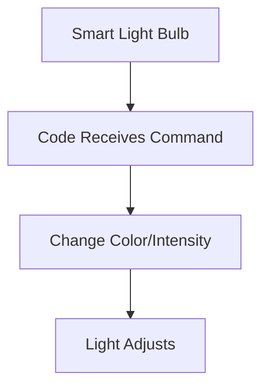
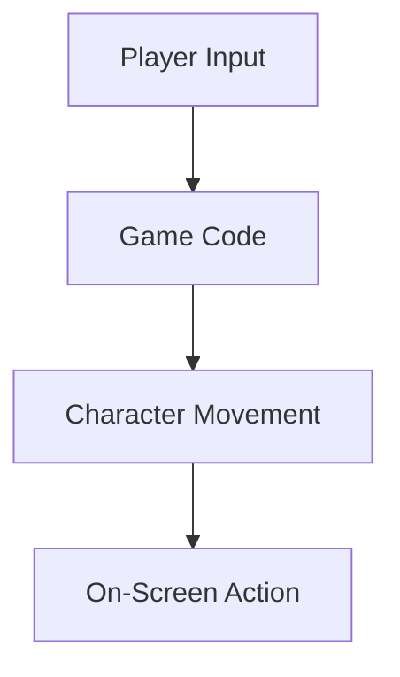
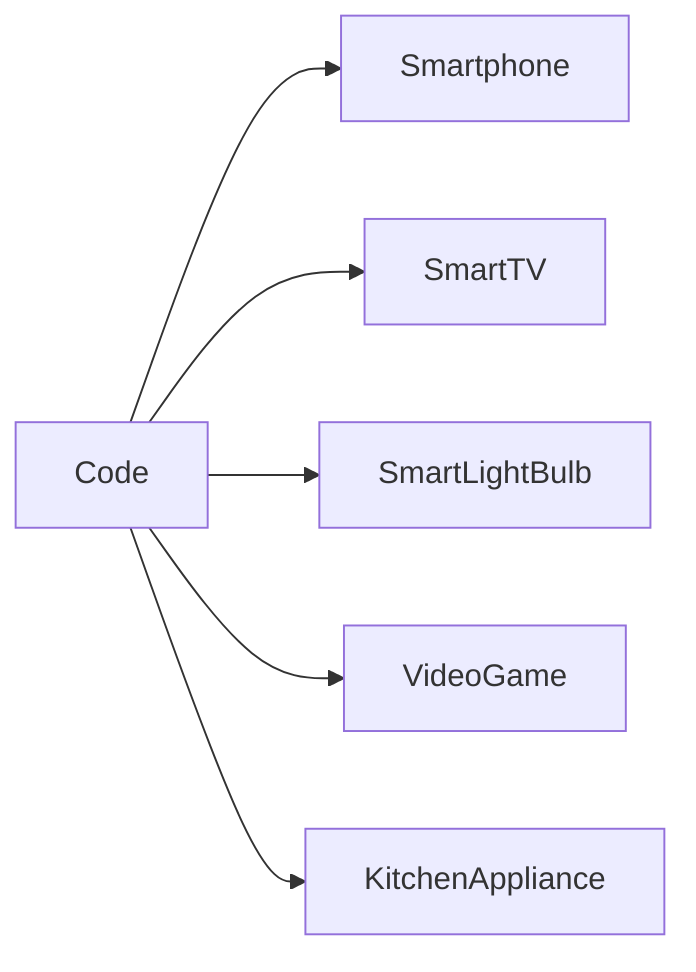

## 1.1.3 Coding in Everyday Life

Welcome to the fascinating world where coding meets everyday life! Coding isn't just for computers and tech experts—it's a part of the world around us, making our lives easier and more fun. Let's dive into how coding is integrated into the devices and technologies we use every day.

### Coding Powers Everyday Devices

Coding is like the magic spell that brings our devices to life. It's the set of instructions that tells gadgets what to do. From the moment you wake up to the time you go to bed, coding is at work, making your day smoother and more enjoyable.

#### Smartphones: Your Pocket-Sized Computer

Think about your smartphone. It's a tiny computer that fits in your pocket, and it's powered by code! Every app you use, from games to messaging, relies on coding to function. When you tap on an app icon, code tells the phone to open that app and display the information you need.

#### Smart TVs: Entertainment at Your Fingertips

Smart TVs are another great example. They use code to connect to the internet, stream your favorite shows, and even respond to voice commands. When you say, "Play my favorite movie," the TV's code interprets your request and finds the movie for you.

#### Kitchen Appliances: Smart Cooking

Even in the kitchen, coding is at work. Smart appliances like ovens and refrigerators use code to maintain the right temperature, suggest recipes, and even order groceries online. Imagine a smart oven that knows exactly how long to bake your cookies to perfection!

### How Simple Technologies Work

Let's explore some simple technologies and see how coding makes them tick.

#### Smart Light Bulbs: Bright Ideas

Smart light bulbs are a fun example. They use code to change colors, dim, or turn on and off at specific times. You can control them with your smartphone or voice commands. The code inside the bulb listens for your instructions and adjusts the light accordingly.

#### Video Games: Bringing Characters to Life

In video games, coding is what makes characters move, jump, and interact with the environment. When you press a button on the controller, code translates that action into movement on the screen. It's like giving instructions to a digital puppet!

### Activity: Spot the Code

Now it's your turn! Look around your home or school and make a list of devices that likely use coding. Here are some ideas to get you started:

- Microwave
- Laptop
- Smartwatch
- Gaming Console
- Digital Thermostat

Think about how each device might use code to perform its functions. Share your list with a friend or family member and see what they come up with!

### Visualizing the Connection

To help you understand how coding connects to everyday devices, let's visualize it with a simple diagram. Imagine a network where code is the central hub, and all your devices are connected to it, each performing its unique tasks.

### Relating Coding to Familiar Experiences

Coding might seem complex, but it's all around us, making our lives easier and more exciting. Whether it's turning on a light with your voice or playing a game on your console, coding is the invisible force behind the magic.

By understanding how coding powers everyday devices, you can start to see the world in a new way. Who knows? Maybe one day you'll be the one writing the code that powers the next big thing!

## Quiz Time!



### Which device is powered by coding to function like a tiny computer in your pocket?

- [x] Smartphone
- [ ] Refrigerator
- [ ] Washing Machine
- [ ] Bicycle

> **Explanation:** Smartphones are powered by coding to function as pocket-sized computers, running apps and connecting to the internet.

### What does coding do in a smart TV?

- [x] Connects to the internet and streams shows
- [ ] Cooks food
- [ ] Cleans the house
- [ ] Waters the plants

> **Explanation:** Coding in smart TVs allows them to connect to the internet, stream shows, and respond to voice commands.

### How do smart light bulbs use coding?

- [x] To change colors and adjust brightness
- [ ] To play music
- [ ] To cook meals
- [ ] To wash clothes

> **Explanation:** Smart light bulbs use coding to change colors, adjust brightness, and respond to commands from smartphones or voice assistants.

### What role does coding play in video games?

- [x] It controls character movement and actions
- [ ] It prints game manuals
- [ ] It builds game consoles
- [ ] It designs game covers

> **Explanation:** Coding in video games controls character movement and actions, translating player inputs into on-screen actions.

### Which of the following is NOT an example of a device that uses coding?

- [ ] Microwave
- [ ] Smartwatch
- [x] Bicycle
- [ ] Gaming Console

> **Explanation:** Bicycles do not use coding, while microwaves, smartwatches, and gaming consoles rely on coding for their functions.

### What happens when you press a button on a video game controller?

- [x] Code translates the action into movement on the screen
- [ ] The console turns off
- [ ] The game restarts
- [ ] The controller changes color

> **Explanation:** When you press a button on a video game controller, code translates the action into movement or actions on the screen.

### How do smart kitchen appliances use coding?

- [x] To maintain temperature and suggest recipes
- [ ] To paint the kitchen
- [ ] To wash dishes
- [ ] To vacuum the floor

> **Explanation:** Smart kitchen appliances use coding to maintain temperature, suggest recipes, and perform other smart functions.

### What is the role of coding in a smart thermostat?

- [x] To adjust temperature settings automatically
- [ ] To play music
- [ ] To display TV shows
- [ ] To brew coffee

> **Explanation:** Coding in a smart thermostat allows it to adjust temperature settings automatically based on user preferences or schedules.

### Which of the following is a benefit of coding in everyday life?

- [x] It makes devices more efficient and user-friendly
- [ ] It makes devices heavier
- [ ] It increases electricity usage
- [ ] It complicates device operation

> **Explanation:** Coding makes devices more efficient and user-friendly, allowing them to perform complex tasks easily.

### True or False: Coding is only used in computers and not in everyday devices.

- [ ] True
- [x] False

> **Explanation:** False. Coding is used in many everyday devices, not just computers, to perform various functions and tasks.


