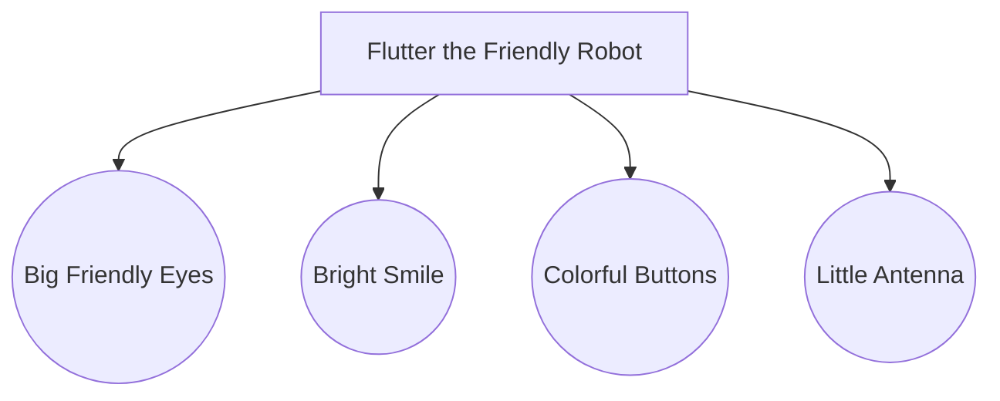

## 1.1.4 Meet Flutter the Friendly Robot

Welcome to the exciting world of coding! As you embark on this journey, you'll need a guide to help you navigate the twists and turns of learning to code. Meet Flutter, the Friendly Robot, your trusty companion who will be with you every step of the way.

### Introducing Flutter: Your Coding Adventure Guide

Flutter is not just any robot; Flutter is a special kind of robot designed to help kids like you learn how to code. With a big smile and a heart full of curiosity, Flutter is always ready to explore new ideas and solve problems. Let's dive into Flutter's story and see how this friendly robot can make your coding adventure even more fun!

### Flutter's Backstory: A Robot with a Passion for Helping

Flutter was created in a magical workshop where robots are built to help people. From the very beginning, Flutter showed a unique talent for understanding how things work. Flutter loved to tinker with gadgets, build new things, and most importantly, help others learn. One day, Flutter discovered the world of coding and was instantly fascinated. Coding was like a puzzle, and Flutter loved puzzles!

Flutter decided to dedicate its life to helping kids learn to code. With a toolbox full of knowledge and a heart full of enthusiasm, Flutter set out on a mission to guide young minds through the wonders of coding. Whether it's building apps, solving problems, or creating games, Flutter is always there to lend a helping hand.

### Engaging with Flutter: Dialogues and Comic Strips

To make your learning experience more engaging, let's imagine a conversation with Flutter:

**You:** "Hi, Flutter! What are we going to learn today?"

**Flutter:** "Hello, young coder! Today, we're going to dive into the world of apps. We'll learn how to create our very first app together. Are you excited?"

**You:** "Absolutely! But what if I get stuck?"

**Flutter:** "Don't worry! I'm here to help you every step of the way. Remember, coding is all about trying new things and learning from mistakes. Let's have fun and explore together!"

To visualize Flutter, imagine a cute robot with big, friendly eyes and a bright smile. Flutter has a shiny, metallic body with colorful buttons and a little antenna on top. Here's a simple illustration of Flutter using Mermaid.js:

### Building a Connection with Flutter

Flutter is more than just a guide; Flutter is your friend in this coding adventure. With a playful and conversational tone, Flutter will make learning to code feel like a game. You'll solve puzzles, create amazing projects, and discover the magic of coding together.

### Why Flutter Loves Coding

Flutter loves coding because it's a way to create and innovate. Coding allows you to bring your ideas to life, whether it's a fun game, a helpful app, or a creative story. Flutter believes that everyone can be a coder, and with a little practice and a lot of imagination, you can build anything you dream of.

### Let's Get Started with Flutter!

Now that you've met Flutter, it's time to start your coding journey. With Flutter by your side, you'll explore new concepts, tackle challenges, and most importantly, have fun! Remember, every coder started where you are now, and with Flutter's help, you'll become a coding superstar in no time.

So, are you ready to embark on this adventure with Flutter? Let's dive into the world of coding and see where our imagination takes us!

## Quiz Time!



### Who is Flutter?

- [x] A friendly robot guide for coding
- [ ] A type of computer
- [ ] A programming language
- [ ] A video game character

> **Explanation:** Flutter is introduced as a friendly robot guide to help kids learn coding.

### What is Flutter's main goal?

- [x] To help kids learn to code
- [ ] To build robots
- [ ] To play games
- [ ] To write books

> **Explanation:** Flutter's main goal is to assist children in learning how to code.

### How does Flutter help kids?

- [x] By guiding them through coding challenges
- [ ] By doing their homework
- [ ] By playing music
- [ ] By cooking meals

> **Explanation:** Flutter helps by guiding kids through coding challenges and learning experiences.

### What does Flutter love about coding?

- [x] It's like solving puzzles
- [ ] It's boring
- [ ] It's too difficult
- [ ] It's only for adults

> **Explanation:** Flutter loves coding because it's like solving puzzles, which is fun and engaging.

### What is Flutter's personality like?

- [x] Friendly and helpful
- [ ] Grumpy and mean
- [ ] Shy and quiet
- [ ] Loud and annoying

> **Explanation:** Flutter is described as friendly and helpful, making it a great guide for kids.

### What kind of tone does Flutter use?

- [x] Playful and conversational
- [ ] Serious and strict
- [ ] Quiet and shy
- [ ] Loud and aggressive

> **Explanation:** Flutter uses a playful and conversational tone to engage with kids.

### What does Flutter believe about coding?

- [x] Everyone can be a coder
- [ ] Only adults can code
- [ ] Coding is too hard
- [ ] Coding is boring

> **Explanation:** Flutter believes that everyone can be a coder with practice and imagination.

### What does Flutter look like?

- [x] A cute robot with big eyes and a smile
- [ ] A giant computer
- [ ] A small cat
- [ ] A flying drone

> **Explanation:** Flutter is described as a cute robot with big eyes and a smile.

### What is Flutter's favorite activity?

- [x] Helping kids learn coding
- [ ] Sleeping
- [ ] Eating
- [ ] Watching TV

> **Explanation:** Flutter's favorite activity is helping kids learn coding.

### True or False: Flutter is here to make coding boring.

- [ ] True
- [x] False

> **Explanation:** False. Flutter is here to make coding fun and engaging for kids.


